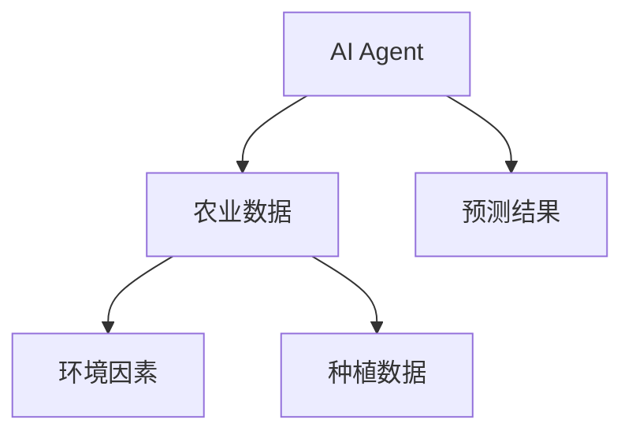
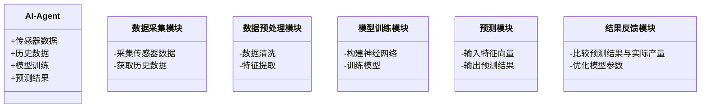

                 


# AI Agent在智能农业产量预测中的实践

> 关键词：AI Agent, 智能农业, 产量预测, 数据驱动, 农业智能化

> 摘要：本文深入探讨了AI Agent在智能农业产量预测中的应用，结合实际案例分析，详细讲解了AI Agent的核心概念、算法原理、系统架构设计及实现，展示了如何通过数据驱动的方法优化农业产量预测，为农业智能化提供技术参考。

---

## 第一章：背景介绍

### 1.1 问题背景

农业作为国民经济的基础产业，其产量预测对于确保粮食安全、优化资源配置具有重要意义。传统农业预测方法主要依赖于统计分析和经验判断，存在数据采集不全面、预测精度低、响应速度慢等问题。随着人工智能技术的发展，AI Agent（智能体）作为一种能够自主感知环境、决策并执行任务的智能系统，为农业产量预测提供了新的解决方案。

### 1.2 问题描述

农业产量预测的目标是通过分析历史数据和环境因素，预测未来单位面积的产量。传统方法通常基于固定的经验和统计模型，难以应对复杂多变的环境条件。AI Agent通过实时数据采集、智能分析和动态调整，能够更精准地预测产量，并提供决策支持。

### 1.3 问题解决

AI Agent的核心优势在于其数据驱动的预测能力。通过整合传感器数据、气象数据和历史产量数据，AI Agent能够构建动态的预测模型，实时更新预测结果，并根据预测结果提供优化建议。这种方法不仅提高了预测精度，还能够帮助农民提前采取措施应对潜在风险。

### 1.4 边界与外延

在实际应用中，AI Agent的预测范围通常限于特定作物和特定区域。例如，本文主要针对水稻的产量预测，且数据采集范围限定在中国南方地区。这种边界设定有助于提高模型的准确性和实用性。

---

## 第二章：核心概念与联系

### 2.1 AI Agent与农业数据的核心概念

AI Agent在农业产量预测中的作用可以简化为一个闭环系统：数据采集、特征提取、模型训练、预测输出和反馈优化。农业数据主要包括环境数据（如温度、湿度、光照）、土壤数据（如pH值、水分含量）和历史产量数据。

#### 2.1.1 核心概念原理

AI Agent通过传感器实时采集农业环境数据，结合历史产量数据，利用机器学习算法构建预测模型。模型输出预测结果，并根据实际产量数据进行反馈优化，逐步提高预测精度。

#### 2.1.2 概念对比表格

| 概念       | 特征                   | 描述                                                                 |
|------------|------------------------|----------------------------------------------------------------------|
| AI Agent   | 数据驱动               | 基于实时数据和历史数据进行预测和优化                                   |
| 传统模型   | 统计分析               | 依赖固定变量关系，预测精度有限                                         |

#### 2.1.3 实体关系图



---

## 第三章：算法原理讲解

### 3.1 数据收集与预处理

#### 3.1.1 数据来源

农业数据主要来源于传感器和历史记录。传感器数据包括温度、湿度、光照强度等，历史记录包括过去几年的产量数据和气象数据。

#### 3.1.2 数据清洗与特征提取

数据清洗是去除噪声数据，特征提取是将原始数据转化为模型可识别的特征。例如，将温度、湿度、光照强度等环境数据转化为特征向量。

### 3.2 模型训练

#### 3.2.1 神经网络结构

神经网络模型通常包括输入层、隐藏层和输出层。输入层接收特征向量，隐藏层进行特征提取和非线性变换，输出层输出预测结果。

#### 3.2.2 损失函数与优化器

常用的损失函数是均方误差（MSE），优化器通常选择Adam优化器。

#### 3.2.3 训练过程

模型通过反向传播算法进行训练，不断优化权重参数，以最小化预测误差。

### 3.3 预测与反馈

模型训练完成后，输入新的特征向量，模型输出预测结果。预测结果与实际产量进行比较，优化模型参数。

---

## 第四章：系统分析与架构设计

### 4.1 问题场景介绍

本文设计的AI Agent系统主要用于预测水稻产量，数据来源于某农业示范区的传感器和历史记录。

### 4.2 系统功能设计

系统功能模块包括数据采集、数据预处理、模型训练、预测输出和结果反馈。

#### 4.2.1 领域模型



---

## 第五章：项目实战

### 5.1 环境安装

安装Python和相关库（如TensorFlow、Keras）。

### 5.2 核心代码实现

```python
import numpy as np
from tensorflow import keras

# 数据预处理
X = ...  # 特征向量
y = ...  # 实际产量

# 构建模型
model = keras.Sequential([
    keras.layers.Dense(64, activation='relu'),
    keras.layers.Dense(1, activation='linear')
])

# 编译模型
model.compile(optimizer='adam', loss='mse')

# 训练模型
model.fit(X, y, epochs=100, batch_size=32)

# 预测
X_new = ...  # 新特征向量
y_pred = model.predict(X_new)
```

### 5.3 实际案例分析

以某农业示范区为例，输入温度、湿度、光照强度等特征，模型输出预测产量。预测结果与实际产量进行比较，优化模型参数。

---

## 第六章：总结

### 6.1 最佳实践

- 数据质量是关键，确保数据准确性和完整性。
- 模型优化需要不断迭代，根据实际数据调整参数。

### 6.2 小结

本文详细讲解了AI Agent在智能农业产量预测中的应用，通过实际案例展示了系统的实现过程和优化方法。

### 6.3 注意事项

- 数据采集和处理需要专业人员操作。
- 模型优化需要大量计算资源。

### 6.4 拓展阅读

建议深入学习强化学习在农业中的应用，探索AI Agent在农业决策优化中的潜力。

---

通过本文的学习，读者可以掌握AI Agent在智能农业中的基本原理和实现方法，为农业智能化提供技术支持。

