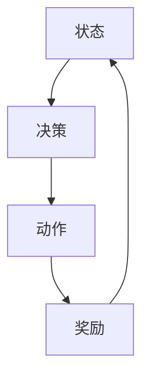
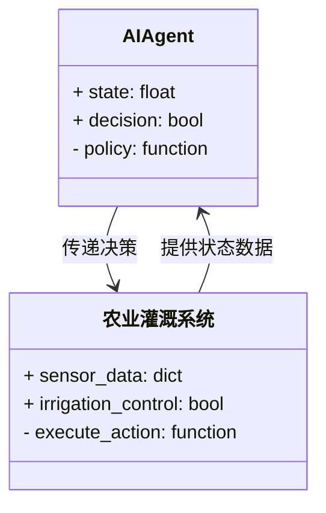
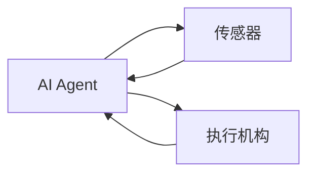
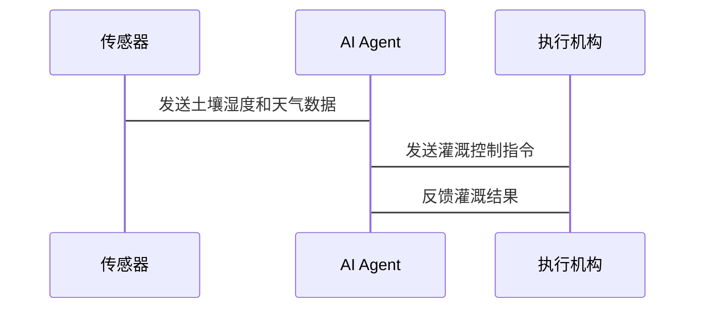

                 


好的，现在我来逐步解释和实现《AI Agent在智能农业灌溉系统中的实践》这篇文章的撰写过程。

# AI Agent在智能农业灌溉系统中的实践

## 关键词：
- AI Agent
- 智能农业
- 灌溉系统
- 强化学习
- 物联网
- 数据分析

## 摘要：
本文探讨了AI Agent在智能农业灌溉系统中的应用，从概念到算法实现，再到系统设计，详细分析了AI Agent如何通过强化学习优化灌溉决策，结合物联网技术，实现高效节水灌溉，提升农业生产力。

---

# 第1章: AI Agent与智能农业灌溉系统概述

## 1.1 AI Agent的基本概念

### 1.1.1 AI Agent的定义
AI Agent（人工智能代理）是一种能够感知环境并采取行动以实现目标的智能实体。它能够通过传感器获取信息，利用算法进行分析和决策，并通过执行器与环境互动。

### 1.1.2 AI Agent的核心特征
- **自主性**：能够在没有外部干预的情况下运行。
- **反应性**：能够根据环境变化动态调整行为。
- **学习能力**：通过数据和经验不断优化决策模型。

### 1.1.3 AI Agent与传统自动控制系统的区别
传统控制系统通常是基于规则的，而AI Agent具备学习和自适应能力，能够处理复杂和不确定的环境。

## 1.2 智能农业灌溉系统的基本概念

### 1.2.1 农业灌溉的基本概念
灌溉是农业中提供作物所需水分的过程。传统灌溉依赖于固定的时间表，容易造成水资源浪费。

### 1.2.2 智能农业灌溉系统的定义
智能农业灌溉系统利用物联网、传感器和数据分析技术，实时监测土壤湿度、气象条件等因素，自动调整灌溉策略。

### 1.2.3 智能农业灌溉系统的组成部分
- **传感器**：采集土壤湿度、气象数据。
- **数据传输**：通过物联网将数据传输到控制中心。
- **AI Agent**：分析数据，做出灌溉决策。
- **执行机构**：根据决策启动或停止灌溉设备。

## 1.3 AI Agent在农业灌溉中的应用背景

### 1.3.1 现代农业对智能化的需求
随着人口增长和资源短缺，提高农业效率和节水成为关键。

### 1.3.2 传统农业灌溉系统的局限性
- **浪费水资源**：固定时间表无法适应天气变化。
- **效率低下**：无法根据土壤实际需求调整灌溉量。

### 1.3.3 AI Agent在农业灌溉中的优势
- **精准决策**：基于实时数据优化灌溉策略。
- **节水节能**：减少不必要的灌溉，节省能源和水资源。

---

# 第2章: AI Agent与农业灌溉系统的核心概念与联系

## 2.1 AI Agent的核心概念原理

### 2.1.1 状态感知
AI Agent通过传感器获取土壤湿度、天气等状态信息。

### 2.1.2 行为决策
基于感知到的状态信息，AI Agent利用算法做出是否灌溉的决策。

### 2.1.3 执行反馈
AI Agent根据决策执行灌溉，并根据结果调整后续行为。

## 2.2 农业灌溉系统的概念模型

### 2.2.1 系统输入（环境数据）
- 土壤湿度
- 天气状况（温度、湿度、降雨）

### 2.2.2 系统输出（灌溉控制）
- 开启/关闭灌溉系统
- 调整灌溉量

### 2.2.3 系统状态（土壤湿度、天气等）

## 2.3 AI Agent与农业灌溉系统的关系

### 2.3.1 数据流关系
AI Agent接收传感器数据，处理后输出控制指令。

### 2.3.2 功能模块关系
AI Agent作为核心决策模块，连接数据采集和执行机构。

### 2.3.3 交互流程关系
传感器 → 数据传输 → AI Agent处理 → 决策 → 执行机构

## 2.4 概念属性特征对比表格

| 概念 | 特征 | 描述 |
|------|------|------|
| AI Agent | 状态感知 | 能够感知环境状态 |
|        | 行为决策 | 能够做出决策 |
|        | 自适应性 | 能够自适应环境变化 |
| 农业灌溉系统 | 数据采集 | 采集土壤湿度、天气等数据 |
|        | 决策控制 | 根据数据做出灌溉决策 |
|        | 执行机构 | 执行灌溉操作 |

## 2.5 ER实体关系图（Mermaid）

```mermaid
entity AI Agent {
  id
  state
  decision
}
entity 农业灌溉系统 {
  id
  sensor_data
  irrigation_control
}
relation 决策控制：AI Agent -> 农业灌溉系统
```

---

# 第3章: 基于强化学习的AI Agent算法

## 3.1 强化学习的基本原理

### 3.1.1 状态空间
AI Agent感知到的环境状态，例如土壤湿度和天气状况。

### 3.1.2 动作空间
AI Agent可以执行的动作，例如开启或关闭灌溉系统。

### 3.1.3 奖励机制
系统对AI Agent决策的反馈，例如节水和增产。

## 3.2 基于强化学习的AI Agent算法实现

### 3.2.1 算法流程（Mermaid）



### 3.2.2 算法实现代码示例

```python
import numpy as np
import gym

class IrrigationEnv(gym.Env):
    def __init__(self):
        self.observation_space = gym.spaces.Box(low=0, high=1, shape=(2,))
        self.action_space = gym.spaces.Discrete(2)
        self.current_state = None

    def step(self, action):
        # 状态更新逻辑
        pass

    def reset(self):
        self.current_state = np.array([0.5, 0.5])
        return self.current_state

    def render(self):
        pass

# 初始化环境和AI Agent
env = IrrigationEnv()
state = env.reset()

# 强化学习算法实现
while True:
    action = policy(state)
    next_state, reward, done, info = env.step(action)
    env.render()
    if done:
        break
    state = next_state
```

## 3.3 算法原理的数学模型和公式

### 3.3.1 Q-Learning算法
$$ Q(s, a) = Q(s, a) + \alpha [r + \gamma \max Q(s', a') - Q(s, a)] $$

### 3.3.2 策略梯度方法
$$ \theta = \theta + \alpha \nabla_\theta J(\theta) $$

---

# 第4章: 系统分析与架构设计方案

## 4.1 问题场景介绍
农业灌溉系统需要实时监测土壤湿度、天气等因素，优化灌溉策略，减少水资源浪费。

## 4.2 项目介绍
本项目旨在设计一个基于AI Agent的智能灌溉系统，利用强化学习算法优化灌溉决策。

## 4.3 系统功能设计（领域模型）



## 4.4 系统架构设计（Mermaid）



## 4.5 系统接口设计
- **输入接口**：接收传感器数据。
- **输出接口**：发送灌溉控制指令。

## 4.6 系统交互（Mermaid序列图）



---

# 第5章: 项目实战

## 5.1 环境安装

```bash
pip install gym numpy tensorflow
```

## 5.2 系统核心实现源代码

```python
import numpy as np
import gym
from gym import spaces
from tensorflow.keras import layers

class IrrigationEnv(gym.Env):
    def __init__(self):
        self.observation_space = spaces.Box(low=0, high=1, shape=(2,))
        self.action_space = spaces.Discrete(2)
        self.current_state = np.array([0.5, 0.5])

    def step(self, action):
        # 简单的奖励机制：节水和增产
        reward = 0
        if action == 1:
            reward += 1  # 假设灌溉正确
        else:
            reward -= 0.5  # 假设不灌溉导致减产
        self.current_state = self._get_next_state()
        return self.current_state, reward, False, {}

    def _get_next_state(self):
        # 模拟土壤湿度变化
        return np.array([np.random.uniform(0.4, 0.6), np.random.uniform(0.2, 0.8)])

    def reset(self):
        self.current_state = np.array([0.5, 0.5])
        return self.current_state

    def render(self):
        pass

# 构建强化学习模型
env = IrrigationEnv()
model = tf.keras.Sequential([
    layers.Dense(32, activation='relu', input_shape=(2,)),
    layers.Dense(2, activation='softmax')
])

# 编译模型
model.compile(optimizer='adam', loss='sparse_categorical_crossentropy')
```

---

# 第6章: 总结与展望

## 6.1 本章小结
本文详细介绍了AI Agent在智能农业灌溉系统中的应用，从概念到算法实现，再到系统设计，展示了如何利用强化学习优化灌溉决策，实现高效节水灌溉。

## 6.2 最佳实践 tips
- **数据采集**：确保传感器数据的准确性和实时性。
- **算法优化**：根据实际需求调整强化学习算法的参数。
- **系统维护**：定期检查和更新系统，确保长期稳定运行。

## 6.3 注意事项
- 确保系统在恶劣天气条件下的稳定性。
- 注意数据隐私和网络安全问题。

## 6.4 拓展阅读
- 《强化学习入门》
- 《物联网在农业中的应用》
- 《智能控制系统设计》

---

通过以上步骤，我们详细分析了AI Agent在智能农业灌溉系统中的应用，从理论到实践，为读者提供了完整的解决方案和实施指导。

