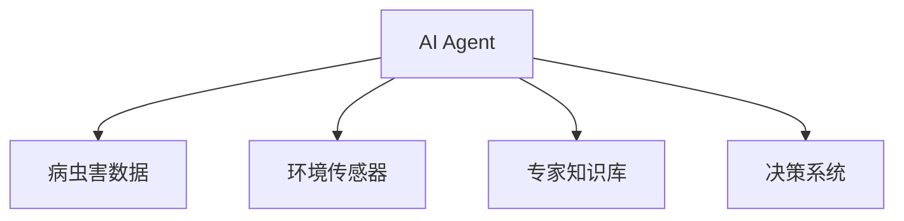
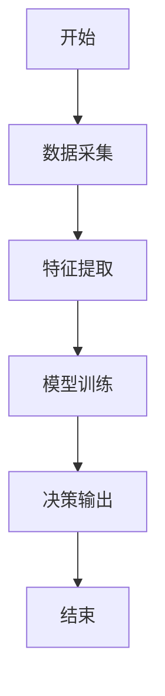
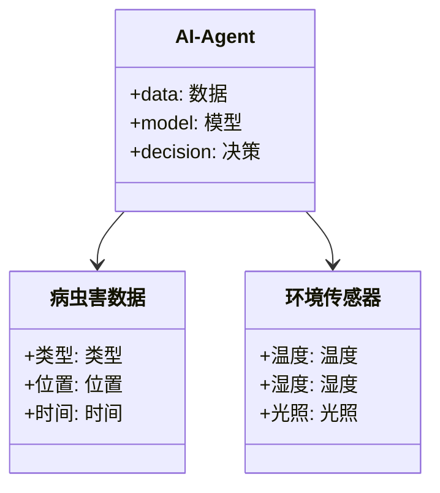
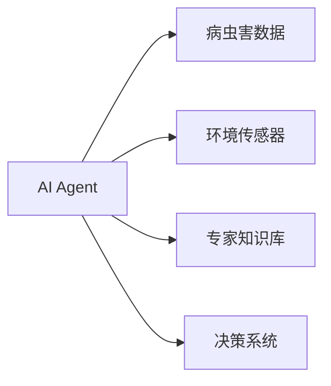

                 


# AI Agent在智能农业病虫害防控中的实践

> **关键词**：AI Agent、智能农业、病虫害防控、算法原理、系统架构、数学模型

> **摘要**：本文将探讨AI Agent在智能农业病虫害防控中的实际应用。通过分析病虫害防控的核心问题，结合AI Agent的技术原理，提出了一种基于AI Agent的智能农业病虫害防控解决方案。文章从问题背景、核心概念、算法原理、系统架构、项目实战等多个方面进行了详细阐述，为读者提供了一套完整的理论与实践框架。

---

# 第一部分: AI Agent在智能农业病虫害防控中的背景与概念

## 第1章: 问题背景与描述

### 1.1 问题背景

#### 1.1.1 病虫害对农业的影响
病虫害是威胁农业产量和质量的主要因素之一。据统计，全球每年因病虫害导致的农业损失高达数百亿美元。传统的病虫害防控手段依赖人工监测和化学农药喷洒，存在效率低、成本高、环境友好的问题。

#### 1.1.2 传统病虫害防控的局限性
传统的病虫害防控方法主要包括：
- **人工监测**：依赖经验丰富的技术人员，监测范围有限，效率低。
- **化学农药喷洒**：虽然能快速控制病虫害，但长期使用会导致抗药性和环境污染。

#### 1.1.3 AI技术在农业中的应用潜力
人工智能（AI）技术的快速发展为农业智能化提供了新的可能。AI Agent（智能代理）作为一种能够自主感知、决策和执行的智能系统，可以在病虫害监测、预警和防控中发挥重要作用。

---

### 1.2 问题描述

#### 1.2.1 病虫害防控的主要挑战
- 病虫害的隐蔽性：许多病虫害在早期阶段不易被发现，导致防控不及时。
- 环境的多样性：农田环境复杂，病虫害的发生与气候、土壤、作物品种等多种因素相关。
- 资源的有限性：人工监测成本高，效率低，难以覆盖大面积农田。

#### 1.2.2 AI Agent在病虫害防控中的应用场景
- **实时监测**：通过传感器和摄像头实时采集农田数据。
- **智能识别**：利用AI算法识别病虫害种类和严重程度。
- **决策支持**：基于数据和模型，提供最优防控策略。

#### 1.2.3 病虫害防控的智能化需求
随着农业现代化的推进，智能化病虫害防控已成为提高农业生产效率和降低环境影响的重要手段。AI Agent通过整合多种数据源，能够实现病虫害的早期预警和精准防控。

---

### 1.3 问题解决与边界

#### 1.3.1 AI Agent在病虫害防控中的解决方案
- **数据采集**：部署传感器和摄像头，实时采集农田环境数据。
- **智能分析**：利用AI算法对数据进行分析，识别病虫害风险。
- **决策执行**：根据分析结果，自动触发防控措施，如喷洒农药或调整灌溉。

#### 1.3.2 解决方案的边界与适用范围
- 边界：AI Agent主要用于病虫害的监测和预警，不直接参与物理防控。
- 适用范围：适用于大规模农田，尤其是对病虫害风险较高的作物种植区域。

#### 1.3.3 解决方案的潜在局限性
- 数据依赖性：AI Agent的性能依赖于数据质量和数量，数据不足可能导致误判。
- 环境适应性：AI Agent需要适应复杂的农田环境，可能受到极端天气或传感器故障的影响。

---

## 第2章: AI Agent的核心概念与联系

### 2.1 核心概念原理

#### 2.1.1 AI Agent的基本定义
AI Agent是一种能够感知环境、自主决策并执行任务的智能系统。在病虫害防控中，AI Agent可以作为决策中枢，整合多种数据源，提供智能化的解决方案。

#### 2.1.2 AI Agent在农业中的应用场景
- 病虫害监测
- 作物生长监测
- 环境监控

#### 2.1.3 AI Agent的核心功能与特性
- **感知能力**：通过传感器和摄像头采集环境数据。
- **学习能力**：利用机器学习算法不断优化识别模型。
- **决策能力**：基于数据和模型，生成最优防控策略。

---

### 2.2 核心概念对比

#### 2.2.1 AI Agent与传统自动化系统的区别
| 特性             | AI Agent               | 传统自动化系统         |
|------------------|------------------------|------------------------|
| 智能性           | 高                     | 低                     |
| 自主性           | 高                     | 低                     |
| 环境适应性       | 强                     | 弱                     |

#### 2.2.2 不同AI Agent模型的对比分析
- **规则驱动型**：基于预设规则进行决策，适用于简单场景。
- **数据驱动型**：基于机器学习模型进行预测，适用于复杂场景。
- **混合型**：结合规则和数据驱动，适用于复杂且动态变化的场景。

#### 2.2.3 系统架构的对比与选择
- **规则驱动型**：适用于简单的病虫害监测任务。
- **数据驱动型**：适用于复杂的病虫害识别和预测任务。
- **混合型**：适用于综合考虑多种因素的病虫害防控任务。

---

### 2.3 实体关系图



---

# 第二部分: AI Agent的算法原理与数学模型

## 第3章: 算法原理讲解

### 3.1 算法流程



---

### 3.2 核心算法实现

```python
def ai_agent_algorithm(data):
    # 数据预处理
    processed_data = preprocess(data)
    # 特征提取
    features = extract_features(processed_data)
    # 模型预测
    prediction = model.predict(features)
    return prediction
```

---

### 3.3 数学模型与公式

#### 3.3.1 分类模型
$$ P(class|data) = \frac{P(data|class)P(class)}{P(data)} $$

---

## 第4章: 算法优化与实现

### 4.1 算法优化策略
- **数据增强**：通过数据增强技术提高模型的泛化能力。
- **模型优化**：选择合适的机器学习算法（如决策树、随机森林）。
- **超参数调优**：通过网格搜索优化模型性能。

### 4.2 实验与结果分析
- **实验设计**：对比不同算法在病虫害识别任务中的表现。
- **结果分析**：通过准确率、召回率、F1分数等指标评估模型性能。

---

# 第三部分: 系统分析与架构设计

## 第5章: 系统分析与架构设计

### 5.1 问题场景介绍
- **问题场景**：大规模农田中病虫害的实时监测和预警。
- **用户需求**：农民、农业合作社需要一种高效、低成本的病虫害防控方案。

### 5.2 系统功能设计

#### 5.2.1 领域模型类图


---

### 5.3 系统架构设计

#### 5.3.1 系统架构图


---

### 5.4 系统接口设计

#### 5.4.1 接口设计
- **数据接口**：与传感器和数据库交互。
- **决策接口**：与执行系统（如喷洒装置）交互。

---

## 第6章: 项目实战

### 6.1 环境安装
- **Python**：3.8+
- **库依赖**：numpy、scikit-learn、OpenCV

---

### 6.2 核心代码实现

#### 6.2.1 数据采集模块
```python
import cv2

def capture_image():
    # 摄像头初始化
    cap = cv2.VideoCapture(0)
    if not cap.isOpened():
        raise ValueError("无法打开摄像头")
    # 捕捉图像
    ret, frame = cap.read()
    if not ret:
        raise ValueError("无法获取图像")
    # 保存图像
    cv2.imwrite("image.jpg", frame)
    cap.release()
```

---

#### 6.2.2 数据处理模块
```python
import numpy as np

def preprocess(data):
    # 数据归一化
    normalized_data = data / np.max(data)
    return normalized_data
```

---

#### 6.2.3 模型训练模块
```python
from sklearn.tree import DecisionTreeClassifier

def train_model(features, labels):
    # 模型训练
    model = DecisionTreeClassifier()
    model.fit(features, labels)
    return model
```

---

### 6.3 案例分析

#### 6.3.1 案例背景
- **地区**：某农业示范区
- **作物**：水稻
- **问题**：稻飞虱病害

---

#### 6.3.2 案例实施
- **数据采集**：部署传感器和摄像头，采集水稻田的环境数据和病虫害图像。
- **模型训练**：利用历史病虫害数据训练分类模型。
- **决策执行**：根据模型预测结果，自动喷洒农药。

---

### 6.4 项目小结
通过实际案例，展示了AI Agent在病虫害防控中的应用价值。系统实现了从数据采集到决策执行的全流程自动化，显著提高了防控效率和精准度。

---

# 第四部分: 最佳实践与总结

## 第7章: 最佳实践与总结

### 7.1 实践经验总结
- **数据质量**：高质量的数据是模型性能的基础。
- **模型选择**：选择合适的算法可以显著提高效果。
- **系统集成**：系统的模块化设计有助于扩展和维护。

### 7.2 小结
AI Agent作为一种智能化的解决方案，在病虫害防控中具有广阔的应用前景。通过本文的分析和实践，我们为读者提供了一套完整的理论与实践框架。

### 7.3 注意事项
- **数据隐私**：注意保护农田数据的隐私和安全。
- **系统稳定性**：确保系统的稳定运行，避免因传感器故障导致的误判。

### 7.4 拓展阅读
- 《机器学习在农业中的应用》
- 《智能系统在病虫害防控中的实践》

---

**总结**：AI Agent通过整合多种数据源和智能算法，为病虫害防控提供了高效、精准的解决方案。本文从理论到实践，全面探讨了AI Agent在智能农业中的应用，为读者提供了一个完整的参考框架。

