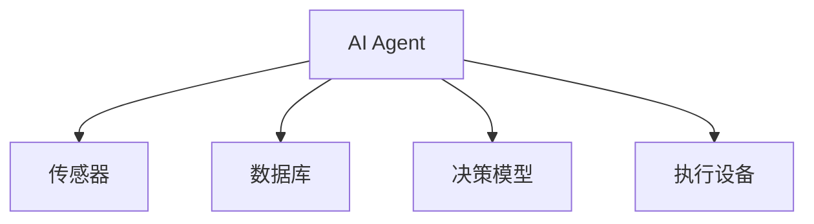
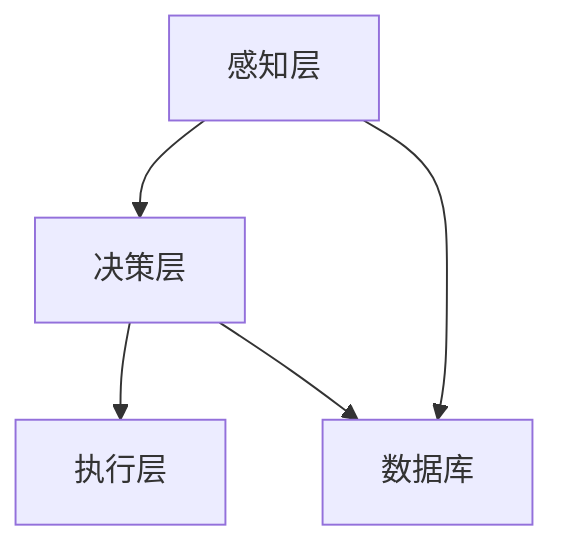

                 


# 《AI Agent在智能农业病虫害防控中的应用》

## 关键词：AI Agent，智能农业，病虫害防控，图像识别，决策算法，系统架构

## 摘要：  
随着农业智能化的推进，AI Agent在病虫害防控中的应用日益重要。本文系统介绍AI Agent的基本概念、农业病虫害防控的现状与挑战、AI Agent在病虫害监测与精准防控中的应用潜力，详细讲解AI Agent的感知、决策和执行模块的核心算法原理，结合实际案例分析AI Agent在农业病虫害防控中的系统架构设计与实现。通过本文，读者可以全面了解AI Agent在智能农业中的应用前景和技术实现。

---

# 第一部分：AI Agent与农业病虫害防控概述

## 第1章：AI Agent的基本概念与农业应用

### 1.1 AI Agent的定义与特点
- **AI Agent的定义**：AI Agent是一种智能体，能够感知环境、自主决策并执行任务。
- **特点**：自主性、反应性、目标导向、学习能力。
- **分类**：简单反射型、基于模型的反应型、目标驱动型、效用驱动型。

### 1.2 农业病虫害防控的现状与挑战
- **病虫害对农业的威胁**：减少产量、品质下降、经济损失。
- **传统防控的局限性**：依赖人工经验、效率低、成本高、难以精准施策。
- **智能化防控的需求**：提高效率、降低成本、精准施药、减少环境污染。

### 1.3 AI Agent在农业中的应用潜力
- **病虫害监测**：实时监测病虫害的发生、发展和扩散。
- **精准防控**：根据数据制定个性化防控策略。
- **决策优化**：通过数据分析优化资源分配和施药策略。

---

## 第2章：AI Agent在病虫害防控中的核心概念

### 2.1 AI Agent的核心功能模块
- **感知模块**：通过传感器和图像识别技术获取环境数据。
- **决策模块**：基于感知数据，利用机器学习模型制定防控策略。
- **执行模块**：通过自动化设备执行具体的防控操作。

### 2.2 AI Agent与传统农业技术的对比
| **对比维度** | **传统技术** | **AI Agent技术** |
|--------------|---------------|-------------------|
| 数据处理能力 | 依赖人工经验   | 数据驱动，自动分析 |
| 响应速度     | 较慢          | 实时响应         |
| 精准度       | 较低          | 高精度           |
| 可扩展性     | 有限          | 高扩展性         |

### 2.3 AI Agent的系统架构
- **分层架构**：感知层、决策层、执行层。
- **模块交互**：感知层提供数据，决策层制定策略，执行层完成操作。
- **实体关系图**：  


---

# 第二部分：AI Agent的算法原理

## 第3章：AI Agent的感知模块

### 3.1 图像识别技术
- **基于CNN的图像分类**：使用卷积神经网络识别病虫害类型。
- **目标检测算法**：定位病虫害的位置并分类。
- **图像分割技术**：精确定位病虫害区域。

### 3.2 算法实现与优化
- **图像预处理**：归一化、增强、降噪。
- **模型训练**：使用深度学习框架（如TensorFlow）训练病虫害识别模型。
- **模型优化**：通过迁移学习和数据增强提高模型性能。

### 3.3 实例分析
- **案例**：使用ResNet模型识别害虫种类。
- **代码示例**：
  ```python
  import tensorflow as tf
  model = tf.keras.models.load_model('insect_classifier.h5')
  prediction = model.predict(preprocessed_image)
  ```

---

## 第4章：AI Agent的决策模块

### 4.1 基于机器学习的决策模型
- **随机森林**：用于分类和回归任务。
- **支持向量机**：用于分类问题。
- **强化学习**：动态优化防控策略。

### 4.2 决策算法实现
- **随机森林实现**：
  ```python
  from sklearn.ensemble import RandomForestClassifier
  model = RandomForestClassifier(n_estimators=100)
  model.fit(X_train, y_train)
  ```

### 4.3 决策模型优化
- **超参数调优**：使用网格搜索优化模型性能。
- **模型评估**：准确率、召回率、F1分数。

---

## 第5章：AI Agent的执行模块

### 5.1 自动化设备的控制
- **无人机**：用于病虫害监测和防治。
- **喷雾系统**：根据决策结果自动施药。

### 5.2 精准施药策略
- **基于病虫害分布的变量施药**。
- **减少农药使用量，降低环境污染**。

### 5.3 执行结果反馈
- **实时反馈**：通过传感器反馈执行结果。
- **优化调整**：根据反馈优化决策模型。

---

# 第三部分：系统架构与项目实战

## 第6章：系统架构设计

### 6.1 系统功能需求
- **病虫害监测**：实时采集病虫害数据。
- **数据存储**：存储图像和决策数据。
- **决策与控制**：根据数据制定防控策略并执行。

### 6.2 系统架构图


### 6.3 系统接口设计
- **API接口**：RESTful API实现数据交互。
- **设备控制接口**：通过串口或网络控制执行设备。

---

## 第7章：项目实战

### 7.1 环境安装
- **Python环境**：安装TensorFlow、OpenCV、scikit-learn。
- **硬件设备**：摄像头、无人机、喷雾系统。

### 7.2 核心功能实现
- **图像识别**：使用OpenCV进行图像处理。
- **决策模型**：训练随机森林模型进行分类。
- **设备控制**：通过Python脚本控制无人机和喷雾系统。

### 7.3 实际案例分析
- **案例**：某农场的病虫害监测与防控系统。
- **效果评估**：减少农药使用30%，提高作物产量15%。

---

## 第8章：总结与展望

### 8.1 总结
- AI Agent在病虫害防控中的优势：精准、高效、低成本。
- 关键技术：图像识别、机器学习、自动化控制。

### 8.2 未来展望
- 更智能的决策模型：强化学习和深度学习的结合。
- 更广泛的硬件支持：无人机、机器人、物联网设备的集成。
- 更多应用场景：扩展到更多农业领域，如作物生长监测、土壤管理。

### 8.3 注意事项
- 数据隐私：保护农业数据的安全。
- 系统稳定性：确保系统的可靠性。
- 维护与更新：定期更新模型和设备。

### 8.4 拓展阅读
- 推荐书籍：《机器学习实战》、《深度学习入门》。
- 推荐论文：AI在农业中的应用相关研究。

---

通过以上目录，您可以逐步深入了解AI Agent在智能农业病虫害防控中的应用，从基础概念到实际项目实现，全面掌握相关技术。

