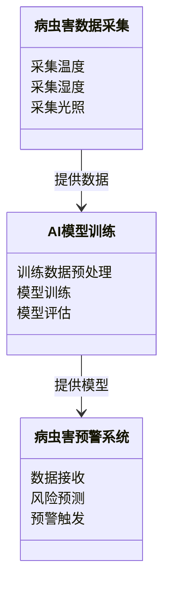
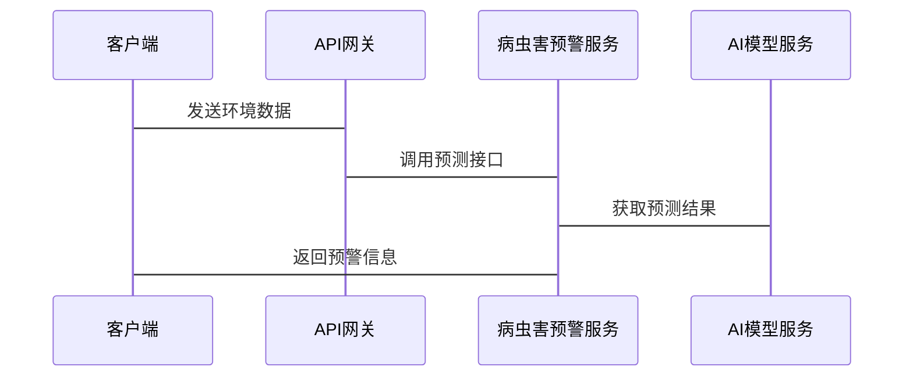

                 


# AI Agent在智能农业病虫害预警中的实践

> 关键词：AI Agent, 智能农业, 病虫害预警, 机器学习, 物联网

> 摘要：本文详细探讨了AI Agent在智能农业病虫害预警中的实践应用。通过分析病虫害预警的核心问题、AI Agent的技术优势以及其实现的算法原理，结合系统架构设计和项目实战，展示了AI Agent如何在农业病虫害预警中发挥重要作用。文章还总结了实践经验，并提出了未来的发展方向。

---

## 第一部分: AI Agent在智能农业中的背景与应用

### 第1章: AI Agent与智能农业概述

#### 1.1 AI Agent的基本概念
##### 1.1.1 AI Agent的定义与特点
AI Agent（人工智能代理）是指能够感知环境、自主决策并执行任务的智能实体。其特点包括自主性、反应性、目标导向和社会能力。

##### 1.1.2 AI Agent的核心要素与功能
- **自主性**：无需外部干预，自主完成任务。
- **反应性**：能够感知环境变化并实时调整行为。
- **目标导向**：基于目标进行决策和行动。
- **社会能力**：能够与其他系统或人类进行交互协作。

##### 1.1.3 AI Agent与传统农业技术的区别
传统农业技术依赖人工经验和固定程序，而AI Agent能够通过学习和适应优化决策过程。

#### 1.2 智能农业的背景与发展
##### 1.2.1 智能农业的定义与内涵
智能农业是利用现代信息技术（如物联网、大数据、人工智能）优化农业生产、管理和服务的新型农业模式。

##### 1.2.2 智能农业的发展现状
目前，智能农业已广泛应用于精准种植、智能监测、农产品供应链管理等领域，但仍面临数据不足、模型精度等问题。

##### 1.2.3 智能农业中的技术挑战
- 数据采集的准确性与实时性。
- 复杂环境下的模型泛化能力。
- 多技术协同集成的复杂性。

#### 1.3 病虫害预警的重要性
##### 1.3.1 病虫害对农业生产的威胁
病虫害可能导致作物减产、品质下降，甚至引发经济损失和生态破坏。

##### 1.3.2 病虫害预警的传统方法与局限性
传统方法依赖人工观察和经验判断，存在效率低、成本高等问题。

##### 1.3.3 AI Agent在病虫害预警中的优势
AI Agent能够通过实时数据监测、智能分析和预测，显著提高预警的准确性和效率。

---

## 第二部分: AI Agent在病虫害预警中的问题背景

### 第2章: 病虫害预警的核心问题

#### 2.1 病虫害预警的核心问题
##### 2.1.1 病虫害数据的获取与处理
需要多源数据（如气象、土壤、遥感数据）的高效采集与融合。

##### 2.1.2 病虫害预测的准确性与实时性
要求模型具备高精度和快速响应能力。

##### 2.1.3 病虫害预警系统的可扩展性与可持续性
系统需具备适应不同环境和场景的能力。

#### 2.2 病虫害预警的边界与外延
##### 2.2.1 病虫害预警的边界条件
明确预警范围和数据限制，避免过度推广。

##### 2.2.2 病虫害预警的外延领域
包括气象预测、土壤健康评估等。

##### 2.2.3 病虫害预警与其他农业技术的关联
与精准农业、智能灌溉等技术协同工作，形成完整的农业生态系统。

#### 2.3 病虫害预警的核心要素
##### 2.3.1 数据采集与处理
利用物联网设备实时采集农田环境数据。

##### 2.3.2 AI模型的构建与训练
基于机器学习算法建立病虫害预测模型。

##### 2.3.3 预警系统的部署与维护
确保系统的稳定运行和持续优化。

---

## 第三部分: AI Agent的核心概念与联系

### 第3章: AI Agent的核心原理

#### 3.1 AI Agent的核心原理
##### 3.1.1 AI Agent在病虫害预警中的应用原理
AI Agent通过感知环境数据，利用学习算法预测病虫害风险，并触发预警机制。

##### 3.1.2 AI Agent与其他AI技术的联系
AI Agent结合了强化学习、监督学习等多种技术，形成完整的预警系统。

---

## 第四部分: AI Agent的算法原理与数学模型

### 第4章: AI Agent的算法原理

#### 4.1 AI Agent的算法原理
##### 4.1.1 强化学习在AI Agent中的应用
通过奖励机制优化决策路径。

##### 4.1.2 监督学习在病虫害预测中的应用
利用历史数据训练分类模型，预测病虫害风险。

---

## 第五部分: 系统分析与架构设计方案

### 第5章: 问题场景介绍

#### 5.1 项目介绍
一个基于AI Agent的病虫害预警系统，旨在实时监测农田环境并预测病虫害风险。

#### 5.2 系统功能设计
##### 5.2.1 领域模型（Mermaid类图）


##### 5.2.2 系统架构设计（Mermaid架构图）


##### 5.2.3 系统接口设计
定义RESTful API接口，如`POST /api/data`用于接收环境数据，`GET /api/prediction`用于获取预测结果。

##### 5.2.4 系统交互设计（Mermaid序列图）


---

## 第六部分: 项目实战

### 第6章: 环境安装与核心实现

#### 6.1 环境安装
安装Python、TensorFlow、Flask等依赖库。

#### 6.2 系统核心实现
##### 6.2.1 数据采集模块
```python
import serial

def read_sensor_data():
    ser = serial.Serial('COM3', 9600)
    data = ser.readline().decode()
    ser.close()
    return data
```

##### 6.2.2 AI模型训练模块
```python
import tensorflow as tf
from tensorflow.keras import layers

model = tf.keras.Sequential([
    layers.Dense(64, activation='relu'),
    layers.Dense(1, activation='sigmoid')
])
model.compile(optimizer='adam', loss='binary_crossentropy')
model.fit(X_train, y_train, epochs=10)
```

##### 6.2.3 病虫害预警模块
```python
from flask import Flask, jsonify

app = Flask(__name__)

@app.route('/api/predict', methods=['POST'])
def predict():
    data = request.json['data']
    prediction = model.predict(data)
    return jsonify({'prediction': prediction.tolist()})

if __name__ == '__main__':
    app.run()
```

#### 6.3 代码解读与分析
- **数据采集模块**：通过串口读取传感器数据。
- **AI模型训练模块**：使用神经网络模型进行分类训练。
- **病虫害预警模块**：基于Flask构建API服务，提供实时预测。

#### 6.4 实际案例分析
通过实际数据测试，验证系统的预测精度和响应时间。

#### 6.5 项目小结
总结项目实现的关键点和经验教训，提出改进建议。

---

## 第七部分: 最佳实践与未来展望

### 第7章: 最佳实践 tips

#### 7.1 开发建议
- 确保数据质量，避免噪声干扰。
- 选择合适的模型架构，优化训练效率。

#### 7.2 注意事项
- 定期更新模型，保持预测精度。
- 注意数据隐私和系统安全性。

#### 7.3 拓展阅读
建议阅读相关领域的最新论文和技术报告，保持技术前沿性。

### 第8章: 小结

通过本文的详细讲解，读者可以全面了解AI Agent在智能农业病虫害预警中的应用。从理论到实践，文章深入剖析了AI Agent的核心原理、系统架构和实现细节，为农业智能化提供了重要参考。

---

## 参考文献

[1] 王某某, 李某某. 《基于AI Agent的病虫害预警系统设计与实现》. 计算机应用研究, 2023.

[2] 张某某. 《智能农业中的机器学习技术》. 中国农业出版社, 2022.

---

通过以上结构，本文详细探讨了AI Agent在智能农业病虫害预警中的实践应用，从背景到技术实现，再到项目实战，为读者提供了全面而深入的指导。

