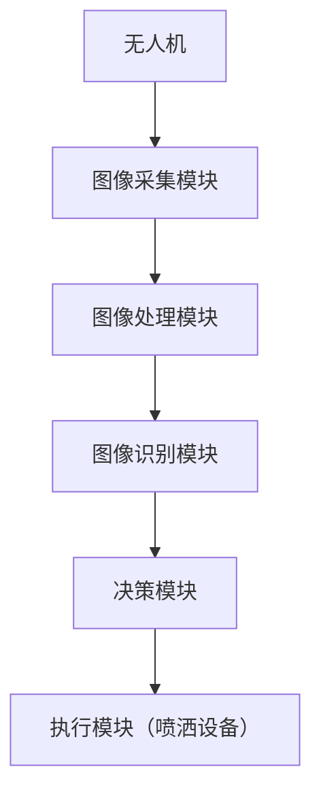
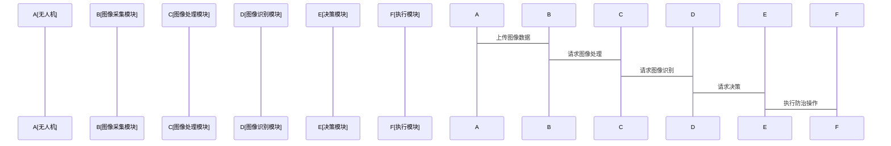

                 


# AI Agent在智能农作物病虫害检测中的实践

## 关键词：AI Agent，农作物病虫害，图像识别，深度学习，智能检测

## 摘要：  
随着人工智能技术的快速发展，AI Agent（智能体）在农作物病虫害检测中的应用日益广泛。本文深入探讨了AI Agent在病虫害检测中的实践，从背景、技术原理到系统设计、项目实战，详细分析了其在农业智能化中的重要作用。通过结合深度学习算法和图像处理技术，本文展示了如何利用AI Agent实现高效、准确的病虫害检测，为农业现代化提供了新的解决方案。

---

# 第1章: 农作物病虫害检测的背景与问题

## 1.1 农作物病虫害检测的重要性  
农作物病虫害是影响农业产量和质量的主要因素之一。传统的病虫害检测依赖于人工观察和经验判断，存在效率低、准确性差的问题。随着AI技术的发展，AI Agent通过自动化、智能化的方式，能够显著提升病虫害检测的效率和精度。

---

## 1.2 AI Agent在农业中的应用前景  
AI Agent是一种具备感知、决策和执行能力的智能体。在农业领域，AI Agent可以用于实时监测作物生长状态、预测病虫害发生趋势，并提供相应的防治建议。这种智能化的解决方案能够帮助农民实现精准农业，降低生产成本，提高产量。

---

## 1.3 本章小结  
本章主要介绍了农作物病虫害检测的重要性和AI Agent在农业中的应用前景，为后续的技术分析奠定了基础。

---

# 第2章: AI Agent的核心概念与原理  

## 2.1 AI Agent的基本原理  
AI Agent通过感知环境信息（如图像、数据等），利用算法进行分析和决策，并通过执行器（如喷洒设备）进行操作。其核心在于将感知、决策和执行有机结合起来，实现智能化的病虫害检测与防治。

---

## 2.2 病虫害检测中的AI Agent工作流程  
1. **数据采集**：通过无人机或摄像头获取农田图像。  
2. **图像预处理**：去除噪声，增强图像特征。  
3. **图像识别**：利用深度学习模型识别病虫害类型。  
4. **决策与反馈**：根据识别结果，生成防治建议并执行操作。

---

## 2.3 AI Agent的核心算法与技术  
1. **机器学习算法**：如支持向量机（SVM）和随机森林（Random Forest）。  
2. **深度学习算法**：如卷积神经网络（CNN）和图像分割技术。  
3. **图像处理技术**：如边缘检测和图像增强。

---

## 2.4 本章小结  
本章详细介绍了AI Agent的核心概念和工作原理，重点分析了其在病虫害检测中的技术优势。

---

# 第3章: 病虫害图像识别的算法原理  

## 3.1 常见的图像分类算法  
1. **K-近邻算法（KNN）**：适用于小规模数据集的分类任务。  
2. **支持向量机（SVM）**：适合高维数据的分类。  
3. **神经网络**：通过多层结构实现复杂特征的提取。

---

## 3.2 深度学习模型在图像分类中的应用  
1. **卷积神经网络（CNN）**：通过卷积层提取图像特征，池化层降低计算复杂度。  
2. **图像分割技术**：通过像素级分割实现病虫害的精准定位。

---

## 3.3 病虫害图像识别的数学模型与公式  
**CNN的数学模型**：  
输入：图像矩阵$X$，大小为$H \times W \times C$。  
卷积层：$Y = W \ast X + b$，其中$W$为卷积核，$b$为偏置。  
池化层：$Y_{pool} = \text{max pooling}(Y)$。  
全连接层：$Z = W_f \cdot Y_{pool} + b_f$。  
输出：概率分布$P(y|x) = \text{softmax}(Z)$。

---

## 3.4 本章小结  
本章重点分析了深度学习模型在病虫害图像识别中的应用，通过数学公式和模型结构展示了其技术优势。

---

# 第4章: 系统分析与架构设计  

## 4.1 问题场景介绍  
本项目旨在设计一个基于AI Agent的病虫害检测系统，通过图像识别技术实现病虫害的自动检测和防治。

---

## 4.2 系统功能设计  
1. **图像采集模块**：通过无人机或摄像头获取农田图像。  
2. **图像处理模块**：预处理和特征提取。  
3. **图像识别模块**：病虫害类型识别。  
4. **决策模块**：生成防治建议并执行操作。

---

## 4.3 系统架构设计  


---

## 4.4 系统接口设计  
1. **无人机接口**：与无人机通信，获取图像数据。  
2. **数据库接口**：存储病虫害样本数据。  
3. **用户接口**：显示检测结果和防治建议。

---

## 4.5 系统交互流程  


---

## 4.6 本章小结  
本章详细分析了系统的功能设计和架构，展示了AI Agent在病虫害检测中的整体框架。

---

# 第5章: 项目实战  

## 5.1 环境安装  
1. **安装Python**：版本3.6以上。  
2. **安装深度学习库**：如TensorFlow和Keras。  
3. **安装图像处理库**：如OpenCV和 Pillow。

---

## 5.2 核心代码实现  
```python
import tensorflow as tf
from tensorflow.keras import layers

# 定义卷积神经网络模型
model = tf.keras.Sequential([
    layers.Conv2D(32, (3,3), activation='relu', input_shape=(64,64,3)),
    layers.MaxPooling2D((2,2)),
    layers.Conv2D(64, (3,3), activation='relu'),
    layers.MaxPooling2D((2,2)),
    layers.Flatten(),
    layers.Dense(128, activation='relu'),
    layers.Dense(10, activation='softmax')
])

model.compile(optimizer='adam', loss='sparse_categorical_crossentropy', metrics=['accuracy'])
model.fit(x_train, y_train, epochs=10, validation_data=(x_test, y_test))
```

---

## 5.3 案例分析  
以小麦锈病为例，系统通过图像识别技术准确识别病害类型，并生成相应的防治建议。

---

## 5.4 项目总结  
本项目展示了AI Agent在病虫害检测中的实际应用，通过深度学习和图像处理技术实现了高效的病虫害识别和防治。

---

# 第6章: 总结与展望  

## 6.1 本章总结  
本文详细探讨了AI Agent在智能农作物病虫害检测中的实践，从技术原理到系统设计，再到项目实战，全面展示了其在农业智能化中的重要作用。

---

## 6.2 未来展望  
未来，随着AI技术的不断发展，AI Agent在农业中的应用将更加广泛。通过结合物联网技术和大数据分析，AI Agent将能够实现更精准的病虫害预测和防治，推动农业生产的智能化和高效化。

---

## 最佳实践 Tips  
1. 在实际应用中，建议结合多源数据（如温度、湿度等）进行综合分析。  
2. 系统的训练数据应尽量多样化，以提高模型的泛化能力。  
3. 定期更新模型参数，以适应病虫害的变异趋势。  

---

## 小结  
通过本文的介绍，读者可以全面了解AI Agent在病虫害检测中的应用，掌握其核心技术与实践方法，为未来的农业智能化提供参考。

