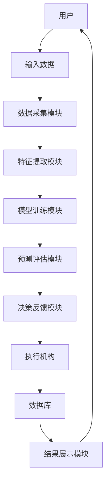

                 


# AI Agent在智能制造质量预测中的角色

> 关键词：人工智能、智能制造、质量预测、AI Agent、机器学习、深度学习、系统架构

> 摘要：本文探讨了AI Agent在智能制造质量预测中的角色和应用。通过分析AI Agent的核心概念、算法原理、系统架构设计和项目实战，详细阐述了AI Agent如何通过感知、决策和执行机制优化质量预测流程，提升制造业的智能化水平。文章还提供了丰富的技术细节和代码示例，帮助读者深入理解AI Agent在智能制造中的实际应用。

---

# 第一部分：AI Agent在智能制造中的背景与概念

## 第1章：智能制造的现状与发展

### 1.1 智能制造的定义与特点

智能制造是一种通过数字化技术、自动化系统和人工智能等技术实现的生产模式，其特点是高效、灵活和精准。相比传统制造，智能制造能够实时监控生产过程，优化资源配置，减少浪费，提高产品质量和生产效率。

智能制造的特点包括：
1. **数字化**：生产过程中的数据采集、分析和应用高度依赖数字化技术。
2. **自动化**：生产流程中的许多环节可以由自动化系统完成，减少人工干预。
3. **智能化**：利用人工智能技术进行预测、优化和决策，提升生产效率和产品质量。
4. **灵活性**：能够快速适应市场需求变化，实现多品种、小批量生产。

### 1.2 制造业智能化转型的驱动力

制造业智能化转型的驱动力主要包括以下几个方面：
1. **市场竞争压力**：全球市场竞争加剧，企业需要通过智能化转型提高效率和竞争力。
2. **技术进步**：人工智能、物联网和大数据等技术的快速发展为智能制造提供了技术基础。
3. **客户需求变化**：消费者对个性化、定制化产品的需求增加，推动制造业向智能化方向发展。
4. **成本控制**：通过智能化技术优化生产流程，降低生产成本。

### 1.3 AI Agent的基本概念

AI Agent（人工智能代理）是指能够感知环境、自主决策并执行任务的智能实体。AI Agent可以是软件程序，也可以是硬件设备，其核心能力包括：
1. **感知**：通过传感器、摄像头等设备获取环境信息。
2. **决策**：基于获取的信息，利用算法进行分析和判断。
3. **执行**：根据决策结果执行相应的动作，例如调整设备参数、优化生产流程等。

### 1.4 AI Agent在智能制造中的角色

AI Agent在智能制造中的角色主要体现在以下几个方面：
1. **质量预测**：通过分析生产数据，预测产品质量，提前发现潜在问题。
2. **优化生产流程**：通过实时监控和分析生产数据，优化生产流程，提高效率。
3. **故障诊断**：通过分析设备运行数据，快速诊断设备故障，减少停机时间。
4. **供应链管理**：通过分析供应链数据，优化库存管理和物流安排，降低运营成本。

---

## 第2章：AI Agent的核心概念与原理

### 2.1 AI Agent的感知与决策机制

#### 2.1.1 数据采集与特征提取

在智能制造中，AI Agent需要从生产线上采集大量的数据，包括温度、压力、振动、图像等。这些数据需要经过特征提取，转化为有意义的信息。例如，通过对振动信号的分析，可以提取设备运行状态的特征，用于故障诊断。

#### 2.1.2 数据分析与模式识别

AI Agent通过机器学习算法对提取的特征进行分析，识别数据中的模式和趋势。例如，使用支持向量机（SVM）对设备状态进行分类，或者使用随机森林算法对产品质量进行预测。

#### 2.1.3 决策逻辑与策略优化

AI Agent根据分析结果制定决策策略，例如调整设备参数、启动维护流程等。决策逻辑需要根据具体场景进行优化，例如通过强化学习算法不断优化决策策略，提高预测准确率。

### 2.2 AI Agent的执行与反馈机制

#### 2.2.1 动作规划与执行

AI Agent根据决策结果制定动作规划，并通过执行机构（如机器人、传感器等）进行操作。例如，AI Agent可以控制机器人调整生产线上的设备参数，确保生产过程符合预期。

#### 2.2.2 反馈机制与自适应调整

AI Agent需要根据执行结果进行反馈，调整决策策略。例如，如果预测的设备故障没有发生，AI Agent可以根据反馈结果优化预测模型，提高准确性。

#### 2.2.3 系统的闭环控制流程

AI Agent通过感知、决策和执行形成一个闭环控制系统，确保生产过程的稳定和优化。例如，在质量预测中，AI Agent可以根据实时数据不断优化预测模型，提高预测准确率。

### 2.3 AI Agent的核心算法与技术

#### 2.3.1 机器学习算法

机器学习算法是AI Agent的核心技术之一，包括监督学习、无监督学习和强化学习等。例如，支持向量机（SVM）和随机森林算法常用于分类和回归任务，而强化学习算法用于优化决策策略。

#### 2.3.2 深度学习算法

深度学习算法通过多层神经网络模型进行特征提取和模式识别，常用于图像识别和语音处理。例如，卷积神经网络（CNN）可以用于产品外观的缺陷检测，循环神经网络（RNN）可以用于时间序列数据的分析。

#### 2.3.3 自然语言处理与知识图谱

自然语言处理（NLP）技术用于处理文本数据，知识图谱用于构建领域知识库。例如，AI Agent可以通过NLP技术分析生产文档，提取有价值的信息，或者通过知识图谱进行推理和决策。

---

## 第3章：AI Agent在质量预测中的算法原理

### 3.1 基于机器学习的质量预测算法

#### 3.1.1 线性回归模型

线性回归是一种简单的回归算法，适用于线性关系的数据。例如，可以通过线性回归模型预测设备的运行时间与产品缺陷率之间的关系。

$$ y = \beta_0 + \beta_1 x + \epsilon $$

其中，$y$是预测目标，$x$是输入特征，$\beta_0$和$\beta_1$是回归系数，$\epsilon$是误差项。

#### 3.1.2 支持向量机（SVM）

支持向量机是一种常用的分类算法，适用于高维数据的分类任务。例如，可以使用SVM对产品质量进行分类，区分合格品和不合格品。

#### 3.1.3 随机森林与梯度提升树

随机森林是一种基于决策树的集成学习算法，适用于分类和回归任务。梯度提升树是一种通过多次迭代优化模型的算法，适用于复杂的数据分布。

### 3.2 基于深度学习的质量预测算法

#### 3.2.1 神经网络模型

神经网络模型是一种多层的深度学习算法，适用于复杂的模式识别任务。例如，可以使用卷积神经网络（CNN）对产品外观进行缺陷检测。

#### 3.2.2 卷积神经网络（CNN）

CNN通过卷积层和池化层提取图像特征，常用于图像分类任务。例如，可以使用CNN对产品的外观进行分类，识别表面缺陷。

#### 3.2.3 循环神经网络（RNN）

RNN适用于时间序列数据的分析，常用于预测任务。例如，可以使用RNN预测设备的运行状态，提前发现潜在故障。

### 3.3 算法对比与优化策略

#### 3.3.1 不同算法的优缺点对比

| 算法类型     | 优点                               | 缺点                               |
|--------------|------------------------------------|------------------------------------|
| 线性回归     | 简单，计算速度快                   | 适用于线性关系，不适合复杂任务   |
| SVM          | 分类能力强，适合高维数据           | 计算复杂，不适合大数据量           |
| 随机森林     | 鲁棒性强，适用于多种数据类型       | 对参数敏感，需要调参               |
| CNN          | 特征提取能力强，适用于图像数据     | 需要大量标注数据，计算资源消耗大  |
| RNN          | 适用于时间序列数据，预测能力强     | 长期依赖问题，梯度消失或爆炸       |

#### 3.3.2 超参数优化与模型调优

超参数优化是提高模型性能的重要手段，常用的方法包括网格搜索（Grid Search）和随机搜索（Random Search）。例如，可以通过网格搜索找到最佳的学习率和正则化参数，优化模型性能。

#### 3.3.3 模型的可解释性与鲁棒性

模型的可解释性是工业应用中的重要考量，尤其是在需要对预测结果进行解释和追溯的场景。例如，可以通过特征重要性分析，了解哪些特征对质量预测影响最大。

---

## 第4章：AI Agent的系统架构设计与实现

### 4.1 问题场景介绍

智能制造中的质量预测问题场景包括：
- **数据来源**：生产线上的传感器数据、图像数据和日志数据。
- **预测目标**：产品质量的分类或回归预测。
- **系统要求**：实时性、准确性、可扩展性和可解释性。

### 4.2 系统功能设计

系统功能设计包括以下几个模块：
1. **数据采集模块**：负责采集生产线上的各种数据，例如温度、压力、振动等。
2. **特征提取模块**：对采集的数据进行特征提取，例如通过FFT算法提取振动信号的频谱特征。
3. **模型训练模块**：使用机器学习或深度学习算法训练质量预测模型。
4. **预测评估模块**：对实时数据进行预测，并评估预测结果的准确性。

### 4.3 系统架构设计

系统架构设计采用分层架构，包括数据层、算法层和应用层。

#### 数据层

数据层包括数据采集、数据存储和数据预处理模块：
- **数据采集**：通过传感器和摄像头采集生产数据。
- **数据存储**：将采集的数据存储在数据库中，例如MySQL或MongoDB。
- **数据预处理**：对数据进行清洗、归一化和特征提取。

#### 算法层

算法层包括特征提取、模型训练和预测评估模块：
- **特征提取**：使用FFT、PCA等算法提取数据特征。
- **模型训练**：使用机器学习或深度学习算法训练质量预测模型。
- **预测评估**：对实时数据进行预测，并评估预测结果的准确性。

#### 应用层

应用层包括用户界面、结果展示和决策反馈模块：
- **用户界面**：提供友好的用户界面，方便用户查看预测结果。
- **结果展示**：以图表形式展示预测结果和模型性能。
- **决策反馈**：根据预测结果，生成决策建议，例如调整设备参数或启动维护流程。

### 4.4 系统接口设计

系统接口设计包括以下几个部分：
1. **数据接口**：与传感器和数据库的接口，确保数据的实时传输和存储。
2. **算法接口**：与机器学习框架（如TensorFlow、Scikit-learn）的接口，方便模型的训练和部署。
3. **用户接口**：与用户界面的接口，提供预测结果和决策建议。

### 4.5 系统交互流程图

以下是系统交互流程图：



---

## 第5章：项目实战与案例分析

### 5.1 环境安装与配置

#### 安装Python和相关库

```bash
pip install numpy
pip install pandas
pip install scikit-learn
pip install tensorflow
pip install matplotlib
pip install pymysql
```

### 5.2 核心代码实现

#### 数据采集与预处理

```python
import numpy as np
import pandas as pd
import pymysql

# 数据采集
def get_data():
    # 连接数据库
    conn = pymysql.connect(host='localhost', user='root', password='password', db='manufacturing')
    cursor = conn.cursor()
    # 执行查询
    cursor.execute("SELECT * FROM quality_data LIMIT 1000")
    data = cursor.fetchall()
    conn.close()
    return data

# 数据预处理
def preprocess_data(data):
    df = pd.DataFrame(data)
    # 删除缺失值
    df.dropna(inplace=True)
    # 标准化处理
    from sklearn.preprocessing import StandardScaler
    scaler = StandardScaler()
    df[['temperature', 'pressure']] = scaler.fit_transform(df[['temperature', 'pressure']])
    return df
```

#### 模型训练与预测

```python
from sklearn.ensemble import RandomForestClassifier
from sklearn.metrics import accuracy_score

def train_model(X_train, y_train):
    # 训练随机森林模型
    model = RandomForestClassifier(n_estimators=100, max_depth=10, random_state=42)
    model.fit(X_train, y_train)
    return model

def predict_model(model, X_test):
    y_pred = model.predict(X_test)
    print("预测准确率:", accuracy_score(y_test, y_pred))
    return y_pred
```

### 5.3 实际案例分析

#### 案例背景

某汽车制造厂需要预测生产线上的产品质量。生产线上的传感器每隔10秒采集一次温度和压力数据，同时记录产品是否合格。目标是通过AI Agent预测产品的合格率，优化生产流程。

#### 数据分析与建模

```python
import matplotlib.pyplot as plt

# 绘制温度与压力分布图
plt.scatter(data['temperature'], data['pressure'], c=data['label'])
plt.xlabel('Temperature')
plt.ylabel('Pressure')
plt.title('Temperature vs Pressure')
plt.colorbar(label='Label')
plt.show()
```

#### 模型优化与部署

通过网格搜索优化随机森林模型的参数，提高预测准确率。

```python
from sklearn.model_selection import GridSearchCV

# 网格搜索优化参数
param_grid = {
    'n_estimators': [100, 200],
    'max_depth': [10, 20],
    'min_samples_split': [2, 5]
}

grid_search = GridSearchCV(RandomForestClassifier(), param_grid, cv=5)
grid_search.fit(X_train, y_train)
best_model = grid_search.best_estimator_
print("最佳参数组合:", grid_search.best_params_)
```

### 5.4 项目小结

通过该项目实战，我们实现了AI Agent在智能制造质量预测中的应用。通过数据采集、预处理、模型训练和预测评估，验证了AI Agent在质量预测中的有效性。同时，通过网格搜索优化模型参数，提高了预测准确率。

---

## 第6章：总结与展望

### 6.1 总结

本文详细探讨了AI Agent在智能制造质量预测中的角色和应用。通过分析AI Agent的核心概念、算法原理和系统架构设计，展示了AI Agent如何通过感知、决策和执行机制优化生产流程，提升产品质量和生产效率。通过实际案例分析，验证了AI Agent在质量预测中的有效性。

### 6.2 展望

未来，随着人工智能和大数据技术的不断发展，AI Agent在智能制造中的应用将更加广泛和深入。例如，通过边缘计算技术，AI Agent可以实现本地化的实时预测和决策，减少对云端的依赖。同时，通过强化学习算法，AI Agent可以实现更加复杂的决策任务，例如多目标优化和动态规划。

### 6.3 最佳实践 Tips

1. **数据预处理**：在质量预测中，数据预处理是关键步骤，需要仔细清洗和特征提取。
2. **模型选择**：根据具体场景选择合适的算法，例如使用随机森林进行分类，使用RNN进行时间序列预测。
3. **模型调优**：通过网格搜索和交叉验证优化模型参数，提高预测准确率。
4. **系统架构设计**：采用分层架构，确保系统的可扩展性和可维护性。

### 6.4 拓展阅读

1.《Hands-On Machine Learning with Scikit-Learn, Keras, and TensorFlow》
2.《Deep Learning for Image Processing》
3.《Reinforcement Learning: Theory and Algorithms》

---

通过本文的学习，读者可以深入了解AI Agent在智能制造质量预测中的应用，并掌握实际项目的实现方法。希望本文能够为相关领域的研究和实践提供有价值的参考。

