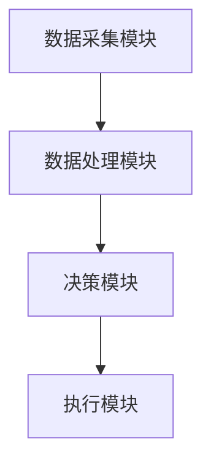
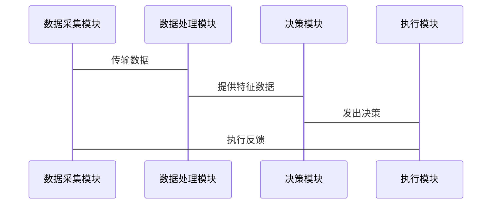

                 


# AI Agent在智能制造过程优化中的角色

> **关键词**: AI Agent, 智能制造, 生产过程优化, 质量控制, 系统架构设计

> **摘要**: 本文探讨了AI Agent在智能制造过程优化中的角色，从背景、核心原理到应用场景，系统地分析了AI Agent如何通过感知、推理、决策和执行等能力，优化生产过程、提高质量控制和提升整体效率。文章结合实际案例，详细讲解了AI Agent在智能制造中的具体应用，展示了其在现代工业中的巨大潜力和实际价值。

---

## 第一部分: AI Agent在智能制造中的背景与概念

### 第1章: 智能制造与AI Agent概述

#### 1.1 智能制造的定义与特点

- **1.1.1 智能制造的定义**  
  智能制造是一种基于人工智能、大数据、物联网等技术的先进制造模式，通过智能化的生产系统和流程，实现从设计、生产到服务的全生命周期管理。

- **1.1.2 智能制造的核心特点**  
  - **数据驱动**: 利用传感器和物联网技术实时采集生产数据，通过数据分析优化生产流程。  
  - **自动化与智能化**: 结合机器人和自动化设备，实现生产过程的智能化控制。  
  - **灵活性与适应性**: 能够快速响应市场变化，灵活调整生产计划。  

- **1.1.3 智能制造的发展历程**  
  从传统的自动化生产到现代的智能化制造，智能制造经历了从单一设备自动化到全系统智能化的演变。

#### 1.2 AI Agent的基本概念

- **1.2.1 AI Agent的定义**  
  AI Agent（人工智能代理）是一种能够感知环境、做出决策并执行动作的智能实体，旨在帮助用户完成特定任务或优化系统运行。

- **1.2.2 AI Agent的核心属性**  
  - **感知能力**: 通过传感器或数据接口获取环境信息。  
  - **推理能力**: 利用知识库和推理引擎进行逻辑推理。  
  - **决策能力**: 基于推理结果做出最优决策。  
  - **执行能力**: 执行决策并通过动作影响环境。  

- **1.2.3 AI Agent与传统自动化系统的区别**  
  AI Agent不仅能够执行预设任务，还能够根据环境变化动态调整行为，具有更强的适应性和自主性。

#### 1.3 AI Agent在智能制造中的应用前景

- **1.3.1 智能制造的潜在应用领域**  
  - **生产优化**: 提高生产效率，降低资源消耗。  
  - **质量控制**: 实时监测生产过程，确保产品质量。  
  - **供应链管理**: 优化库存管理，提高供应链效率。  

- **1.3.2 AI Agent在智能制造中的优势**  
  - **高效决策**: 通过机器学习和大数据分析，快速做出最优决策。  
  - **灵活性**: 能够根据环境变化动态调整生产计划。  
  - **实时监控**: 实时监测生产过程，快速响应异常情况。  

- **1.3.3 AI Agent应用的挑战与机遇**  
  - **挑战**: 数据隐私、算法复杂性、系统集成难度。  
  - **机遇**: 提高生产效率、降低成本、增强企业竞争力。  

---

## 第二部分: AI Agent的核心原理与技术

### 第2章: AI Agent的体系结构与决策机制

#### 2.1 AI Agent的体系结构

- **2.1.1 基于模型的体系结构**  
  - 通过构建知识库和逻辑推理引擎，AI Agent能够基于模型做出决策。  
  - 示例: 知识图谱构建与推理。  

- **2.1.2 基于数据驱动的体系结构**  
  - 通过机器学习算法，AI Agent直接从数据中学习决策规则。  
  - 示例: 基于监督学习的分类任务。  

- **2.1.3 混合体系结构**  
  - 结合模型驱动和数据驱动的优势，实现更强大的决策能力。  
  - 示例: 混合型推荐系统。  

#### 2.2 AI Agent的决策机制

- **2.2.1 基于规则的决策**  
  - 通过预定义的规则进行决策，适用于规则明确的场景。  
  - 示例: 基于规则的交通信号灯控制。  

- **2.2.2 基于机器学习的决策**  
  - 利用机器学习算法从数据中学习决策模型。  
  - 示例: 基于随机森林的分类任务。  

- **2.2.3 基于强化学习的决策**  
  - 通过与环境的交互学习最优策略。  
  - 示例: 基于Q-learning的机器人路径规划。  

#### 2.3 AI Agent的学习与优化

- **2.3.1 监督学习在AI Agent中的应用**  
  - 通过标注数据训练分类器，实现预测和分类任务。  
  - 示例: 基于线性回归的生产成本预测。  

- **2.3.2 无监督学习在AI Agent中的应用**  
  - 通过聚类分析发现数据中的隐含模式。  
  - 示例: 基于K-means的客户群体划分。  

- **2.3.3 强化学习在AI Agent中的应用**  
  - 通过试错学习优化策略。  
  - 示例: 基于深度强化学习的机器人控制。  

#### 2.4 本章小结

---

### 第3章: AI Agent的感知与推理

#### 3.1 感知技术

- **3.1.1 传感器数据采集**  
  - 通过多种传感器（如温度、压力传感器）实时采集生产数据。  
  - 示例: 生产线上的温度传感器数据采集。  

- **3.1.2 数据预处理与特征提取**  
  - 对采集到的数据进行清洗、归一化等预处理操作。  
  - 示例: 利用主成分分析（PCA）提取关键特征。  

- **3.1.3 多模态数据融合**  
  - 将来自不同传感器的数据进行融合，提高感知能力。  
  - 示例: 结合视觉和听觉数据进行故障检测。  

#### 3.2 推理与知识表示

- **3.2.1 知识图谱构建**  
  - 通过知识抽取和知识融合构建领域知识图谱。  
  - 示例: 基于本体的生产流程知识图谱。  

- **3.2.2 逻辑推理与符号推理**  
  - 利用逻辑推理引擎进行推理，如一阶逻辑推理。  
  - 示例: 基于Prolog的逻辑推理。  

- **3.2.3 概率推理与 Bayesian 网络**  
  - 利用概率图模型进行推理，如贝叶斯网络。  
  - 示例: 基于贝叶斯网络的故障诊断。  

#### 3.3 本章小结

---

## 第三部分: 智能制造中的AI Agent应用场景

### 第4章: 生产过程优化中的AI Agent

#### 4.1 生产过程优化的挑战

- **4.1.1 生产效率的提升需求**  
  - 如何通过优化调度提高生产效率。  
  - 示例: 制造业中的生产调度问题。  

- **4.1.2 资源利用率的优化**  
  - 如何合理分配资源，降低浪费。  
  - 示例: 基于资源约束的生产计划优化。  

- **4.1.3 生产过程中的不确定性**  
  - 如何应对生产过程中的不确定性，如设备故障、市场需求变化。  
  - 示例: 基于强化学习的动态生产调度。  

#### 4.2 AI Agent在生产优化中的应用

- **4.2.1 生产调度优化**  
  - 利用AI Agent进行生产调度优化，如基于遗传算法的调度优化。  
  - 示例: 基于强化学习的生产调度优化。  

- **4.2.2 资源分配优化**  
  - 利用AI Agent进行资源分配优化，如基于线性规划的资源分配。  
  - 示例: 基于动态规划的资源分配优化。  

- **4.2.3 生产过程中的实时决策**  
  - 利用AI Agent实时监测生产过程，快速响应异常情况。  
  - 示例: 基于实时数据的动态调整生产计划。  

#### 4.3 实际案例分析

- **4.3.1 某汽车制造企业的生产优化案例**  
  - 通过AI Agent优化生产调度，提高生产效率20%。  

- **4.3.2 某电子制造企业的生产优化案例**  
  - 通过AI Agent优化资源分配，降低生产成本15%。  

#### 4.4 本章小结

---

### 第5章: 质量控制中的AI Agent

#### 5.1 质量控制的挑战

- **5.1.1 质量检测的高精度要求**  
  - 如何实现高精度的质量检测。  
  - 示例: 制造业中的表面缺陷检测。  

- **5.1.2 质量检测的高效率要求**  
  - 如何快速完成质量检测，减少生产瓶颈。  
  - 示例: 基于深度学习的快速检测。  

- **5.1.3 质量检测的实时性要求**  
  - 如何实现实时质量检测，确保生产过程的连续性。  
  - 示例: 基于边缘计算的实时检测。  

#### 5.2 AI Agent在质量控制中的应用

- **5.2.1 基于计算机视觉的质量检测**  
  - 利用深度学习模型进行图像识别，实现高精度的质量检测。  
  - 示例: 基于卷积神经网络（CNN）的表面缺陷检测。  

- **5.2.2 基于机器学习的质量预测**  
  - 利用机器学习模型预测产品质量，提前发现潜在问题。  
  - 示例: 基于随机森林的分类模型预测产品合格率。  

- **5.2.3 基于实时反馈的质量优化**  
  - 利用实时数据反馈优化生产参数，提升产品质量。  
  - 示例: 基于实时反馈的生产参数优化。  

#### 5.3 实际案例分析

- **5.3.1 某电子制造企业的质量控制案例**  
  - 通过AI Agent实现高精度的质量检测，减少不合格品率。  

- **5.3.2 某汽车制造企业的质量控制案例**  
  - 通过AI Agent实现实时质量检测，确保生产过程的连续性。  

#### 5.4 本章小结

---

## 第四部分: 系统架构设计

### 第6章: 智能制造系统的架构与实现

#### 6.1 问题场景介绍

- **6.1.1 问题背景**  
  - 某制造企业希望优化其生产过程，提升产品质量。  

- **6.1.2 项目介绍**  
  - 开发一个基于AI Agent的智能制造系统，实现生产过程优化和质量控制。  

#### 6.2 系统功能设计

- **6.2.1 领域模型设计**  
  - 基于Mermaid的领域模型类图，展示系统的核心功能模块。  

- **6.2.2 功能模块设计**  
  - 数据采集模块、数据处理模块、决策模块、执行模块。  

#### 6.3 系统架构设计

- **6.3.1 系统架构图**  
  - 基于Mermaid的系统架构图，展示系统的整体架构。  

- **6.3.2 关键模块设计**  
  - 数据采集模块: 实现传感器数据的采集与传输。  
  - 数据处理模块: 对数据进行预处理和特征提取。  
  - 决策模块: 基于AI Agent进行决策。  
  - 执行模块: 执行决策并反馈结果。  

#### 6.4 系统接口设计

- **6.4.1 系统接口描述**  
  - 数据采集接口: 传感器数据的采集接口。  
  - 数据处理接口: 数据预处理和特征提取的接口。  
  - 决策接口: AI Agent的决策接口。  
  - 执行接口: 执行决策的接口。  

#### 6.5 系统交互设计

- **6.5.1 系统交互序列图**  
  - 基于Mermaid的系统交互序列图，展示系统的交互流程。  

#### 6.6 本章小结

---

## 第五部分: 项目实战

### 第7章: 基于AI Agent的智能制造系统实现

#### 7.1 环境安装

- **7.1.1 系统环境要求**  
  - 操作系统: Linux/Windows/MacOS  
  - Python版本: Python 3.6+  
  - 其他依赖: TensorFlow, Scikit-learn, Mermaid CLI  

- **7.1.2 安装步骤**  
  ```bash
  pip install tensorflow scikit-learn mermaid-cli
  ```

#### 7.2 系统核心实现

- **7.2.1 数据采集模块实现**  
  ```python
  import serial

  def read_sensor_data(port, baud_rate):
      ser = serial.Serial(port, baud_rate)
      data = ser.readline().decode().strip()
      ser.close()
      return data
  ```

- **7.2.2 数据处理模块实现**  
  ```python
  from sklearn.decomposition import PCA

  def preprocess_data(data):
      # 数据清洗
      cleaned_data = data.dropna()
      # 特征提取
      pca = PCA(n_components=2)
      reduced_data = pca.fit_transform(cleaned_data)
      return reduced_data
  ```

- **7.2.3 决策模块实现**  
  ```python
  import tensorflow as tf
  from tensorflow.keras import layers

  model = tf.keras.Sequential([
      layers.Dense(64, activation='relu', input_shape=(2,)),
      layers.Dense(1, activation='sigmoid')
  ])
  model.compile(optimizer='adam', loss='binary_crossentropy', metrics=['accuracy'])
  model.fit(X_train, y_train, epochs=10, batch_size=32)
  ```

- **7.2.4 执行模块实现**  
  ```python
  def execute_decision(decision):
      # 执行决策，例如调整生产参数
      print(f"执行决策: {decision}")
  ```

#### 7.3 代码应用解读与分析

- **7.3.1 数据采集模块**  
  - 使用Python的`serial`库实现传感器数据的采集。  
  - 示例: 从串口读取温度传感器数据。  

- **7.3.2 数据处理模块**  
  - 使用Scikit-learn的PCA进行数据降维。  
  - 示例: 从高维数据中提取关键特征。  

- **7.3.3 决策模块**  
  - 使用TensorFlow构建一个简单的神经网络模型。  
  - 示例: 基于训练数据进行分类任务。  

- **7.3.4 执行模块**  
  - 根据决策结果执行实际操作。  
  - 示例: 调整生产线参数。  

#### 7.4 实际案例分析

- **7.4.1 案例背景**  
  - 某制造企业希望优化其生产过程，提高生产效率。  

- **7.4.2 数据准备**  
  - 采集生产线上的传感器数据，包括温度、压力等参数。  

- **7.4.3 模型训练**  
  - 使用训练数据训练神经网络模型，实现生产调度优化。  

- **7.4.4 模型部署**  
  - 将训练好的模型部署到生产线上，实时优化生产调度。  

#### 7.5 本章小结

---

## 第六部分: 总结与展望

### 第8章: 总结与展望

#### 8.1 总结

- AI Agent在智能制造中的应用前景广阔，能够显著提升生产效率和产品质量。  
- 通过感知、推理、决策和执行等能力，AI Agent能够优化生产过程，实现智能制造的目标。

#### 8.2 展望

- **技术发展**: 随着AI技术的不断进步，AI Agent在智能制造中的应用将更加广泛和深入。  
- **应用场景**: 更多行业的智能制造系统将引入AI Agent技术，推动工业4.0的发展。  
- **挑战与机遇**: 需要克服数据隐私、算法复杂性等挑战，同时抓住提升企业竞争力的机遇。  

#### 8.3 最佳实践 Tips

- **数据质量管理**: 确保数据的准确性、完整性和一致性。  
- **模型可解释性**: 提高AI Agent的决策可解释性，便于问题诊断和优化。  
- **系统集成**: 确保AI Agent与现有系统的良好集成，实现无缝对接。  

#### 8.4 本章小结

---

## 附录

### 附录A: AI Agent相关数学公式

- **线性回归公式**:  
  $$ y = \beta_0 + \beta_1 x + \epsilon $$  
- **神经网络损失函数**:  
  $$ L = \frac{1}{N}\sum_{i=1}^{N}(y_i - \hat{y}_i)^2 $$  
- **强化学习Q-learning公式**:  
  $$ Q(s, a) = Q(s, a) + \alpha (r + \gamma \max Q(s', a') - Q(s, a)) $$  

### 附录B: 系统架构图



### 附录C: 系统交互序列图



---

# 结束语

通过本文的探讨，我们可以看到AI Agent在智能制造过程优化中的巨大潜力。随着技术的不断进步，AI Agent将发挥越来越重要的作用，推动工业4.0的发展。希望本文能为相关领域的读者提供有价值的参考和启示。

--- 

如果需要更详细的内容或进一步的技术支持，请随时联系。

