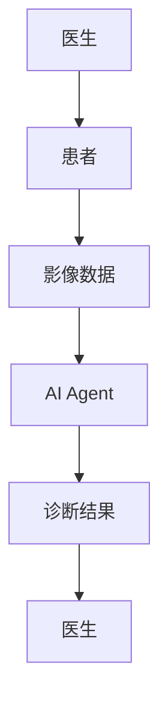
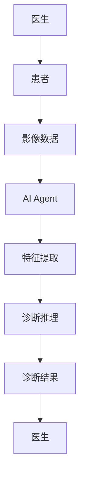
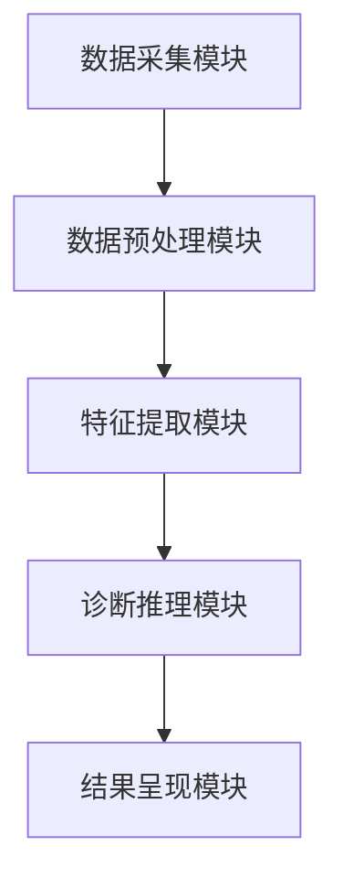
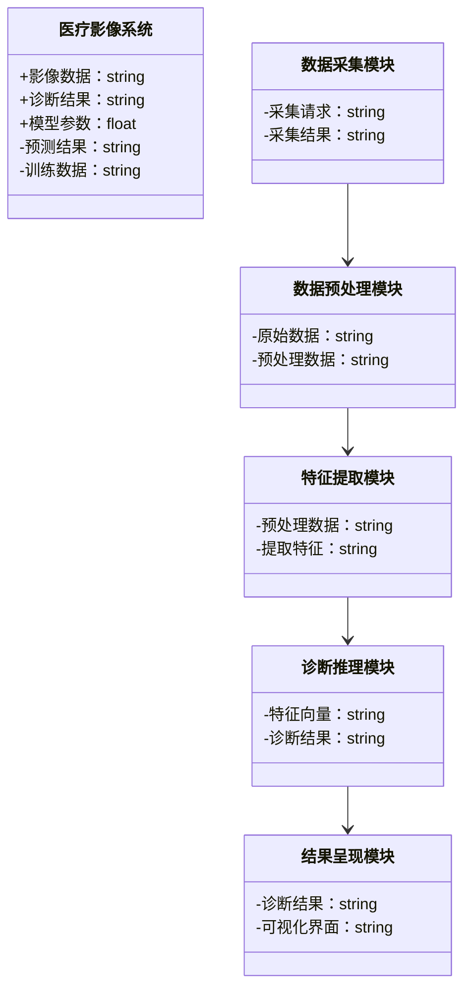
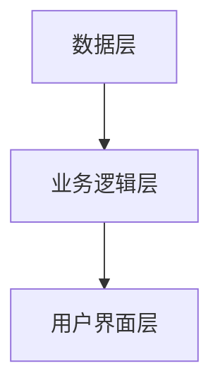
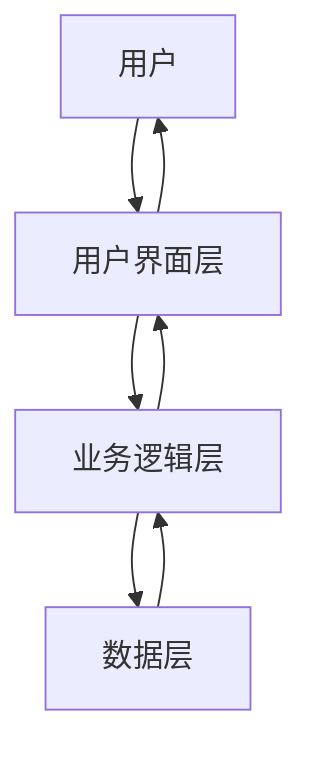
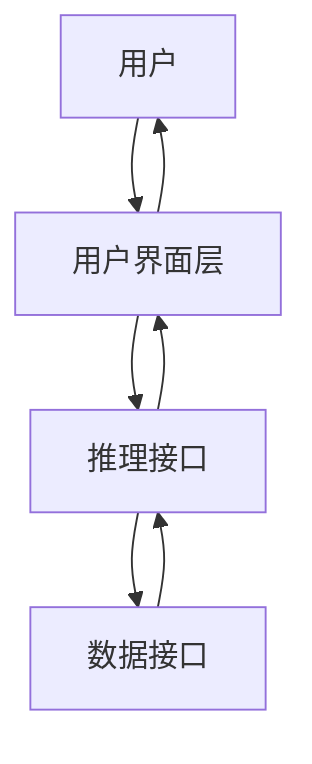

                 


# AI Agent在智能医疗影像分析与诊断中的角色

> 关键词：AI Agent, 医疗影像分析, 诊断系统, 人工智能, 深度学习, 系统架构

> 摘要：本文探讨了AI Agent在智能医疗影像分析与诊断中的核心角色，系统性地分析了AI Agent的背景、核心概念、算法原理、系统架构设计以及实际项目中的应用。文章从理论到实践，全面解析了AI Agent在医疗影像分析中的技术细节与实现方案，为相关领域的研究与应用提供了参考。

---

# 第1章: AI Agent与医疗影像分析的背景介绍

## 1.1 AI Agent的基本概念

### 1.1.1 AI Agent的定义与特点
AI Agent（人工智能代理）是指能够感知环境、自主决策并执行任务的智能实体。其特点包括：
1. **自主性**：能够在没有外部干预的情况下独立运行。
2. **反应性**：能够根据环境反馈实时调整行为。
3. **目标导向性**：具有明确的目标，能够优化行为以实现目标。
4. **学习能力**：通过数据和经验不断优化自身的性能。

### 1.1.2 医疗影像分析的基本概念
医疗影像分析是通过对医学影像（如X光、CT、MRI等）进行处理，提取有用的医疗信息以辅助诊断的过程。常见的医疗影像分析任务包括图像分割、目标检测、图像分类等。

### 1.1.3 AI Agent在医疗影像分析中的演进
随着深度学习技术的发展，AI Agent在医疗影像分析中的应用逐步从简单的图像分类扩展到复杂的诊断推理和决策支持。AI Agent通过整合多模态数据（如影像数据、患者病史、实验室数据等），能够提供更精准的诊断建议。

## 1.2 AI Agent与医疗影像分析的结合

### 1.2.1 医疗影像分析的挑战与需求
医疗影像分析面临以下挑战：
1. 数据量大且标注成本高。
2. 需要处理复杂的医学知识。
3. 对诊断的准确性和可靠性要求极高。

AI Agent能够通过以下方式满足这些需求：
1. **自动化处理**：快速处理大量影像数据。
2. **知识整合**：结合患者病史和其他临床数据，提供更全面的诊断建议。
3. **实时反馈**：通过实时分析影像数据，辅助医生快速做出诊断。

### 1.2.2 AI Agent在医疗影像分析中的角色
AI Agent在医疗影像分析中扮演以下几个角色：
1. **数据预处理**：对影像数据进行标准化处理。
2. **特征提取**：通过深度学习模型提取影像特征。
3. **诊断推理**：基于提取的特征进行诊断推理。
4. **结果解释**：将诊断结果以易于理解的方式呈现给医生。

### 1.2.3 AI Agent与传统医疗影像分析的对比
| 特性             | 传统医疗影像分析                  | AI Agent驱动的医疗影像分析          |
|------------------|-----------------------------------|------------------------------------|
| **效率**         | 依赖人工，效率较低                | 高效自动化，显著提高处理速度        |
| **准确性**        | 易受主观因素影响，准确性有限      | 基于大量数据训练，准确性更高        |
| **可扩展性**      | 受限于专家资源，难以扩展          | 可扩展性强，支持大规模数据处理      |
| **实时性**        | 需要人工干预，实时性较弱          | 可实现实时分析，支持快速诊断        |

## 1.3 AI Agent在智能医疗影像分析中的应用现状

### 1.3.1 国内外研究现状
目前，国内外在AI Agent驱动的医疗影像分析领域已有大量研究。国外研究主要集中在技术实现和算法优化，而国内研究则更注重临床应用的可行性。

### 1.3.2 临床应用的典型案例
1. **肺癌筛查**：通过AI Agent分析CT影像，辅助医生发现早期肺结节。
2. **糖尿病视网膜病变诊断**：利用AI Agent对眼底图像进行分类，辅助诊断糖尿病视网膜病变。

### 1.3.3 当前存在的问题与挑战
1. **数据隐私问题**：医疗数据涉及患者隐私，数据安全和合规性是亟待解决的问题。
2. **算法的可解释性**：AI Agent的决策过程需要透明化，以便医生理解和信任。
3. **法律法规的限制**：医疗领域的AI应用需要符合严格的法律法规。

## 1.4 本章小结
本章介绍了AI Agent的基本概念及其在医疗影像分析中的背景和应用。通过对比分析，揭示了AI Agent在提高医疗影像分析效率和准确性方面的巨大潜力。

---

# 第2章: AI Agent的核心概念与联系

## 2.1 AI Agent的核心概念

### 2.1.1 AI Agent的定义与分类
AI Agent可以分为以下几类：
1. **反应式AI Agent**：基于当前感知做出实时反应。
2. **认知式AI Agent**：具有复杂推理和规划能力。
3. **协作式AI Agent**：能够与其他AI Agent或人类协同工作。

### 2.1.2 AI Agent的核心属性特征对比
| 特性             | 反应式AI Agent                   | 认知式AI Agent                   |
|------------------|----------------------------------|----------------------------------|
| **决策能力**      | 基于当前感知做出反应             | 具有复杂推理和规划能力           |
| **知识表示**      | 通常基于简单规则               | 使用知识图谱或符号逻辑           |
| **应用场景**      | 适合实时反馈和简单任务           | 适合需要复杂决策的任务           |

### 2.1.3 AI Agent的实体关系图（ER图）

```mermaid
erDiagram
    actor 医生 {
        <<角色>>
        +id : integer
        +name : string
    }
    actor 患者 {
        <<角色>>
        +id : integer
        +name : string
    }
    entity 影像数据 {
        <<实体>>
        +id : integer
        +类型 : string
        +存储路径 : string
    }
    entity 诊断结果 {
        <<实体>>
        +id : integer
        +诊断结论 : string
        +置信度 : float
    }
    relationship 医生与患者 {
        doctor plays 治疗医生
        患者 plays 患者
    }
    relationship AI Agent与影像数据 {
        AI Agent ->> 影像数据
    }
    relationship AI Agent与诊断结果 {
        AI Agent ->> 诊断结果
    }
```

## 2.2 AI Agent与医疗影像分析的联系

### 2.2.1 AI Agent在医疗影像分析中的功能模块
1. **数据获取**：从医疗系统中获取影像数据。
2. **特征提取**：通过深度学习模型提取影像特征。
3. **诊断推理**：基于特征进行诊断推理。
4. **结果呈现**：将诊断结果以可视化形式呈现给医生。

### 2.2.2 AI Agent与医疗影像数据的关系
AI Agent通过处理医疗影像数据，提取有用的信息以辅助诊断。数据流如下：


### 2.2.3 AI Agent在医疗影像诊断中的流程图



## 2.3 本章小结
本章详细阐述了AI Agent的核心概念及其与医疗影像分析的联系，通过ER图和流程图展示了AI Agent在医疗影像分析中的功能模块和数据流。

---

# 第3章: AI Agent在医疗影像分析中的算法原理

## 3.1 AI Agent的算法概述

### 3.1.1 基于深度学习的AI Agent算法
深度学习模型（如卷积神经网络CNN）在图像分类、分割等任务中表现优异。

### 3.1.2 基于强化学习的AI Agent算法
强化学习（如Q-Learning）适用于需要动态决策的任务。

### 3.1.3 基于知识图谱的AI Agent算法
知识图谱结合规则推理，用于复杂场景下的诊断推理。

## 3.2 医疗影像分析的算法实现

### 3.2.1 图像分类算法
使用ResNet模型对医疗影像进行分类。

```python
import torch
import torch.nn as nn

class ResNetBlock(nn.Module):
    def __init__(self, in_channels, out_channels):
        super(ResNetBlock, self).__init__()
        self.conv1 = nn.Conv2d(in_channels, out_channels, kernel_size=3, padding=1)
        self.bn1 = nn.BatchNorm2d(out_channels)
        self.relu = nn.ReLU()

    def forward(self, x):
        x = self.conv1(x)
        x = self.bn1(x)
        x = self.relu(x)
        return x

# 示例分类模型
class MedicalImageClassifier(nn.Module):
    def __init__(self, num_classes=2):
        super(MedicalImageClassifier, self).__init__()
        self.resnet_blocks = nn.Sequential(
            ResNetBlock(3, 64),
            ResNetBlock(64, 128),
        )
        self.fc = nn.Linear(128 * 32 * 32, num_classes)

    def forward(self, x):
        x = self.resnet_blocks(x)
        x = x.view(x.size(0), -1)
        x = self.fc(x)
        return x

# 训练示例
model = MedicalImageClassifier()
criterion = nn.CrossEntropyLoss()
optimizer = torch.optim.Adam(model.parameters(), lr=0.001)

# 示例训练循环
for epoch in range(10):
    for inputs, labels in dataloader:
        outputs = model(inputs)
        loss = criterion(outputs, labels)
        optimizer.zero_grad()
        loss.backward()
        optimizer.step()
```

### 3.2.2 图像分割算法
使用U-Net模型对医疗影像进行分割。

```python
class UNet(nn.Module):
    def __init__(self, in_channels=3, out_channels=2):
        super(UNet, self).__init__()
        self.conv1 = self.unet_block(in_channels, 64, 2)
        self.conv2 = self.unet_block(64, 128, 2)
        self.conv3 = self.unet_block(128, 256, 2)
        self.conv4 = self.unet_block(256, 512, 2)
        self.conv5 = self.unet_block(512, 1024, 2)
        self.upconv4 = self.up_sample(1024, 512)
        self.upconv3 = self.up_sample(512, 256)
        self.upconv2 = self.up_sample(256, 128)
        self.upconv1 = self.up_sample(128, 64)
        self.conv6 = nn.Conv2d(64, out_channels, kernel_size=1)

    def unet_block(self, in_channels, out_channels, downsample):
        layers = []
        layers.append(nn.Conv2d(in_channels, out_channels, kernel_size=3, padding=1))
        layers.append(nn.BatchNorm2d(out_channels))
        layers.append(nn.ReLU())
        if downsample:
            layers.append(nn.MaxPool2d(2,2))
        return nn.Sequential(*layers)

    def up_sample(self, in_channels, out_channels):
        return nn.Sequential(
            nn.ConvTranspose2d(in_channels, out_channels, kernel_size=2, stride=2),
            nn.BatchNorm2d(out_channels),
            nn.ReLU()
        )

    def forward(self, x):
        c1 = self.conv1(x)
        c2 = self.conv2(c1)
        c3 = self.conv3(c2)
        c4 = self.conv4(c3)
        c5 = self.conv5(c4)
        u4 = self.upconv4(c5)
        u3 = self.upconv3(u4)
        u2 = self.upconv2(u3)
        u1 = self.upconv1(u2)
        output = self.conv6(u1)
        return output

# 示例分割模型训练
model = UNet()
criterion = nn.BCEWithLogitsLoss()
optimizer = torch.optim.Adam(model.parameters(), lr=0.001)

for epoch in range(10):
    for inputs, labels in dataloader:
        outputs = model(inputs)
        loss = criterion(outputs, labels)
        optimizer.zero_grad()
        loss.backward()
        optimizer.step()
```

### 3.2.3 图像配准算法
图像配准通常使用互信息（Mutual Information）作为相似性度量。

$$
\text{MI}(I_1, I_2) = \sum_{i,j} p(i,j) \log\left( \frac{p(i,j)}{p(i)p(j)} \right)
$$

其中，\( p(i,j) \) 是配准后两幅图像的联合概率分布，\( p(i) \) 和 \( p(j) \) 是边缘概率分布。

## 3.3 算法原理的数学模型与公式

### 3.3.1 深度学习模型的数学表达
以卷积神经网络为例，其前向传播过程可以表示为：
$$
y = f(Wx + b)
$$
其中，\( W \) 是权重矩阵，\( b \) 是偏置，\( f \) 是激活函数。

### 3.3.2 强化学习算法的数学推导
强化学习中的Q-Learning算法通过Q值函数更新策略：
$$
Q(s, a) = Q(s, a) + \alpha \left( r + \gamma \max_{a'} Q(s', a') - Q(s, a) \right)
$$
其中，\( \alpha \) 是学习率，\( \gamma \) 是折扣因子。

### 3.3.3 知识图谱构建的数学模型
知识图谱的构建通常基于关系抽取，其数学模型可以表示为：
$$
R(x, y) = \text{True}
$$
其中，\( R \) 是关系函数，\( x \) 和 \( y \) 是实体。

## 3.4 本章小结
本章详细介绍了AI Agent在医疗影像分析中的算法原理，包括深度学习、强化学习和知识图谱等技术，并通过具体的Python代码和数学公式进行了详细讲解。

---

# 第4章: AI Agent在医疗影像分析中的系统架构设计

## 4.1 系统功能设计

### 4.1.1 系统功能模块划分
医疗影像分析系统主要包括以下功能模块：
1. **数据采集模块**：从医疗系统中获取影像数据。
2. **数据预处理模块**：对影像数据进行标准化处理。
3. **特征提取模块**：使用深度学习模型提取特征。
4. **诊断推理模块**：基于特征进行诊断推理。
5. **结果呈现模块**：将诊断结果以可视化形式呈现。

### 4.1.2 系统功能流程图



### 4.1.3 系统功能的领域模型类图



## 4.2 系统架构设计

### 4.2.1 系统架构的分层设计
医疗影像分析系统的架构分为以下几层：
1. **数据层**：存储原始影像数据。
2. **业务逻辑层**：处理业务逻辑，如数据预处理、特征提取等。
3. **用户界面层**：提供用户交互界面。

### 4.2.2 系统架构的组件关系图



### 4.2.3 系统架构的交互流程图



## 4.3 系统接口设计

### 4.3.1 系统接口的定义
1. **数据接口**：定义影像数据的输入格式和存储方式。
2. **推理接口**：定义诊断推理的输入和输出接口。

### 4.3.2 系统接口的交互流程



## 4.4 本章小结
本章详细设计了AI Agent驱动的医疗影像分析系统的架构，包括功能模块划分、系统架构设计和接口设计。

---

# 第5章: AI Agent在医疗影像分析中的项目实战

## 5.1 项目背景与目标
本项目旨在开发一个基于AI Agent的医疗影像分析系统，实现对肺部结节的自动检测和诊断。

## 5.2 环境安装与配置
### 5.2.1 环境配置
1. **操作系统**：Linux/Windows/MacOS
2. **Python版本**：3.6以上
3. **依赖库安装**：
   - PyTorch
   - torchvision
   - numpy
   - matplotlib
   - mermaid

## 5.3 系统核心实现源代码

### 5.3.1 数据预处理代码

```python
import os
import cv2
import numpy as np

def load_image(image_path):
    image = cv2.imread(image_path)
    image = cv2.cvtColor(image, cv2.COLOR_BGR2RGB)
    image = image.astype(np.float32) / 255.0
    return image

def preprocess_images(data_dir, output_dir):
    for filename in os.listdir(data_dir):
        image_path = os.path.join(data_dir, filename)
        image = load_image(image_path)
        output_path = os.path.join(output_dir, filename)
        np.save(output_path, image)

# 示例使用
data_dir = 'input_images'
output_dir = 'processed_images'
preprocess_images(data_dir, output_dir)
```

### 5.3.2 模型训练代码

```python
import torch
import torch.nn as nn
import torch.optim as optim
import numpy as np
from torch.utils.data import DataLoader, Dataset

class MedicalDataset(Dataset):
    def __init__(self, data_dir, label_file):
        self.data_dir = data_dir
        self.label_file = label_file
        self.images = []
        self.labels = []
        # 加载数据
        with open(label_file, 'r') as f:
            for line in f.readlines():
                image_name, label = line.strip().split()
                self.images.append(os.path.join(data_dir, image_name))
                self.labels.append(int(label))

    def __len__(self):
        return len(self.images)

    def __getitem__(self, idx):
        image_path = self.images[idx]
        label = self.labels[idx]
        image = load_image(image_path)
        image = torch.from_numpy(image).permute(2, 1, 0).float()
        label = torch.tensor(label, dtype=torch.long)
        return image, label

# 示例训练代码
data_dir = 'processed_images'
label_file = 'labels.txt'
dataset = MedicalDataset(data_dir, label_file)
dataloader = DataLoader(dataset, batch_size=8, shuffle=True, num_workers=4)

model = MedicalImageClassifier()
criterion = nn.CrossEntropyLoss()
optimizer = optim.Adam(model.parameters(), lr=0.001)

for epoch in range(10):
    for inputs, labels in dataloader:
        outputs = model(inputs)
        loss = criterion(outputs, labels)
        optimizer.zero_grad()
        loss.backward()
        optimizer.step()
```

## 5.4 项目小结
本章通过一个具体的项目案例，详细介绍了AI Agent在医疗影像分析中的实际应用，从数据预处理到模型训练，展示了完整的实现流程。

---

# 第6章: 总结与展望

## 6.1 总结
本文系统性地探讨了AI Agent在智能医疗影像分析与诊断中的角色，从背景、核心概念、算法原理到系统架构设计和项目实战，全面解析了AI Agent在医疗影像分析中的技术细节与实现方案。

## 6.2 展望
随着AI技术的不断发展，AI Agent在医疗影像分析中的应用前景广阔。未来的研究方向包括：
1. **算法优化**：进一步提高AI Agent的诊断准确性和可解释性。
2. **多模态数据整合**：结合影像数据与其他临床数据，提供更全面的诊断支持。
3. **法律法规与伦理问题**：制定严格的法律法规以规范AI Agent在医疗领域的应用。

---

# 结语

AI Agent作为人工智能的核心技术，在智能医疗影像分析与诊断中具有重要的应用价值。通过本文的分析，我们相信AI Agent将在未来的医疗影像分析中发挥更大的作用，为医疗行业带来更多的创新与变革。

