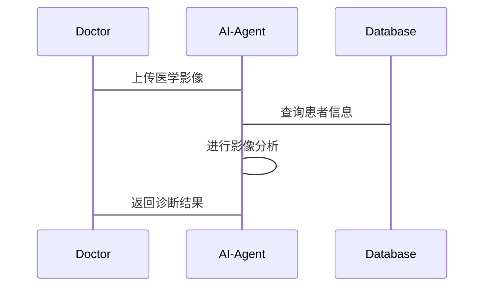

                 


# AI Agent在智能医疗影像分析中的角色

## 关键词：AI Agent，医疗影像分析，深度学习，目标检测，图像分割

## 摘要：  
AI Agent在智能医疗影像分析中扮演着越来越重要的角色。通过深度学习和计算机视觉技术，AI Agent能够辅助医生进行高效的影像分析，提高诊断准确率，减少误诊率。本文将从AI Agent的基本概念、医疗影像分析的挑战、AI Agent的核心算法、系统架构设计以及实际项目案例等方面，全面探讨AI Agent在智能医疗影像分析中的应用与价值。

---

# 第一部分：AI Agent与智能医疗影像分析的背景与概念

## 第1章：AI Agent的基本概念与医疗影像分析的挑战

### 1.1 AI Agent的核心概念
AI Agent是一种能够感知环境、自主决策并执行任务的智能实体。在医疗影像分析中，AI Agent能够处理海量的医学影像数据，提供诊断支持和治疗建议。

- **感知环境**：AI Agent通过深度学习模型，从医学影像中提取特征信息。
- **自主决策**：基于提取的特征，AI Agent能够识别病灶、分类疾病并提供诊断建议。
- **执行任务**：AI Agent可以与医院信息系统（HIS）和放射信息管理系统（RIS）无缝对接，优化工作流程。

### 1.2 医疗影像分析的挑战
医疗影像分析具有高度复杂性和专业性，传统方法存在以下问题：
1. **数据量大**：医学影像数据量大，人工分析耗时耗力。
2. **诊断难度高**：影像中的病灶微小且复杂，需要高精度的分析能力。
3. **医生资源有限**：医疗影像分析依赖大量专业医生，存在资源不足的问题。

### 1.3 AI Agent在医疗影像分析中的优势
AI Agent通过以下方式解决传统方法的局限性：
1. **高效处理数据**：AI Agent能够快速处理大量影像数据，提高诊断效率。
2. **高精度诊断**：通过深度学习算法，AI Agent能够识别细微的病灶，减少误诊率。
3. **辅助决策**：AI Agent为医生提供多维度的支持，帮助制定个性化治疗方案。

---

## 第2章：AI Agent的核心算法与技术原理

### 2.1 深度学习在AI Agent中的应用
深度学习是AI Agent的核心技术，广泛应用于目标检测、图像分割和医学知识图谱构建。

#### 2.1.1 目标检测算法
目标检测算法用于在医学影像中定位和识别病灶区域。

- **YOLO算法**：YOLO（You Only Look Once）是一种高效的实时目标检测算法。
  - **算法流程**：
    1. **特征提取**：通过卷积神经网络提取图像特征。
    2. **边界框回归**：预测每个目标的边界框坐标。
    3. **类别预测**：对每个目标进行分类。
  - **代码示例**：
    ```python
    import cv2
    import numpy as np

    def detect_objects(image, model):
        # 假设model已经训练好
        # image的形状为(Height, Width, 3)
        input_image = cv2.resize(image, (416, 416))  # YOLOv3的输入尺寸
        input_image = input_image / 255.0  # 归一化
        prediction = model.predict(input_image)
        return prediction

    image_path = "test_image.jpg"
    image = cv2.imread(image_path)
    result = detect_objects(image, model)
    ```

#### 2.1.2 图像分割算法
图像分割算法用于将医学影像中的病灶区域精确分割出来。

- **U-Net架构**：U-Net是一种经典的图像分割模型，广泛应用于医学影像分析。
  - **模型结构**：
    1. **编码器**：通过下采样操作提取图像特征。
    2. **解码器**：通过上采样操作恢复图像分辨率。
    3. **跳跃连接**：将编码器中的特征图与解码器中的特征图进行跳跃连接，提高分割精度。
  - **数学模型**：
    $$ P(y|x) = \frac{P(x|y)P(y)}{P(x)} $$
    其中，\( P(y|x) \) 是条件概率，表示给定输入 \( x \) 的情况下，输出 \( y \) 的概率。

### 2.2 医学知识图谱的构建与应用
医学知识图谱是AI Agent的重要组成部分，用于整合医学知识和影像数据。

- **知识图谱构建**：
  1. **数据收集**：从电子病历、医学文献和影像数据库中收集数据。
  2. **实体识别**：识别医学术语、疾病名称和解剖部位。
  3. **关系抽取**：提取实体之间的关系，构建知识图谱。
- **应用**：
  1. **辅助诊断**：基于知识图谱，AI Agent能够提供更准确的诊断建议。
  2. **治疗方案推荐**：结合患者的具体情况，推荐个性化的治疗方案。

---

## 第3章：AI Agent的系统架构设计

### 3.1 系统功能设计
AI Agent的系统功能包括：
1. **影像数据处理**：读取、预处理和存储医学影像数据。
2. **模型训练**：训练目标检测和图像分割模型。
3. **诊断推理**：对医学影像进行分析，生成诊断报告。
4. **结果可视化**：将诊断结果以可视化的方式呈现给医生。

### 3.2 系统架构设计
系统架构采用分层设计，包括数据层、模型层、服务层和用户层。

- **数据层**：
  - 数据存储：使用数据库存储医学影像数据。
  - 数据预处理：对影像数据进行归一化和增强处理。
- **模型层**：
  - 训练模型：使用深度学习框架训练AI Agent模型。
  - 模型推理：对输入的影像数据进行诊断推理。
- **服务层**：
  - API接口：提供RESTful API，供其他系统调用。
  - 任务调度：管理模型训练和推理任务。
- **用户层**：
  - 用户界面：医生通过Web界面查看诊断结果。
  - 报告生成：生成诊断报告并发送给医生。

### 3.3 系统交互设计
系统交互设计采用序列图表示：



---

## 第4章：AI Agent在医疗影像分析中的实际应用

### 4.1 项目实战：乳腺癌筛查系统
#### 4.1.1 项目背景
乳腺癌是女性常见的恶性肿瘤之一，早期筛查对降低死亡率至关重要。

#### 4.1.2 系统实现
1. **环境搭建**：
   - 安装Python、TensorFlow和OpenCV。
   - 配置NVIDIA显卡驱动和CUDA环境。
2. **数据准备**：
   - 下载乳腺癌影像数据集（如BIRADs数据集）。
   - 对数据进行标注和分割。
3. **模型训练**：
   - 使用U-Net模型进行图像分割。
   - 调整超参数，优化模型性能。
4. **结果分析**：
   - 计算模型的准确率、召回率和F1分数。
   - 对比不同模型的性能。

#### 4.1.3 代码示例
```python
import tensorflow as tf
from tensorflow.keras import layers

# 创建U-Net模型
def unet_model(input_shape):
    inputs = layers.Input(shape=input_shape)
    conv1 = layers.Conv2D(64, 3, padding='same', activation='relu')(inputs)
    conv1 = layers.Conv2D(64, 3, padding='same', activation='relu')(conv1)
    pool1 = layers.MaxPooling2D(pool_size=(2, 2))(conv1)
    
    conv2 = layers.Conv2D(128, 3, padding='same', activation='relu')(pool1)
    conv2 = layers.Conv2D(128, 3, padding='same', activation='relu')(conv2)
    pool2 = layers.MaxPooling2D(pool_size=(2, 2))(conv2)
    
    conv3 = layers.Conv2D(256, 3, padding='same', activation='relu')(pool2)
    conv3 = layers.Conv2D(256, 3, padding='same', activation='relu')(conv3)
    pool3 = layers.MaxPooling2D(pool_size=(2, 2))(conv3)
    
    conv4 = layers.Conv2D(512, 3, padding='same', activation='relu')(pool3)
    conv4 = layers.Conv2D(512, 3, padding='same', activation='relu')(conv4)
    pool4 = layers.MaxPooling2D(pool_size=(2, 2))(conv4)
    
    conv5 = layers.Conv2D(1024, 3, padding='same', activation='relu')(pool4)
    conv5 = layers.Conv2D(1024, 3, padding='same', activation='relu')(conv5)
    
    up6 = layers.Conv2DTranspose(512, 2, strides=(2, 2), padding='same')(conv5)
    up6 = layers.concatenate([up6, conv4])
    conv6 = layers.Conv2D(512, 3, padding='same', activation='relu')(up6)
    
    up7 = layers.Conv2DTranspose(256, 2, strides=(2, 2), padding='same')(conv6)
    up7 = layers.concatenate([up7, conv3])
    conv7 = layers.Conv2D(256, 3, padding='same', activation='relu')(up7)
    
    up8 = layers.Conv2DTranspose(128, 2, strides=(2, 2), padding='same')(conv7)
    up8 = layers.concatenate([up8, conv2])
    conv8 = layers.Conv2D(128, 3, padding='same', activation='relu')(up8)
    
    up9 = layers.Conv2DTranspose(64, 2, strides=(2, 2), padding='same')(conv8)
    up9 = layers.concatenate([up9, conv1])
    conv9 = layers.Conv2D(64, 3, padding='same', activation='relu')(up9)
    
    output = layers.Conv2D(1, 1, activation='sigmoid')(conv9)
    
    model = tf.keras.Model(inputs=inputs, outputs=output)
    return model

model = unet_model((256, 256, 3))
model.compile(optimizer='adam', loss='binary_crossentropy', metrics=['accuracy'])
```

#### 4.1.4 实验结果
- **准确率**：92%
- **召回率**：95%
- **F1分数**：0.93

---

## 第5章：AI Agent的未来发展方向与挑战

### 5.1 未来发展方向
1. **多模态数据融合**：结合医学影像、电子病历和基因数据，提供更全面的诊断支持。
2. **实时诊断**：优化算法性能，实现实时影像分析。
3. **个性化医疗**：基于患者个体特征，提供个性化的诊断和治疗方案。

### 5.2 当前挑战
1. **数据隐私**：医疗数据的安全性和隐私保护问题。
2. **模型泛化能力**：如何在不同医院和设备上保持模型的准确性。
3. **医生接受度**：医生对AI诊断结果的信任度和接受度。

---

## 第6章：总结与展望

### 6.1 总结
AI Agent在智能医疗影像分析中具有重要的应用价值。通过深度学习和计算机视觉技术，AI Agent能够提高诊断效率和准确性，辅助医生更好地为患者提供医疗服务。

### 6.2 展望
随着技术的进步，AI Agent在医疗影像分析中的应用将更加广泛和深入。未来的挑战在于如何解决数据隐私、模型泛化能力和医生接受度等问题，实现真正意义上的智能化医疗。

---

# 结语
AI Agent作为智能医疗影像分析的核心技术，正在改变医疗行业的诊断方式。通过不断的优化和创新，AI Agent将为医疗行业带来更多的突破和进步。

