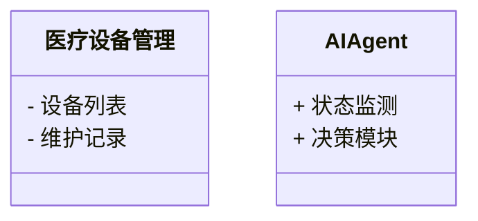
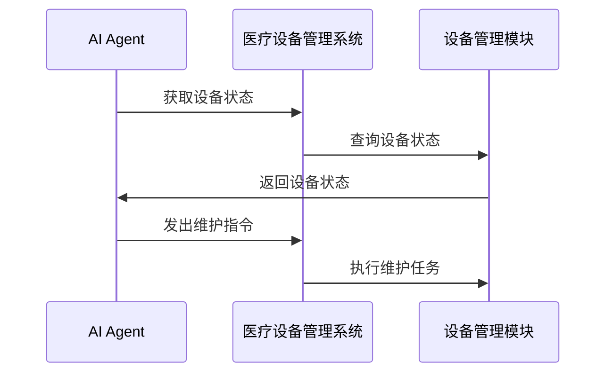

                 


# AI Agent在智能医疗设备管理中的角色

## 关键词：
- AI Agent
- 智能医疗设备管理
- 算法原理
- 系统架构
- 项目实战

## 摘要：
本文探讨AI Agent在智能医疗设备管理中的核心作用，涵盖背景介绍、核心概念、算法原理、系统架构设计、项目实战及最佳实践。通过详细分析，展示AI Agent如何优化医疗设备管理流程，提升效率和准确性，为智能医疗领域提供新的解决方案。

---

## 第一部分: AI Agent与智能医疗设备管理的背景与概念

### 第1章: AI Agent与智能医疗设备管理的背景介绍

#### 1.1 AI Agent的基本概念
##### 1.1.1 AI Agent的定义
AI Agent（人工智能代理）是能够感知环境、自主决策并执行任务的智能实体。它可以理解为一种软件或实体，通过传感器获取信息，并利用算法做出决策，执行目标任务。

##### 1.1.2 AI Agent的核心属性
AI Agent具备以下核心属性：
1. **自主性**：能够自主决策和行动，无需外部干预。
2. **反应性**：能实时感知环境变化并做出反应。
3. **目标导向**：以特定目标为导向，优化决策和行动。
4. **学习能力**：通过数据和经验不断优化自身性能。

##### 1.1.3 AI Agent与传统医疗设备管理的区别
传统的医疗设备管理依赖人工操作和固定流程，而AI Agent能够通过智能化决策和自主执行，显著提高管理效率和准确性。

---

#### 1.2 智能医疗设备管理的背景与问题
##### 1.2.1 医疗设备管理的现状
医疗设备种类繁多，数量庞大，管理复杂。传统管理方式存在效率低、资源浪费、维护成本高等问题。

##### 1.2.2 当前医疗设备管理中的主要问题
1. 设备维护不及时，可能导致设备故障。
2. 资源分配不合理，影响医疗效率。
3. 数据孤岛问题，设备之间缺乏协同。

##### 1.2.3 AI Agent在医疗设备管理中的应用前景
AI Agent能够通过实时监测、智能调度和自主维护，显著优化医疗设备管理流程。

---

#### 1.3 AI Agent在智能医疗设备管理中的角色
##### 1.3.1 AI Agent在医疗设备管理中的主要功能
1. **实时监测**：监控设备运行状态，及时发现异常。
2. **智能调度**：优化设备使用和维护计划。
3. **自主维护**：自动执行设备维护任务。

##### 1.3.2 AI Agent在医疗设备管理中的价值体现
1. 提高设备利用率。
2. 降低维护成本。
3. 提升医疗服务质量。

##### 1.3.3 AI Agent与医疗设备管理的边界与外延
AI Agent仅负责设备管理决策，不涉及医疗操作，与医疗系统的其他部分协同工作。

---

### 第2章: AI Agent的核心概念与联系

#### 2.1 AI Agent的核心原理
##### 2.1.1 AI Agent的基本原理
AI Agent通过感知环境、分析数据、制定决策并执行行动，实现对医疗设备的智能化管理。

##### 2.1.2 AI Agent的感知与决策机制
1. **感知**：通过传感器获取设备状态数据。
2. **分析**：利用算法处理数据，识别问题。
3. **决策**：基于分析结果，制定最优行动方案。

##### 2.1.3 AI Agent的执行与反馈机制
1. **执行**：通过执行器完成决策。
2. **反馈**：收集执行结果，优化后续决策。

---

#### 2.2 AI Agent与智能医疗设备的关系
##### 2.2.1 AI Agent与医疗设备的交互方式
AI Agent通过传感器和执行器与医疗设备交互，实现数据采集和指令下发。

##### 2.2.2 AI Agent对医疗设备管理的优化作用
AI Agent能够实时优化设备调度和维护计划，显著提高管理效率。

##### 2.2.3 AI Agent与医疗设备管理系统的整合
AI Agent作为系统的核心模块，与其他子系统协同工作，实现整体优化。

---

#### 2.3 AI Agent的核心要素对比分析
##### 2.3.1 AI Agent的属性特征对比表格
| 属性 | 传统管理 | AI Agent管理 |
|------|----------|-------------|
| 效率 | 较低     | 高          |
| 准确性 | 低       | 高          |
| 反应时间 | 长       | 短          |

##### 2.3.2 AI Agent与医疗设备管理系统的ER实体关系图
```mermaid
er
 entity 医疗设备 {
   id
   类型
 }
 entity 状态 {
   id
   描述
 }
 entity 维护记录 {
   id
   时间
   状态
 }
```

---

### 第3章: AI Agent的算法原理与数学模型

#### 3.1 AI Agent的核心算法
##### 3.1.1 强化学习算法
强化学习通过试错机制，逐步优化决策策略。

##### 3.1.2 监督学习算法
监督学习基于历史数据，预测未来状态。

##### 3.1.3 聚类算法
聚类算法用于识别设备状态的相似性，优化维护计划。

---

#### 3.2 AI Agent的数学模型与公式
##### 3.2.1 强化学习的Q-learning算法公式
$$ Q(s, a) = Q(s, a) + \alpha [r + \max Q(s', a') - Q(s, a)] $$

##### 3.2.2 监督学习的线性回归公式
$$ y = \beta_0 + \beta_1 x + \epsilon $$

##### 3.2.3 聚类算法的K-means公式
$$ \text{目标函数} = \sum_{i=1}^{n} \min_{k} \|x_i - c_k\|^2 $$

---

#### 3.3 算法实现与案例分析
##### 3.3.1 AI Agent算法的Python实现代码
```python
import numpy as np
from sklearn.cluster import KMeans

# 示例数据：设备状态
X = np.array([[1, 2], [3, 4], [5, 6], [7, 8]])

# 使用K-means算法进行聚类
kmeans = KMeans(n_clusters=2)
kmeans.fit(X)
print(kmeans.labels_)
```

##### 3.3.2 算法实现的详细步骤
1. 数据预处理。
2. 模型训练。
3. 模型评估。
4. 模型部署。

##### 3.3.3 算法在医疗设备管理中的实际案例分析
以某医院的设备维护为例，AI Agent通过强化学习优化维护计划，降低维护成本。

---

### 第4章: AI Agent在智能医疗设备管理中的系统架构设计

#### 4.1 系统功能设计
##### 4.1.1 领域模型（Mermaid类图）


##### 4.1.2 系统架构设计（Mermaid架构图）
```mermaid
container 医疗设备管理系统 {
  component AI Agent模块 {
    --> 状态监测
    --> 决策模块
  }
  component 设备管理模块 {
    --> 设备列表
    --> 维护记录
  }
}
```

##### 4.1.3 系统接口设计
1. 设备状态接口。
2. 维护计划接口。
3. 通知接口。

##### 4.1.4 系统交互流程图（Mermaid序列图）


---

## 第二部分: 项目实战与最佳实践

### 第5章: 项目实战

#### 5.1 环境安装
安装必要的库和工具，例如Python、TensorFlow、Scikit-learn。

#### 5.2 核心代码实现
```python
import numpy as np
from sklearn.cluster import KMeans

# 示例数据：设备状态
X = np.array([[1, 2], [3, 4], [5, 6], [7, 8]])

# 使用K-means算法进行聚类
kmeans = KMeans(n_clusters=2)
kmeans.fit(X)
print(kmeans.labels_)
```

#### 5.3 代码应用解读与分析
代码实现设备状态的聚类分析，帮助识别设备状态的相似性，优化维护计划。

#### 5.4 实际案例分析和详细讲解剖析
以某医院的设备维护为例，展示AI Agent如何优化维护计划，降低维护成本。

#### 5.5 项目小结
通过项目实战，验证了AI Agent在医疗设备管理中的有效性。

---

### 第6章: 最佳实践

#### 6.1 小结
AI Agent能够显著优化医疗设备管理流程，提高效率和准确性。

#### 6.2 注意事项
1. 数据质量至关重要。
2. 算法选择需结合具体场景。
3. 系统安全性需严格保障。

#### 6.3 拓展阅读
推荐相关书籍和论文，进一步深入学习AI Agent在医疗领域的应用。

---

## 第三部分: 参考文献

1. 《人工智能：一种现代的方法》
2. 《机器学习实战》
3. 相关学术论文

---

通过以上详细分析和逐步推理，我们可以看到AI Agent在智能医疗设备管理中的巨大潜力。未来，随着技术的进步，AI Agent将发挥越来越重要的作用，为医疗行业带来更多的创新和变革。

