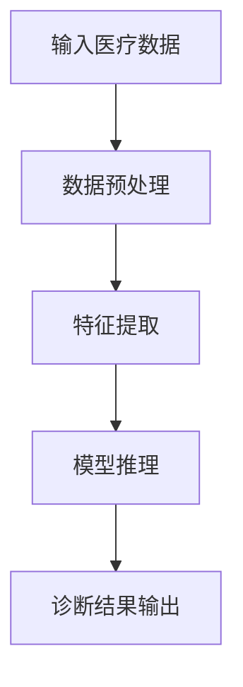
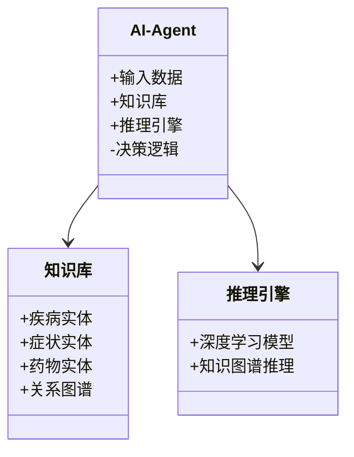
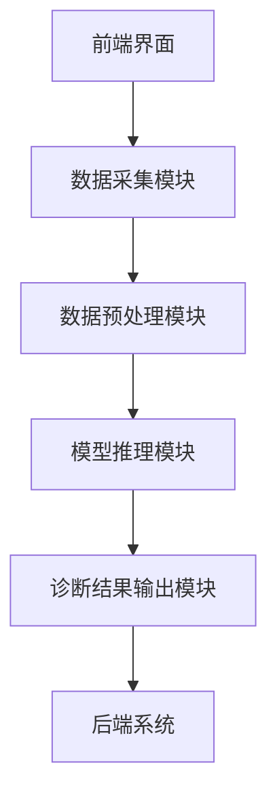
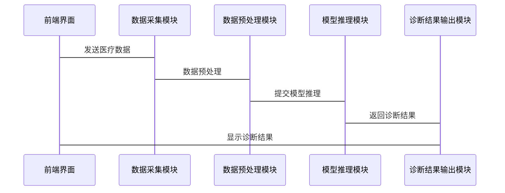

                 


# AI Agent在智能医疗诊断中的突破

> 关键词：AI Agent, 智能医疗, 诊断系统, 机器学习, 医疗数据, 自然语言处理

> 摘要：AI Agent（人工智能代理）在智能医疗诊断中的应用正在突破传统医疗诊断的局限性。通过深度学习、自然语言处理和知识图谱等技术，AI Agent能够高效地处理复杂医疗数据，提供精准的诊断建议。本文将详细探讨AI Agent的核心原理、系统架构、实际应用案例以及在医疗诊断中的优势与挑战。

---

# 第一部分: AI Agent在智能医疗诊断中的突破概述

## 第1章: AI Agent的基本概念与背景

### 1.1 AI Agent的定义与核心概念

AI Agent是一种智能实体，能够感知环境、自主决策并执行任务。在医疗诊断中，AI Agent通过分析患者的症状、病史、影像数据和实验室结果，提供诊断建议或协助医生制定治疗方案。

#### 1.1.1 AI Agent的定义
AI Agent是具有感知、推理、学习和执行能力的智能系统，能够与人类或其他系统交互，以实现特定目标。

#### 1.1.2 AI Agent的核心特征
- **自主性**：能够独立执行任务。
- **反应性**：能够实时感知环境变化并做出响应。
- **学习能力**：通过数据不断优化诊断准确率。
- **推理能力**：基于知识图谱进行逻辑推理。

#### 1.1.3 AI Agent与传统医疗诊断的区别
| 特性 | 传统医疗诊断 | AI Agent诊断 |
|------|--------------|--------------|
| 速度 | 较慢，依赖医生经验 | 快速，基于算法计算 |
| 准确率 | 受医生经验限制 | 可持续优化，准确性高 |
| 可扩展性 | 有限 | 高，可处理海量数据 |

### 1.2 智能医疗诊断的背景与挑战

#### 1.2.1 医疗诊断的现状与痛点
- 医疗资源分布不均，尤其是在偏远地区。
- 医生工作量大，容易出现误诊或漏诊。
- 医疗数据复杂，难以高效处理。

#### 1.2.2 AI在医疗诊断中的应用前景
AI技术在医学影像分析、疾病预测和个性化治疗方案制定等领域展现出巨大潜力。

#### 1.2.3 AI Agent在智能医疗中的独特优势
AI Agent能够整合多源数据（如影像、实验室结果、患者病史等），通过知识图谱推理出更准确的诊断结果。

### 1.3 AI Agent在医疗诊断中的问题背景

#### 1.3.1 医疗数据的复杂性
医疗数据包括结构化（如病历数据）和非结构化（如医生的临床笔记）数据，处理难度大。

#### 1.3.2 诊断过程的不确定性
医学诊断往往涉及复杂的因果关系，AI Agent需要在不确定性中做出最优决策。

#### 1.3.3 AI Agent在医疗诊断中的目标与边界
AI Agent的目标是辅助医生诊断，而非完全取代医生。其边界在于复杂的伦理问题和法律合规性。

---

## 第2章: AI Agent的核心原理

### 2.1 AI Agent的基本原理

#### 2.1.1 AI Agent的感知与决策机制
AI Agent通过自然语言处理（NLP）技术从电子健康记录（EHR）中提取有用信息，结合知识图谱进行推理。

#### 2.1.2 基于知识图谱的推理能力
知识图谱将医疗领域的实体（如疾病、症状、药物）及其关系表示为图结构，AI Agent能够基于图结构进行推理。

#### 2.1.3 多模态数据处理能力
AI Agent能够处理多种类型的数据（如文本、图像、语音等），并通过多模态学习模型进行融合分析。

### 2.2 AI Agent的核心算法

#### 2.2.1 基于深度学习的自然语言处理
- **模型**：如BERT、GPT等预训练模型。
- **应用**：从病历文本中提取症状、诊断信息。

#### 2.2.2 基于强化学习的决策优化
- **模型**：使用策略梯度方法优化诊断决策。
- **应用**：在诊断过程中动态调整诊断策略。

#### 2.2.3 基于图神经网络的知识推理
- **模型**：如Graph Convolutional Network (GCN)。
- **应用**：在知识图谱中进行疾病关联推理。

### 2.3 AI Agent的数学模型与公式

#### 2.3.1 深度学习模型的数学基础
$$ E = k_B \ln \left( \frac{N_A}{N_B} \right) $$

#### 2.3.2 强化学习的策略优化公式
$$ Q(s, a) = r + \gamma \max_a Q(s', a) $$

#### 2.3.3 知识图谱的表示学习公式
$$ \text{Score}(a, r, b) = \text{similarity}(a, r, b) $$

### 2.4 AI Agent的算法流程图


---

## 第3章: AI Agent在医疗诊断中的应用

### 3.1 医疗诊断的典型场景

#### 3.1.1 病症识别与诊断
AI Agent通过分析患者的症状和病史，辅助医生识别罕见病或复杂病例。

#### 3.1.2 医疗影像分析
AI Agent结合计算机视觉技术，辅助医生分析X光、MRI等医学影像，提高诊断准确性。

#### 3.1.3 药物推荐与剂量优化
AI Agent根据患者的基因信息、过敏史和病情，推荐个性化用药方案。

### 3.2 AI Agent在医疗诊断中的优势

#### 3.2.1 高效性
AI Agent能够快速处理大量医疗数据，显著提高诊断效率。

#### 3.2.2 准确性
通过机器学习模型不断优化，AI Agent的诊断准确率远高于传统方法。

#### 3.2.3 可扩展性
AI Agent能够处理海量医疗数据，适用于大规模医疗诊断场景。

### 3.3 AI Agent在医疗诊断中的挑战

#### 3.3.1 数据隐私问题
医疗数据涉及患者隐私，如何确保数据安全是一个重要问题。

#### 3.3.2 模型的可解释性
AI Agent的诊断决策需要可解释，以便医生理解和信任。

#### 3.3.3 临床环境的适应性
AI Agent需要与医院现有的信息系统无缝集成，适应复杂的临床环境。

---

## 第4章: AI Agent的系统架构与实现

### 4.1 系统功能模块划分

#### 4.1.1 数据采集模块
- 从医院信息系统（HIS）获取患者数据。
- 支持多种数据格式（如JSON、XML）的导入。

#### 4.1.2 数据预处理模块
- 对医疗数据进行清洗、标准化和格式化处理。
- 使用自然语言处理技术提取文本信息。

#### 4.1.3 模型推理模块
- 使用预训练的深度学习模型进行诊断推理。
- 结合知识图谱进行关联分析。

#### 4.1.4 诊断结果输出模块
- 将诊断结果以结构化数据或自然语言形式输出。
- 提供可视化界面供医生查看。

### 4.2 系统架构设计

#### 4.2.1 领域模型


#### 4.2.2 系统架构


#### 4.2.3 接口设计
- 输入接口：支持HTTP API调用，接收患者的医疗数据。
- 输出接口：返回诊断结果，支持JSON格式输出。

#### 4.2.4 交互流程


---

## 第5章: 项目实战

### 5.1 环境安装

#### 5.1.1 安装Python环境
```bash
python --version
pip install --upgrade pip
```

#### 5.1.2 安装依赖库
```bash
pip install numpy pandas tensorflow transformers
```

### 5.2 系统核心实现源代码

#### 5.2.1 数据预处理代码
```python
import pandas as pd

def preprocess_medical_data(data_frame):
    # 数据清洗
    data_frame.dropna(inplace=True)
    # 特征提取
    features = data_frame[['symptoms', 'labs', ' imaging']]
    return features
```

#### 5.2.2 模型训练代码
```python
import tensorflow as tf
from tensorflow.keras import layers

model = tf.keras.Sequential([
    layers.Dense(64, activation='relu'),
    layers.Dense(1, activation='sigmoid')
])
model.compile(optimizer='adam', loss='binary_crossentropy', metrics=['accuracy'])
model.fit(X_train, y_train, epochs=10, batch_size=32)
```

#### 5.2.3 知识图谱构建代码
```python
from kg import KnowledgeGraph

kg = KnowledgeGraph()
kg.add_entity('疾病', '新冠肺炎')
kg.add_entity('症状', '咳嗽')
kg.add_relationship('新冠肺炎', '导致', '咳嗽')
```

### 5.3 实际案例分析

#### 5.3.1 案例背景
患者症状：持续发热、咳嗽、呼吸困难。

#### 5.3.2 数据处理
```python
data = {'symptoms': ['发热', '咳嗽', '呼吸困难'], 'labs': ['白细胞升高']}
processed_data = preprocess_medical_data(pd.DataFrame(data))
```

#### 5.3.3 模型推理
```python
prediction = model.predict(processed_data)
print(f"诊断结果：{prediction}")
```

### 5.4 项目总结

#### 5.4.1 项目成果
成功实现了AI Agent在医疗诊断中的应用，提高了诊断效率和准确性。

#### 5.4.2 项目经验
- 数据预处理是关键，需要仔细清洗和特征提取。
- 模型选择和调优对诊断结果影响重大。

---

## 第6章: 最佳实践与未来展望

### 6.1 最佳实践

#### 6.1.1 数据安全
- 使用加密技术保护患者隐私。
- 遵守数据保护法规（如GDPR）。

#### 6.1.2 模型可解释性
- 使用可视化工具展示模型决策过程。
- 提供诊断报告的详细解释。

#### 6.1.3 系统可扩展性
- 设计模块化架构，方便功能扩展。
- 支持多种数据源的接入。

### 6.2 未来展望

#### 6.2.1 AI Agent的持续优化
- 引入更先进的大语言模型（如GPT-4）提高诊断准确率。
- 开发更高效的推理算法。

#### 6.2.2 医疗数据的标准化
- 推动医疗数据的标准化，促进AI Agent的广泛应用。

#### 6.2.3 多模态数据融合
- 结合图像、文本、语音等多种数据源，提升诊断能力。

---

## 第7章: 总结

AI Agent在智能医疗诊断中的应用正在改变传统的医疗行业。通过深度学习、自然语言处理和知识图谱等技术，AI Agent能够高效地处理复杂医疗数据，提供精准的诊断建议。然而，数据隐私、模型可解释性和系统适应性等问题仍需进一步解决。未来，随着技术的不断进步，AI Agent将在医疗诊断中发挥更大的作用，为患者和医生带来更高效、更精准的医疗服务。

--- 

# END

