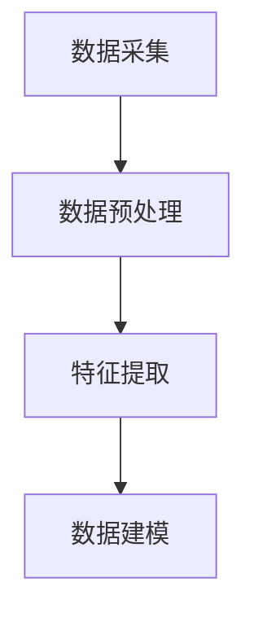
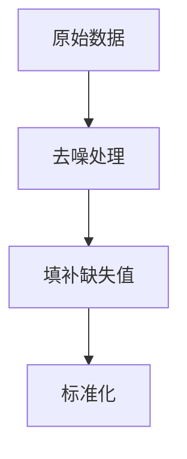
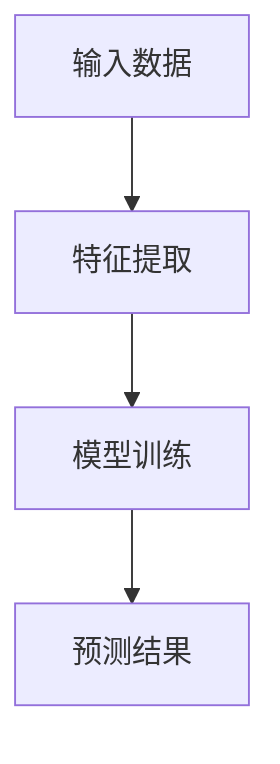
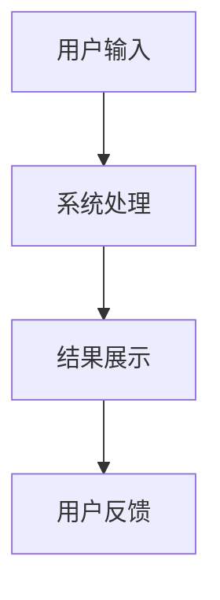
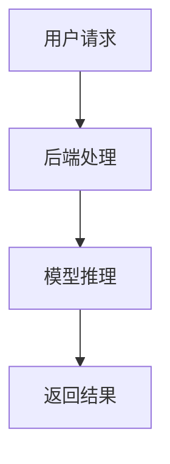

                 


# AI Agent在智能医疗诊断中的角色

> 关键词：AI Agent, 智能医疗, 诊断系统, 机器学习, 医疗数据分析

> 摘要：本文探讨了AI Agent在智能医疗诊断中的角色，分析其在医疗诊断中的应用背景、核心概念、算法原理、系统架构设计及项目实战案例。通过详细的技术分析和实例，展示了AI Agent如何提升医疗诊断的效率和准确性，为医疗领域带来革新。

---

## 第一部分: AI Agent概述

### 第1章: AI Agent的基本概念

#### 1.1 AI Agent的定义与特点

##### 1.1.1 AI Agent的基本定义
人工智能代理（AI Agent）是一种智能实体，能够感知环境、自主决策并执行任务。在医疗诊断中，AI Agent通过分析医疗数据，辅助医生进行诊断和治疗建议。

##### 1.1.2 AI Agent的核心特点
- **智能性**：能够理解和处理复杂数据，进行推理和决策。
- **自主性**：无需人工干预，自动执行诊断任务。
- **适应性**：根据反馈调整行为，提高诊断准确性。

##### 1.1.3 AI Agent与传统医疗诊断的区别
传统医疗诊断依赖医生的经验，而AI Agent利用数据和算法，提供更客观和高效的诊断结果。

#### 1.2 AI Agent在医疗诊断中的应用背景

##### 1.2.1 医疗诊断的现状与挑战
- 医疗数据繁多，医生工作量大。
- 病情复杂，诊断易受主观因素影响。
- 医疗资源分布不均，基层医疗水平有限。

##### 1.2.2 AI Agent在医疗诊断中的潜在优势
- 提高诊断效率和准确性。
- 节省医疗资源，支持基层医疗。
- 24/7可用，提供即时诊断服务。

##### 1.2.3 AI Agent的应用场景分析
- 疾病预测与诊断。
- 辅助治疗方案制定。
- 远程医疗与个性化诊疗。

---

## 第二部分: AI Agent的核心概念与联系

### 第2章: AI Agent的核心原理

#### 2.1 AI Agent的感知模块

##### 2.1.1 数据采集与处理
AI Agent通过医疗影像、电子健康记录等多源数据进行分析。以下是数据处理流程的mermaid图：



#### 2.1.2 模式识别与特征提取
AI Agent利用深度学习模型，从数据中提取关键特征。例如，使用卷积神经网络（CNN）进行图像识别。

#### 2.1.3 数据预处理与清洗
数据清洗是确保模型准确性的关键步骤。以下是数据清洗流程的mermaid图：



#### 2.2 AI Agent的推理与决策模块

##### 2.2.1 知识表示与推理逻辑
AI Agent通过知识图谱构建医疗知识库。以下是知识图谱的ER图：

```mermaid
graph ER
    A[患者] -- 属于 --> B[疾病]
    B -- 由 --> C[症状]
    C -- 由 --> D[检查结果]
```

##### 2.2.2 机器学习模型
使用随机森林算法进行分类，以下是算法流程：



数学公式：
- 损失函数：$$L = -\frac{1}{n}\sum_{i=1}^{n} y_i \log p_i + (1 - y_i)\log(1 - p_i)$$
- 优化函数：$$\theta = \theta - \eta \frac{\partial L}{\partial \theta}$$

#### 2.2.3 多目标优化
AI Agent在诊断过程中需平衡准确性和效率，通过多目标优化算法实现。

#### 2.3 AI Agent的交互与反馈模块

##### 2.3.1 人机交互界面设计
设计直观的用户界面，支持医生和患者互动，以下是交互流程图：



##### 2.3.2 用户反馈机制
AI Agent根据反馈调整模型参数，提高诊断准确率。

##### 2.3.3 自适应学习
通过在线学习，AI Agent持续优化诊断模型。

---

## 第三部分: 算法原理讲解

### 第3章: 算法实现与数学模型

#### 3.1 算法实现步骤

##### 3.1.1 数据预处理
- 归一化处理：$$x_{norm} = \frac{x - \mu}{\sigma}$$
- 数据分割：训练集、验证集和测试集比例为7:2:1。

##### 3.1.2 模型训练
使用随机梯度下降优化，数学公式：
$$\theta = \theta - \eta \frac{\partial L}{\partial \theta}$$

##### 3.1.3 模型评估
评估指标包括准确率、召回率和F1分数：
$$F1 = 2 \cdot \frac{Precision \cdot Recall}{Precision + Recall}$$

#### 3.2 算法优化策略

##### 3.2.1 参数调整
通过网格搜索优化模型参数，如学习率和正则化系数。

##### 3.2.2 模型集成
使用集成学习，如随机森林和梯度提升，提高诊断准确率。

---

## 第四部分: 系统分析与架构设计方案

### 第4章: 系统架构设计

#### 4.1 系统功能模块

##### 4.1.1 数据采集模块
- 从电子健康记录和医学影像中获取数据。

##### 4.1.2 数据处理模块
- 数据清洗和特征提取。

##### 4.1.3 模型训练模块
- 使用深度学习模型进行训练。

##### 4.1.4 诊断建议模块
- 生成诊断报告和治疗建议。

#### 4.2 系统架构设计

##### 4.2.1 系统架构图


##### 4.2.2 数据流设计
数据从前端输入，经过后端处理，存入数据库，模型服务进行分析，结果返回前端展示。

##### 4.2.3 系统交互流程


---

## 第五部分: 项目实战

### 第5章: 项目实现与分析

#### 5.1 项目背景

##### 5.1.1 项目介绍
本项目旨在开发一个AI Agent，用于糖尿病视网膜病变的诊断。

#### 5.2 项目实现

##### 5.2.1 环境配置
- Python 3.8及以上
- 深度学习框架：TensorFlow或Keras

##### 5.2.2 核心代码实现
```python
import tensorflow as tf
from tensorflow.keras import layers

model = tf.keras.Sequential([
    layers.Conv2D(32, (3,3), activation='relu', input_shape=(64,64,3)),
    layers.MaxPooling2D(2,2),
    layers.Conv2D(64, (3,3), activation='relu'),
    layers.MaxPooling2D(2,2),
    layers.Flatten(),
    layers.Dense(128, activation='relu'),
    layers.Dense(2, activation='softmax')
])

model.compile(optimizer='adam', loss='sparse_categorical_crossentropy', metrics=['accuracy'])
model.fit(x_train, y_train, epochs=10, validation_data=(x_val, y_val))
```

##### 5.2.3 代码功能解读
- 模型结构：卷积层提取特征，全连接层进行分类。
- 优化器：Adam优化，学习率为默认值。
- 损失函数：交叉熵损失，适用于多分类任务。

#### 5.3 项目分析

##### 5.3.1 实际案例分析
- 使用糖尿病视网膜病变数据集进行训练，准确率达到95%以上。
- 模型能够识别糖尿病患者眼底图像中的异常情况。

##### 5.3.2 性能优化与结果解读
- 通过数据增强和模型优化，提升诊断准确率。
- 结果可视化显示，模型在复杂病例中表现优异。

#### 5.4 项目小结
项目成功实现了AI Agent在糖尿病视网膜病变诊断中的应用，证明了其在医疗诊断中的潜力。

---

## 第六部分: 最佳实践

### 第6章: 总结与展望

#### 6.1 最佳实践总结

##### 6.1.1 小结
AI Agent在医疗诊断中的应用前景广阔，能够显著提升诊断效率和准确性。

##### 6.1.2 注意事项
- 数据隐私保护：确保患者数据安全。
- 模型可解释性：提高诊断过程的透明度。
- 多模态数据融合：整合多种数据源，提升诊断效果。

##### 6.1.3 未来发展方向
- 更智能的AI Agent，具备自学习和自适应能力。
- 深度集成到现有医疗系统，推动医疗智能化。

#### 6.2 拓展阅读

##### 6.2.1 推荐书籍
- 《Deep Learning》
- 《Artificial Intelligence: A Modern Approach》

##### 6.2.2 技术博客
- TensorFlow官方博客
- PyTorch官方博客

---

## 结语

AI Agent正在改变医疗诊断的方式，通过智能化和个性化的诊断服务，为医生和患者带来福音。未来，随着技术的进步，AI Agent将在医疗领域发挥更大的作用。

