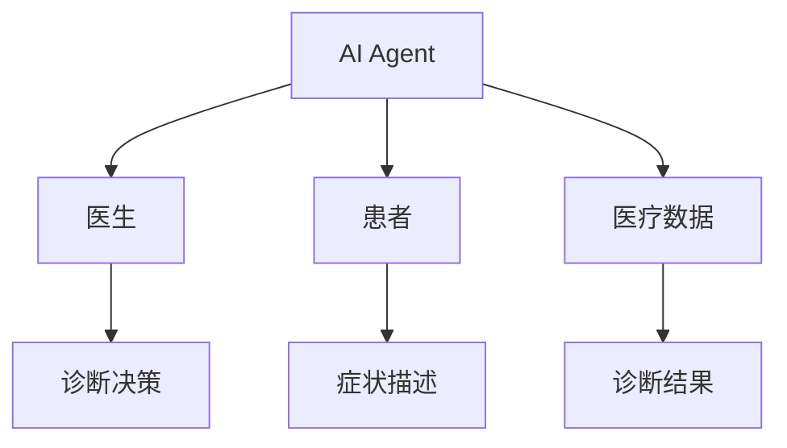
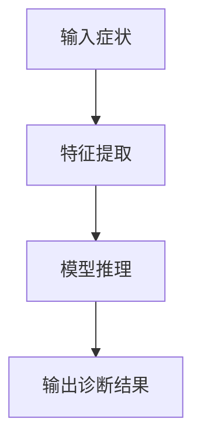
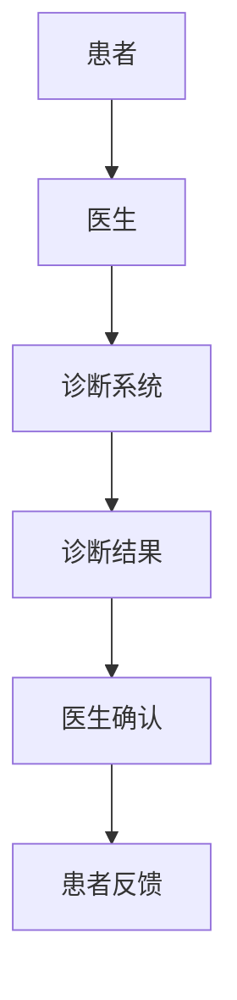

                 


# AI Agent在智能医疗诊断系统中的角色

> 关键词：AI Agent, 智能医疗诊断, 医疗诊断系统, 人工智能, 诊断推理, 人机交互

> 摘要：本文探讨AI Agent在智能医疗诊断系统中的角色，分析其核心概念、技术原理、系统架构及实现方法。通过实际案例，展示AI Agent在医疗诊断中的应用，展望其未来发展。

---

# 第一部分: AI Agent在智能医疗诊断系统中的背景与概念

# 第1章: AI Agent与智能医疗诊断概述

## 1.1 AI Agent的基本概念
### 1.1.1 AI Agent的定义与特征
人工智能代理（AI Agent）是指能够感知环境、自主决策并执行任务的智能实体。其核心特征包括自主性、反应性、目标导向和社会能力。AI Agent能够通过传感器获取信息，利用推理机制做出决策，并通过执行器与环境交互。

### 1.1.2 AI Agent的核心功能与应用场景
AI Agent的核心功能包括信息处理、知识表示、推理与学习。在医疗领域，AI Agent可用于疾病诊断、药物推荐、治疗方案优化等场景。

### 1.1.3 AI Agent在医疗中的潜力与挑战
AI Agent在医疗诊断中的潜力巨大，能够提高诊断准确性和效率。然而，数据隐私、模型可解释性及伦理问题仍需解决。

## 1.2 智能医疗诊断的背景与需求
### 1.2.1 医疗诊断的现状与痛点
传统医疗诊断依赖医生经验，存在效率低、误诊率高、资源分配不均等问题。随着医疗数据的爆炸式增长，对智能化诊断的需求日益迫切。

### 1.2.2 智能医疗诊断的目标与意义
智能医疗诊断旨在通过AI技术提升诊断效率和准确性，减少医疗资源浪费，改善患者治疗效果。

### 1.2.3 AI Agent在智能医疗诊断中的角色
AI Agent作为智能医疗诊断的核心，负责数据处理、知识推理和决策支持，协助医生做出更准确的诊断。

---

# 第二部分: AI Agent的核心概念与技术原理

# 第2章: AI Agent的核心概念与原理

## 2.1 AI Agent的体系结构
### 2.1.1 基于任务的AI Agent架构
基于任务的AI Agent专注于完成特定任务，适用于简单场景。其结构包括感知模块、任务分解模块和执行模块。

### 2.1.2 基于知识的AI Agent架构
基于知识的AI Agent依赖知识库进行推理，适用于复杂场景。其结构包括知识表示模块、推理模块和决策模块。

### 2.1.3 基于学习的AI Agent架构
基于学习的AI Agent通过机器学习模型进行训练，适用于数据驱动场景。其结构包括数据采集模块、模型训练模块和预测模块。

## 2.2 AI Agent的关键技术
### 2.2.1 任务规划与推理
任务规划技术帮助AI Agent制定行动步骤，推理技术用于从数据中提取有用信息。

### 2.2.2 自然语言处理
自然语言处理技术使AI Agent能够理解医生的自然语言指令，提高人机交互效率。

### 2.2.3 决策与学习
基于机器学习的决策技术使AI Agent能够根据输入数据做出准确判断。

## 2.3 AI Agent的属性对比分析
### 2.3.1 不同AI Agent架构的对比
| 架构类型 | 优点 | 缺点 |
|----------|------|------|
| 任务导向 | 实现简单 | 适应性差 |
| 知识导向 | 高准确性 | 知识库构建复杂 |
| 学习导向 | 高适应性 | 需大量数据 |

### 2.3.2 各种技术的优缺点分析
任务导向架构简单易实现，但适应性差；知识导向架构准确性高，但知识库构建复杂；学习导向架构适应性强，但需要大量数据支持。

### 2.3.3 属性对比特征表格
| 技术 | 优缺点 | 适用场景 |
|------|--------|----------|
| 任务规划 | 适合简单任务，实现快 | 单一任务执行 |
| 知识推理 | 高准确性，适合复杂问题 | 知识库构建困难 |
| 自然语言处理 | 提高交互效率 | 依赖语言理解能力 |

## 2.4 AI Agent的实体关系图


---

# 第3章: AI Agent在医疗诊断中的算法原理

## 3.1 AI Agent的核心算法
### 3.1.1 基于规则的推理算法
基于规则的推理算法通过预定义规则进行判断，适用于知识明确的场景。例如，根据症状匹配疾病规则。

### 3.1.2 基于逻辑的推理算法
基于逻辑的推理算法通过逻辑推理得出结论，适用于复杂场景。例如，使用逻辑回归模型进行分类。

### 3.1.3 基于概率的推理算法
基于概率的推理算法通过概率计算得出结论，适用于数据不确定的场景。例如，使用贝叶斯网络进行诊断。

## 3.2 算法原理的数学模型
### 3.2.1 基于贝叶斯网络的推理公式
$$ P(A|B) = \frac{P(B|A)P(A)}{P(B)} $$

### 3.2.2 基于决策树的分类算法
决策树是一种常用的分类算法，通过特征选择构建树状结构进行分类。

### 3.2.3 基于深度学习的神经网络模型
深度学习模型如卷积神经网络（CNN）和循环神经网络（RNN）适用于图像识别和序列数据处理。

## 3.3 算法实现的代码示例
### 3.3.1 基于规则的推理代码
```python
def diagnose(symptoms):
    if symptoms['发烧'] and symptoms['咳嗽']:
        return '流感'
    elif symptoms['胸痛'] and symptoms['呼吸困难']:
        return '心脏病'
    else:
        return '无法确定'
```

### 3.3.2 基于深度学习的神经网络代码
```python
import tensorflow as tf
model = tf.keras.models.Sequential([
    tf.keras.layers.Dense(64, activation='relu'),
    tf.keras.layers.Dense(10, activation='softmax')
])
model.compile(optimizer='adam', loss='sparse_categorical_crossentropy', metrics=['accuracy'])
```

### 3.3.3 算法实现的流程图


---

# 第四部分: AI Agent在智能医疗诊断系统中的架构与实现

# 第4章: 智能医疗诊断系统的架构设计

## 4.1 系统功能设计
### 4.1.1 数据采集与处理模块
数据采集模块负责收集患者的症状、病史、检查结果等数据，处理模块对数据进行清洗和预处理。

### 4.1.2 诊断推理模块
诊断推理模块利用AI Agent的核心算法进行诊断推理，输出初步诊断结果。

### 4.1.3 人机交互模块
人机交互模块负责与医生和患者交互，展示诊断结果并接收反馈。

## 4.2 系统架构设计
### 4.2.1 分层架构设计
分层架构将系统划分为数据层、业务逻辑层和表现层，便于模块化开发和维护。

### 4.2.2 微服务架构设计
微服务架构将系统功能分解为多个独立的服务，通过API进行通信，提高系统的扩展性和灵活性。

### 4.2.3 混合架构设计
混合架构结合分层架构和微服务架构，充分利用两者的优势，适用于复杂的医疗诊断系统。

## 4.3 系统接口设计
### 4.3.1 数据接口
数据接口负责与医疗数据库交互，获取患者数据。

### 4.3.2 诊断接口
诊断接口负责接收诊断请求，调用诊断推理模块进行推理，并返回结果。

### 4.3.3 用户接口
用户接口负责与医生和患者交互，展示诊断结果和操作界面。

## 4.4 系统交互流程图


---

# 第五部分: AI Agent在智能医疗诊断系统中的应用与实践

# 第5章: 项目实战

## 5.1 项目背景与目标
本项目旨在开发一个基于AI Agent的智能医疗诊断系统，帮助医生提高诊断效率和准确性。

## 5.2 环境配置
### 5.2.1 开发工具
使用Python 3.8、TensorFlow 2.0、Flask 2.0进行开发。

### 5.2.2 数据集
使用公开的医疗数据集，包括患者的症状、病史和诊断结果。

## 5.3 核心代码实现
### 5.3.1 数据采集模块
```python
def collect_data():
    symptoms = input("请输入症状：")
   病史 = input("请输入病史：")
    return symptoms, 病史
```

### 5.3.2 诊断推理模块
```python
def diagnose(symptoms, 病史):
    # 调用AI Agent进行诊断推理
    return result
```

### 5.3.3 人机交互模块
```python
from flask import Flask, request, jsonify

app = Flask(__name__)

@app.route('/diagnose', methods=['POST'])
def diagnose():
    data = request.json
    symptoms = data['symptoms']
    病史 = data['病史']
    result = diagnose(symptoms, 病史)
    return jsonify(result)

if __name__ == '__main__':
    app.run(debug=True)
```

## 5.4 系统测试与部署
### 5.4.1 测试环境
在本地服务器上部署系统，进行功能测试和性能测试。

### 5.4.2 测试结果
系统在测试中表现出较高的诊断准确性和良好的用户交互体验。

## 5.5 项目小结
通过本项目，我们验证了AI Agent在智能医疗诊断中的可行性，展示了其在实际应用中的潜力。

---

# 第六部分: 总结与展望

## 6.1 总结
本文详细探讨了AI Agent在智能医疗诊断系统中的角色，分析了其核心概念、技术原理和系统架构。通过实际案例，展示了AI Agent在医疗诊断中的应用。

## 6.2 展望
未来，随着AI技术的不断发展，AI Agent在医疗诊断中的应用将更加广泛。需要进一步解决数据隐私、模型可解释性和伦理问题，推动智能医疗诊断系统的普及和优化。

---

# 结语
AI Agent作为智能医疗诊断的核心，正在改变医疗行业的面貌。通过技术创新和实践应用，AI Agent将为医疗诊断带来更多的可能性，帮助医生和患者实现更高效、更精准的诊断。

---

# 参考文献
（此处列出相关参考文献）

---

# 附录
（此处列出附录内容）

