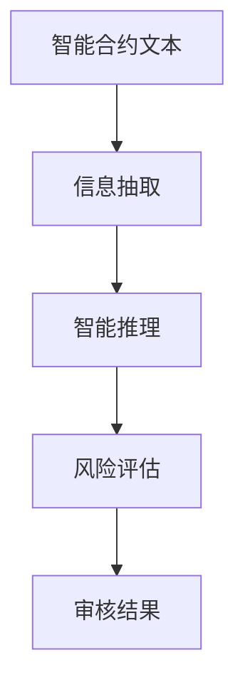
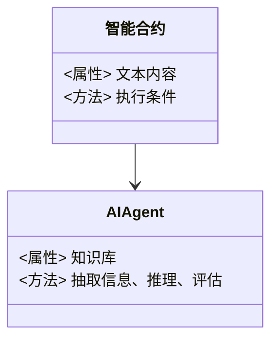
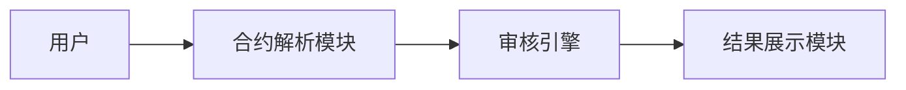

                 


# AI Agent在智能合约审核中的应用

> 关键词：智能合约，AI Agent，区块链，智能合约审核，风险评估，法律合规，自动化审核

> 摘要：本文探讨AI Agent在智能合约审核中的应用，详细分析其技术原理、算法流程、系统架构及实际案例。通过结合区块链技术和AI技术，AI Agent能够实现智能合约的自动化审核，提高审核效率和准确性，降低法律风险。

---

## 第一部分：智能合约与AI Agent背景介绍

### 第1章：智能合约基础

#### 1.1 智能合约的定义与特点
智能合约是一种基于区块链技术的自动执行合约，其特点包括：
- **自动性**：无需人工干预，自动执行条款。
- **不可篡改性**：存储在区块链上，难以被修改。
- **透明性**：所有交易记录公开，可追溯。
- **去中心化**：不依赖中央机构，运行在区块链网络中。

#### 1.2 区块链技术基础
- **区块链分类**：
  - **公有链**：如比特币、以太坊。
  - **联盟链**：用于特定组织的内部交易。
  - **私有链**：仅限于特定用户。
  
- **区块链的核心组件**：
  - 分布式账本：记录所有交易。
  - 加密技术：确保数据安全。
  - 共识机制：验证交易合法性。

#### 1.3 智能合约的法律与合规性问题
智能合约的法律挑战包括：
- **法律认可度**：不同国家对智能合约的法律地位有不同的规定。
- **合规性要求**：需符合当地法律法规，如数据隐私、反洗钱等。
- **可解释性**：智能合约的自动执行可能缺乏透明度，影响法律审查。

### 第2章：AI Agent的核心概念
AI Agent是一种智能代理，能够感知环境并采取行动以实现目标。其特点包括：
- **自主性**：无需外部干预，自动完成任务。
- **反应性**：实时感知环境变化并调整行为。
- **学习能力**：通过数据和经验优化决策。

---

## 第二部分：核心概念与联系

### 第3章：AI Agent与智能合约的交互原理

#### 3.1 核心技术原理
AI Agent通过以下步骤审核智能合约：
1. **信息抽取**：从合约文本中提取关键信息，如条款、条件。
2. **智能推理**：分析条款之间的逻辑关系，预测可能的执行结果。
3. **风险评估**：识别潜在的法律风险和漏洞。

#### 3.2 技术流程图


#### 3.3 实体关系图


---

## 第三部分：算法原理

### 第4章：审核流程与数学模型

#### 4.1 审核流程
审核流程分为以下步骤：
1. **信息抽取**：使用NLP技术提取合约中的关键词和条款。
2. **智能推理**：基于知识库，分析条款之间的逻辑关系。
3. **风险评估**：计算每个条款的风险评分，确定潜在问题。

#### 4.2 数学模型
- **条件概率模型**：
  $$ P(A|B) = \frac{P(B|A)P(A)}{P(B)} $$
  用于评估某个条款条件下风险的概率。
  
- **贝叶斯定理**：
  $$ P(H|D) = \frac{P(D|H)P(H)}{P(D)} $$
  用于更新基于数据的假设概率。

- **风险评分模型**：
  $$ \text{风险评分} = \sum_{i=1}^{n} w_i \times R_i $$
  其中，$w_i$为权重，$R_i$为风险因素。

---

## 第四部分：系统分析与架构设计

### 第5章：系统架构

#### 5.1 应用场景
AI Agent审核系统应用于区块链平台，审核智能合约的合规性和风险。

#### 5.2 系统功能设计
- **合约解析模块**：解析智能合约文本。
- **审核引擎**：执行信息抽取、推理和风险评估。
- **结果展示模块**：呈现审核结果和建议。

#### 5.3 系统架构图


---

## 第五部分：项目实战

### 第6章：系统实现

#### 6.1 环境配置
安装Python、TensorFlow、Scikit-learn等工具。

#### 6.2 核心代码实现
```python
def extract_info(contract_text):
    # 使用NLP模型提取信息
    pass

def risk_assessment(rules, info):
    # 评估风险并返回评分
    pass
```

#### 6.3 实际案例分析
分析一个智能合约，展示系统如何识别潜在风险并提供建议。

---

## 第六部分：总结与展望

### 第7章：小结
AI Agent通过自动化审核提高效率，但仍需解决可解释性和法律认可等问题。

### 第8章：注意事项
- 数据隐私：确保审核过程中数据的安全。
- 模型优化：持续改进AI模型的准确性。

### 第9章：拓展阅读
推荐相关书籍和论文，深入理解AI与区块链的结合。

---

通过以上内容，本文详细探讨了AI Agent在智能合约审核中的应用，从技术原理到系统实现，为读者提供了全面的视角。

