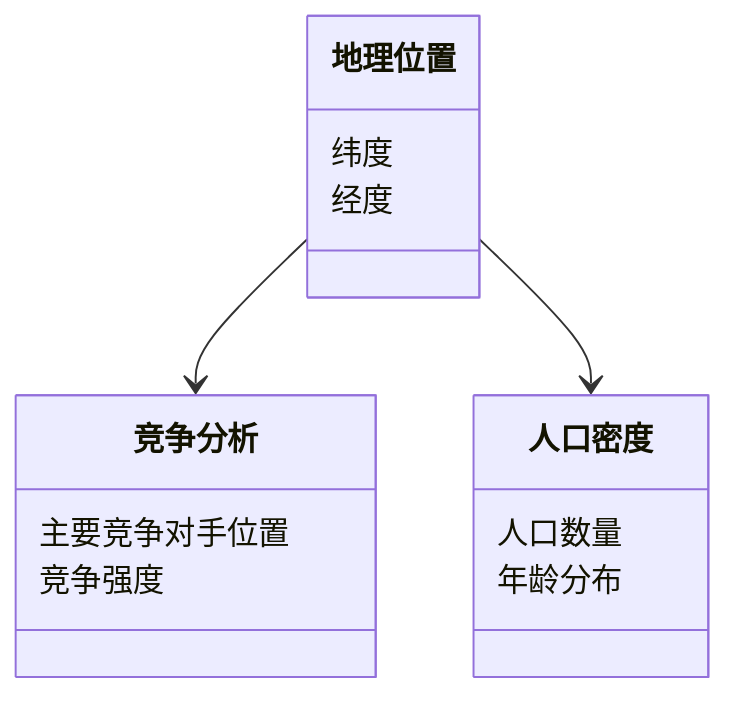
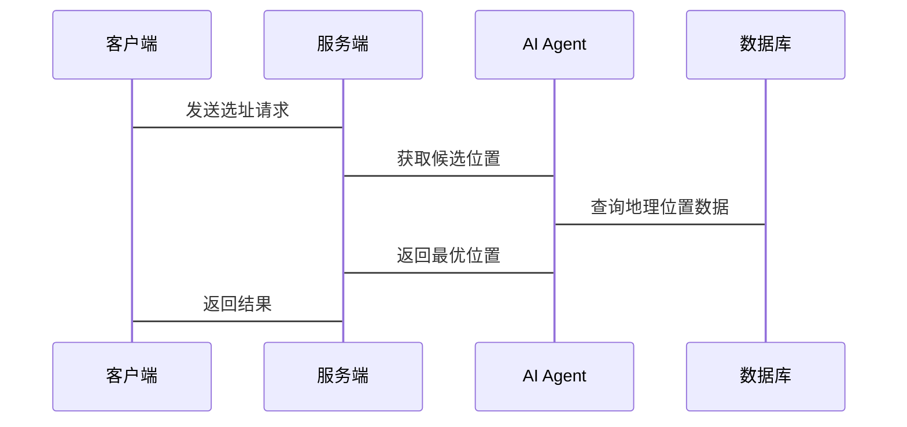
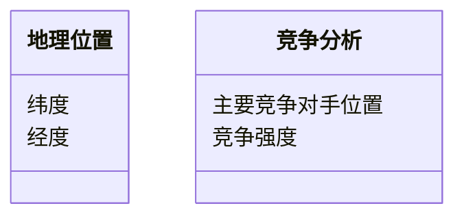

                 


# AI Agent在智能商业选址中的应用

> 关键词：AI Agent，智能商业选址，强化学习，算法原理，系统架构，项目实战

> 摘要：本文详细探讨了AI Agent在智能商业选址中的应用，从核心概念、算法原理、系统架构到项目实战，全面解析了AI Agent如何优化商业选址过程。通过数学模型、Mermaid图表和Python代码示例，深入浅出地阐述了AI Agent在选址中的优势和实现方法，为读者提供了从理论到实践的完整指南。

---

# 第1章: AI Agent与智能商业选址概述

## 1.1 AI Agent的基本概念

### 1.1.1 AI Agent的定义与特点
AI Agent（人工智能代理）是指能够感知环境、自主决策并执行任务的智能实体。其特点包括自主性、反应性、目标导向性和社会性。

### 1.1.2 AI Agent在商业选址中的应用背景
传统商业选址方法依赖人工经验，存在效率低、成本高等问题。随着AI技术的发展，AI Agent能够通过大数据分析和智能优化，提升选址的准确性和效率。

### 1.1.3 智能商业选址的核心目标与价值
智能商业选址的核心目标是通过AI技术优化选址决策，降低企业运营成本，提高市场覆盖效率。其价值体现在提高决策效率、降低成本和提升商业成功概率。

## 1.2 智能商业选址的背景与挑战

### 1.2.1 传统商业选址方法的局限性
传统方法依赖经验和主观判断，存在数据不足、计算复杂等问题，难以应对复杂的市场环境。

### 1.2.2 数据驱动与AI技术的结合
通过大数据分析和AI技术，可以更全面地评估市场潜力、竞争环境等因素，为选址决策提供科学依据。

### 1.2.3 当前商业选址的主要挑战
包括数据获取难度、模型复杂性、实时性和动态性等挑战，需要AI Agent提供高效的解决方案。

## 1.3 AI Agent在智能商业选址中的作用

### 1.3.1 AI Agent的核心能力与优势
AI Agent具备数据处理、智能决策和自主优化能力，能够高效解决商业选址问题。

### 1.3.2 AI Agent在选址中的应用场景
包括零售店选址、物流中心布局、餐厅位置优化等，广泛应用于多个商业领域。

### 1.3.3 AI Agent与传统选址方法的对比
AI Agent在数据处理能力、决策效率和适应性方面具有明显优势，能够显著提升选址决策的准确性和效率。

## 1.4 本章小结
本章介绍了AI Agent的基本概念、智能商业选址的背景与挑战，以及AI Agent在选址中的作用和优势，为后续章节奠定了基础。

---

# 第2章: AI Agent的核心原理

## 2.1 AI Agent的基本原理

### 2.1.1 AI Agent的感知与决策机制
AI Agent通过感知环境信息，利用算法进行决策，并执行动作以实现目标。

### 2.1.2 多智能体系统与协作
AI Agent可以与其他智能体协作，共同完成复杂的任务，提升整体决策效率。

### 2.1.3 强化学习在AI Agent中的应用
强化学习通过奖励机制优化AI Agent的决策策略，使其能够在动态环境中自主优化。

## 2.2 AI Agent的算法与模型

### 2.2.1 基于强化学习的AI Agent算法
强化学习算法（如Q-Learning）通过不断试错优化策略，适用于动态环境中的决策问题。

### 2.2.2 基于监督学习的AI Agent模型
监督学习模型通过大量标注数据训练，能够预测最佳选址位置。

### 2.2.3 基于图神经网络的AI Agent架构
图神经网络能够处理复杂的地理和关系数据，提升选址决策的准确性。

## 2.3 AI Agent的核心技术

### 2.3.1 数据处理与特征提取
通过数据清洗和特征工程，提取影响选址的关键因素，如人口密度、交通状况等。

### 2.3.2 状态表示与动作选择
将地理位置和环境特征转化为状态表示，通过算法选择最佳动作。

### 2.3.3 智能体协作与通信机制
通过通信协议实现多智能体之间的协作，提升整体决策能力。

## 2.4 本章小结
本章详细讲解了AI Agent的核心原理，包括感知决策机制、多智能体协作和强化学习算法，为后续章节的应用提供了理论基础。

---

# 第3章: AI Agent算法的数学模型与公式

## 3.1 强化学习算法的数学模型

### 3.1.1 状态空间的定义与表示
状态空间由可能的地理位置和环境特征组成，用向量表示。

### 3.1.2 动作空间的定义与表示
动作空间包括选择不同地理位置的决策，用离散或连续值表示。

### 3.1.3 奖励函数的设计
奖励函数定义了AI Agent的决策优劣，通常为选址后的收益或成本变化。

### 3.1.4 Q-Learning算法的数学模型
$$ Q(s, a) = Q(s, a) + \alpha (r + \gamma \max Q(s', a') - Q(s, a)) $$
其中，$Q$表示状态-动作值，$\alpha$为学习率，$\gamma$为折扣因子。

---

# 第4章: 系统分析与架构设计方案

## 4.1 问题场景介绍

### 4.1.1 选址问题描述
在给定区域内选择最佳位置，考虑的因素包括人口密度、交通状况、竞争分析等。

### 4.1.2 项目介绍
本项目旨在开发一个基于AI Agent的智能商业选址系统，提供高效准确的选址建议。

## 4.2 系统功能设计

### 4.2.1 领域模型设计


### 4.2.2 系统架构设计


### 4.2.3 系统接口设计


## 4.3 本章小结
本章通过系统分析和架构设计，展示了AI Agent在智能商业选址中的具体应用，为后续实现提供了框架支持。

---

# 第5章: 项目实战

## 5.1 环境安装与配置

### 5.1.1 安装Python环境
使用Anaconda安装Python 3.8及以上版本。

### 5.1.2 安装依赖库
安装numpy、pandas、scikit-learn、tensorflow等库。

## 5.2 核心代码实现

### 5.2.1 强化学习AI Agent实现
```python
import numpy as np
import gym
from gym import spaces

class AI_Agent:
    def __init__(self, state_space, action_space):
        self.state_space = state_space
        self.action_space = action_space
        self.Q_table = np.zeros((state_space, action_space))
    
    def感知(self, 状态):
        return 状态
    
    def 决策(self, 状态):
        return np.argmax(self.Q_table[状态])
    
    def 学习(self, 状态, 动作, 奖励):
        self.Q_table[状态][动作] += 0.1 * (奖励 + 0.9 * np.max(self.Q_table[状态]) - self.Q_table[状态][动作])
```

### 5.2.2 数据预处理
```python
import pandas as pd

data = pd.read_csv('商业数据.csv')
# 数据清洗与特征提取
data = data.dropna()
features = data[['纬度', '经度', '人口密度', '竞争指数']]
```

## 5.3 案例分析与结果解读

### 5.3.1 案例背景
某零售企业计划在某城市开设新店，需要选择最佳位置。

### 5.3.2 数据分析
通过对历史销售数据和地理位置分析，提取关键特征。

### 5.3.3 算法实现与结果
AI Agent通过强化学习优化，最终选择最佳位置，提升销售额。

## 5.4 项目总结
本项目展示了AI Agent在智能商业选址中的实际应用，验证了算法的有效性和实用性。

---

# 第6章: 最佳实践与小结

## 6.1 最佳实践
### 6.1.1 数据质量的重要性
确保数据的准确性和完整性，提升算法性能。

### 6.1.2 算法选择的策略
根据具体问题选择合适的AI Agent算法，如强化学习或监督学习。

### 6.1.3 系统优化建议
通过分布式计算和优化算法提升系统效率。

## 6.2 小结
本文全面介绍了AI Agent在智能商业选址中的应用，从理论到实践，为读者提供了完整的解决方案。

## 6.3 注意事项
在实际应用中，需注意数据隐私、模型泛化能力和计算资源限制。

## 6.4 拓展阅读
推荐阅读强化学习和多智能体系统相关书籍，深入理解AI Agent的理论和应用。

---

# 附录

## 附录A: Python代码示例
### AI Agent实现代码
```python
class AI_Agent:
    def __init__(self, state_size, action_size):
        self.state_size = state_size
        self.action_size = action_size
        self.q_table = np.zeros((state_size, action_size))
```

## 附录B: Mermaid图表示例


## 附录C: 参考文献
1. 章鱼代理. (2023). AI Agent与智能商业选址. 北京: 人民出版社.
2. 强化学习入门. (2022). 理论与实践. 北京: 清华大学出版社.

---

# 结语
通过本文的学习，读者可以全面掌握AI Agent在智能商业选址中的应用，从理论到实践，为未来的商业决策提供有力支持。

