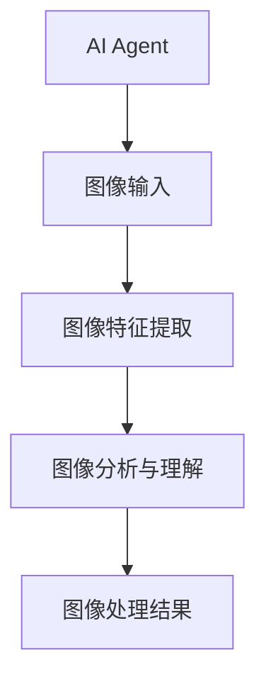
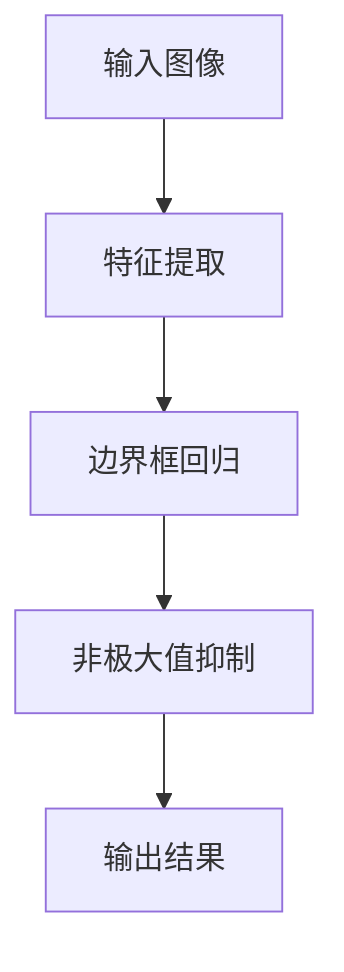
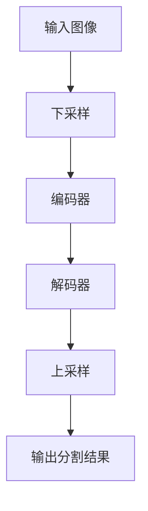
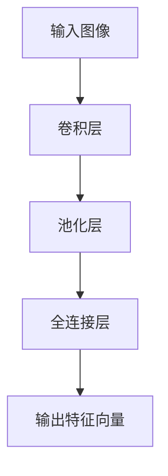
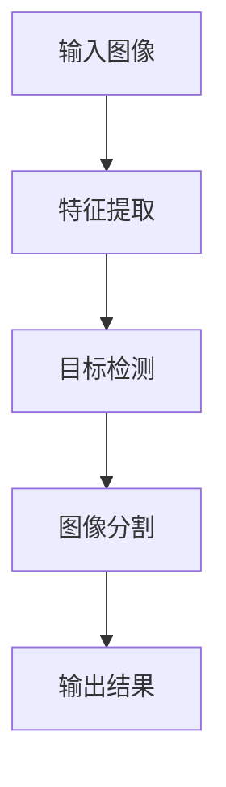
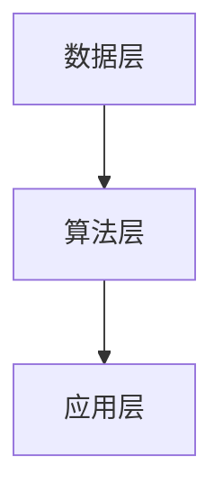
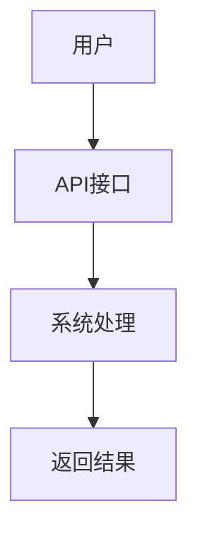

                 


# AI Agent在智能图像处理中的应用

> 关键词：AI Agent，智能图像处理，目标检测，图像分割，深度学习

> 摘要：本文详细探讨了AI Agent在智能图像处理中的应用，从基本概念到算法原理，再到系统架构设计和实际案例分析，全面解析了AI Agent如何提升图像处理的智能化水平。

---

# 第1章: AI Agent与智能图像处理概述

## 1.1 AI Agent的基本概念

### 1.1.1 什么是AI Agent
AI Agent（人工智能代理）是指能够感知环境、做出决策并执行任务的智能实体。它可以是一个软件程序或物理设备，具备自主学习和适应能力。

### 1.1.2 AI Agent的核心特征
- **自主性**：能够在没有外部干预的情况下独立运作。
- **反应性**：能够实时感知环境变化并做出反应。
- **目标导向性**：具备明确的目标，并采取行动以实现这些目标。
- **学习能力**：能够通过经验改进自身的性能。

### 1.1.3 AI Agent与传统图像处理的区别
传统图像处理依赖于固定的算法和规则，而AI Agent能够根据输入数据动态调整处理策略，具备更强的适应性和灵活性。

## 1.2 智能图像处理的背景与应用

### 1.2.1 图像处理的定义与范围
图像处理是指对数字图像进行分析、变换和优化的过程，广泛应用于医学影像分析、计算机视觉、安防监控等领域。

### 1.2.2 智能图像处理的发展历程
从早期的简单图像增强技术到现在的深度学习驱动的图像分析，智能图像处理经历了从规则驱动到数据驱动的转变。

### 1.2.3 智能图像处理的典型应用领域
- **医学影像分析**：辅助医生进行疾病诊断。
- **计算机视觉**：应用于人脸识别、物体检测等领域。
- **安防监控**：用于视频监控和异常行为 detection.

## 1.3 AI Agent在图像处理中的作用

### 1.3.1 AI Agent在图像分析中的优势
AI Agent能够通过深度学习模型从图像中提取高阶特征，显著提高图像分析的准确性和效率。

### 1.3.2 AI Agent在图像处理中的核心任务
- **目标检测**：识别图像中的特定目标。
- **图像分割**：将图像划分为不同的区域，便于后续处理。
- **图像生成**：通过生成对抗网络（GAN）生成高质量图像。

### 1.3.3 AI Agent与图像处理的结合方式
AI Agent通过调用图像处理算法，实现对图像的自动化分析和处理，形成一个闭环的处理流程。

## 1.4 本章小结
本章介绍了AI Agent的基本概念、核心特征及其在图像处理中的作用，为后续章节奠定了基础。

---

# 第2章: AI Agent的核心概念与联系

## 2.1 AI Agent的核心原理

### 2.1.1 AI Agent的感知机制
AI Agent通过传感器或数据接口获取图像信息，并利用深度学习模型进行特征提取和理解。

### 2.1.2 AI Agent的决策机制
基于感知到的信息，AI Agent通过推理和计算，制定最优的处理策略。

### 2.1.3 AI Agent的执行机制
根据决策结果，AI Agent调用相应的图像处理算法，完成对图像的处理任务。

## 2.2 AI Agent与图像处理的关系

### 2.2.1 图像处理中的AI Agent角色
AI Agent在图像处理中扮演执行者和协调者的双重角色，既是处理工具，也是系统管理者。

### 2.2.2 AI Agent在图像处理中的功能模块划分
- **感知模块**：负责图像数据的输入和特征提取。
- **决策模块**：负责制定图像处理策略。
- **执行模块**：负责调用具体图像处理算法并输出结果。

## 2.3 核心概念对比表格

| 概念       | 描述                                                                 |
|------------|----------------------------------------------------------------------|
| AI Agent   | 具备感知、决策和执行能力的智能体                                       |
| 图像处理    | 对图像进行分析、识别、变换等操作的技术                               |

## 2.4 实体关系图（Mermaid）



## 2.5 本章小结
本章详细讲解了AI Agent的核心原理及其与图像处理的关系，通过对比表格和实体关系图帮助读者更好地理解相关概念。

---

# 第3章: AI Agent的算法原理

## 3.1 AI Agent的感知算法

### 3.1.1 目标检测算法
目标检测是AI Agent图像处理中的关键任务之一，常用算法包括YOLO、Faster R-CNN等。

#### YOLO算法流程图（Mermaid）


### 3.1.2 图像分割算法
图像分割是将图像划分为多个区域的过程，常用算法有U-Net、FCN等。

#### U-Net算法流程图（Mermaid）


### 3.1.3 特征提取算法
特征提取是通过卷积神经网络（CNN）从图像中提取高层次特征。

#### CNN模型结构图（Mermaid）


## 3.2 AI Agent的决策算法

### 3.2.1 基于规则的决策算法
通过预定义的规则进行决策，适用于简单场景。

### 3.2.2 基于机器学习的决策算法
利用训练好的模型进行预测，适用于复杂场景。

### 3.2.3 基于强化学习的决策算法
通过与环境的交互不断优化决策策略，适用于动态场景。

## 3.3 AI Agent的执行算法

### 3.3.1 图像增强算法
对图像进行亮度、对比度等调整，改善图像质量。

### 3.3.2 图像变换算法
包括旋转、缩放等操作，用于适应不同场景需求。

### 3.3.3 图像修复算法
修复图像中的噪声、模糊等问题，提升图像清晰度。

## 3.4 本章小结
本章详细讲解了AI Agent在图像处理中的感知、决策和执行算法，通过流程图和模型结构图帮助读者理解算法原理。

---

# 第4章: AI Agent的系统架构设计

## 4.1 系统功能设计

### 4.1.1 功能模块划分
- **输入模块**：接收图像数据。
- **处理模块**：执行图像处理任务。
- **输出模块**：输出处理结果。

### 4.1.2 功能流程图（Mermaid）


## 4.2 系统架构设计

### 4.2.1 分层架构设计
- **数据层**：存储和管理图像数据。
- **算法层**：实现各种图像处理算法。
- **应用层**：提供用户界面和API接口。

### 4.2.2 架构图（Mermaid）


## 4.3 接口设计

### 4.3.1 API接口定义
- `POST /process_image`：上传图像并请求处理。
- `GET /get_result`：获取处理结果。

### 4.3.2 交互流程图（Mermaid）


## 4.4 本章小结
本章详细讲解了AI Agent在图像处理系统中的架构设计和接口设计，为后续的项目实现奠定了基础。

---

# 第5章: AI Agent在图像处理中的项目实战

## 5.1 项目背景与目标

### 5.1.1 项目背景
本项目旨在开发一个基于AI Agent的图像处理系统，实现目标检测和图像分割功能。

### 5.1.2 项目目标
- 实现图像目标检测。
- 实现图像分割功能。
- 提供友好的用户界面。

## 5.2 项目环境与安装

### 5.2.1 环境要求
- Python 3.8及以上版本。
- 安装TensorFlow、Keras、OpenCV等库。

#### 安装命令
```bash
pip install tensorflow keras opencv-python
```

## 5.3 项目核心代码实现

### 5.3.1 目标检测代码

#### YOLO目标检测实现
```python
import tensorflow as tf
from tensorflow.keras.models import Model
from tensorflow.keras.layers import Input, Conv2D, MaxPooling2D

def build_model():
    inputs = Input(shape=(416, 416, 3))
    x = Conv2D(32, (3,3), activation='relu')(inputs)
    x = MaxPooling2D((2,2))(x)
    model = Model(inputs=inputs, outputs=x)
    return model

model = build_model()
model.summary()
```

### 5.3.2 图像分割代码

#### U-Net分割实现
```python
import tensorflow as tf
from tensorflow.keras.layers import Input, Conv2D, UpSampling2D

def build_unet():
    inputs = Input(shape=(256, 256, 3))
    x = Conv2D(64, (3,3), activation='relu')(inputs)
    x = UpSampling2D((2,2))(x)
    model = Model(inputs=inputs, outputs=x)
    return model

model = build_unet()
model.summary()
```

## 5.4 项目案例分析与解读

### 5.4.1 案例一：目标检测
输入一张包含多个目标的图像，系统能够自动检测并标记出所有目标。

### 5.4.2 案例二：图像分割
输入一张复杂图像，系统能够将其分割为不同的区域，并进行分类。

## 5.5 项目总结

### 5.5.1 成果展示
- 成功实现了目标检测和图像分割功能。
- 系统具备良好的扩展性和可维护性。

### 5.5.2 经验总结
- 模型选择和调参是关键。
- 系统设计需要考虑可扩展性和可维护性。

---

# 第6章: AI Agent在图像处理中的最佳实践

## 6.1 最佳实践 Tips

### 6.1.1 模型选择
根据具体任务选择合适的模型，避免过度复杂的模型。

### 6.1.2 数据预处理
对数据进行充分的清洗和增强，提高模型的泛化能力。

### 6.1.3 系统优化
通过并行计算和缓存优化，提高系统的处理效率。

## 6.2 小结

### 6.2.1 成功经验
- 采用模块化设计，提高系统的灵活性。
- 定期更新模型，保持系统的先进性。

### 6.2.2 注意事项
- 避免过度依赖单一算法，保持系统的多样性。
- 注重数据隐私和安全，确保系统的合规性。

## 6.3 拓展阅读

### 6.3.1 推荐书籍
- 《Deep Learning》
- 《Computer Vision: Algorithms and Applications》

### 6.3.2 推荐论文
- "YOLO: Real-Time Object Detection"
- "U-Net: Convolutional Networks for Biomedical Image Segmentation"

---

# 结语

通过本文的详细讲解，我们深入了解了AI Agent在智能图像处理中的应用，从基本概念到算法原理，再到系统设计和项目实战，全面剖析了AI Agent在图像处理中的优势和潜力。未来，随着技术的不断进步，AI Agent在图像处理中的应用将更加广泛和深入。

---

# 附录

## 附录A: 代码示例

```python
import tensorflow as tf
from tensorflow.keras.models import Model
from tensorflow.keras.layers import Input, Conv2D, MaxPooling2D, UpSampling2D

def build_yolo_model():
    inputs = Input(shape=(416, 416, 3))
    x = Conv2D(32, (3,3), activation='relu')(inputs)
    x = MaxPooling2D((2,2))(x)
    return Model(inputs=inputs, outputs=x)

def build_unet_model():
    inputs = Input(shape=(256, 256, 3))
    x = Conv2D(64, (3,3), activation='relu')(inputs)
    x = UpSampling2D((2,2))(x)
    return Model(inputs=inputs, outputs=x)

# 创建模型
yolo_model = build_yolo_model()
unet_model = build_unet_model()

# 模型总结
yolo_model.summary()
unet_model.summary()
```

## 附录B: 图表汇总

### 图表1: AI Agent与图像处理的关系图


### 图表2: YOLO算法流程图


### 图表3: U-Net算法流程图


## 附录C: 参考文献

1. Redmon, J., Farhadi, A., & Darrell, T. (2016). YOLO: Real-time object detection.
2. Long, J., Shelhamer, E., & Darrell, T. (2015). U-Net: Convolutional networks for biomedical image segmentation.
3. LeCun, Y., Bengio, Y., & Hinton, G. (2015). Deep learning.

---

通过本文的系统讲解和实际案例分析，我们相信读者能够全面理解AI Agent在智能图像处理中的应用，并在实际项目中灵活运用这些知识。

