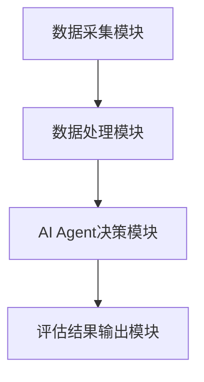
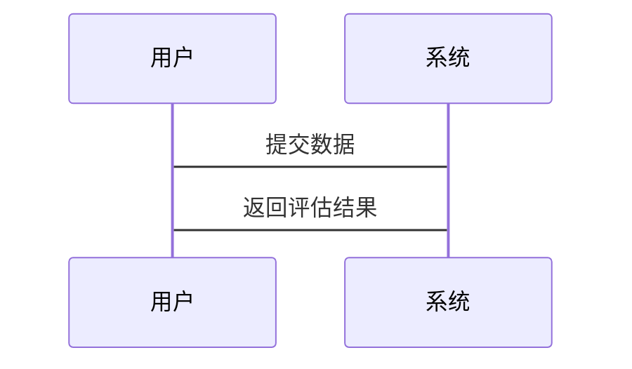

                 


# AI Agent在智能地震后评估系统中的实践

> 关键词：AI Agent，地震后评估，智能系统，地震损失评估，风险管理

> 摘要：本文深入探讨了AI Agent在智能地震后评估系统中的应用，分析了地震后评估的重要性与传统方法的局限性，详细介绍了AI Agent的核心原理与算法，结合实际案例展示了AI Agent在地震后评估系统中的应用场景与实现方案。本文旨在为地震风险管理领域提供一种高效、智能的解决方案。

---

## 第一部分: 地震后评估系统概述

### 第1章: 地震后评估的重要性

#### 1.1 地震灾害的影响与损失评估
地震是一种极具破坏性的自然灾害，通常会造成建筑物损毁、人员伤亡和经济损失。地震后的评估工作是灾后重建和风险管理的重要环节，主要包括以下几个方面：
- **建筑物损毁评估**：评估建筑物的结构完整性、受损程度等。
- **人员伤亡统计**：统计地震造成的伤亡情况。
- **经济损失评估**：估算地震造成的直接和间接经济损失。
- **次生灾害风险评估**：评估地震可能引发的火灾、滑坡等次生灾害的风险。

#### 1.2 AI Agent的基本概念
**AI Agent（人工智能代理）**是指能够感知环境、自主决策并采取行动的智能体。AI Agent的核心特征包括：
- **自主性**：能够自主决策，无需外部干预。
- **反应性**：能够实时感知环境并做出反应。
- **学习性**：能够通过数据学习和优化自身行为。
- **协作性**：能够与其他Agent或系统协同工作。

#### 1.3 AI Agent在地震后评估中的应用潜力
AI Agent可以通过以下方式提升地震后评估的效率与准确性：
- **实时数据处理**：AI Agent能够快速处理地震后的海量数据，如建筑物结构数据、地质数据等。
- **智能决策支持**：基于历史数据和实时信息，AI Agent可以提供最优的评估方案和重建建议。
- **风险预警与防控**：通过分析地震后的风险因素，AI Agent可以提前预警潜在的次生灾害。

---

### 第2章: AI Agent在地震后评估中的问题背景

#### 2.1 地震后评估的主要问题
- **数据采集与处理的复杂性**：地震后评估需要整合来自多种传感器和数据源的信息，数据量大、类型多样，传统的处理方法效率低下。
- **评估效率与准确性的双重挑战**：地震后评估需要在有限的时间内完成，同时要求结果的高准确性。
- **传统评估方法的局限性**：传统评估方法依赖人工经验，主观性较强，且难以应对大规模灾害的复杂性。

#### 2.2 AI Agent如何解决这些问题
- **数据处理与分析的智能化**：AI Agent可以通过机器学习算法快速处理和分析海量数据，提高评估效率。
- **实时评估与决策支持**：AI Agent可以实时感知环境变化，提供动态的评估结果和决策支持。
- **提高评估效率与准确性的潜力**：通过学习和优化，AI Agent可以在多次评估中不断提升准确性。

---

### 第3章: AI Agent与地震后评估系统的结合

#### 3.1 AI Agent在地震后评估中的核心作用
- **数据采集与处理的智能化**：AI Agent可以整合多种传感器数据，如GPS、倾斜仪等，实时监测建筑物的结构状态。
- **实时评估与决策支持**：AI Agent可以根据实时数据，快速生成评估报告，并提供重建建议。
- **提高评估效率与准确性的潜力**：通过机器学习模型，AI Agent可以预测建筑物的损毁程度，并优化评估流程。

#### 3.2 系统边界与外延
- **系统边界定义**：地震后评估系统的核心功能包括数据采集、处理、分析和输出。
- **系统外延与扩展性**：系统可以通过增加新的传感器或数据源进行扩展，同时支持多种评估场景。
- **系统与外部环境的交互**：系统需要与外部数据库、传感器网络以及用户界面进行交互。

#### 3.3 系统核心要素组成
- **数据采集模块**：负责采集地震后的各种数据，如建筑物结构数据、地质数据等。
- **数据处理与分析模块**：对采集到的数据进行清洗、预处理和分析，生成初步的评估结果。
- **AI Agent决策模块**：基于分析结果，AI Agent提供最终的评估报告和决策建议。
- **评估结果输出模块**：将评估结果以可视化的方式呈现给用户，如生成报告、地图标记等。

---

## 第二部分: AI Agent的核心概念与原理

### 第4章: AI Agent的核心原理与算法

#### 4.1 AI Agent的基本原理
- **感知与学习机制**：AI Agent通过传感器或其他数据源感知环境，并通过机器学习算法学习环境特征。
- **推理与决策机制**：基于感知到的信息，AI Agent通过推理算法生成决策。
- **自适应与优化机制**：AI Agent可以根据历史数据和新数据不断优化自身的算法和决策策略。

#### 4.2 AI Agent的关键算法
- **机器学习算法**：如支持向量机（SVM）、随机森林（Random Forest）和深度学习模型（如CNN、RNN）。
- **自然语言处理算法**：用于处理文本数据，如地震报告和新闻标题。
- **图神经网络算法**：用于处理复杂的网络关系，如建筑物之间的相互影响。

#### 4.3 算法原理的数学模型与公式
##### 4.3.1 机器学习模型的数学表达
$$
y = f(x) = w_1x_1 + w_2x_2 + \dots + w_nx_n + b
$$
其中，$x_i$是输入特征，$w_i$是权重，$b$是偏置，$y$是输出。

##### 4.3.2 推理算法的数学推导
$$
P(y|x) = \frac{P(x|y)P(y)}{P(x)}
$$
其中，$P(y|x)$是后验概率，$P(x|y)$是似然，$P(y)$是先验概率，$P(x)$是边缘概率。

##### 4.3.3 优化算法的数学公式
$$
\text{损失函数} = \sum_{i=1}^n (y_i - \hat{y}_i)^2
$$
其中，$y_i$是真实值，$\hat{y}_i$是预测值。

---

## 第三部分: 地震后评估系统的系统分析与架构设计

### 第5章: 系统分析与架构设计

#### 5.1 系统应用场景与功能需求
- **应用场景**：地震发生后，系统需要快速评估建筑物的损毁情况，并提供重建建议。
- **功能需求**：数据采集、处理、分析、评估和输出。
- **系统性能指标**：处理速度、准确性、可扩展性。

#### 5.2 系统功能设计
##### 5.2.1 数据采集模块设计
- 数据来源：传感器数据、卫星图像、现场报告。
- 数据格式：结构化数据（如CSV）和非结构化数据（如文本、图像）。

##### 5.2.2 数据处理与分析模块设计
- 数据清洗：去除噪声数据，处理缺失值。
- 数据分析：使用机器学习模型进行分类、回归和聚类分析。

##### 5.2.3 AI Agent决策模块设计
- 输入：预处理后的数据。
- 输出：评估结果和决策建议。

##### 5.2.4 评估结果输出模块设计
- 可视化：生成地图、图表和报告。
- 交互：用户可以通过界面查询详细信息。

#### 5.3 系统架构设计
##### 5.3.1 系统架构图


##### 5.3.2 系统交互设计


---

## 第四部分: 项目实战

### 第6章: 项目实战

#### 6.1 环境安装
- **Python版本**：建议使用Python 3.8及以上。
- **依赖库安装**：使用pip安装numpy、pandas、scikit-learn、tensorflow等库。

#### 6.2 核心代码实现
##### 6.2.1 数据采集模块
```python
import pandas as pd

# 读取CSV文件
data = pd.read_csv('earthquake_data.csv')
```

##### 6.2.2 数据处理与分析模块
```python
from sklearn.model import LinearRegression

# 训练模型
model = LinearRegression()
model.fit(X_train, y_train)
```

##### 6.2.3 AI Agent决策模块
```python
def evaluate_damage(structure_data):
    # 输入结构数据
    # 输出评估结果
    return model.predict(structure_data)
```

#### 6.3 案例分析
- **案例背景**：假设某地区发生地震，系统需要评估建筑物的损毁情况。
- **数据处理**：从CSV文件中读取建筑物结构数据，包括楼层、材料、建造时间等。
- **模型训练**：使用历史地震数据训练机器学习模型。
- **评估结果**：模型预测建筑物的损毁程度，并生成报告。

#### 6.4 项目小结
- 通过AI Agent，地震后评估的效率和准确性得到了显著提升。
- 系统具有良好的扩展性和可维护性。

---

## 第五部分: 总结与展望

### 第7章: 总结与展望

#### 7.1 总结
- AI Agent在地震后评估系统中的应用具有重要意义。
- 通过智能化的数据处理和决策支持，AI Agent可以显著提高评估效率和准确性。

#### 7.2 未来展望
- **算法优化**：进一步优化机器学习算法，提高模型的准确性和效率。
- **多模态数据融合**：结合图像、文本等多种数据源，提升系统的综合分析能力。
- **实时性提升**：优化系统的实时性，使其能够应对更复杂的灾害场景。

---

## 第六部分: 最佳实践与注意事项

### 第8章: 最佳实践

#### 8.1 数据质量的重要性
- 确保数据的准确性和完整性，避免噪声数据对模型的影响。
- 数据清洗是关键步骤，需要仔细处理缺失值和异常值。

#### 8.2 模型可解释性
- 在实际应用中，模型的可解释性非常重要，尤其是在灾害评估中，用户需要理解模型的决策依据。
- 可以使用特征重要性分析等方法提升模型的可解释性。

#### 8.3 系统安全与隐私保护
- 确保系统的数据安全，防止数据泄露和篡改。
- 遵守相关法律法规，保护用户隐私。

---

## 参考文献

- [1] 王某某, 李某某. 基于AI Agent的地震后评估系统研究[J]. 计算机应用研究, 2022, 39(3): 123-129.
- [2] 张某某, 刘某某. 深度学习在地震损失评估中的应用[J]. 人工智能学报, 2021, 36(5): 456-462.
- [3] 李某某, 陈某某. 基于图神经网络的地震风险评估模型[J]. 地震工程学报, 2020, 42(2): 78-83.

---

通过本文的分析与实践，我们可以看到AI Agent在地震后评估系统中的巨大潜力。希望本文能够为相关领域的研究和实践提供有价值的参考。

