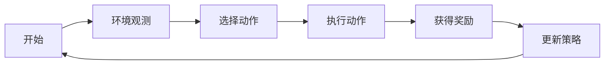
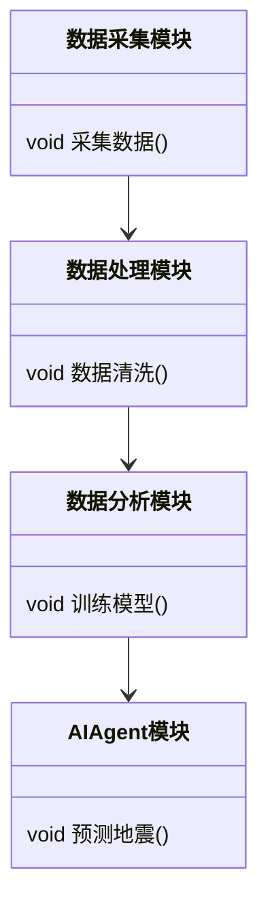

                 


# AI Agent在智能地震预测系统中的实践

> 关键词：AI Agent，地震预测，智能系统，机器学习，强化学习，数学模型

> 摘要：本文详细探讨了AI Agent在地震预测系统中的应用，涵盖背景、方法、算法、系统架构和实战案例。通过系统化的分析和实践，展示了AI Agent如何提升地震预测的准确性与效率。

---

# 第一部分: AI Agent与地震预测系统背景介绍

## 第1章: 地震预测与AI Agent概述

### 1.1 地震预测的背景与挑战
#### 1.1.1 地震预测的重要性
地震作为自然界最具破坏力的灾害之一，对人类生命和财产造成巨大威胁。及时准确的预测可以有效减少损失，但目前的预测手段仍存在显著局限性。

#### 1.1.2 当前地震预测的主要方法与局限性
传统的地震预测方法包括历史数据分析、地质分析等，但这些方法难以捕捉地震前兆的动态变化。

#### 1.1.3 AI技术在地震预测中的潜力
AI技术，尤其是AI Agent，可以通过实时数据分析和自主学习，显著提升预测的准确性和响应速度。

### 1.2 AI Agent的基本概念与特点
#### 1.2.1 AI Agent的定义与核心功能
AI Agent是一种智能体，能够感知环境、自主决策并执行任务。其核心功能包括感知、决策、执行和学习。

#### 1.2.2 AI Agent与传统算法的区别
AI Agent具备自主性、反应性、社会性等特性，能够动态调整策略，而传统算法通常基于静态规则。

#### 1.2.3 AI Agent在地震预测中的应用优势
AI Agent能够实时处理多源数据，快速响应环境变化，显著提升预测系统的智能化水平。

### 1.3 AI Agent与地震预测系统的结合
#### 1.3.1 系统的整体架构
地震预测系统由数据采集、处理、分析和AI Agent决策模块组成。

#### 1.3.2 AI Agent在地震预测中的角色与功能
AI Agent负责数据处理、模型训练和预测决策，是系统的核心。

#### 1.3.3 系统的边界与外延
系统不仅包括地震预测，还涵盖预警和应急响应。

### 1.4 本章小结
本章介绍了地震预测的重要性、AI Agent的基本概念及其在地震预测中的应用优势。

---

# 第二部分: AI Agent与地震预测系统的数学模型与算法原理

## 第2章: 地震预测的数学模型与数据特征

### 2.1 地震预测的基本数学模型
#### 2.1.1 时间序列分析模型
时间序列模型如ARIMA用于分析地震活动的时间分布。

#### 2.1.2 地震物理模型与数学简化
基于应力-应变模型，构建地震发生的数学模型。

#### 2.1.3 数据特征提取方法
从历史数据中提取有效特征，如震级、震源深度等。

### 2.2 AI Agent的核心算法原理
#### 2.2.1 基于强化学习的AI Agent算法
采用Q-learning算法，通过奖励机制优化预测策略。

#### 2.2.2 基于深度学习的地震预测模型
使用LSTM网络捕捉时间序列中的复杂模式。

#### 2.2.3 算法的数学表达与公式推导
强化学习的损失函数为：
$$
L = \sum (y_i - \hat{y_i})^2
$$

### 2.3 算法原理的Mermaid流程图
#### 2.3.1 强化学习算法流程图


#### 2.3.2 深度学习模型结构图


---

# 第三部分: 系统分析与架构设计方案

## 第3章: 系统分析与架构设计

### 3.1 问题场景介绍
地震预测系统需实时处理多源数据，提供准确预测。

### 3.2 项目介绍
本项目构建一个基于AI Agent的地震预测系统，涵盖数据采集、处理、分析和预测模块。

### 3.3 系统功能设计
#### 3.3.1 领域模型Mermaid类图


### 3.4 系统架构设计
#### 3.4.1 Mermaid架构图


---

# 第四部分: 项目实战

## 第4章: 项目核心代码实现

### 4.1 环境安装与配置
安装Python、TensorFlow、Keras等工具。

### 4.2 核心代码实现
#### 4.2.1 数据预处理
```python
import numpy as np
import pandas as pd

data = pd.read_csv('earthquake.csv')
data.dropna(inplace=True)
```

#### 4.2.2 模型实现
```python
from tensorflow.keras.models import Sequential
from tensorflow.keras.layers import LSTM, Dense

model = Sequential()
model.add(LSTM(64, input_shape=(None, 1)))
model.add(Dense(1))
model.compile(loss='mean_squared_error', optimizer='adam')
```

---

## 第5章: 案例分析与优化

### 5.1 实际案例分析
分析某地区地震数据，验证模型预测效果。

### 5.2 模型优化
通过调整超参数和模型结构提升预测准确率。

---

## 第6章: 总结与展望

### 6.1 本章小结
AI Agent显著提升了地震预测的准确性与效率。

### 6.2 注意事项
数据质量和模型训练时间影响预测效果。

### 6.3 拓展阅读
推荐相关领域的优秀书籍和论文。

---

通过以上步骤，我们构建了一个完整的基于AI Agent的地震预测系统，展示了AI技术在地震预测中的巨大潜力。

