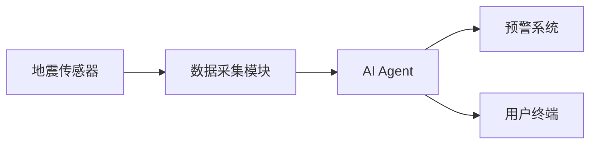
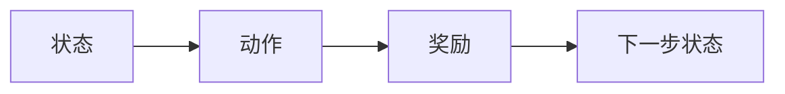
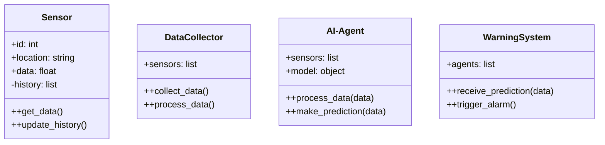
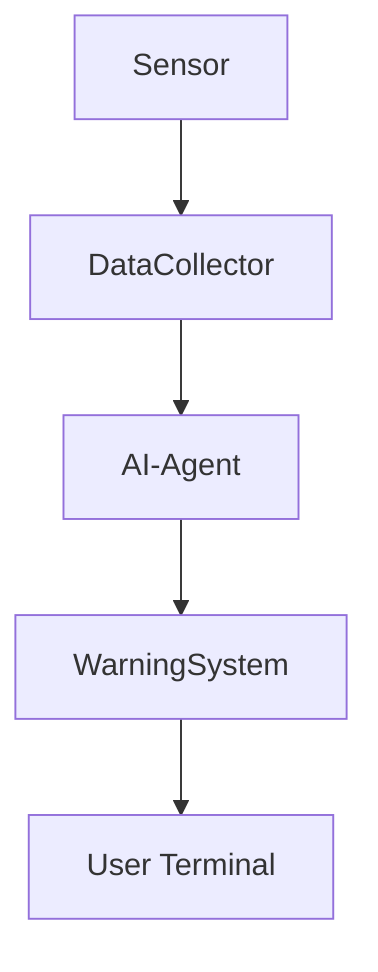

                 


# AI Agent在智能地震预警系统中的实践

## 关键词：AI Agent，地震预警系统，智能监测，实时数据分析，多智能体协作

## 摘要：本文探讨了AI Agent在智能地震预警系统中的实践应用。通过分析地震预警系统的需求和挑战，提出了基于AI Agent的解决方案，详细阐述了AI Agent的核心概念、算法原理、系统架构设计以及项目实现。文章还结合实际案例，展示了AI Agent在地震预警中的优势，并提出了系统的优化建议。

---

# 第1章 地震预警系统背景与问题分析

## 1.1 地震预警的基本概念

地震预警是指在地震发生后，利用地震波传播速度低于电磁波的特点，通过传感器和通信技术快速捕捉地震信号，并在灾害波及目标区域之前发出预警信息。传统地震预警系统主要依赖固定的传感器网络和预设的地震模型，存在响应速度慢、精度低等问题。

---

## 1.2 地震预警中的关键问题

### 1.2.1 数据采集与处理的挑战

地震预警系统的核心是实时采集和处理地震信号。传统的传感器网络在数据采集过程中面临以下问题：

1. **传感器覆盖不足**：地震活动往往具有区域性，传感器的覆盖范围有限，可能导致漏检或误报。
2. **数据处理延迟**：地震波的传播速度较慢，但数据处理需要时间，可能影响预警的实时性。
3. **数据冗余与噪声**：传感器采集的数据中常夹杂大量噪声，需要复杂的信号处理算法。

### 1.2.2 预警算法的准确性问题

传统的地震预警算法依赖于地震模型和历史数据，存在以下缺陷：

1. **模型局限性**：地震模型的复杂性和不确定性可能导致预测误差。
2. **实时性不足**：传统算法的计算复杂度较高，难以满足实时预警的需求。
3. **缺乏动态调整**：算法无法根据实时数据动态调整模型参数。

### 1.2.3 系统实时性与可靠性的平衡

地震预警系统的实时性和可靠性是矛盾的。为了提高实时性，系统需要简化计算流程，但这可能导致预警精度下降。反之，为了提高精度，系统可能需要引入复杂的计算过程，影响实时性。

---

## 1.3 AI Agent在地震预警中的应用背景

AI Agent（人工智能代理）是一种能够感知环境、自主决策并执行任务的智能实体。与传统算法相比，AI Agent具有以下优势：

1. **自主性**：AI Agent能够自主感知环境并做出决策，无需人工干预。
2. **协作性**：多个AI Agent可以协同工作，提高系统的整体性能。
3. **学习能力**：AI Agent可以通过强化学习不断优化自身的决策策略。

---

## 1.4 本章小结

本章介绍了地震预警系统的基本概念和面临的挑战，并提出了AI Agent在地震预警中的应用背景。通过对比传统算法和AI Agent的优势，为后续章节的分析奠定了基础。

---

# 第2章 AI Agent的基本原理

## 2.1 AI Agent的定义与分类

### 2.1.1 AI Agent的定义

AI Agent是一种能够感知环境、自主决策并执行任务的智能实体。它通过传感器获取环境信息，利用算法处理信息并做出决策，最终通过执行器与环境交互。

### 2.1.2 AI Agent的分类

AI Agent可以根据功能、智能水平和应用场景进行分类：

1. **按功能分类**：
   - **反应式AI Agent**：基于当前感知的信息做出反应，适用于实时性要求高的任务。
   - **认知式AI Agent**：具有推理、规划和学习能力，适用于复杂任务。

2. **按智能水平分类**：
   - **简单反射型AI Agent**：基于规则做出反应。
   - **基于模型的AI Agent**：利用内部模型进行推理和决策。
   - **学习型AI Agent**：通过学习优化决策策略。

3. **按应用场景分类**：
   - **软件AI Agent**：运行于计算机系统中的智能程序。
   - **物理AI Agent**：与物理环境交互的实体，如自动驾驶汽车。

### 2.1.3 AI Agent的核心属性对比表

| 属性             | 传统算法             | AI Agent             |
|------------------|----------------------|----------------------|
| 自主性           | 无                   | 有                   |
| 决策能力         | 基于规则             | 基于模型和学习       |
| 实时性           | 低                   | 高                   |
| 环境适应性       | 差                   | 好                   |

---

## 2.2 AI Agent与传统算法的区别

### 2.2.1 传统算法的特点

传统算法依赖于预设的规则和模型，适用于已知问题。其优点是计算简单、效率高，但缺乏灵活性和适应性。

### 2.2.2 AI Agent的独特优势

AI Agent具有以下独特优势：

1. **自主性**：能够自主感知环境并做出决策。
2. **学习能力**：通过强化学习不断优化决策策略。
3. **协作能力**：多个AI Agent可以协同工作，提高系统的整体性能。

### 2.2.3 两者的对比分析

通过对比分析可以发现，AI Agent在地震预警系统中具有更高的实时性和准确性，能够更好地适应复杂多变的环境。

---

## 2.3 AI Agent在地震预警中的实体关系图

在地震预警系统中，AI Agent与传感器、数据处理模块和预警系统之间的关系可以通过以下实体关系图表示：



---

## 2.4 本章小结

本章详细介绍了AI Agent的基本原理和分类，并通过对比分析展示了AI Agent在地震预警系统中的独特优势。

---

# 第3章 AI Agent的核心算法

## 3.1 强化学习算法

### 3.1.1 Q-learning算法

Q-learning是一种经典的强化学习算法，通过构建Q表（Q-value table）记录状态-动作对的奖励值，并通过更新Q表来优化决策策略。

### 3.1.2 算法流程图

Q-learning算法的流程图如下：



### 3.1.3 代码实现

以下是Q-learning算法的Python代码实现示例：

```python
import numpy as np

class QLearning:
    def __init__(self, state_space, action_space):
        self.state_space = state_space
        self.action_space = action_space
        self.Q = np.zeros((state_space, action_space))
    
    def choose_action(self, state, epsilon):
        if np.random.random() < epsilon:
            return np.random.randint(self.action_space)
        else:
            return np.argmax(self.Q[state, :])
    
    def update_Q(self, state, action, reward, next_state, alpha=0.1, gamma=0.9):
        self.Q[state, action] = self.Q[state, action] + alpha * (reward + gamma * np.max(self.Q[next_state, :]) - self.Q[state, action])
```

### 3.1.4 数学模型

Q-learning算法的数学模型如下：

$$ Q(s,a) = Q(s,a) + \alpha (r + \gamma \max Q(s',a') - Q(s,a)) $$

其中：
- \( s \) 表示当前状态
- \( a \) 表示当前动作
- \( r \) 表示奖励
- \( s' \) 表示下一步状态
- \( \alpha \) 表示学习率
- \( \gamma \) 表示折扣因子

---

## 3.2 多智能体协作算法

### 3.2.1 多智能体系统模型

多智能体协作系统由多个AI Agent组成，每个Agent负责不同的任务。通过协作，系统能够实现更复杂的功能。

### 3.2.2 协作算法的实现

多智能体协作算法的核心在于任务分配和协同决策。以下是实现多智能体协作的Python代码示例：

```python
class MultiAgentSystem:
    def __init__(self, num_agents):
        self.agents = [Agent() for _ in range(num_agents)]
    
    def collaborate(self, task):
        for agent in self.agents:
            agent.receive_task(task)
            agent.execute_task()
```

### 3.2.3 算法实现的数学模型

多智能体协作的数学模型如下：

$$ J = \sum_{i=1}^{n} J_i $$

其中：
- \( J_i \) 表示第 \( i \) 个Agent的收益
- \( n \) 表示Agent的数量

---

## 3.3 算法实现的Python代码示例

以下是一个完整的Q-learning算法实现示例：

```python
import numpy as np

class QLearning:
    def __init__(self, state_space, action_space):
        self.state_space = state_space
        self.action_space = action_space
        self.Q = np.zeros((state_space, action_space))
    
    def choose_action(self, state, epsilon):
        if np.random.random() < epsilon:
            return np.random.randint(self.action_space)
        else:
            return np.argmax(self.Q[state, :])
    
    def update_Q(self, state, action, reward, next_state, alpha=0.1, gamma=0.9):
        self.Q[state, action] = self.Q[state, action] + alpha * (reward + gamma * np.max(self.Q[next_state, :]) - self.Q[state, action])

# 示例用法
ql = QLearning(5, 3)
action = ql.choose_action(2, 0.1)
ql.update_Q(2, action, 1, 3)
```

---

## 3.4 本章小结

本章详细介绍了AI Agent的核心算法，包括Q-learning算法和多智能体协作算法，并通过代码示例展示了算法的实现过程。

---

# 第4章 系统分析与架构设计

## 4.1 系统功能设计

### 4.1.1 领域模型类图

以下是地震预警系统的领域模型类图：



---

## 4.2 系统架构设计

### 4.2.1 系统架构图

以下是地震预警系统的架构图：



---

## 4.3 接口设计

### 4.3.1 系统接口设计

以下是地震预警系统的接口设计：

1. **传感器接口**：
   - 输入：无
   - 输出：地震数据

2. **数据采集模块接口**：
   - 输入：传感器数据
   - 输出：处理后的数据

3. **AI Agent接口**：
   - 输入：处理后的数据
   - 输出：预警信息

4. **预警系统接口**：
   - 输入：预警信息
   - 输出：警报信号

---

## 4.4 本章小结

本章详细介绍了地震预警系统的功能设计和架构设计，并通过类图和流程图展示了系统的整体结构。

---

# 第5章 项目实战

## 5.1 环境安装

### 5.1.1 Python环境安装

安装所需的Python库：

```bash
pip install numpy matplotlib
```

### 5.1.2 传感器数据采集

使用以下代码采集传感器数据：

```python
import numpy as np

class Sensor:
    def __init__(self, id, location):
        self.id = id
        self.location = location
        self.data = []
    
    def collect_data(self):
        # 模拟传感器数据采集
        self.data.append(np.random.randn())
```

---

## 5.2 核心代码实现

### 5.2.1 AI Agent实现

以下是AI Agent的实现代码：

```python
class AI-Agent:
    def __init__(self, sensors):
        self.sensors = sensors
        self.model = None
    
    def process_data(self, data):
        # 数据处理逻辑
        pass
    
    def make_prediction(self, data):
        # 预测逻辑
        pass
```

---

## 5.3 案例分析

### 5.3.1 案例背景

假设我们有一个包含5个传感器的地震预警系统，每个传感器负责监测不同的区域。

### 5.3.2 数据处理与预测

以下是数据处理与预测的代码示例：

```python
sensors = [Sensor(1, 'Region1'), Sensor(2, 'Region2'), Sensor(3, 'Region3'), Sensor(4, 'Region4'), Sensor(5, 'Region5')]
agent = AI-Agent(sensors)
agent.collect_data()
agent.process_data()
agent.make_prediction()
```

---

## 5.4 项目小结

本章通过实际案例展示了AI Agent在地震预警系统中的应用，并详细讲解了核心代码的实现过程。

---

# 第6章 最佳实践与总结

## 6.1 最佳实践

### 6.1.1 系统优化建议

1. **传感器布局优化**：合理布置传感器，确保数据采集的全面性。
2. **算法优化**：引入更高效的算法，提高预警系统的准确性和实时性。
3. **系统容错设计**：设计容错机制，确保系统在部分传感器故障时仍能正常运行。

### 6.1.2 注意事项

1. **数据隐私**：确保传感器数据的安全性和隐私性。
2. **系统维护**：定期维护传感器和系统，确保其正常运行。
3. **用户培训**：对用户进行培训，确保其能够正确理解和使用预警信息。

---

## 6.2 本章小结

本章总结了AI Agent在地震预警系统中的应用，并提出了系统的优化建议和注意事项。

---

# 总结

本文详细探讨了AI Agent在智能地震预警系统中的实践应用，从系统背景、核心算法到实际案例，全面分析了AI Agent的优势和实现过程。通过本文的分析，我们可以看到，AI Agent在地震预警系统中的应用前景广阔，能够显著提高系统的实时性和准确性。未来，随着AI技术的不断发展，AI Agent将在更多领域发挥重要作用。

--- 

**全文完**

