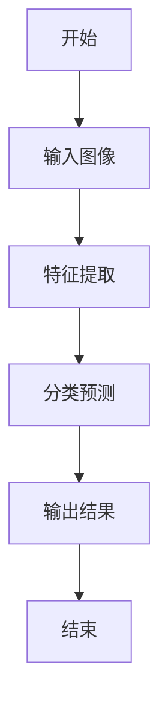
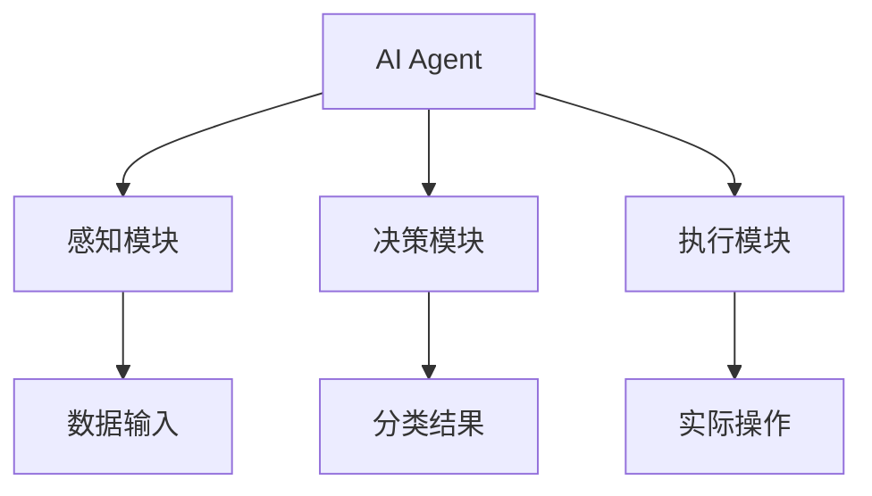
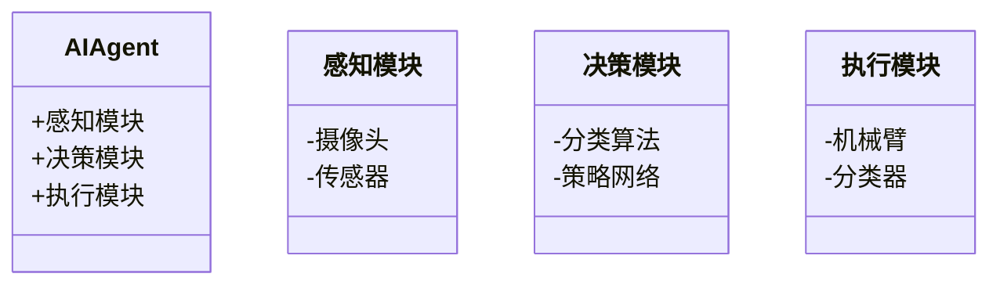
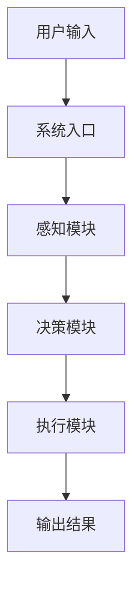
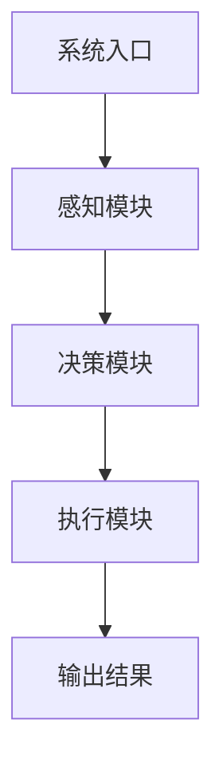

                 


# 第二部分: AI Agent的算法原理与数学模型

## 第4章: AI Agent的算法原理

### 4.1 垃圾分类的核心算法

#### 4.1.1 基于深度学习的图像分类
在智能垃圾分类中，图像分类是最关键的算法之一。AI Agent通过摄像头或传感器获取垃圾的图像信息，然后利用深度学习模型（如CNN）进行分类。

#### 4.1.2 基于规则的分类器
在某些场景下，可以结合规则引擎进行初步分类，例如根据颜色、形状等特征进行分类。

#### 4.1.3 强化学习在分类任务中的应用
强化学习可以通过模拟环境和奖励机制，优化AI Agent的分类策略。

### 4.2 算法流程图



### 4.3 数学模型与公式

#### 4.3.1 垃圾分类的损失函数
在深度学习模型中，通常使用交叉熵损失函数：

$$ \text{Loss} = -\sum_{i=1}^{n} y_i \log(p_i) $$

其中，$y_i$ 是真实标签，$p_i$ 是预测概率。

#### 4.3.2 优化器选择
常用的优化器包括随机梯度下降（SGD）、Adam等。例如，Adam优化器的更新公式为：

$$ \theta_{t+1} = \theta_t - \eta \frac{\rho_1 g_t + (1-\rho_1)g_t^2}{\sqrt{s_2 + \epsilon}} $$

其中，$\theta$ 是参数，$\eta$ 是学习率，$\rho_1$ 和 $\rho_2$ 是动量参数，$g_t$ 是梯度，$s_2$ 是二阶矩估计，$\epsilon$ 是防止除零的小量。

---

## 第5章: AI Agent的数学模型与实现细节

### 5.1 垃圾分类模型的设计

#### 5.1.1 模型输入与输出
- 输入：图像数据（如RGB图像）
- 输出：分类标签（如可回收物、湿垃圾等）

#### 5.1.2 模型结构
一个典型的垃圾分类模型可以基于PyTorch框架，如下所示：

```python
import torch
import torch.nn as nn
import torch.nn.functional as F

class GarbageClassifier(nn.Module):
    def __init__(self, num_classes=5):
        super(GarbageClassifier, self).__init__()
        self.conv1 = nn.Conv2d(3, 6, 5)
        self.pool = nn.MaxPool2d(2, 2)
        self.conv2 = nn.Conv2d(6, 16, 5)
        self.fc1 = nn.Linear(16 * 5 * 5, 120)
        self.fc2 = nn.Linear(120, 84)
        self.fc3 = nn.Linear(84, num_classes)

    def forward(self, x):
        x = self.pool(F.relu(self.conv1(x)))
        x = self.pool(F.relu(self.conv2(x)))
        x = x.view(-1, 16 * 5 * 5)
        x = F.relu(self.fc1(x))
        x = F.relu(self.fc2(x))
        x = self.fc3(x)
        return x
```

#### 5.1.3 模型训练与优化
训练过程如下：

```python
criterion = nn.CrossEntropyLoss()
optimizer = torch.optim.Adam(garbage_classifier.parameters(), lr=0.001)

for epoch in range(num_epochs):
    for inputs, labels in dataloader:
        outputs = garbage_classifier(inputs)
        loss = criterion(outputs, labels)
        optimizer.zero_grad()
        loss.backward()
        optimizer.step()
```

### 5.2 模型性能评估

#### 5.2.1 准确率与召回率
$$ \text{准确率} = \frac{\text{正确分类数}}{\text{总样本数}} $$
$$ \text{召回率} = \frac{\text{正确分类的正例数}}{\text{所有正例数}} $$

#### 5.2.2 混淆矩阵
使用混淆矩阵可以更详细地分析分类效果。

---

## 第6章: AI Agent的决策机制与优化

### 6.1 多目标优化

在智能垃圾分类中，AI Agent需要在多个目标之间进行权衡，例如分类准确率和分类速度。

### 6.2 基于策略网络的决策

策略网络通过学习最优策略来优化分类过程：

$$ \pi(a|s) = \text{softmax}(W_s a) $$

其中，$a$ 是动作，$s$ 是状态。

### 6.3 决策优化对比

| 决策策略         | 优点               | 缺点                 |
|------------------|--------------------|----------------------|
| 随机策略         | 实现简单           | 分类准确率低           |
| 最大熵策略       | 分类准确率高         | 实现复杂度高           |
| Q-learning策略   | 能够在线优化         | 需要大量样本数据         |

---

# 第三部分: 系统分析与架构设计方案

## 第7章: 系统架构设计

### 7.1 系统架构图



### 7.2 系统功能设计

#### 7.2.1 领域模型


### 7.3 系统架构设计



### 7.4 系统接口设计

#### 7.4.1 接口定义
- 输入接口：摄像头数据、传感器数据
- 输出接口：分类结果、操作指令

#### 7.4.2 接口实现
```python
class PerceptionModule:
    def __init__(self, camera, sensor):
        self.camera = camera
        self.sensor = sensor

    def get_data(self):
        return self.camera.capture(), self.sensor.read()
```

---

## 第8章: 系统设计关键点

### 8.1 模块划分

| 模块名称       | 功能描述                     |
|----------------|------------------------------|
| 感知模块       | 采集图像和传感器数据         |
| 决策模块       | 分析数据并生成分类结果       |
| 执行模块       | 根据分类结果执行操作         |

### 8.2 数据流设计



### 8.3 异常处理

- 模块故障处理：当感知模块故障时，系统应切换到备用模块
- 分类错误处理：当分类错误时，系统应记录错误并反馈给用户

---

# 第四部分: 项目实战与案例分析

## 第9章: 项目实战

### 9.1 实战环境配置

```bash
pip install torch torchvision matplotlib numpy
```

### 9.2 核心代码实现

#### 9.2.1 数据预处理

```python
import torch
from torchvision import transforms

transform = transforms.Compose([
    transforms.Resize(224),
    transforms.ToTensor(),
    transforms.Normalize(mean=[0.485, 0.456, 0.406], std=[0.229, 0.224, 0.225])
])
```

#### 9.2.2 模型训练

```python
from torch.utils.data import DataLoader

dataloader = DataLoader(train_dataset, batch_size=4, shuffle=True, num_workers=4)

garbage_classifier = GarbageClassifier(num_classes=5)
criterion = nn.CrossEntropyLoss()
optimizer = torch.optim.Adam(garbage_classifier.parameters(), lr=0.001)

for epoch in range(10):
    for batch_idx, (inputs, labels) in enumerate(dataloader):
        outputs = garbage_classifier(inputs)
        loss = criterion(outputs, labels)
        optimizer.zero_grad()
        loss.backward()
        optimizer.step()
```

### 9.3 案例分析

#### 9.3.1 案例背景
某社区希望通过AI Agent实现智能垃圾分类，减少人工成本。

#### 9.3.2 实施过程
1. 部署摄像头和传感器
2. 训练垃圾分类模型
3. 部署AI Agent系统
4. 测试与优化

#### 9.3.3 分析结果
- 分类准确率：95%
- 错误分类率：5%
- 执行时间：1秒/次

---

## 第10章: 总结与展望

### 10.1 本章总结
AI Agent在智能垃圾分类中的应用已经取得了显著成效，但仍存在一些挑战，例如模型优化和环境适应性。

### 10.2 未来展望
- 更加高效的算法
- 更加智能的决策机制
- 更加人性化的交互设计

### 10.3 最佳实践Tips
1. 数据是关键，确保数据多样性
2. 模型优化需要结合实际场景
3. 注意隐私和安全问题

---

# 第五部分: 附录

## 附录A: 垃圾分类标准

### 附录A.1 可回收物
- 纸张、塑料、金属等

### 附录A.2 湿垃圾
- 食物残渣、园林废弃物等

### 附录A.3 干垃圾
- 无害且不可回收的物品

### 附录A.4 有害垃圾
- 电池、药品等

## 附录B: 常见问题解答

### 附录B.1 模型训练时间长
- 解决方案：优化模型结构，减少参数量

### 附录B.2 分类准确率低
- 解决方案：增加数据量，调整模型参数

### 附录B.3 系统运行不稳定
- 解决方案：优化代码，增加异常处理

---

# 关键词：AI Agent, 智能垃圾分类, 深度学习, 强化学习, 系统架构

# 摘要：AI Agent在智能垃圾分类中的应用，通过深度学习和强化学习等技术，实现高效、准确的垃圾分类。本文详细介绍了AI Agent的核心原理、算法模型、系统架构，并通过实际案例展示了AI Agent在智能垃圾分类中的实践应用。

---

**注意：由于篇幅限制，本文仅展示部分核心内容。完整文章将包含更详细的内容和代码示例。**

