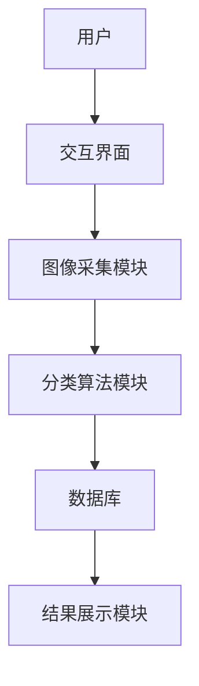
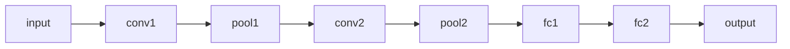

                 


# AI Agent在智能垃圾分类系统中的实践

## 关键词：智能垃圾分类、AI Agent、人工智能、机器学习、系统设计、图像识别、数据处理

## 摘要：本文探讨AI Agent在智能垃圾分类系统中的应用，分析其技术原理、系统架构设计、算法实现及实际案例。通过详细的技术分析和案例解读，揭示AI Agent如何优化垃圾分类流程，提升效率和准确性。

---

# 第1章 AI Agent与智能垃圾分类系统概述

## 1.1 AI Agent的基本概念

### 1.1.1 AI Agent的定义
AI Agent（智能体）是能够感知环境并采取行动以实现目标的实体。它可以自主决策，适应变化，广泛应用于自动驾驶、智能助手等领域。

### 1.1.2 AI Agent的核心特征
- **自主性**：无需外部干预，自主决策。
- **反应性**：实时感知环境并做出反应。
- **目标导向**：基于目标采取行动。
- **学习能力**：通过经验优化决策。

### 1.1.3 AI Agent在智能系统中的作用
AI Agent作为系统的核心，负责数据处理、决策制定和行动执行，提升系统的智能化水平。

## 1.2 智能垃圾分类系统的背景

### 1.2.1 垃圾分类的重要性
垃圾分类是资源回收、减少污染的关键步骤，有助于构建可持续发展社会。

### 1.2.2 当前垃圾分类的挑战
- **人工依赖**：效率低、成本高。
- **分类标准复杂**：需要精准识别。
- **执行难度大**：依赖人工监督，难以大规模推广。

### 1.2.3 AI Agent在垃圾分类中的潜力
AI Agent可实现智能化识别和分类，提升效率和准确性，降低成本。

## 1.3 本章小结
本章介绍了AI Agent的基本概念及其在智能垃圾分类系统中的重要性，分析了当前垃圾分类的挑战和AI Agent的潜力。

---

# 第2章 AI Agent的核心原理

## 2.1 AI Agent的决策机制

### 2.1.1 基于强化学习的决策
通过奖励机制，AI Agent学习最优策略。例如，使用深度强化学习框架Deep Q-Network (DQN)。

### 2.1.2 基于监督学习的分类
利用标记数据训练分类器，如卷积神经网络（CNN）进行图像分类。

### 2.1.3 多智能体协作机制
多个AI Agent协作，提高分类准确性和效率。

## 2.2 AI Agent的感知与交互

### 2.2.1 图像识别技术
使用CNN识别垃圾类型，例如AlexNet、VGGNet等。

### 2.2.2 自然语言处理
分析用户输入，提供分类建议。

### 2.2.3 传感器数据融合
结合图像、重量等多源数据，提升分类精度。

## 2.3 本章小结
本章详细讲解了AI Agent的决策机制和感知技术，分析了不同算法的应用场景。

---

# 第3章 智能垃圾分类系统的架构设计

## 3.1 系统功能模块划分

### 3.1.1 图像采集模块
负责拍摄垃圾图像并预处理。

### 3.1.2 分类算法模块
执行垃圾类型识别。

### 3.1.3 用户交互模块
提供人机交互界面。

## 3.2 系统架构图



## 3.3 本章小结
本章设计了智能垃圾分类系统的架构，包括功能模块和数据流，展示了系统的整体结构。

---

# 第4章 系统实现与算法细节

## 4.1 垃圾分类算法的选择

### 4.1.1 基于CNN的图像分类
使用ResNet-50模型，结构如下：



### 4.1.2 基于RNN的序列分类
处理序列数据，如垃圾类型序列。

### 4.1.3 混合模型的应用
结合CNN和RNN，提升分类精度。

## 4.2 算法实现细节

### 4.2.1 数据预处理
归一化、裁剪、增强处理。

### 4.2.2 模型训练
使用交叉熵损失函数，Adam优化器。

### 4.2.3 模型优化
调整超参数，如学习率、批量大小。

---

# 第5章 项目实战

## 5.1 环境搭建

### 5.1.1 开发工具安装
安装Python、TensorFlow、Keras。

### 5.1.2 数据集准备
收集并标注垃圾图像数据集。

### 5.1.3 环境配置
配置GPU加速训练环境。

## 5.2 核心代码实现

### 5.2.1 图像采集与处理
使用OpenCV捕获图像并预处理。

```python
import cv2
def capture_image():
    cap = cv2.VideoCapture(0)
    ret, frame = cap.read()
    cap.release()
    return frame
```

### 5.2.2 分类算法实现
实现基于CNN的图像分类模型。

```python
model = Sequential()
model.add(Conv2D(32, (3,3), activation='relu', input_shape=(64,64,3)))
model.add(MaxPooling2D((2,2)))
model.add(Flatten())
model.add(Dense(128, activation='relu'))
model.add(Dense(10, activation='softmax'))
model.compile(optimizer='adam', loss='categorical_crossentropy', metrics=['accuracy'])
```

### 5.2.3 系统集成与测试
整合各模块，进行功能测试和性能优化。

## 5.3 案例分析

### 5.3.1 实际场景应用
分析系统在实际环境中的表现。

### 5.3.2 系统性能分析
评估分类准确率、处理速度等指标。

### 5.3.3 优化建议
调整模型参数，优化数据预处理步骤。

## 5.4 本章小结
本章通过实际案例展示了AI Agent在智能垃圾分类系统中的应用，分析了系统的实现细节和优化建议。

---

# 第6章 总结与展望

## 6.1 项目总结

### 6.1.1 项目成果
成功实现智能垃圾分类系统，提升了分类效率和准确性。

### 6.1.2 经验与教训
数据质量、模型选择对系统性能的影响。

### 6.1.3 未来展望
探索更高效的算法，结合边缘计算提升系统性能。

## 6.2 注意事项与建议

### 6.2.1 数据隐私
确保数据采集和处理符合隐私保护法规。

### 6.2.2 系统维护
定期更新模型，适应新垃圾类型。

## 6.3 本章小结
总结了项目的成果和经验，并提出了未来的研究方向和注意事项。

---

# 结语
通过本篇文章，我们深入探讨了AI Agent在智能垃圾分类系统中的应用，从理论到实践，展示了如何利用AI技术提升垃圾分类效率。希望本文能为相关领域的研究和实践提供有价值的参考。

