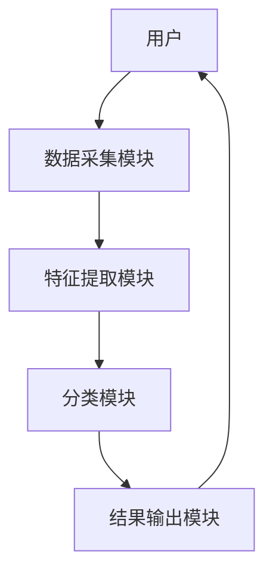
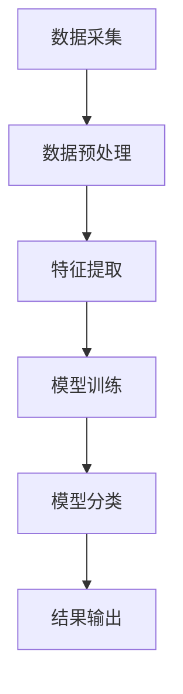
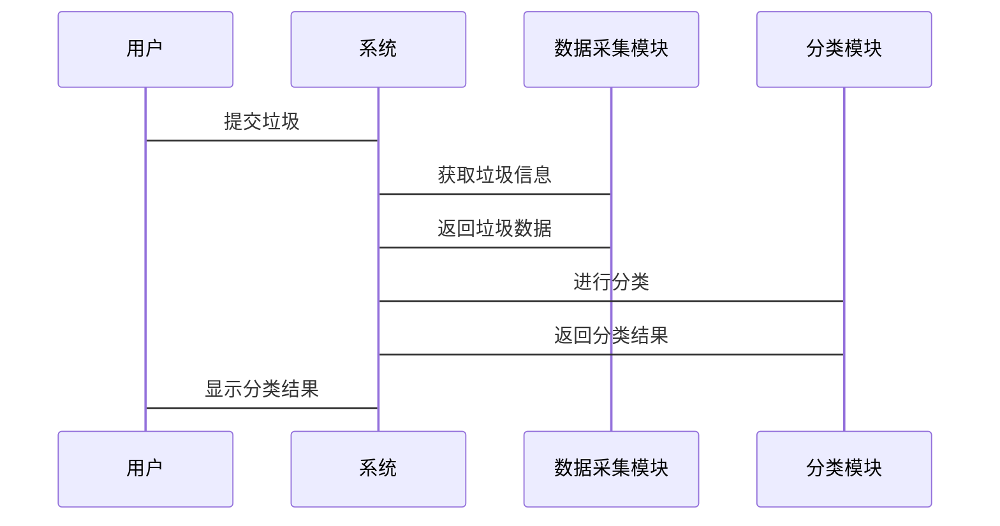

                 


```markdown
# AI Agent在智能垃圾分类识别中的实践

## 关键词
AI Agent, 智能垃圾分类, 图像识别, 机器学习, 系统架构设计

## 摘要
本文详细探讨了AI Agent在智能垃圾分类识别中的实践应用。首先介绍了AI Agent的基本概念及其在智能系统中的作用，接着分析了智能垃圾分类的背景与挑战。然后深入讲解了AI Agent的核心概念与原理，包括其工作流程和与传统AI的区别。通过具体案例，展示了AI Agent在图像识别、语音识别等场景中的应用。详细阐述了相关的算法原理和技术实现，并提供了系统架构设计和项目实战指导。最后总结了AI Agent在智能垃圾分类中的优势及未来发展方向。

---

## 第1章: AI Agent与智能垃圾分类概述

### 1.1 AI Agent的基本概念
#### 1.1.1 AI Agent的定义
AI Agent（人工智能代理）是指能够感知环境、自主决策并执行任务的智能体。它能够通过传感器获取信息，利用算法进行分析，并采取行动以实现目标。

#### 1.1.2 AI Agent的特点
- **自主性**：能够在没有外部干预的情况下自主运行。
- **反应性**：能够实时感知环境变化并做出反应。
- **学习能力**：通过机器学习算法不断优化自身行为。
- **社交能力**：能够与其他系统或人类进行交互。

#### 1.1.3 AI Agent在智能系统中的作用
AI Agent能够处理复杂任务，提高系统效率，优化资源利用，并增强用户体验。

### 1.2 智能垃圾分类的背景与挑战
#### 1.2.1 垃圾分类的重要性
垃圾分类是环境保护的重要环节，能够减少环境污染、节约资源，并提高垃圾处理效率。

#### 1.2.2 当前垃圾分类的主要问题
- **人工成本高**：传统垃圾分类依赖人工操作，效率低下。
- **分类标准复杂**：垃圾种类繁多，分类标准多样。
- **环境适应性差**：传统方法难以适应不同场景和环境变化。

#### 1.2.3 AI Agent在垃圾分类中的应用前景
AI Agent能够通过图像识别、语音识别等技术实现自动分类，提高效率和准确性。

## 第2章: AI Agent的核心概念与原理

### 2.1 AI Agent的核心概念
#### 2.1.1 AI Agent的组成要素
- **感知模块**：负责获取环境信息，如图像、语音等。
- **决策模块**：利用算法对信息进行分析和决策。
- **执行模块**：根据决策结果执行相应的操作。

#### 2.1.2 AI Agent的分类
- **反应式AI Agent**：基于当前感知做出实时反应。
- **认知式AI Agent**：具备复杂推理和规划能力。
- **混合式AI Agent**：结合反应式和认知式的特点。

#### 2.1.3 AI Agent的工作原理
AI Agent通过感知环境、分析信息、做出决策并执行操作，实现目标。

### 2.2 AI Agent与传统AI的区别
#### 2.2.1 传统AI的特点
- **任务特定性**：针对特定任务设计，缺乏灵活性。
- **缺乏自主性**：需要人工干预和指导。

#### 2.2.2 AI Agent的独特性
- **自主性**：能够独立完成任务。
- **适应性**：能够根据环境变化调整行为。

#### 2.2.3 两者在垃圾分类中的应用对比
AI Agent能够更高效、灵活地处理复杂任务，而传统AI则适用于简单、固定的场景。

### 2.3 AI Agent的核心算法原理
#### 2.3.1 机器学习算法
- **支持向量机（SVM）**：用于分类任务。
- **随机森林**：用于分类和回归任务。

#### 2.3.2 深度学习算法
- **卷积神经网络（CNN）**：用于图像识别。
- **循环神经网络（RNN）**：用于序列数据处理。

#### 2.3.3 自然语言处理技术
- **词嵌入（Word Embedding）**：用于文本表示。
- ** Transformer 模型**：用于序列建模。

### 2.4 本章小结
AI Agent的核心概念和算法原理为智能垃圾分类提供了理论基础和技术支持。

## 第3章: AI Agent在智能垃圾分类中的应用场景

### 3.1 图像识别在垃圾分类中的应用
#### 3.1.1 图像识别技术的基本原理
- **数据采集**：通过摄像头获取图像。
- **特征提取**：利用CNN提取图像特征。
- **分类识别**：基于训练好的模型进行分类。

#### 3.1.2 图像识别在垃圾分类中的具体应用
- **可回收物识别**：识别纸张、塑料等可回收物品。
- **有害垃圾识别**：识别电池、药品等有害物品。

#### 3.1.3 常见的图像识别算法
- **ResNet**：深度残差网络。
- **Inception**：多层感知器网络。

### 3.2 语音识别在垃圾分类中的应用
#### 3.2.1 语音识别技术的基本原理
- **语音采集**：通过麦克风获取语音信号。
- **特征提取**：提取语音特征，如梅尔频率倒谱系数（MFCC）。
- **语音识别**：基于模型进行语音识别。

#### 3.2.2 语音识别在垃圾分类中的具体应用
- **语音指令**：用户通过语音指令进行垃圾分类。
- **语音反馈**：系统通过语音反馈分类结果。

#### 3.2.3 常见的语音识别算法
- **隐马尔可夫模型（HMM）**：用于语音识别。
- **深度神经网络（DNN）**：用于端到端语音识别。

### 3.3 传感器数据处理在垃圾分类中的应用
#### 3.3.1 传感器数据的基本原理
- **数据采集**：通过传感器获取物理信号。
- **数据处理**：对信号进行滤波、放大等处理。
- **数据分类**：基于传感器数据进行分类。

#### 3.3.2 传感器数据在垃圾分类中的具体应用
- **重量检测**：通过重量传感器进行垃圾分类。
- **形状检测**：通过形状传感器进行分类。

#### 3.3.3 常见的传感器数据处理算法
- **K近邻算法（KNN）**：用于分类任务。
- **支持向量机（SVM）**：用于分类任务。

## 第4章: AI Agent在智能垃圾分类中的技术实现

### 4.1 数据预处理
#### 4.1.1 数据清洗
- **去除噪声**：清理数据中的无关信息。
- **数据归一化**：将数据标准化处理。

#### 4.1.2 数据增强
- **旋转**：对图像进行旋转处理。
- **翻转**：对图像进行水平或垂直翻转。

### 4.2 特征提取
#### 4.2.1 图像特征提取
- **使用CNN提取特征**：通过卷积层提取图像特征。
- **使用PCA降维**：对特征进行降维处理。

#### 4.2.2 文本特征提取
- **使用Word2Vec生成词向量**：将文本转换为向量表示。
- **使用TF-IDF提取关键词**：提取文本中的重要关键词。

### 4.3 分类算法
#### 4.3.1 监督学习算法
- **随机森林**：用于分类和回归任务。
- **梯度提升树（GBDT）**：用于分类和回归任务。

#### 4.3.2 无监督学习算法
- **K-means聚类**：用于无监督分类任务。
- **DBSCAN聚类**：用于密度聚类任务。

### 4.4 模型训练与优化
#### 4.4.1 模型训练
- **训练策略**：使用交叉验证进行模型训练。
- **超参数调优**：通过网格搜索优化模型参数。

#### 4.4.2 模型评估
- **准确率评估**：计算模型的分类准确率。
- **混淆矩阵分析**：分析模型的分类结果。

### 4.5 系统集成
#### 4.5.1 系统模块划分
- **数据采集模块**：负责数据的采集和预处理。
- **特征提取模块**：负责特征的提取和降维。
- **分类模块**：负责模型的训练和分类。

#### 4.5.2 系统接口设计
- **API接口**：定义系统与其他模块的接口。
- **数据格式**：定义数据的传输格式。

## 第5章: AI Agent在智能垃圾分类中的系统架构设计

### 5.1 系统功能设计
#### 5.1.1 系统功能模块
- **数据采集模块**：负责数据的采集和预处理。
- **特征提取模块**：负责特征的提取和降维。
- **分类模块**：负责模型的训练和分类。
- **用户交互模块**：负责与用户的交互。

#### 5.1.2 功能流程图


### 5.2 系统架构设计
#### 5.2.1 系统架构图


#### 5.2.2 系统交互流程


### 5.3 系统实现细节
#### 5.3.1 数据采集模块实现
- **摄像头采集图像**：使用OpenCV库进行图像采集。
- **麦克风采集语音**：使用PyAudio库进行语音采集。

#### 5.3.2 分类模块实现
- **图像分类**：使用预训练的ResNet模型进行图像分类。
- **语音识别**：使用预训练的Deep Speech模型进行语音识别。

## 第6章: AI Agent在智能垃圾分类中的项目实战

### 6.1 环境配置
#### 6.1.1 安装Python
```bash
python --version
pip install --upgrade pip
```

#### 6.1.2 安装依赖库
```bash
pip install numpy
pip install pandas
pip install matplotlib
pip install scikit-learn
pip install tensorflow
pip install keras
pip install opencv-python
pip install pyaudio
```

### 6.2 核心代码实现
#### 6.2.1 图像分类实现
```python
import cv2
import numpy as np
from sklearn import svm

# 加载预训练模型
model = svm.SVC()

# 数据预处理
def preprocess_image(image_path):
    image = cv2.imread(image_path)
    image = cv2.resize(image, (224, 224))
    image = image.astype(np.float32) / 255.0
    return image

# 训练模型
X = []
y = []
for class_name in classes:
    for image_file in os.listdir(class_name):
        image = preprocess_image(os.path.join(class_name, image_file))
        X.append(image)
        y.append(class_name)

model.fit(X, y)
```

#### 6.2.2 语音识别实现
```python
import speech_recognition as sr

# 初始化语音识别器
recognizer = sr.Recognizer()

# 加载语音文件
audio_file = sr.AudioFile("voice.wav")
with audio_file as source:
    audio_data = recognizer.record(source)

# 转换语音为文本
try:
    text = recognizer.recognize_google(audio_data, language='zh-CN')
    print("识别结果:", text)
except sr.UnknownValueError:
    print("无法识别语音")
```

### 6.3 项目总结
通过本项目的实战，我们可以看到AI Agent在智能垃圾分类中的巨大潜力。通过图像识别和语音识别等技术，AI Agent能够高效、准确地完成垃圾分类任务。

## 第7章: 总结与展望

### 7.1 本章总结
本文详细探讨了AI Agent在智能垃圾分类中的实践应用，从核心概念到技术实现，再到系统设计和项目实战，全面展示了AI Agent在这一领域的巨大潜力。

### 7.2 未来展望
随着AI技术的不断发展，AI Agent在智能垃圾分类中的应用将更加广泛和深入。未来，可以通过结合更多的传感器数据和更先进的算法，进一步提高垃圾分类的准确率和效率。

### 7.3 注意事项
- **数据隐私**：在处理用户数据时，需要注意数据隐私保护。
- **系统稳定性**：需要确保系统的稳定性和可靠性。
- **用户体验**：需要注重用户体验，提供友好的交互界面。

### 7.4 拓展阅读
- **《机器学习实战》**：深入学习机器学习算法。
- **《深度学习入门：基于Python的CNN实践》**：学习卷积神经网络的实现。

---

# 附录

## 附录A: AI Agent相关术语表
- **AI Agent**：人工智能代理。
- **CNN**：卷积神经网络。
- **RNN**：循环神经网络。

## 附录B: Python代码示例
```python
import cv2
import numpy as np
from sklearn import svm

# 加载预训练模型
model = svm.SVC()

# 数据预处理
def preprocess_image(image_path):
    image = cv2.imread(image_path)
    image = cv2.resize(image, (224, 224))
    image = image.astype(np.float32) / 255.0
    return image

# 训练模型
X = []
y = []
for class_name in classes:
    for image_file in os.listdir(class_name):
        image = preprocess_image(os.path.join(class_name, image_file))
        X.append(image)
        y.append(class_name)

model.fit(X, y)
```

## 附录C: 参考文献
1. LeCun, Y., Bengio, Y., & Hinton, G. (2015). Deep learning. Nature, 521(7555), 436-444.
2. Goodfellow, I., Bengio, Y., & Courville, A. (2016). Deep learning. MIT Press.
3. Russell, S., & Norvig, P. (2010). Artificial intelligence: a modern approach. Pearson.

---

通过本文的详细讲解和项目实战，读者可以全面了解AI Agent在智能垃圾分类中的应用，并能够实际操作相关技术。
```

