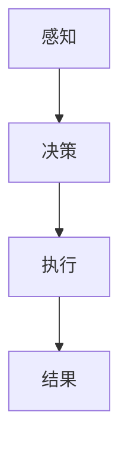
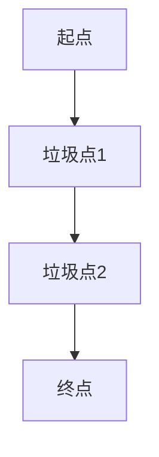
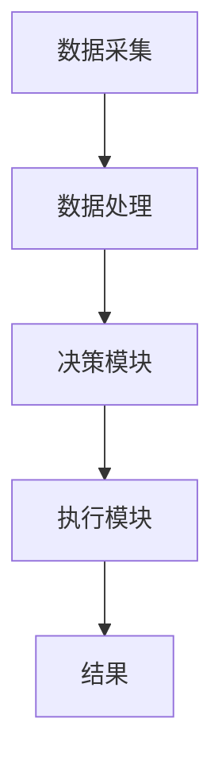

                 


# 《AI Agent在智能垃圾回收中的实践》

## 关键词：
AI Agent，智能垃圾回收，路径优化，分类算法，资源分配，系统架构

## 摘要：
随着城市化进程的加快，垃圾处理问题日益严重，传统的人工垃圾回收方式效率低下，资源浪费严重。AI Agent作为人工智能领域的重要技术，可以通过智能感知、决策和执行机制，优化垃圾回收的路径、分类和资源分配，显著提升垃圾回收的效率和可持续性。本文详细探讨AI Agent在智能垃圾回收中的实践，涵盖背景、原理、算法、系统架构、项目实现及总结，为读者提供全面的技术指导。

---

# 第1章: 问题背景与概念介绍

## 1.1 问题背景

### 1.1.1 垃圾处理的现状与挑战
城市化进程的加快导致垃圾产生量急剧增加，传统的垃圾处理方式存在效率低、资源浪费、环境污染等问题。垃圾处理不仅需要大量的人力，还面临分类不准确、运输路线不合理等挑战。

### 1.1.2 智能化垃圾回收的必要性
随着AI技术的发展，智能化垃圾回收成为解决传统问题的重要手段。通过引入AI Agent，可以实现垃圾的智能分类、路径优化和资源优化分配，提升整体效率。

### 1.1.3 AI Agent在垃圾回收中的作用
AI Agent可以通过感知环境、分析数据、优化决策，帮助垃圾回收系统实现高效运作。例如，AI Agent可以实时分析垃圾分布情况，优化收集路线，减少运输成本。

## 1.2 问题描述

### 1.2.1 垃圾分类与回收的复杂性
垃圾种类繁多，分类复杂，人工分类容易出错，效率低下。如何实现高效的垃圾分类是智能化垃圾回收的核心问题。

### 1.2.2 现有垃圾回收系统的不足
传统垃圾回收系统存在路线不合理、资源浪费、分类不准确等问题，导致整体效率低下。

### 1.2.3 引入AI Agent的解决方案
通过引入AI Agent，可以实现垃圾的智能分类、路径优化和资源分配，显著提升垃圾回收的效率和可持续性。

## 1.3 问题解决

### 1.3.1 AI Agent的核心功能
AI Agent在垃圾回收中的核心功能包括：
1. 智能分类：通过图像识别和机器学习算法，实现垃圾的精准分类。
2. 路径优化：通过优化算法，计算最优的垃圾收集路线，减少时间和成本。
3. 资源分配：根据垃圾量和分布情况，合理分配资源，提高效率。

### 1.3.2 智能垃圾回收的实现目标
智能垃圾回收的实现目标包括：
1. 提高垃圾分类的准确率。
2. 优化垃圾收集路线，减少运输成本。
3. 实现资源的合理分配，提高整体效率。

### 1.3.3 边界与外延
AI Agent在垃圾回收中的应用边界包括：
1. 仅限于垃圾分类、路径优化和资源分配。
2. 不涉及垃圾处理的具体过程（如焚烧、填埋等）。
3. 外延包括与其他智能系统的集成，如智能垃圾桶、无人驾驶垃圾车等。

## 1.4 概念结构与核心要素

### 1.4.1 AI Agent的定义与属性
AI Agent是一种智能系统，能够感知环境、分析数据、优化决策，并通过执行动作来实现目标。AI Agent具有以下属性：
1. 感知能力：通过传感器、摄像头等设备获取环境数据。
2. 决策能力：通过算法分析数据，制定最优决策。
3. 执行能力：通过执行器或控制系统，实现决策的结果。

### 1.4.2 智能垃圾回收系统的组成
智能垃圾回收系统由以下几个部分组成：
1. 智能垃圾桶：用于分类和存储垃圾。
2. AI Agent：用于数据分析、决策和优化。
3. 无人驾驶垃圾车：用于收集和运输垃圾。
4. 中央控制系统：用于监控和协调整个系统的运行。

### 1.4.3 核心要素对比表格
表1-1：AI Agent与传统垃圾回收系统的对比

| 对比项             | AI Agent垃圾回收系统         | 传统垃圾回收系统         |
|--------------------|----------------------------|--------------------------|
| 数据采集方式       | 智能传感器、图像识别         | 人工分类、记录           |
| 决策方式           | 机器学习算法、优化算法       | 人工经验、简单规则       |
| 执行方式           | 无人驾驶车辆、自动化设备     | 人工操作、传统设备       |
| 效率               | 高效、精准                   | 低效、易出错             |
| 成本               | 低（长期）                   | 高（人力、时间）         |

---

# 第2章: AI Agent的核心原理

## 2.1 AI Agent的感知机制

### 2.1.1 数据采集与处理
AI Agent通过智能传感器和摄像头等设备采集垃圾分布、类型、数量等数据。数据采集后，需要进行预处理，包括去噪、归一化等。

### 2.1.2 感知算法的实现
感知算法的核心是图像识别和机器学习。例如，使用卷积神经网络（CNN）对垃圾进行分类，识别出垃圾的类型和数量。

## 2.2 AI Agent的决策机制

### 2.2.1 决策模型的构建
决策模型基于感知到的数据，通过优化算法计算出最优的垃圾收集路线和资源分配方案。常用的优化算法包括遗传算法、模拟退火算法等。

### 2.2.2 决策算法的实现
以路径优化为例，路径优化的目标是找到从起点到终点的最短路径，同时经过所有需要收集垃圾的点。数学模型可以表示为：

$$
\text{目标函数：} \quad \min \sum_{i=1}^{n} (x_i - x_{i-1})^2 + (y_i - y_{i-1})^2
$$

其中，\(x_i\) 和 \(y_i\) 分别表示第 \(i\) 个点的坐标。

## 2.3 AI Agent的执行机制

### 2.3.1 执行策略的制定
根据决策结果，制定具体的执行策略，例如无人驾驶垃圾车的行驶路线、垃圾的分类方式等。

### 2.3.2 执行过程的监控
通过实时监控系统，AI Agent可以动态调整执行策略，确保垃圾收集过程的顺利进行。

## 2.4 核心概念之间的关系

### 2.4.1 感知、决策、执行的关系图（Mermaid流程图）



---

# 第3章: AI Agent的核心概念与联系

## 3.1 核心概念的属性特征对比表

表3-1：AI Agent与传统垃圾回收系统的对比

| 对比项             | AI Agent垃圾回收系统         | 传统垃圾回收系统         |
|--------------------|----------------------------|--------------------------|
| 数据采集方式       | 智能传感器、图像识别         | 人工分类、记录           |
| 决策方式           | 机器学习算法、优化算法       | 人工经验、简单规则       |
| 执行方式           | 无人驾驶车辆、自动化设备     | 人工操作、传统设备       |
| 效率               | 高效、精准                   | 低效、易出错             |
| 成本               | 低（长期）                   | 高（人力、时间）         |

## 3.2 系统实体关系图（Mermaid ER图）

```mermaid
erd
    A[垃圾点] --> B[垃圾类型]
    A --> C[垃圾车]
    C --> D[路径]
    D --> E[优化结果]
```

---

# 第4章: 路径优化算法

## 4.1 路径优化算法的数学模型

路径优化的目标是找到从起点到终点的最短路径，同时经过所有需要收集垃圾的点。数学模型可以表示为：

$$
\text{目标函数：} \quad \min \sum_{i=1}^{n} (x_i - x_{i-1})^2 + (y_i - y_{i-1})^2
$$

约束条件包括：
1. 必须经过所有垃圾点。
2. 不能重复访问同一个点。

## 4.2 算法实现流程（Mermaid流程图）



## 4.3 Python实现代码

```python
import numpy as np
import math

def distance(p1, p2):
    return math.sqrt((p1[0]-p2[0])**2 + (p1[1]-p2[1])**2)

def optimize_path(start, end, points):
    # 简单的路径优化算法（示例）
    points = [start] + points + [end]
    min_distance = float('inf')
    best_order = None
    # 遍历所有可能的排列组合（示例，实际中应采用更高效的算法）
    for order in permutations(points):
        total = 0
        for i in range(len(order)-1):
            total += distance(order[i], order[i+1])
        if total < min_distance:
            min_distance = total
            best_order = order
    return best_order, min_distance

# 示例数据
start = (0,0)
end = (5,5)
points = [(1,2), (3,4)]

best_order, min_distance = optimize_path(start, end, points)
print(f"最佳路径：{best_order}")
print(f"最小距离：{min_distance}")
```

---

# 第5章: 系统分析与架构设计

## 5.1 项目介绍
智能垃圾回收系统是一个基于AI Agent的自动化垃圾处理系统，旨在通过智能化的方式提高垃圾回收的效率和准确性。

## 5.2 系统功能设计

### 5.2.1 系统功能模块
1. 数据采集模块：负责采集垃圾分布、类型等数据。
2. 数据处理模块：对采集的数据进行预处理和分析。
3. 决策模块：基于优化算法，制定最优的垃圾收集路线和资源分配方案。
4. 执行模块：通过无人驾驶垃圾车等设备执行决策结果。

### 5.2.2 功能模块的交互流程


## 5.3 系统架构设计

### 5.3.1 系统架构图（Mermaid架构图）


---

# 第6章: 项目实战

## 6.1 环境搭建
1. 安装Python和必要的库（如numpy、scipy、cv2等）。
2. 安装无人驾驶垃圾车的控制系统（如ROS）。

## 6.2 核心代码实现

### 6.2.1 数据采集与处理
```python
import cv2
import numpy as np

def process_image(image):
    # 图像处理代码（示例）
    gray = cv2.cvtColor(image, cv2.COLOR_BGR2GRAY)
    edges = cv2.Canny(gray, 50, 150)
    return edges
```

### 6.2.2 路径优化算法
```python
import math
from itertools import permutations

def distance(p1, p2):
    return math.sqrt((p1[0]-p2[0])**2 + (p1[1]-p2[1])**2)

def optimize_path(start, end, points):
    points = [start] + points + [end]
    min_distance = float('inf')
    best_order = None
    for order in permutations(points):
        total = 0
        for i in range(len(order)-1):
            total += distance(order[i], order[i+1])
        if total < min_distance:
            min_distance = total
            best_order = order
    return best_order, min_distance

# 示例数据
start = (0,0)
end = (5,5)
points = [(1,2), (3,4)]

best_order, min_distance = optimize_path(start, end, points)
print(f"最佳路径：{best_order}")
print(f"最小距离：{min_distance}")
```

## 6.3 案例分析
以一个城市社区为例，分析AI Agent如何优化垃圾收集路线，减少运输成本。

## 6.4 项目总结
通过实际案例分析，验证AI Agent在智能垃圾回收中的有效性，总结经验教训，提出改进建议。

---

# 第7章: 总结与展望

## 7.1 总结
AI Agent在智能垃圾回收中的应用显著提升了垃圾处理的效率和准确性，减少了资源浪费和环境污染。

## 7.2 未来展望
随着AI技术的不断发展，智能垃圾回收系统将更加智能化、自动化。未来的挑战包括如何处理更复杂的场景和如何与其他智能系统集成。

---

通过以上内容，您可以开始撰写完整的文章。每个章节和子章节都需要进一步展开，加入更多细节和具体案例，确保文章内容丰富、逻辑清晰、技术深入。

