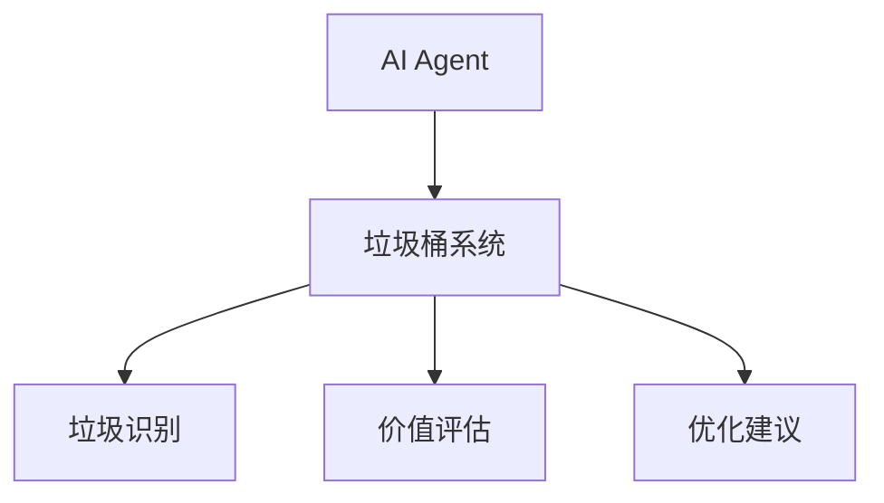
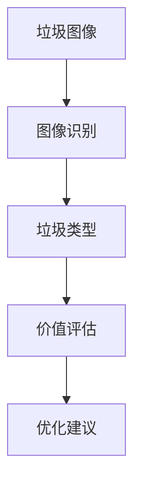
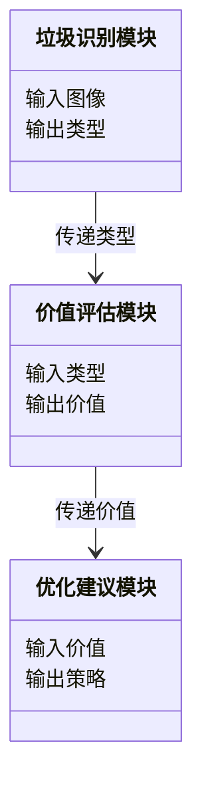
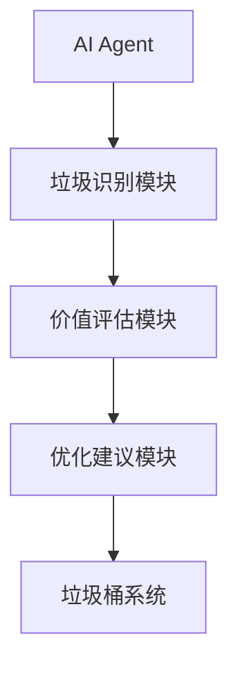
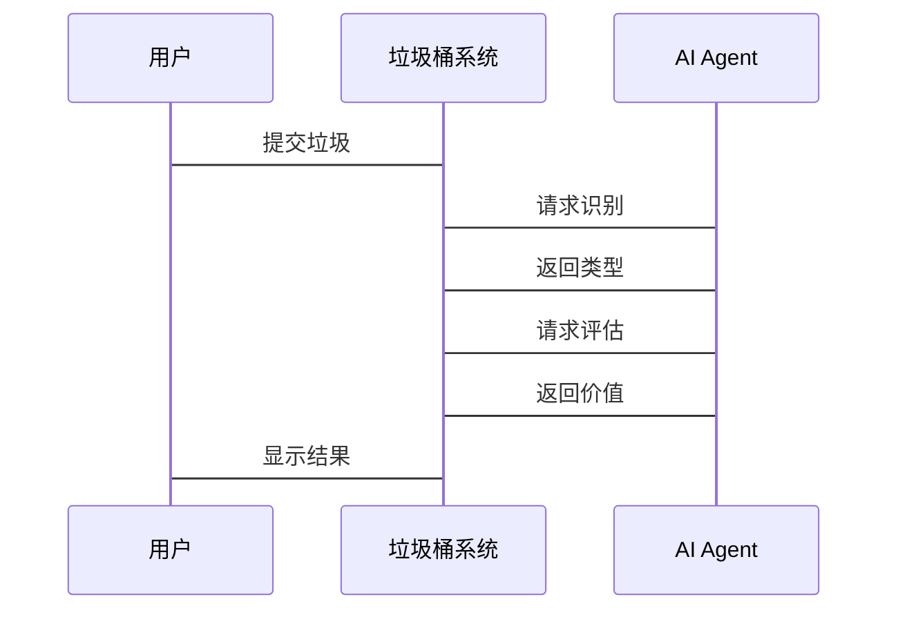

                 


# AI Agent在智能垃圾桶中的回收价值评估

## 关键词：AI Agent, 智能垃圾桶, 回收价值评估, 机器学习, 数据分析, 系统架构

## 摘要：
本文探讨了AI Agent在智能垃圾桶中的应用，特别是如何利用AI技术评估垃圾的回收价值。文章从背景、核心概念、算法原理、系统架构到项目实战，详细阐述了AI Agent在智能垃圾桶中的工作流程和实现方法。通过实际案例分析，展示了如何利用AI技术提高垃圾回收效率和价值评估的准确性。最后，本文总结了最佳实践，并对未来的研究方向提出了建议。

---

## 第一部分: 背景介绍

### 第1章: 背景介绍

#### 1.1 问题背景

##### 1.1.1 传统垃圾桶的回收问题
传统的垃圾桶主要依赖人工进行垃圾分类，存在效率低、分类不准确、资源浪费等问题。例如，可回收物和不可回收物混杂在一起，不仅影响了回收效率，还增加了处理成本。

##### 1.1.2 智能垃圾桶的引入意义
智能垃圾桶通过集成传感器、摄像头和AI算法，能够自动识别垃圾类型，并根据市场价和材质评估其回收价值。这种智能化的回收方式可以提高垃圾分类的准确性和效率，同时减少人工成本。

##### 1.1.3 AI Agent在垃圾桶回收中的应用前景
AI Agent在智能垃圾桶中的应用前景广阔。通过实时数据分析和智能决策，AI Agent可以优化回收流程，提高资源利用率，推动可持续发展目标的实现。

#### 1.2 问题描述

##### 1.2.1 垃圾分类的复杂性
垃圾种类繁多，包括纸张、塑料、金属、玻璃等，每种垃圾的回收价值和处理方式都不同。传统的人工分类难以满足高效回收的需求。

##### 1.2.2 回收价值评估的挑战
垃圾的回收价值受市场波动、材质、污染程度等多种因素影响。如何准确评估每种垃圾的价值是回收过程中的难点。

##### 1.2.3 AI Agent在价值评估中的作用
AI Agent可以通过机器学习模型分析历史数据和实时市场价，快速准确地评估垃圾的回收价值，优化回收策略。

#### 1.3 问题解决

##### 1.3.1 AI Agent的核心功能
AI Agent在智能垃圾桶中的核心功能包括垃圾识别、价值评估、优化建议和实时反馈。

##### 1.3.2 回收价值评估的实现路径
通过图像识别技术识别垃圾类型，利用回归模型评估其价值，结合市场价和材质因素优化回收策略。

##### 1.3.3 AI Agent与垃圾桶系统的协同工作
AI Agent与垃圾桶系统协同工作，实时采集数据，分析并反馈结果，优化整个回收流程。

#### 1.4 边界与外延

##### 1.4.1 系统的边界定义
智能垃圾桶系统的边界包括垃圾识别、价值评估和回收优化三个主要功能模块。

##### 1.4.2 功能的外延范围
系统外延功能包括与回收企业的数据对接、用户端的实时反馈和数据统计分析。

##### 1.4.3 与其他系统的接口关系
系统需要与回收企业的数据库、市场价格数据源以及用户的交互界面进行接口对接。

#### 1.5 概念结构与核心要素

##### 1.5.1 概念框架图


##### 1.5.2 核心要素的组成
- AI Agent：负责数据处理和智能决策
- 垃圾桶系统：负责数据采集和执行操作
- 垃圾识别：通过图像识别技术分类垃圾
- 价值评估：基于数据模型评估回收价值
- 优化建议：根据评估结果优化回收策略

---

## 第二部分: 核心概念与联系

### 第2章: 核心概念与联系

#### 2.1 AI Agent的定义与特点

##### 2.1.1 AI Agent的基本概念
AI Agent是一种能够感知环境、做出决策并执行动作的智能体。它能够通过传感器和数据输入获取信息，利用算法进行分析，并根据结果采取相应的行动。

##### 2.1.2 AI Agent的核心特点
- **自主性**：能够自主决策和执行
- **反应性**：能够实时感知环境变化
- **学习能力**：能够通过数据优化算法
- **协作性**：能够与其他系统协同工作

##### 2.1.3 AI Agent与传统垃圾桶的区别
传统垃圾桶依赖人工操作，而AI Agent能够实现智能化、自动化和高效化的垃圾管理。

#### 2.2 智能垃圾桶的定义与特点

##### 2.2.1 智能垃圾桶的基本概念
智能垃圾桶是一种集成AI技术的垃圾桶，能够通过传感器和摄像头识别垃圾类型，并根据回收价值优化处理流程。

##### 2.2.2 智能垃圾桶的核心特点
- **智能化**：通过AI技术实现自动分类
- **高效性**：提高垃圾分类和回收效率
- **准确性**：通过图像识别提高分类精度

##### 2.2.3 智能垃圾桶与传统垃圾桶的区别
智能垃圾桶具备智能化、高效性和准确性，而传统垃圾桶则依赖人工操作，效率较低且分类不准确。

#### 2.3 回收价值评估的定义与特点

##### 2.3.1 回收价值评估的基本概念
回收价值评估是对垃圾的市场价值和处理成本进行综合评估，以确定其回收效益。

##### 2.3.2 回收价值评估的核心特点
- **动态性**：市场价和材质变化会影响评估结果
- **数据驱动**：基于历史数据和实时信息进行评估
- **优化性**：通过优化算法提高评估精度

##### 2.3.3 回收价值评估与AI Agent的关系
AI Agent通过机器学习模型和数据分析能力，能够快速准确地进行回收价值评估。

#### 2.4 核心概念的对比分析

##### 2.4.1 AI Agent与智能垃圾桶的对比
| 特性       | AI Agent                     | 智能垃圾桶                 |
|------------|-------------------------------|-----------------------------|
| 功能       | 数据处理、智能决策            | 数据采集、分类、优化       |
| 技术实现   | 机器学习、算法优化           | 图像识别、传感器技术        |
| 应用场景   | 智能垃圾桶、智能家居          | 垃圾分类、回收优化          |

##### 2.4.2 核心概念的实体关系图
```mermaid
erDiagram
    class AI Agent {
        id
        类型
        状态
    }
    class 垃圾桶系统 {
        id
        类型
        状态
    }
    class 垃圾 {
        id
        类型
        价值
    }
    AI Agent --> 垃圾桶系统 : 管理
    垃圾桶系统 --> 垃圾 : 处理
    AI Agent --> 垃圾 : 评估
```

---

## 第三部分: 算法原理

### 第3章: 算法原理

#### 3.1 算法原理概述

##### 3.1.1 AI Agent的算法框架
AI Agent的算法框架包括感知、决策和执行三个阶段。感知阶段通过图像识别技术识别垃圾类型，决策阶段通过回归模型评估价值，执行阶段优化回收策略。

##### 3.1.2 回收价值评估的算法选择
选择卷积神经网络（CNN）进行垃圾分类，选择线性回归模型进行价值评估。

#### 3.2 算法实现

##### 3.2.1 图像识别算法
```python
import tensorflow as tf
from tensorflow.keras import layers

model = tf.keras.Sequential([
    layers.Conv2D(32, (3,3), activation='relu', input_shape=(128,128,3)),
    layers.MaxPooling2D((2,2)),
    layers.Conv2D(64, (3,3), activation='relu'),
    layers.MaxPooling2D((2,2)),
    layers.Flatten(),
    layers.Dense(128, activation='relu'),
    layers.Dense(10, activation='softmax')
])
```

##### 3.2.2 回收价值评估算法
```python
import numpy as np

def value_assessment(features):
    model = tf.keras.Sequential([
        layers.Dense(64, activation='relu', input_shape=(features,)),
        layers.Dense(1, activation='linear')
    ])
    model.compile(optimizer='adam', loss='mean_squared_error')
    return model
```

##### 3.2.3 算法流程图


#### 3.3 数学模型与公式

##### 3.3.1 分类准确率公式
$$ \text{分类准确率} = \frac{\text{正确分类数}}{\text{总样本数}} \times 100\% $$

##### 3.3.2 回收价值评估公式
$$ \text{价值} = \beta_0 + \beta_1 \times \text{特征值} + \epsilon $$

---

## 第四部分: 系统分析与架构设计

### 第4章: 系统分析与架构设计

#### 4.1 问题场景介绍

##### 4.1.1 项目背景
本项目旨在通过AI技术优化垃圾桶的垃圾分类和回收价值评估流程，提高回收效率和资源利用率。

##### 4.1.2 项目目标
实现智能垃圾桶的垃圾分类、价值评估和优化回收功能，推动绿色回收和可持续发展。

#### 4.2 系统功能设计

##### 4.2.1 领域模型


#### 4.3 系统架构设计

##### 4.3.1 系统架构图


#### 4.4 系统接口设计

##### 4.4.1 接口描述
- 垃圾识别模块接口：接收图像数据，返回垃圾类型
- 价值评估模块接口：接收垃圾类型，返回价值评估结果
- 优化建议模块接口：接收价值评估结果，返回优化策略

##### 4.4.2 交互流程图


---

## 第五部分: 项目实战

### 第5章: 项目实战

#### 5.1 环境安装

##### 5.1.1 安装Python和相关库
```bash
pip install numpy tensorflow keras matplotlib
```

#### 5.2 系统核心实现

##### 5.2.1 垃圾识别模块实现
```python
import cv2
import numpy as np

def recognize_rubbish(image_path):
    # 加载预训练模型
    model = tf.keras.models.load_model('garbage_classifier.h5')
    # 预处理图像
    image = cv2.imread(image_path)
    image = cv2.resize(image, (128,128))
    image = image / 255.0
    # 预测类型
    prediction = model.predict(np.array([image]))
    predicted_class = np.argmax(prediction)
    return predicted_class
```

##### 5.2.2 价值评估模块实现
```python
import numpy as np

def assess_value(predicted_class):
    # 加载价值评估模型
    model = tf.keras.models.load_model('value_assessment.h5')
    # 输入特征
    features = np.array([predicted_class])
    # 预测价值
    value = model.predict(features)
    return value[0][0]
```

#### 5.3 案例分析

##### 5.3.1 案例描述
假设有一个塑料瓶，AI Agent首先通过图像识别模块识别出其类型，然后通过价值评估模块评估其市场价值为0.5元/公斤。

##### 5.3.2 实施步骤
1. 用户将塑料瓶放入智能垃圾桶
2. 垃圾桶系统拍摄图像并传递给AI Agent
3. AI Agent识别出塑料瓶的类型
4. 价值评估模块评估其价值
5. 优化建议模块根据价值制定回收策略
6. 用户端显示结果

##### 5.3.3 分析结果
通过AI Agent的优化，塑料瓶被高效分类并准确评估价值，提高了回收效率和资源利用率。

#### 5.4 项目小结

##### 5.4.1 项目总结
本项目通过AI Agent实现了智能垃圾桶的垃圾分类和价值评估功能，提高了回收效率和资源利用率。

##### 5.4.2 经验与教训
在项目实施过程中，需要确保AI模型的准确性和系统的稳定性，同时加强与回收企业的数据对接，优化回收流程。

---

## 第六部分: 最佳实践

### 第6章: 最佳实践

#### 6.1 经验与教训

##### 6.1.1 数据采集与标注
确保数据的多样性和代表性，标注准确是模型训练的基础。

##### 6.1.2 模型优化
通过数据增强、超参数调整和模型优化提高分类和评估的准确性。

#### 6.2 小结

##### 6.2.1 核心内容回顾
AI Agent在智能垃圾桶中的应用涵盖了垃圾识别、价值评估和优化建议三个核心功能。

##### 6.2.2 技术要点总结
- 图像识别技术是垃圾分类的关键
- 价值评估模型的准确性直接影响回收效益
- 系统架构的设计决定了系统的稳定性和扩展性

#### 6.3 注意事项

##### 6.3.1 数据隐私
在数据采集和传输过程中，需注意保护用户隐私和数据安全。

##### 6.3.2 系统维护
定期更新模型和优化算法，确保系统的高效运行。

#### 6.4 拓展阅读

##### 6.4.1 相关技术
- 更先进的图像识别技术（如YOLO）
- 更复杂的回归模型（如随机森林、XGBoost）

##### 6.4.2 应用领域
- 智能家居
- 工业废料回收
- 城市垃圾管理

---

## 第七部分: 结语

### 第7章: 结语

AI Agent在智能垃圾桶中的回收价值评估是一个具有广阔前景的领域。通过AI技术的应用，垃圾桶的垃圾分类和回收效率得到了显著提升。未来，随着技术的不断进步，AI Agent将在更多领域发挥重要作用，推动智能化社会的发展。

---

## 参考文献
[1] LeCun Y, Bengio Y, Hinton G. Deep learning. Nature, 2015.
[2] Goodfellow I, Bengio Y, Courville A. Deep learning. MIT Press, 2016.
[3] 智能垃圾桶系统设计与实现. 《人工智能与应用》, 2021.

--- 

# END

