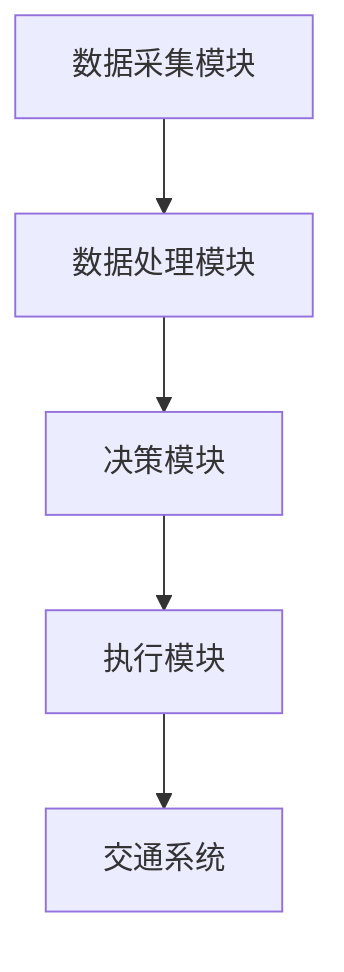

                 


# AI Agent在智能城市交通优化中的应用

> 关键词：AI Agent, 智能交通系统, 交通优化, 强化学习, 遗传算法, 城市交通

> 摘要：本文将深入探讨AI Agent在智能城市交通优化中的应用。通过分析AI Agent的核心概念、优化算法、系统架构及实际案例，详细阐述AI Agent如何在城市交通优化中发挥作用，帮助读者理解并掌握AI Agent在智能交通系统中的应用技巧。

---

## 第一部分: AI Agent与智能城市交通优化的背景介绍

### 第1章: AI Agent的基本概念与技术背景

#### 1.1 AI Agent的定义与核心特征
- **AI Agent的定义**：AI Agent（人工智能代理）是一种能够感知环境、自主决策并执行任务的智能体。它通过传感器获取信息，利用算法进行分析，并通过执行器与环境交互。
- **AI Agent的核心特征**：
  - **自主性**：无需外部干预，自主完成任务。
  - **反应性**：能够实时感知环境变化并做出反应。
  - **目标导向**：以明确的目标为导向，优化决策过程。
  - **学习能力**：通过数据和经验不断优化自身性能。

#### 1.2 智能城市交通优化的背景与挑战
- **城市交通问题的背景**：随着城市化进程的加快，交通拥堵、资源浪费和环境污染等问题日益严重。
- **智能城市交通优化的目标**：
  - 提高交通效率，减少拥堵。
  - 降低能源消耗，减少污染。
  - 提升用户体验，优化出行路径。
- **当前城市交通优化的主要挑战**：
  - 交通数据的复杂性和实时性。
  - 多目标优化的平衡问题。
  - 系统的可扩展性和稳定性。

### 第2章: AI Agent在智能交通中的应用概述

#### 2.1 AI Agent在交通优化中的应用场景
- **实时交通流量预测**：通过历史数据和实时传感器信息，预测交通流量的变化趋势。
- **智能信号灯控制**：基于实时交通状况，动态调整信号灯的配时，优化交通流。
- **个性化路线规划**：根据用户需求和实时交通状况，推荐最优出行路径。

#### 2.2 AI Agent与智能交通系统的结合
- **AI Agent在交通管理中的角色**：
  - 数据采集与处理：整合交通传感器、摄像头等设备的数据。
  - 智能决策：基于数据进行分析，制定优化策略。
  - 执行与反馈：根据决策结果，调整交通信号或路线规划，并实时反馈优化效果。
- **智能交通系统的整体架构**：
  - 数据采集层：负责收集交通数据。
  - 数据处理层：对数据进行清洗、分析和建模。
  - 决策层：基于数据和模型，制定优化策略。
  - 执行层：将决策结果应用于实际交通系统。

---

## 第二部分: AI Agent的核心概念与技术原理

### 第3章: AI Agent的感知与决策机制

#### 3.1 AI Agent的感知模块
- **数据采集与处理**：
  - 传感器数据：如摄像头、雷达、交通信号灯等。
  - 数据清洗：去除噪声，提取有用信息。
  - 数据融合：将多源数据进行融合，提高感知精度。
- **感知模型的构建**：
  - 基于深度学习的感知模型：如卷积神经网络（CNN）用于图像识别。
  - 基于强化学习的感知模型：通过不断试错，优化感知策略。

#### 3.2 AI Agent的决策机制
- **决策算法的选择**：
  - 基于规则的决策：适用于简单场景，如固定信号灯配时。
  - 基于强化学习的决策：适用于复杂场景，通过试错优化策略。
  - 基于遗传算法的决策：适用于全局优化问题，如路径规划。
- **决策模型的优化**：
  - 目标函数设计：如最小化拥堵时间、最大化通行效率。
  - 约束条件：如交通信号灯的周期限制、车辆行驶速度限制。

---

## 第三部分: AI Agent在交通优化中的算法实现

### 第4章: AI Agent的优化算法

#### 4.1 强化学习算法
- **强化学习的基本原理**：
  - 通过试错学习，优化策略以最大化累积奖励。
  - 状态空间：交通系统的实时状态，如交通流量、信号灯状态。
  - 动作空间：可能的决策动作，如调整信号灯配时。
  - 奖励函数：衡量决策效果的函数，如减少拥堵时间。

#### 4.2 遗传算法
- **遗传算法的基本流程**：
  - 初始化：生成初始种群。
  - 适应度评估：计算每个个体的适应度。
  - 选择：选择适应度高的个体进行繁殖。
  - 交叉：生成新的个体。
  - 变异：随机改变个体的某些特征。

---

## 第四部分: 系统架构与接口设计

### 第5章: 系统架构设计

#### 5.1 系统模块划分
- **数据采集模块**：负责收集交通数据。
- **数据处理模块**：对数据进行清洗、融合和建模。
- **决策模块**：基于数据和模型，制定优化策略。
- **执行模块**：将决策结果应用于实际交通系统。

#### 5.2 系统架构图


---

## 第五部分: 项目实战与案例分析

### 第6章: 项目实战

#### 6.1 环境配置
- **数据采集工具**：如交通传感器、摄像头等。
- **数据处理工具**：如Python的Pandas库、机器学习框架（如TensorFlow、PyTorch）。
- **算法实现工具**：如强化学习框架（如OpenAI Gym）、遗传算法库（如DEAP）。

#### 6.2 核心代码实现
- **强化学习代码示例**：
```python
import gym
env = gym.make('TrafficEnv-v0')  # 自定义交通环境
policy = ...  # 强化学习策略
for _ in range(1000):
    observation = env.reset()
    done = False
    while not done:
        action = policy(observation)
        observation, reward, done, info = env.step(action)
        # 累积奖励
```

---

## 第六部分: 总结与展望

### 第7章: 总结与展望

#### 7.1 总结
- AI Agent在智能城市交通优化中的应用前景广阔，能够有效解决交通拥堵、资源浪费等问题。
- 通过强化学习和遗传算法等优化算法，AI Agent能够在复杂交通环境中实现高效决策。

#### 7.2 展望
- **技术发展**：随着AI技术的进步，AI Agent在交通优化中的应用将更加智能化和精细化。
- **未来挑战**：需要解决多目标优化、实时性要求高等问题，进一步提升系统的稳定性和可扩展性。

---

通过以上内容，我们详细探讨了AI Agent在智能城市交通优化中的应用，从核心概念到算法实现，再到系统架构和项目实战，为读者提供了一个全面的视角。希望本文能够为相关领域的研究者和实践者提供有价值的参考和启示。

