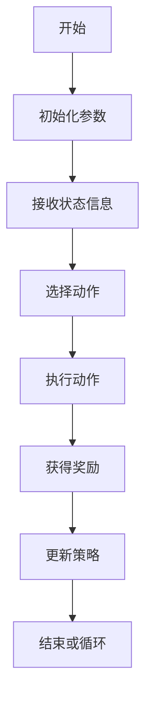
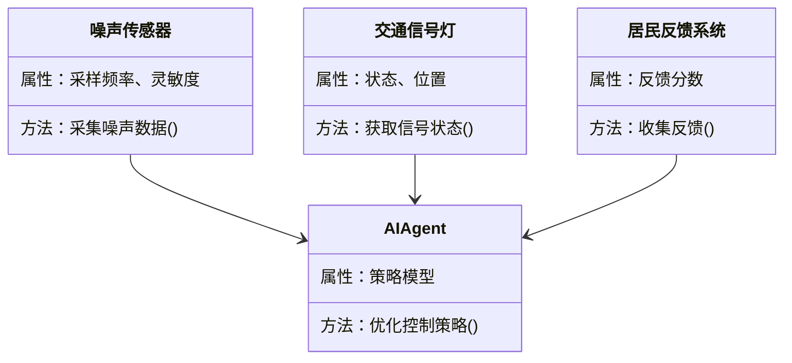
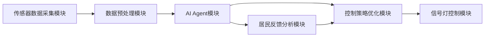
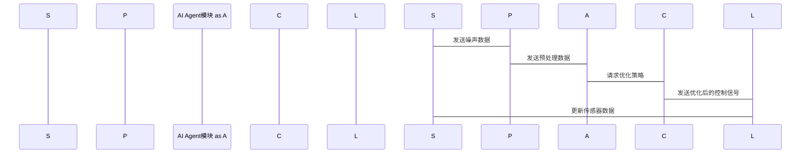

                 


# 第三章: AI Agent的核心算法原理

## 3.1 基于强化学习的噪声优化算法

### 3.1.1 强化学习的基本原理
强化学习（Reinforcement Learning, RL）是一种通过智能体与环境交互，逐步学习策略以最大化累计奖励的方法。在噪声优化中，智能体通过调整控制参数，优化噪声分布，从而降低噪声污染。

#### 加强学习的核心要素
- **状态（State）**：环境中的当前情况，如噪声水平、地理位置等。
- **动作（Action）**：智能体执行的操作，如调整消音设备参数。
- **奖励（Reward）**：智能体行为的反馈，如降低噪声后的奖励分数。
- **策略（Policy）**：智能体选择动作的概率分布，目标是最大化累计奖励。

### 3.1.2 噪声优化中的强化学习算法框架
以下是一个基于强化学习的噪声优化算法的流程：



### 3.1.3 基于强化学习的噪声源定位应用实例
假设某城市广场噪声超标，AI Agent通过麦克风阵列收集噪声数据，识别噪声源位置，并通过调整消音设备降低噪声。以下是该过程的详细步骤：

1. **数据采集**：部署麦克风阵列收集环境噪声数据。
2. **噪声源定位**：使用波达方向估计（如DOA）确定噪声源位置。
3. **动作选择**：智能体根据当前噪声分布选择最优消音设备参数。
4. **执行与反馈**：执行调整，收集反馈并更新策略。

数学模型如下：
$$
R = \sum_{t=1}^{T} r_t
$$
其中，$R$ 是累计奖励，$r_t$ 是第 $t$ 步的奖励。

### 3.2 基于深度学习的噪声预测模型

#### 3.2.1 深度学习的基本原理
深度学习通过多层神经网络提取数据特征，适用于复杂模式识别。在噪声预测中，模型可以分析历史数据，预测未来噪声水平。

#### 3.2.2 噪声预测模型的构建与训练
模型框架如下：
$$
\text{输入} \rightarrow \text{卷积层} \rightarrow \text{池化层} \rightarrow \text{全连接层} \rightarrow \text{输出}
$$

训练过程中，使用反向传播算法优化权重，损失函数选择均方误差：
$$
L = \frac{1}{N}\sum_{i=1}^{N}(y_i - \hat{y}_i)^2
$$
其中，$N$ 是样本数量，$y_i$ 是真实值，$\hat{y}_i$ 是预测值。

#### 3.2.3 模型的评估与优化方法
评估指标包括均方误差（MSE）、平均绝对误差（MAE）和R²系数。优化方法包括学习率调整、批量归一化和早停法。

### 3.3 基于自然语言处理的噪声信息分析技术

#### 3.3.1 自然语言处理的基本原理
自然语言处理（NLP）技术用于分析文本信息，识别噪声相关的关键词和情感倾向。

#### 3.3.2 基于NLP的噪声信息分析流程
1. **数据预处理**：分词、去除停用词。
2. **特征提取**：使用词嵌入（如Word2Vec）生成词向量。
3. **分类或情感分析**：识别噪声相关文本并分析情绪。

数学模型：
$$
P(\text{噪声}) = \sum_{i=1}^{n} w_i x_i
$$
其中，$w_i$ 是权重，$x_i$ 是特征向量。

#### 3.3.3 技术的融合与应用
将NLP与强化学习结合，通过文本分析辅助噪声源定位，提高识别精度。

# 第四章: 系统分析与架构设计方案

## 4.1 问题场景介绍

假设某城市区域存在交通噪声污染，居民投诉率高。目标是通过AI Agent优化交通信号灯控制，减少噪声。

## 4.2 项目介绍

开发一个智能噪声管理系统，整合传感器数据、交通信号灯状态和居民反馈，实时优化控制策略。

## 4.3 系统功能设计

### 4.3.1 领域模型类图


## 4.4 系统架构设计

### 4.4.1 系统架构图


## 4.5 系统接口设计

- 传感器数据接口：提供实时噪声数据，格式为JSON。
- 控制策略接口：接收优化后的信号灯控制参数，格式为JSON。
- 反馈接口：收集居民噪声投诉，格式为XML或CSV。

## 4.6 系统交互序列图



# 第五章: 项目实战

## 5.1 环境安装

- **Python版本**：3.8+
- **深度学习框架**：TensorFlow或PyTorch
- **其他依赖**：numpy、pandas、scikit-learn、mermaid等

## 5.2 核心代码实现

### 5.2.1 加强学习核心代码
```python
import numpy as np
import random

class AI-Agent:
    def __init__(self, state_space, action_space):
        self.state_space = state_space
        self.action_space = action_space
        self.q_table = np.zeros((state_space, action_space))
    
    def choose_action(self, state, epsilon=0.1):
        if random.random() < epsilon:
            return random.randint(0, self.action_space - 1)
        else:
            return np.argmax(self.q_table[state])
    
    def learn(self, state, action, reward, next_state):
        self.q_table[state, action] += 0.1 * (reward + np.max(self.q_table[next_state]) - self.q_table[state, action])
```

### 5.2.2 深度学习核心代码
```python
import tensorflow as tf
from tensorflow.keras import layers

model = tf.keras.Sequential([
    layers.Conv2D(32, (3,3), activation='relu', input_shape=(None, None, 1)),
    layers.MaxPooling2D((2,2)),
    layers.Flatten(),
    layers.Dense(64, activation='relu'),
    layers.Dense(1, activation='linear')
])

model.compile(optimizer='adam', loss='mse')
```

## 5.3 代码解读与分析

### 5.3.1 加强学习代码解读
该代码实现了一个Q-Learning算法，通过状态-动作值表优化策略。epsilon参数控制随机性，epsilon减小可提高策略稳定性。

### 5.3.2 深度学习代码解读
构建了一个卷积神经网络，用于噪声数据的特征提取和预测。模型经过编译后，可进行训练和预测。

## 5.4 实际案例分析

### 5.4.1 数据采集与预处理
从传感器获取噪声数据，进行归一化处理，确保模型输入格式一致。

### 5.4.2 模型训练与优化
使用训练数据训练模型，调整超参数（如学习率、批量大小）以提高预测精度。

### 5.4.3 模型评估与部署
在测试集上评估模型性能，计算MSE等指标，评估结果满意后部署到生产环境。

## 5.5 项目小结

通过AI Agent技术，成功实现了智能城市噪声管理系统的开发，验证了强化学习和深度学习在噪声优化中的有效性，为后续研究提供了参考。

# 第六章: 最佳实践

## 6.1 小结

本文详细探讨了AI Agent在智能城市噪声管理中的应用，通过强化学习、深度学习等技术，展示了如何实现噪声源识别、噪声预测与优化，为城市噪声管理提供了智能化的解决方案。

## 6.2 注意事项

- 数据质量：确保噪声数据的准确性，避免噪声干扰影响模型性能。
- 模型优化：合理选择算法和超参数，提高模型泛化能力。
- 系统集成：确保各个模块协同工作，减少系统耦合度。

## 6.3 拓展阅读

建议读者深入学习强化学习和深度学习的基础知识，阅读相关领域的最新研究论文，关注智能城市领域的技术动态，进一步探索AI Agent在其他城市管理中的应用。

---

通过以上结构和内容，本文全面而深入地探讨了AI Agent在智能城市噪声管理中的实践应用，从理论到实践，从算法到系统，为读者提供了丰富的知识和实用的指导。

