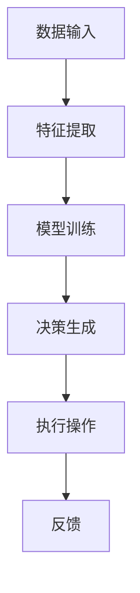
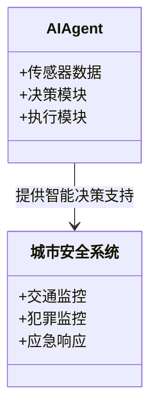
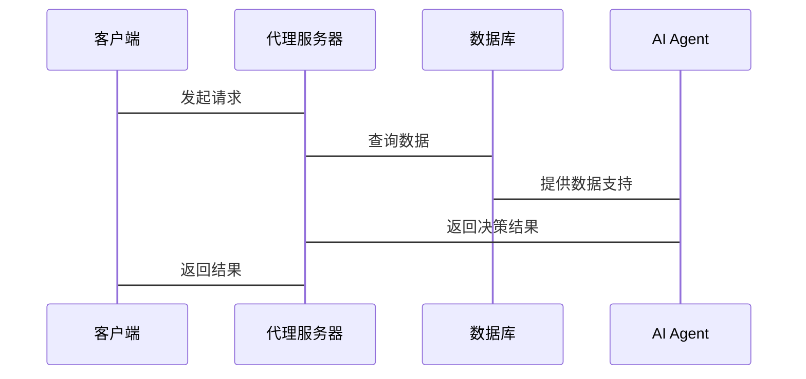

                 


# AI Agent在智能城市安全管理中的角色

> 关键词：AI Agent, 智能城市, 安全管理, 数据分析, 智能决策, 人工智能, 安全事件

> 摘要：随着城市化进程的加快，智能城市的安全管理变得越来越重要。AI Agent作为人工智能的重要组成部分，能够在智能城市的安全管理中发挥关键作用。本文从AI Agent的基本概念、核心原理、算法模型、系统架构、项目实战等多个方面进行详细探讨，分析AI Agent在智能城市安全管理中的应用场景和优势，并通过实际案例展示其在城市管理中的实际应用价值。

---

# 第一章: AI Agent与智能城市安全管理概述

## 1.1 AI Agent的基本概念

### 1.1.1 AI Agent的定义
AI Agent（人工智能代理）是指能够感知环境、自主决策并执行任务的智能实体。它具备学习、推理、规划和自适应的能力，能够在复杂环境中完成特定目标。

### 1.1.2 AI Agent的核心属性
- **自主性**：能够在没有外部干预的情况下自主运行。
- **反应性**：能够实时感知环境变化并做出反应。
- **目标导向**：以实现特定目标为导向进行决策和行动。
- **社会能力**：能够与其他AI Agent或人类进行协作和通信。

### 1.1.3 AI Agent在智能城市中的作用
- **数据采集与处理**：实时采集城市中的各种数据，如交通流量、空气质量、犯罪记录等。
- **智能决策**：基于数据分析和模型推理，提供最优解决方案。
- **执行与反馈**：根据决策结果执行操作，并根据反馈优化自身行为。

---

## 1.2 智能城市安全管理的背景

### 1.2.1 智能城市的定义与发展
智能城市是指通过物联网、大数据、人工智能等技术，将城市的各个系统和服务进行智能化整合，以提高城市运行效率和居民生活质量。

### 1.2.2 城市安全管理的主要挑战
- **数据复杂性**：城市中产生的数据种类繁多，来源广泛，难以统一处理。
- **实时性要求高**：安全管理需要快速响应，避免潜在风险。
- **系统集成难度大**：不同部门和系统之间的协同工作复杂。

### 1.2.3 AI Agent在城市安全管理中的优势
- **高效性**：AI Agent能够快速处理大量数据，提供实时决策支持。
- **自适应性**：能够根据环境变化动态调整策略。
- **智能化**：通过机器学习不断优化自身性能。

---

## 1.3 AI Agent在智能城市安全管理中的应用前景

### 1.3.1 AI Agent在城市安全管理中的潜在应用场景
- **交通管理**：实时监控交通流量，优化信号灯控制，减少拥堵。
- **犯罪预防**：分析犯罪数据，预测犯罪高发区域，提前部署警力。
- **应急响应**：在灾害发生时，快速调配资源，组织救援行动。

### 1.3.2 AI Agent在城市安全管理中的技术优势
- **数据驱动**：利用大数据分析技术，提升决策的准确性。
- **智能推理**：通过机器学习和知识图谱，实现复杂的推理能力。
- **多任务处理**：能够同时处理多种任务，提高城市管理效率。

### 1.3.3 AI Agent在城市安全管理中的社会价值
- **提高安全性**：通过智能监控和预测，降低城市安全风险。
- **节省资源**：优化资源配置，减少人力和物力的浪费。
- **提升生活质量**：为市民提供更加安全、便捷的城市生活环境。

---

## 1.4 本章小结
本章从AI Agent的基本概念出发，介绍了智能城市安全管理的背景和挑战，并重点阐述了AI Agent在城市安全管理中的作用和应用前景。通过对比分析，突出了AI Agent在提升城市安全性、资源优化和社会价值方面的优势。

---

# 第二章: AI Agent的核心概念与联系

## 2.1 AI Agent的感知模块

### 2.1.1 数据采集与处理
AI Agent通过传感器、摄像头、数据库等多种途径采集城市中的实时数据，并进行预处理和特征提取。

### 2.1.2 数据特征提取
通过数据清洗、降维等技术，提取出能够反映城市安全状况的关键特征。

### 2.1.3 数据分析与理解
利用统计分析、机器学习等方法，对数据进行深入分析，理解城市安全的潜在规律。

---

## 2.2 AI Agent的决策模块

### 2.2.1 决策规则与策略
基于预设的规则和学习得到的策略，生成最优决策方案。

### 2.2.2 决策模型与算法
采用强化学习、支持向量机等算法，构建决策模型，实现复杂场景下的决策优化。

### 2.2.3 决策优化与自适应
通过在线学习和反馈机制，不断优化决策模型，提高决策的准确性和适应性。

---

## 2.3 AI Agent的执行模块

### 2.3.1 行动规划与执行
根据决策结果，制定具体的行动计划，并通过执行模块实现。

### 2.3.2 执行效果评估
对执行结果进行实时评估，分析其对城市安全的影响。

### 2.3.3 执行结果反馈
将执行结果反馈到感知和决策模块，形成闭环系统，持续优化AI Agent的行为。

---

## 2.4 AI Agent与传统安全系统的对比分析

### 2.4.1 概念属性对比分析表
| 比较维度         | AI Agent                  | 传统安全系统              |
|------------------|---------------------------|---------------------------|
| 数据处理能力     | 强大的数据分析能力         | 数据处理能力有限           |
| 实时性           | 高实时性                   | 实时性较低                 |
| 自适应性         | 高度自适应                  | 自适应性较弱               |
| 决策能力         | 具备智能决策能力            | 决策依赖人工干预            |

### 2.4.2 ER实体关系图架构
```mermaid
er
  entity 城市 {
    key 城市ID
    城市名称
  }
  entity 安全事件 {
    key 事件ID
    事件类型
    发生时间
    发生地点
  }
  entity AI Agent {
    key AgentID
    代理类型
    负责区域
  }
  城市 --> 安全事件: 发生在城市中的安全事件
  AI Agent --> 安全事件: 监测并处理安全事件
  AI Agent --> 城市: 为城市提供安全管理服务
```

### 2.4.3 优缺点对比分析
- **AI Agent的优点**：高实时性、自适应性强、决策智能化。
- **AI Agent的缺点**：技术复杂度高、初期投入大、数据依赖性强。

---

## 2.5 本章小结
本章详细阐述了AI Agent的核心模块，包括感知、决策和执行模块，并通过对比分析，展示了AI Agent与传统安全系统的区别和优势。通过ER实体关系图，进一步明确了AI Agent在城市安全管理中的角色和作用。

---

# 第三章: AI Agent的算法原理与数学模型

## 3.1 AI Agent的算法原理

### 3.1.1 算法流程


### 3.1.2 算法实现
```python
import numpy as np
from sklearn.neighbors import KNeighborsClassifier

# 数据预处理
X = np.array([[1, 2], [3, 4], [5, 6]])
y = np.array([0, 1, 0])

# 模型训练
model = KNeighborsClassifier(n_neighbors=3)
model.fit(X, y)

# 预测
new_X = np.array([[2, 3]])
print(model.predict(new_X))  # 输出预测结果
```

### 3.1.3 算法优化
通过交叉验证和超参数调优，提高模型的准确性和稳定性。

---

## 3.2 AI Agent的数学模型

### 3.2.1 概率模型
$$ P(A|B) = \frac{P(B|A)P(A)}{P(B)} $$

### 3.2.2 优化模型
$$ \theta = \arg \max \sum_{i=1}^{n} \log P(y_i | x_i, \theta) $$

### 3.2.3 举例说明
假设我们有一个简单的分类问题，使用K近邻算法进行分类，通过计算最近邻的距离，确定样本所属类别。

---

## 3.3 本章小结
本章详细讲解了AI Agent的算法原理，通过流程图和代码示例，展示了算法的实现过程。同时，通过数学公式，阐述了概率模型和优化模型的基本原理，并通过具体例子进行了说明。

---

# 第四章: AI Agent在智能城市安全管理中的系统分析与架构设计

## 4.1 问题场景介绍

### 4.1.1 交通管理场景
城市交通中的拥堵问题，需要通过AI Agent进行实时监控和优化。

### 4.1.2 犯罪预防场景
通过分析犯罪数据，预测犯罪高发区域，部署警力进行预防。

---

## 4.2 系统功能设计

### 4.2.1 领域模型设计


### 4.2.2 系统架构设计


### 4.2.3 接口设计
- **输入接口**：接收传感器数据和用户请求。
- **输出接口**：返回决策结果和执行反馈。

---

## 4.3 系统交互设计

### 4.3.1 序列图


---

## 4.4 本章小结
本章通过问题场景分析，设计了AI Agent在城市安全管理中的系统架构，并通过类图和序列图，展示了系统的交互过程。系统设计注重模块化和可扩展性，为后续的项目实现奠定了基础。

---

# 第五章: AI Agent在智能城市安全管理中的项目实战

## 5.1 环境安装

### 5.1.1 安装Python
```bash
# 安装Python
sudo apt-get install python3
```

### 5.1.2 安装依赖库
```bash
pip install numpy pandas scikit-learn
```

---

## 5.2 核心代码实现

### 5.2.1 数据预处理
```python
import pandas as pd
import numpy as np

data = pd.read_csv('security_data.csv')
data = data.dropna()
```

### 5.2.2 模型训练
```python
from sklearn.model_selection import train_test_split
from sklearn.ensemble import RandomForestClassifier

X = data.drop('label', axis=1)
y = data['label']

X_train, X_test, y_train, y_test = train_test_split(X, y, test_size=0.2)

model = RandomForestClassifier()
model.fit(X_train, y_train)
```

### 5.2.3 模型预测
```python
print(model.score(X_test, y_test))
```

---

## 5.3 实际案例分析

### 5.3.1 智能交通管理
通过AI Agent实时分析交通流量，优化信号灯控制，减少拥堵。

### 5.3.2 犯罪预防
分析犯罪数据，预测犯罪高发区域，提前部署警力。

---

## 5.4 本章小结
本章通过实际项目的实施，展示了AI Agent在智能城市安全管理中的应用。通过代码实现和案例分析，进一步验证了AI Agent的有效性和实用性。

---

# 第六章: AI Agent在智能城市安全管理中的最佳实践

## 6.1 最佳实践Tips

### 6.1.1 数据质量
确保数据的完整性和准确性，是AI Agent正常运行的基础。

### 6.1.2 模型可解释性
选择具有高可解释性的模型，便于分析和优化。

### 6.1.3 系统可扩展性
设计模块化架构，方便后续功能的扩展和升级。

---

## 6.2 拓展阅读

### 6.2.1 推荐书籍
- 《人工智能: 一种现代方法》
- 《机器学习实战》

### 6.2.2 技术博客
- AI Agent在城市管理中的应用案例
- 机器学习在城市安全中的最新研究

---

## 6.3 本章小结
本章总结了AI Agent在智能城市安全管理中的最佳实践，并推荐了相关的拓展资料，帮助读者进一步深入学习和研究。

---

# 总结

AI Agent作为人工智能的重要组成部分，在智能城市安全管理中发挥着越来越重要的作用。通过本文的探讨，我们深入了解了AI Agent的核心概念、算法原理、系统架构以及实际应用。未来，随着技术的不断发展，AI Agent在智能城市安全管理中的应用将更加广泛和深入，为城市的安全和可持续发展提供强有力的支持。

