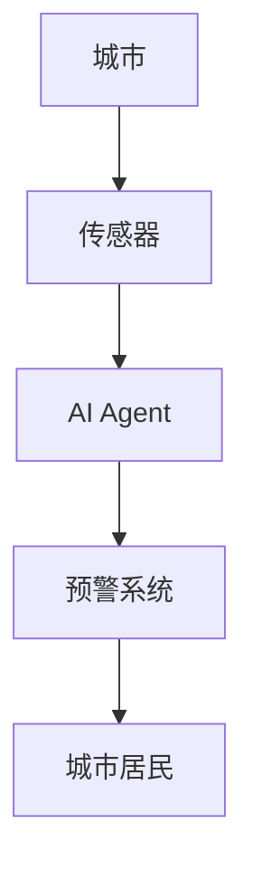
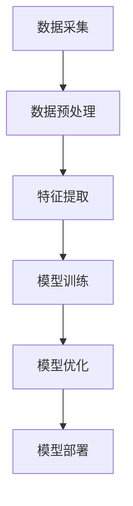
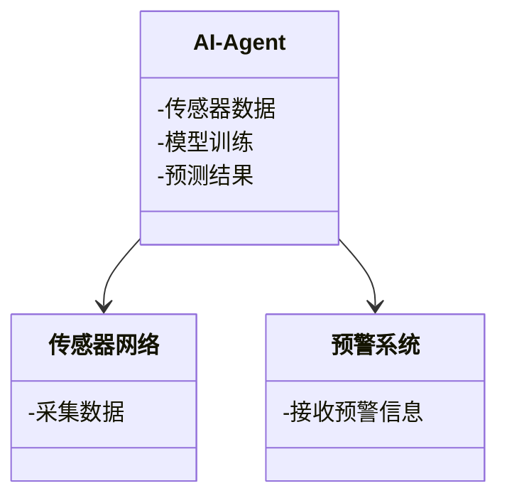
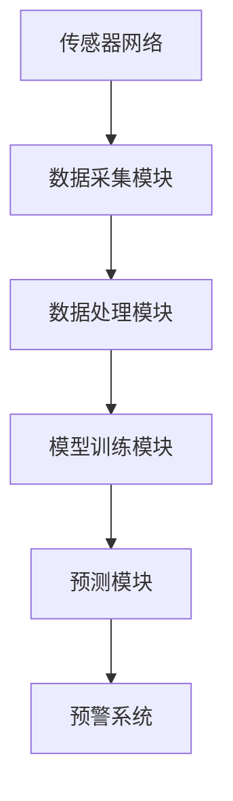

                 


# AI Agent在智能城市安全预警中的角色

**关键词**：AI Agent、智能城市、安全预警、算法原理、系统架构

**摘要**：  
随着智能城市的快速发展，安全预警系统成为保障城市运行的关键基础设施。AI Agent（人工智能代理）作为智能城市的核心技术之一，能够通过自主学习、实时感知和智能决策，显著提升城市安全预警的效率和准确性。本文将从AI Agent的基本概念出发，深入探讨其在智能城市安全预警中的角色与应用，分析其算法原理、系统架构，并结合实际案例，展示AI Agent如何通过数据驱动的方法实现城市安全的智能化管理。

---

# 第一章: AI Agent与智能城市安全预警的背景

## 1.1 AI Agent的基本概念

### 1.1.1 AI Agent的定义与特征
AI Agent（人工智能代理）是指能够感知环境、自主决策并执行任务的智能实体。它具备以下核心特征：
1. **自主性**：AI Agent能够在没有外部干预的情况下独立执行任务。
2. **反应性**：能够实时感知环境变化并做出快速响应。
3. **学习性**：通过数据学习和优化，不断提升任务执行的效率和准确性。

### 1.1.2 智能城市的概念与特点
智能城市是通过物联网、大数据、人工智能等技术，将城市中的各个系统和资源进行整合，以实现高效、可持续发展的城市形态。其特点包括：
1. **数据驱动**：依赖实时数据进行决策。
2. **智能化**：利用AI技术实现自动化管理。
3. **协同性**：各系统之间高度协同，共同服务于城市运行。

### 1.1.3 安全预警在智能城市中的重要性
安全预警是智能城市运行中的关键环节，主要涵盖交通安全、环境安全、网络安全等领域。通过AI Agent的实时监测和智能分析，可以有效预防和应对突发事件，保障城市居民的生命财产安全。

## 1.2 智能城市安全预警的核心问题

### 1.2.1 城市安全问题的复杂性
城市安全问题具有多样性、突发性和不确定性。例如，交通拥堵可能导致连锁反应，极端天气可能引发城市基础设施损毁等。这些问题需要综合多方面的数据进行分析，传统的单一监测手段已难以应对。

### 1.2.2 AI Agent在安全预警中的角色定位
AI Agent在智能城市安全预警中扮演着多重角色：
1. **数据采集与处理**：通过传感器、摄像头等设备实时采集城市运行数据。
2. **智能分析与预测**：利用机器学习算法对数据进行分析，预测潜在的安全风险。
3. **决策与执行**：根据分析结果，启动相应的预警机制或执行应对措施。

### 1.2.3 AI Agent与传统安全预警系统的区别
传统的安全预警系统依赖人工监控和固定的规则，存在反应慢、覆盖面窄等问题。而AI Agent通过自主学习和实时感知，能够实现动态调整和精准预测，显著提升了预警系统的效率和准确性。

## 1.3 本章小结
本章从AI Agent的基本概念出发，介绍了智能城市的安全预警需求，并分析了AI Agent在其中的独特优势和作用。下一章将深入探讨AI Agent的核心原理及其在智能城市中的具体应用。

---

# 第二章: AI Agent的核心概念与联系

## 2.1 AI Agent的核心原理

### 2.1.1 AI Agent的感知与决策机制
AI Agent通过传感器、摄像头等设备感知环境，并利用机器学习算法对数据进行分析，生成决策方案。例如，在交通安全管理中，AI Agent可以通过实时监测车流、人流等数据，预测潜在的拥堵风险。

### 2.1.2 AI Agent的自主性与反应性
AI Agent的自主性体现在其能够独立完成任务，而反应性则表现在其能够实时感知环境变化并做出快速响应。例如，在火灾预警系统中，AI Agent可以实时监测温度、烟雾等数据，一旦发现异常立即触发报警。

### 2.1.3 AI Agent的学习与进化能力
AI Agent通过机器学习、深度学习等技术不断优化自身的算法模型，提升预测的准确性和决策的合理性。例如，通过历史数据训练，AI Agent可以识别出某些特定模式，从而更准确地预测未来可能发生的安全事件。

## 2.2 AI Agent与智能城市安全预警的关系

### 2.2.1 AI Agent在城市安全预警中的应用场景
AI Agent广泛应用于交通、环境、能源等领域。例如，在环境监测中，AI Agent可以通过传感器实时监测空气质量，预测污染趋势。

### 2.2.2 AI Agent与其他城市系统的协同工作
AI Agent需要与城市中的其他系统（如传感器网络、数据平台）协同工作，共同完成安全预警任务。例如，AI Agent可以与交通管理系统协同，实时调整信号灯配时，缓解交通拥堵。

### 2.2.3 AI Agent的实时性与高效性要求
AI Agent需要在极短的时间内完成数据处理和决策，以应对突发事件。例如，在地震预警系统中，AI Agent需要在几秒钟内完成数据分析并触发预警机制。

## 2.3 AI Agent的核心概念对比表

| 概念       | 特征描述                                                                 |
|------------|--------------------------------------------------------------------------|
| 自主性      | AI Agent能够独立完成任务，无需外部干预                                       |
| 反应性      | AI Agent能够实时感知环境变化并做出快速响应                                   |
| 学习性      | AI Agent通过数据学习和优化，不断提升任务执行的效率和准确性                   |

## 2.4 AI Agent的实体关系图



---

# 第三章: AI Agent的算法原理与实现

## 3.1 AI Agent的算法原理

### 3.1.1 数据处理与特征提取
AI Agent通过传感器、摄像头等设备采集城市运行数据，并对数据进行预处理和特征提取。例如，交通流量数据可以通过滑动窗口技术提取出小时级别的流量变化趋势。

### 3.1.2 机器学习模型的构建与训练
AI Agent利用机器学习算法（如随机森林、支持向量机等）构建预测模型，并通过历史数据进行模型训练。例如，可以通过训练模型预测未来某一时间段内的交通拥堵概率。

### 3.1.3 模型的优化与部署
AI Agent通过不断优化算法模型（如调整超参数、引入深度学习模型）提升预测的准确性，并将优化后的模型部署到实际应用中。

## 3.2 AI Agent的实现流程图



## 3.3 AI Agent的核心代码实现

### 3.3.1 环境安装
```bash
pip install numpy scikit-learn
```

### 3.3.2 核心代码
```python
import numpy as np
from sklearn import tree

# 示例数据：交通流量数据
X = np.array([[100, 20], [150, 25], [200, 30], [250, 35]])
y = np.array([0, 1, 2, 3])

# 训练决策树模型
model = tree.DecisionTreeClassifier()
model.fit(X, y)

# 预测未来交通流量
new_data = np.array([[220, 32]])
print(model.predict(new_data))
```

### 3.3.3 算法数学公式
$$
\text{预测值} = \sum_{i=1}^{n} w_i \cdot x_i + b
$$
其中，$w_i$ 是特征 $x_i$ 的权重，$b$ 是偏置项。

---

# 第四章: AI Agent的系统分析与架构设计

## 4.1 系统分析

### 4.1.1 问题场景介绍
以交通安全管理为例，AI Agent需要实时监测交通流量、天气状况等数据，并预测潜在的拥堵风险。

### 4.1.2 项目介绍
本项目旨在设计一个基于AI Agent的智能交通安全管理系统，利用实时数据和机器学习算法实现交通拥堵的智能预警。

## 4.2 系统功能设计

### 4.2.1 领域模型


### 4.2.2 系统架构设计


### 4.2.3 接口设计
- 数据采集模块接口：提供传感器数据的采集和传输功能。
- 预警系统接口：接收AI Agent的预测结果并触发预警机制。

## 4.3 本章小结
本章通过系统分析和架构设计，展示了AI Agent在智能城市安全预警中的实现过程。下一章将通过实际案例，进一步验证AI Agent的应用效果。

---

# 第五章: AI Agent的项目实战与案例分析

## 5.1 项目实战

### 5.1.1 环境安装
```bash
pip install numpy scikit-learn matplotlib
```

### 5.1.2 核心代码实现
```python
import numpy as np
from sklearn import tree
import matplotlib.pyplot as plt

# 示例数据：空气质量指数
X = np.array([[80, 1], [70, 0], [60, 1], [50, 0]])
y = np.array([2, 1, 3, 2])

# 训练决策树模型
model = tree.DecisionTreeClassifier()
model.fit(X, y)

# 可视化决策树
tree.plot_tree(model)
plt.show()
```

### 5.1.3 实际案例分析
以空气质量预警为例，AI Agent可以通过传感器数据训练模型，预测未来24小时内的空气质量指数，并触发相应的预警机制。

## 5.2 本章小结
本章通过实际案例展示了AI Agent在智能城市安全预警中的应用效果。下一章将总结AI Agent的相关内容，并提出未来的发展方向。

---

# 第六章: 总结与展望

## 6.1 最佳实践 tips
- 在实际应用中，建议结合具体场景选择合适的AI Agent算法。
- 数据的质量和实时性对AI Agent的性能影响重大，需特别关注数据采集和处理环节。

## 6.2 小结
本文从AI Agent的基本概念出发，深入探讨了其在智能城市安全预警中的角色与应用，并通过实际案例展示了AI Agent的实现过程和应用效果。

## 6.3 注意事项
- AI Agent的部署和运行需要强大的计算能力和高效的算法优化。
- 在实际应用中，需考虑系统的鲁棒性和容错性，确保在极端情况下仍能正常运行。

## 6.4 拓展阅读
- 推荐阅读《机器学习实战》、《深度学习入门》等相关书籍，进一步了解AI Agent的实现细节。

---

**结语**：  
AI Agent作为智能城市安全预警的核心技术，正在发挥越来越重要的作用。随着人工智能技术的不断进步，AI Agent的应用场景将更加广泛，其性能和效率也将进一步提升。未来，AI Agent有望成为智能城市安全预警的标配技术，为城市居民的安全保驾护航。

