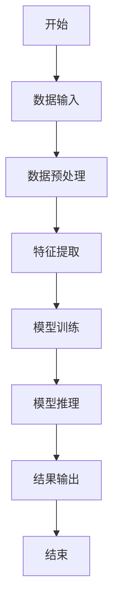
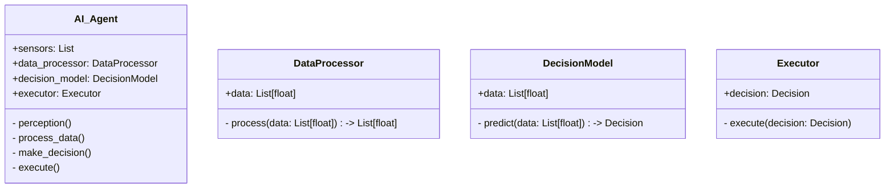
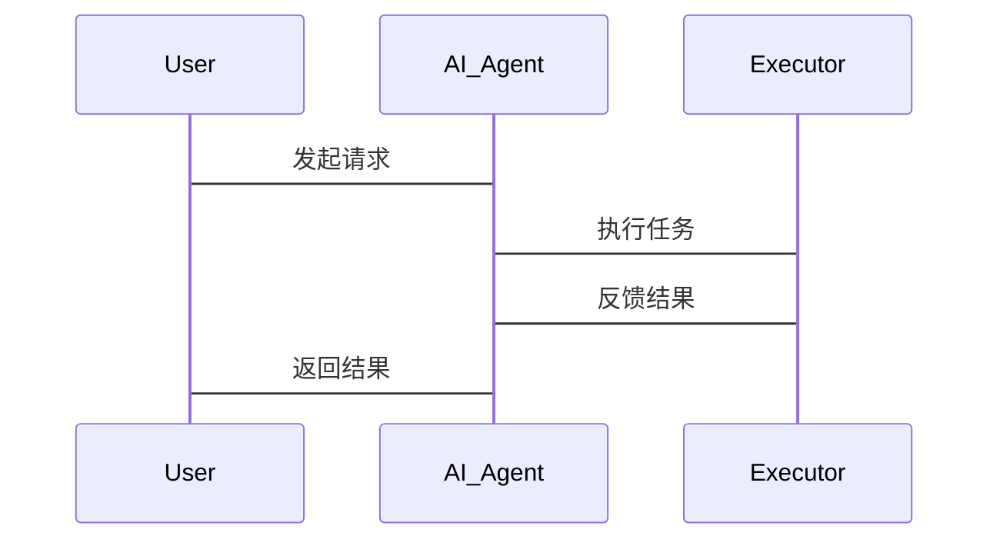

                 


# AI Agent在智能城市应急指挥中的角色

---

## 关键词：
- AI Agent
- 智能城市
- 应急指挥
- 机器学习
- 自然语言处理
- 计算机视觉

---

## 摘要：
本文探讨AI Agent在智能城市应急指挥中的核心角色与应用。通过分析AI Agent的原理、算法、系统架构以及实战案例，揭示其在提升应急指挥效率、优化资源分配、增强城市安全等方面的重要作用。文章结合理论与实践，为智能城市应急指挥系统的建设和优化提供深度技术见解。

---

## 第1章: AI Agent与智能城市应急指挥的背景

### 1.1 AI Agent的基本概念
AI Agent（人工智能代理）是指能够感知环境、自主决策并执行任务的智能实体。它具备以下核心特点：
- **自主性**：无需外部干预，自主完成任务。
- **反应性**：实时感知环境变化并做出响应。
- **目标导向**：基于目标驱动行为。
- **学习能力**：通过数据优化决策模型。

AI Agent在智能城市中的应用涵盖了交通管理、公共安全、环境监测等多个领域。

### 1.2 智能城市应急指挥的背景与挑战
智能城市应急指挥系统需要应对复杂的城市环境和多样化的需求。其核心挑战包括：
- **数据复杂性**：整合来自传感器、摄像头、社交媒体等多源数据。
- **决策实时性**：在突发事件中快速响应，避免人员伤亡和财产损失。
- **资源协调性**：优化应急资源的分配与调度。

### 1.3 AI Agent在智能城市应急指挥中的作用
AI Agent通过实时数据分析和智能决策，显著提升了应急指挥的效率和准确性。其具体作用包括：
- **实时监测与预警**：通过传感器和摄像头数据，提前发现潜在风险。
- **智能决策支持**：基于机器学习模型，提供最优应急方案。
- **资源优化调度**：协调消防、医疗等资源，确保快速响应。

---

## 第2章: AI Agent的核心概念与原理

### 2.1 AI Agent的核心概念
AI Agent可以根据智能水平分为**反应式代理**和**认知式代理**：
- **反应式代理**：基于当前感知做出即时反应。
- **认知式代理**：具备复杂推理和规划能力，适用于复杂场景。

AI Agent的核心行为模式包括**感知-决策-行动**三大部分。

### 2.2 AI Agent的原理与工作流程
AI Agent的工作流程如下：
1. **感知环境**：通过传感器、摄像头等获取实时数据。
2. **数据处理**：利用自然语言处理和计算机视觉技术分析数据。
3. **决策制定**：基于机器学习模型生成最优决策。
4. **执行行动**：通过执行器或人机交互完成任务。
5. **反馈优化**：根据执行结果优化模型。

### 2.3 AI Agent的核心算法与技术
- **机器学习算法**：用于模式识别和预测。
- **自然语言处理**：用于文本分析和语义理解。
- **计算机视觉**：用于图像识别和视频监控。

---

## 第3章: AI Agent在智能城市应急指挥中的算法原理

### 3.1 AI Agent的核心算法
AI Agent的算法选择直接影响其性能。常用算法包括：
- **监督学习**：用于分类和回归任务。
- **无监督学习**：用于聚类和异常检测。
- **强化学习**：用于复杂决策问题。

### 3.2 算法原理与流程图
以下是AI Agent在应急指挥中的算法流程图：



### 3.3 算法实现与代码示例
以下是一个简单的AI Agent框架代码示例：

```python
class AI_Agent:
    def __init__(self):
        self.sensors = []  # 传感器数据
        self.data_processor = DataProcessor()  # 数据处理模块
        self.decision_model = DecisionModel()  # 决策模型
        self.executor = Executor()  # 执行器

    def perceive(self):
        # 获取实时数据
        self.sensors = get_sensor_data()

    def process_data(self):
        # 数据处理
        processed_data = self.data_processor.process(self.sensors)
        return processed_data

    def make_decision(self, data):
        # 生成决策
        decision = self.decision_model.predict(data)
        return decision

    def execute(self, decision):
        # 执行决策
        self.executor.execute(decision)

    def run(self):
        while True:
            self.perceive()
            data = self.process_data()
            decision = self.make_decision(data)
            self.execute(decision)
```

---

## 第4章: AI Agent的数学模型与公式

### 4.1 机器学习模型
常用的机器学习模型包括：
- **线性回归**：用于预测任务。
  $$ y = \beta_0 + \beta_1 x + \epsilon $$
- **支持向量机**：用于分类任务。
  $$ \text{max}(\gamma) \text{ s.t. } y_i (w \cdot x_i + b) \geq 1 $$

### 4.2 自然语言处理模型
常用的NLP模型包括：
- **TF-IDF**：用于关键词提取。
  $$ \text{TF-IDF}(t, d) = \text{TF}(t, d) \times \text{IDF}(t, D) $$
- **词嵌入**：用于文本表示。
  $$ \text{Word2Vec}(w) \in \mathbb{R}^d $$

### 4.3 计算机视觉模型
常用的CV模型包括：
- **卷积神经网络**：用于图像识别。
  $$ \mathcal{L} = \frac{1}{n}\sum_{i=1}^{n} (y_i - \hat{y}_i)^2 $$

---

## 第5章: 系统分析与架构设计方案

### 5.1 项目背景与目标
本项目旨在开发一个基于AI Agent的智能城市应急指挥系统，提升城市应对突发事件的能力。

### 5.2 系统功能设计
系统功能包括：
1. **实时监测**：监控城市各区域的传感器数据。
2. **智能决策**：基于AI模型生成应急方案。
3. **资源调度**：协调应急资源的分配。

### 5.3 系统架构设计
以下是系统架构图：



### 5.4 系统接口设计
系统接口包括：
- **数据接口**：与传感器和数据库交互。
- **用户接口**：供用户查看和控制系统。

### 5.5 系统交互设计
以下是系统交互图：



---

## 第6章: 项目实战

### 6.1 环境安装与配置
安装Python和相关库：
```bash
pip install numpy pandas scikit-learn tensorflow
```

### 6.2 核心实现代码
以下是AI Agent的核心实现代码：

```python
import numpy as np
from sklearn.svm import SVC

class DecisionModel:
    def __init__(self):
        self.model = SVC()

    def train(self, X, y):
        self.model.fit(X, y)

    def predict(self, X):
        return self.model.predict(X)
```

### 6.3 实际案例分析
以城市火灾应急响应为例，AI Agent可以实时分析火源位置、风向等因素，生成最优灭火方案。

### 6.4 代码解读与分析
- **数据预处理**：清洗和归一化数据。
- **模型训练**：使用支持向量机进行分类。
- **决策执行**：根据模型预测结果，协调消防资源。

---

## 第7章: 总结与展望

### 7.1 总结
AI Agent在智能城市应急指挥中发挥着越来越重要的作用，通过实时数据处理和智能决策，显著提升了应急响应效率。

### 7.2 展望
未来，AI Agent在智能城市中的应用将更加广泛，包括：
- **边缘计算**：提升数据处理效率。
- **人机协作**：增强人机交互体验。
- **多Agent协作**：实现更复杂的协同任务。

---

## 最佳实践 tips
- 在实际应用中，建议结合具体场景选择合适的AI算法。
- 定期更新模型，确保系统适应新数据和新需求。
- 注重数据隐私和安全，避免信息泄露风险。

---

通过本文的系统分析和实战案例，我们深入探讨了AI Agent在智能城市应急指挥中的重要作用和实现方法。希望这些内容能够为相关领域的研究和实践提供有价值的参考。

