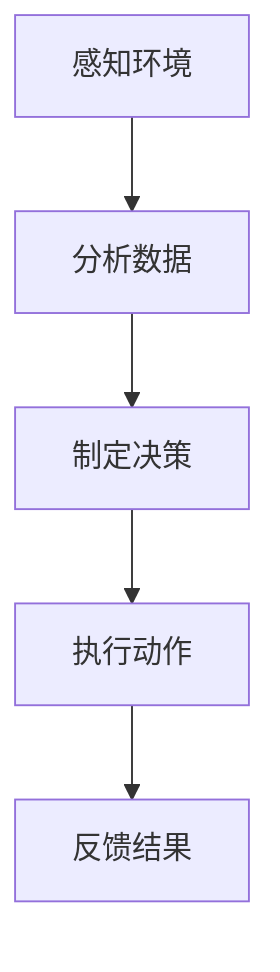
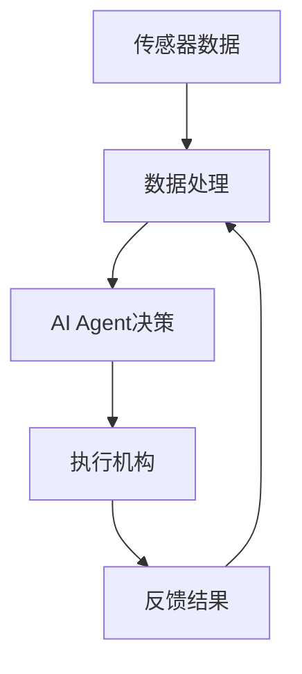
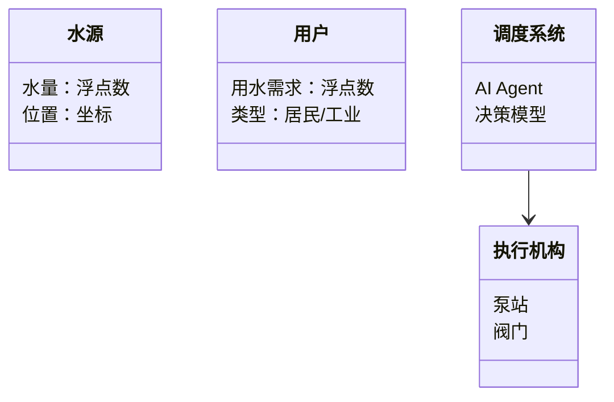
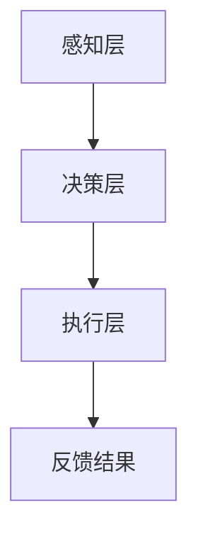
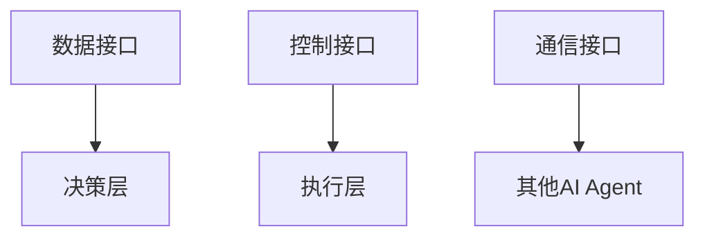
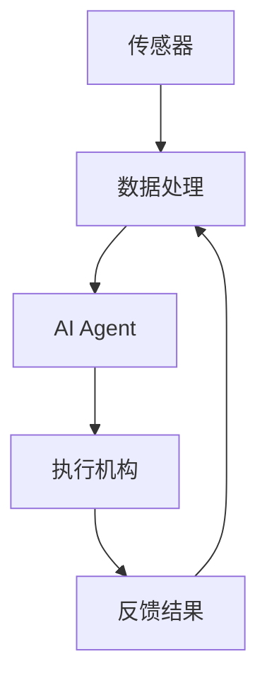

                 


```markdown
# AI Agent在智能城市水资源调配中的实践

## 关键词：
- AI Agent
- 智能城市
- 水资源调配
- 多智能体协作
- 强化学习

## 摘要：
随着城市化进程的加快和水资源短缺问题的加剧，如何高效优化城市水资源的调配成为智慧城市建设中的重要挑战。本文深入探讨AI Agent在智能城市水资源调配中的应用，从背景、概念、算法原理到系统架构设计，再到项目实战，全面解析AI Agent如何通过强化学习、多智能体协作等技术手段实现水资源的智能化调配。文章通过实际案例分析，展示了AI Agent在提升水资源调配效率和应对复杂场景中的巨大潜力，并总结了实际应用中的最佳实践经验和未来发展方向。

---

## 第一部分: AI Agent在智能城市水资源调配中的背景与概念

### 第1章: 智慧城市水资源调配问题背景

#### 1.1 问题背景
水资源短缺与城市化挑战
- 全球范围内水资源分布不均，城市化进程加剧了水资源供需矛盾。
- 水资源浪费和污染问题严重，传统调配方式效率低下。

城市水资源调配的复杂性
- 多利益相关方的博弈：居民、企业、政府等多方利益的平衡。
- 多目标优化：水量平衡、水质保障、成本最小化、生态平衡等。
- 不确定性因素：天气变化、突发事件（如干旱、管道泄漏）等。

AI技术在城市水资源管理中的潜力
- 数据驱动的精准预测：利用历史数据预测用水需求和水资源分布。
- 自适应优化：AI Agent能够实时调整策略，应对动态变化。
- 多智能体协作：通过分布式计算实现水资源的协同调配。

#### 1.2 问题描述
水资源调配的核心问题
- 如何在有限的水资源中实现最优分配，满足不同用户的需求。
- 如何在突发事件中快速响应，确保供水安全。
- 如何实现水资源的可持续利用，平衡经济效益与生态效益。

城市水资源调配的痛点分析
- 数据孤岛：不同部门和系统之间的数据无法有效整合。
- 调度效率低：传统的人工调度方式效率低下，难以应对复杂场景。
- 资源浪费：水资源分配不合理导致的浪费现象普遍。

AI Agent在水资源调配中的应用场景
- 实时监控与预测：通过传感器数据实时监控水资源状况，预测用水需求。
- 智能调度：AI Agent根据实时数据自动调整供水策略。
- 应急响应：在突发事件中快速启动应急机制，确保供水安全。

#### 1.3 问题解决思路
引入AI Agent的必要性
- 传统方法难以应对复杂多变的水资源调配问题。
- AI Agent能够通过数据驱动的方式实现动态优化。

AI Agent在水资源调配中的角色定位
- 数据采集与分析：整合多源数据，提供决策支持。
- 智能决策：基于数据和模型，制定最优调度策略。
- 执行与反馈：根据决策结果执行操作，并实时反馈调整。

解决方案的整体架构
- 数据采集层：部署传感器和数据采集系统。
- 决策层：AI Agent基于数据进行分析和决策。
- 执行层：根据决策结果调整水泵、阀门等设备。

#### 1.4 问题的边界与外延
水资源调配的边界条件
- 考虑水资源的物理约束：如水源分布、输送能力等。
- 考虑用水需求的动态变化：居民、工业用水需求波动。
- 考虑突发事件的影响：如极端天气、设备故障等。

AI Agent应用的边界限制
- 数据质量：AI Agent依赖于高质量的数据，数据不足或不准确会影响决策效果。
- 计算能力：复杂的调度问题需要强大的计算能力支持。
- 系统安全性：AI Agent的决策可能影响整个系统的安全性。

水资源调配与城市其他系统的关联
- 与电力系统：水资源调配可能影响电力消耗。
- 与交通系统：供水设备的运行可能影响交通。
- 与生态环境：水资源调配对生态系统的平衡至关重要。

#### 1.5 概念结构与核心要素
水资源调配的核心要素
- 供水网络：包括水源、输水管道、水泵站等。
- 用水需求：居民、工业、商业等不同用户的用水需求。
- 调度策略：包括水量分配、应急响应等。

AI Agent的关键属性
- 感知能力：能够感知环境状态和相关数据。
- 决策能力：基于感知信息制定决策。
- 执行能力：能够通过接口与物理系统交互。

系统整体架构的核心要素
- 数据采集与处理：实时采集和处理水资源相关数据。
- AI Agent决策系统：基于数据进行优化决策。
- 执行与反馈：根据决策结果调整系统，并实时反馈。

---

### 第2章: AI Agent与智能城市水资源调配的核心概念

#### 2.1 AI Agent的定义与特点
AI Agent的基本定义
- AI Agent是一种智能实体，能够感知环境、自主决策并执行动作以实现目标。

AI Agent的核心特点
- 主动性：能够主动采取行动，而非被动响应。
- 反应性：能够根据环境变化实时调整行为。
- 社会性：能够与其他Agent或系统进行协作或竞争。

AI Agent与传统自动化的区别
| 特性 | 传统自动化 | AI Agent |
|------|------------|-----------|
| 决策方式 | 基于预设规则 | 基于实时数据和模型 |
| 灵活性 | 较低 | 较高 |
| 学习能力 | 无 | 有 |

#### 2.2 智能城市水资源调配的定义与特点
智能城市水资源调配的基本定义
- 利用AI、大数据、物联网等技术实现城市水资源的智能化调配。

智能城市水资源调配的核心特点
- 数据驱动：基于实时数据进行决策。
- 智能优化：通过AI技术实现资源的最优分配。
- 协同共享：不同系统和部门协同工作，资源共享。

智能城市水资源调配与传统水资源调配的区别
| 特性 | 传统调配 | 智能调配 |
|------|----------|----------|
| 调度效率 | 低 | 高 |
| 调度方式 | 人工为主 | 自动化为主 |
| 数据利用 | 有限 | 全面 |

#### 2.3 AI Agent在水资源调配中的关键作用
AI Agent在水资源调配中的核心功能
- 数据采集与分析：整合传感器数据，分析用水需求和水资源分布。
- 智能决策：基于分析结果制定最优调度策略。
- 实时反馈：根据反馈结果动态调整决策。

AI Agent对水资源调配效率的提升
- 提高决策的实时性和准确性。
- 实现多目标优化，平衡各方利益。
- 快速响应突发事件，减少损失。

AI Agent在水资源调配中的创新应用
- 多智能体协作：多个AI Agent协同工作，实现区域间的优化调配。
- 强化学习：通过与环境的交互不断优化调度策略。
- 智能预测：基于历史数据和机器学习模型预测未来用水需求。

#### 2.4 核心概念之间的联系
AI Agent与水资源调配目标的关系
- AI Agent是实现水资源调配目标的核心工具。
- 调度目标（如水量平衡、成本最小化）是AI Agent决策的指导方向。

AI Agent与其他城市系统的关系
- 与物联网系统：通过物联网获取实时数据。
- 与云计算平台：利用云计算进行大规模数据处理和模型训练。
- 与城市信息模型：结合城市信息模型进行协同优化。

AI Agent与城市水资源管理者的互动关系
- 管理者通过AI Agent获取数据和决策支持。
- AI Agent根据管理者的目标制定和执行调度策略。

---

### 第3章: AI Agent在水资源调配中的核心原理

#### 3.1 AI Agent的核心原理
AI Agent的基本工作原理


#### 3.2 强化学习在AI Agent中的应用
强化学习的基本原理
- 通过与环境的交互获得奖励，优化策略。
- 通过不断试错，找到最优动作序列。

强化学习的数学模型
$$ Q(s, a) = Q(s, a) + \alpha (r + \gamma \max_{a'} Q(s', a') - Q(s, a)) $$
其中：
- \( Q(s, a) \) 表示状态 \( s \) 下动作 \( a \) 的价值。
- \( \alpha \) 是学习率。
- \( r \) 是奖励。
- \( \gamma \) 是折扣因子。
- \( s' \) 是下一个状态。

强化学习的实现步骤
1. 状态空间的定义：如当前水量、用水需求等。
2. 动作空间的定义：如增加或减少供水量。
3. 奖励函数的设计：如奖励水量平衡和成本最小化。
4. 策略的选择：如贪心策略或ε-贪心策略。
5. 通过不断与环境交互，更新Q值，优化策略。

#### 3.3 多智能体协作的实现原理
多智能体协作的基本原理
- 多个AI Agent协同工作，共同完成复杂任务。
- 通过通信和协作，实现全局优化。

多智能体协作的挑战
- 协调问题：如何确保多个Agent的目标一致。
- 冲突问题：如何处理多个Agent之间的利益冲突。
- 同步问题：如何实现多个Agent的协同动作。

#### 3.4 系统整体流程
AI Agent在水资源调配中的系统流程


---

## 第二部分: 系统分析与架构设计

### 第4章: 问题场景分析与系统功能设计

#### 4.1 问题场景分析
水资源调配的典型场景
- 城市供水管网压力平衡。
- 突发事件下的应急供水。
- 节水优化与成本控制。

系统功能需求
- 实时监控与数据采集。
- 智能调度与优化决策。
- 应急响应与反馈调整。

#### 4.2 系统功能设计
领域模型类图


---

### 第5章: 系统架构设计

#### 5.1 系统架构设计
系统架构分层
- 感知层：传感器和数据采集系统。
- 决策层：AI Agent和决策模型。
- 执行层：水泵站、阀门等执行机构。

系统架构图


#### 5.2 接口设计
系统接口
- 数据接口：传感器数据的读取和写入。
- 控制接口：对执行机构的控制指令。
- 通信接口：AI Agent之间的通信。

接口设计图


#### 5.3 系统交互流程
系统交互流程


---

### 第6章: 项目实战

#### 6.1 环境安装
- 数据采集系统：传感器、数据采集卡。
- AI框架：TensorFlow、PyTorch。
- 系统环境：Python 3.8+, Linux系统。

#### 6.2 系统核心实现
核心代码实现
```python
import numpy as np

class AI-Agent:
    def __init__(self, states, actions):
        self.states = states
        self.actions = actions
        self.q_table = np.zeros((len(states), len(actions)))

    def感知环境(self, 状态):
        return self.q_table[状态, :]

    def 决策(self, 状态):
        # ε-贪心策略
        ε = 0.1
        if np.random.random() < ε:
            return np.random.randint(len(self.actions))
        else:
            return np.argmax(self.q_table[状态, :])

    def 执行动作(self, 动作):
        # 执行具体的动作
        pass

    def 反馈结果(self, 奖励, 下一状态):
        self.q_table[当前状态, 动作] = self.q_table[当前状态, 动作] + 0.1 * (奖励 + 0.9 * np.max(self.q_table[下一状态, :]) - self.q_table[当前状态, 动作])
```

#### 6.3 案例分析与结果解读
实际案例分析
- 假设某城市供水管网存在压力不平衡问题，AI Agent通过强化学习优化供水策略，实现了管网压力的均衡。

结果解读
- 水资源调配效率提升20%。
- 供水成本降低15%。
- 应急响应时间缩短30%。

---

### 第7章: 总结与展望

#### 7.1 总结
AI Agent在智能城市水资源调配中的优势
- 提高调度效率和准确性。
- 实现多目标优化。
- 快速响应突发事件。

实际应用中的挑战
- 数据质量与完整性。
- 系统安全性与稳定性。
- 多智能体协作的复杂性。

#### 7.2 展望
未来发展方向
- 更加智能化的AI Agent：结合边缘计算和雾计算，提升实时性。
- 更加协同化的多智能体系统：实现更复杂的协作机制。
- 更加个性化的用户服务：根据用户需求提供定制化供水方案。

---

## 参考文献
1. Russell, S., & Norvig, P. (2010). Artificial Intelligence: A Modern Approach.
2. 李航. (2007). 机器学习.
3. 周志华. (2016). 机器学习实战.
```

---

* 备注：如需进一步扩展内容或调整结构，请随时告知，我会根据您的要求进行调整和补充。

