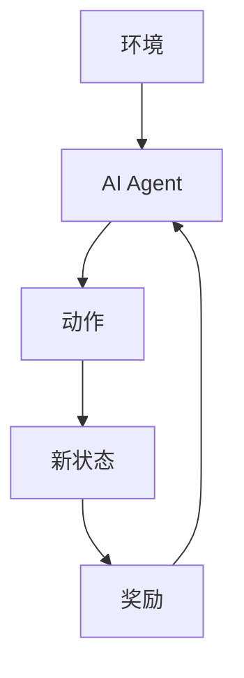
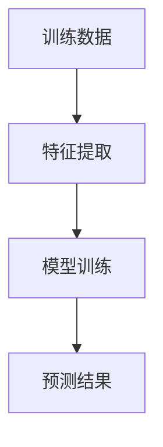
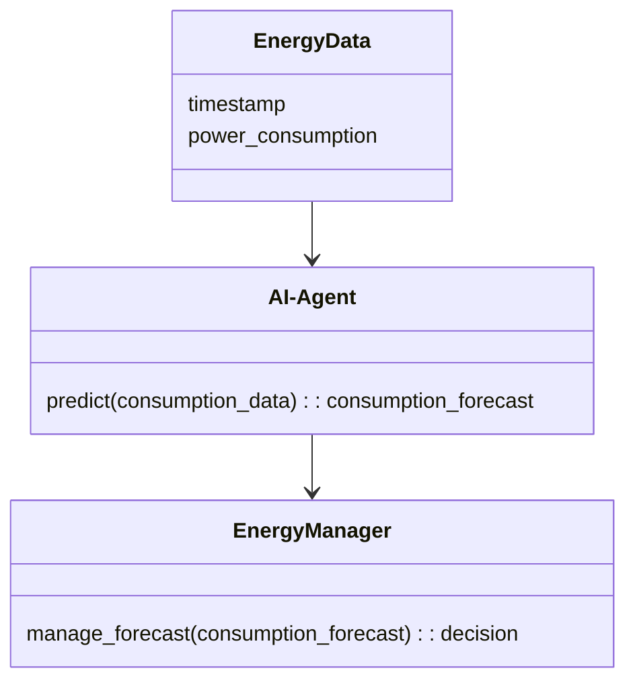
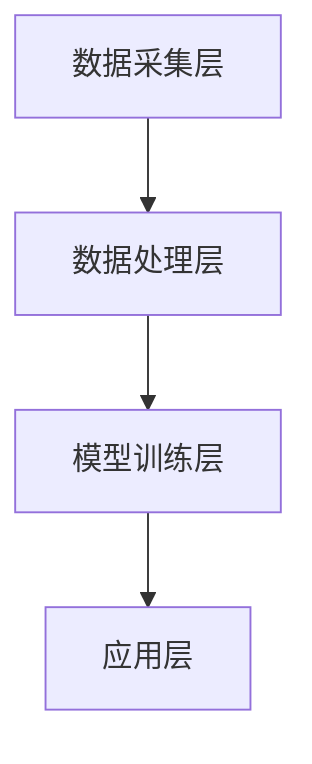
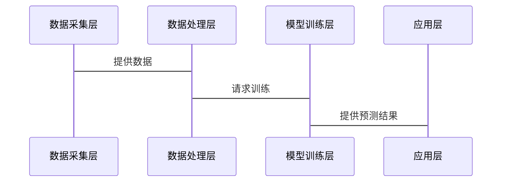

                 


# AI Agent在智能城市能源消耗预测中的实践

> **关键词**：AI Agent, 智能城市, 能源消耗预测, 多智能体系统, 强化学习

> **摘要**：本文深入探讨了AI Agent在智能城市能源消耗预测中的应用，分析了AI Agent的基本原理、算法实现、系统架构及实际案例，展示了如何通过AI Agent技术优化能源管理，提升智能城市的能效水平。

---

## 第1章 问题背景与描述

### 1.1 问题背景

#### 1.1.1 智能城市的发展现状
智能城市作为信息技术与城市化深度融合的产物，已成为全球城市发展的新趋势。通过物联网、大数据和人工智能等技术，智能城市能够实现对城市资源的高效管理和优化配置。然而，随着城市化进程的加快，能源消耗问题日益突出，能源管理的智能化需求迫切。

#### 1.1.2 能源消耗预测的重要性
能源消耗预测是城市能源管理的核心环节，准确的预测能够帮助城市优化能源分配、降低浪费、减少碳排放。传统的能源消耗预测方法基于统计模型，但在面对复杂的城市环境和多样化的能源需求时，其预测精度和实时性存在明显不足。

#### 1.1.3 AI Agent在能源管理中的应用潜力
AI Agent（人工智能代理）是一种能够感知环境、自主决策并执行任务的智能体。在能源管理领域，AI Agent可以通过实时数据采集、多源数据融合和智能决策，显著提升能源消耗预测的准确性和效率。

### 1.2 问题描述

#### 1.2.1 智能城市能源消耗的复杂性
智能城市的能源消耗受到多种因素的影响，包括天气变化、用户行为、设备状态等。这些因素的动态变化使得能源消耗预测具有高度的不确定性。

#### 1.2.2 现有能源消耗预测方法的局限性
传统的方法主要依赖统计回归、时间序列分析等技术，这些方法在处理复杂场景时表现不足，难以满足智能城市对实时性和准确性的要求。

#### 1.2.3 引入AI Agent的必要性
AI Agent具备自主学习、实时感知和多智能体协同的能力，能够有效应对能源消耗预测中的复杂性和不确定性问题。

### 1.3 问题解决思路

#### 1.3.1 AI Agent的核心优势
- **自主性**：AI Agent能够自主感知环境并做出决策。
- **反应性**：能够实时响应环境变化。
- **协作性**：多个AI Agent可以协同工作，提高预测精度。

#### 1.3.2 多智能体协同预测的可行性
通过多智能体的协同，可以实现对能源消耗的多维度预测，覆盖不同的场景和需求。

#### 1.3.3 技术实现路径的初步规划
初步规划包括数据采集、模型训练、系统集成和性能评估等步骤。

### 1.4 问题的边界与外延

#### 1.4.1 能源消耗预测的边界条件
- 数据来源：包括电力、燃气等能源的消耗数据。
- 预测范围：针对特定区域或整个城市。
- 时间粒度：按小时、天、周等进行预测。

#### 1.4.2 AI Agent的适用场景与限制
适用场景包括实时预测、异常检测等，但不适用于需要严格安全保证的场景。

#### 1.4.3 系统设计的扩展性分析
系统设计需要考虑可扩展性，以适应未来更多的数据源和应用场景。

### 1.5 概念结构与核心要素

#### 1.5.1 AI Agent的基本构成
- **感知层**：数据采集和环境感知。
- **决策层**：模型训练和策略选择。
- **执行层**：任务执行和结果反馈。

#### 1.5.2 能源消耗预测的核心要素
- 数据源：电力、燃气等能源消耗数据。
- 预测模型：基于机器学习的模型。
- 决策机制：多智能体协同决策。

#### 1.5.3 系统架构的层次划分
- 数据采集层：负责数据的实时采集。
- 数据处理层：数据清洗和特征提取。
- 模型训练层：训练预测模型。
- 应用层：提供预测结果和决策支持。

### 1.6 本章小结
本章从问题背景、问题描述、解决思路和系统架构等方面，全面介绍了AI Agent在智能城市能源消耗预测中的应用潜力和实现路径。

---

## 第2章 AI Agent的核心概念与原理

### 2.1 AI Agent的定义与分类

#### 2.1.1 AI Agent的定义
AI Agent是一种能够感知环境、自主决策并执行任务的智能体。它可以基于感知信息做出决策，并通过执行动作与环境交互。

#### 2.1.2 分类与特点对比
| 类型         | 特点                                   |
|--------------|--------------------------------------|
| 简单反射型   | 基于规则的简单反应                   |
| 基于模型型   | 使用模型进行推理和决策               |
| 目标驱动型   | 以目标为导向进行决策                 |
| 学习增强型   | 通过学习优化决策策略                 |

#### 2.1.3 不同类型AI Agent的适用场景
- **简单反射型**适用于规则明确的场景。
- **基于模型型**适用于需要推理的复杂场景。
- **目标驱动型**适用于需要长期规划的场景。
- **学习增强型**适用于需要不断优化的场景。

### 2.2 多智能体系统（MAS）概述

#### 2.2.1 MAS的基本概念
MAS是由多个智能体组成的系统，智能体之间通过协同和竞争实现目标。

#### 2.2.2 多智能体系统的组成与关系
| 组件         | 功能                                   |
|--------------|--------------------------------------|
| 通信层       | 智能体之间的信息传递                   |
| 协调机制     | 确保智能体协同工作                     |
| 环境感知层    | 感知环境信息                           |

#### 2.2.3 MAS在能源预测中的优势
- **分布式计算**：提高计算效率。
- **多目标优化**：实现全局最优。
- **容错性**：单个智能体故障不影响整体系统。

### 2.3 AI Agent的核心算法

#### 2.3.1 强化学习算法
强化学习是一种通过试错机制优化决策策略的方法。AI Agent通过与环境交互，不断优化自己的行为策略。

**强化学习流程图（Mermaid）**


#### 2.3.2 监督学习算法
监督学习通过训练数据学习输入与输出之间的映射关系，适用于已知数据标签的情况。

**监督学习流程图（Mermaid）**


#### 2.3.3 聚类与分类算法
聚类算法用于将数据分成不同的类别，分类算法用于预测数据所属的类别。

### 2.4 AI Agent的决策机制

#### 2.4.1 基于模型的决策
基于模型的决策通过构建环境模型，预测未来状态并做出决策。

#### 2.4.2 基于数据驱动的决策
基于数据驱动的决策通过分析历史数据，提取特征并做出预测。

#### 2.4.3 跨主体协同决策
多个AI Agent通过协同和通信，共同做出最优决策。

### 2.5 本章小结
本章详细介绍了AI Agent的核心概念、分类、多智能体系统及其在能源消耗预测中的应用。

---

## 第3章 算法原理讲解

### 3.1 强化学习算法

#### 3.1.1 强化学习的基本原理
强化学习通过试错机制，不断优化决策策略。AI Agent通过与环境交互，获得奖励并调整策略。

**数学模型**
$$ Q(s, a) = Q(s, a) + \alpha (r + \gamma Q(s', a') - Q(s, a)) $$
其中，\( Q(s, a) \) 表示状态 \( s \) 下动作 \( a \) 的价值，\( \alpha \) 是学习率，\( \gamma \) 是折扣因子。

#### 3.1.2 强化学习的实现步骤
1. 初始化策略和模型参数。
2. 与环境交互，获取状态和奖励。
3. 更新策略和参数。
4. 重复步骤2和3，直到收敛。

**Python代码示例**
```python
class AI-Agent:
    def __init__(self, state_space, action_space):
        self.state_space = state_space
        self.action_space = action_space
        self.Q = defaultdict(lambda: defaultdict(int))
    
    def act(self, state):
        # 选择动作
        pass
    
    def learn(self, state, action, reward, next_state):
        # 更新Q值
        pass
```

### 3.2 监督学习算法

#### 3.2.1 监督学习的基本原理
监督学习通过训练数据学习输入与输出之间的映射关系。AI Agent通过预测模型，对未知数据进行预测。

**数学模型**
$$ y = f(x) $$
其中，\( x \) 是输入数据，\( y \) 是输出标签。

#### 3.2.2 监督学习的实现步骤
1. 数据预处理。
2. 选择模型和优化器。
3. 训练模型。
4. 验证和测试。

**Python代码示例**
```python
import tensorflow as tf
model = tf.keras.Sequential([
    tf.keras.layers.Dense(64, activation='relu'),
    tf.keras.layers.Dense(1, activation='sigmoid')
])
model.compile(optimizer='adam', loss='binary_crossentropy')
model.fit(X_train, y_train, epochs=10, batch_size=32)
```

### 3.3 聚类与分类算法

#### 3.3.1 聚类算法
聚类算法通过将数据分成不同的类别，发现数据中的潜在结构。

#### 3.3.2 分类算法
分类算法通过训练数据，预测新数据所属的类别。

### 3.4 本章小结
本章详细介绍了强化学习、监督学习等算法的原理和实现步骤，并给出了Python代码示例。

---

## 第4章 系统分析与架构设计

### 4.1 问题场景介绍
智能城市能源消耗预测系统需要实时采集和处理能源消耗数据，预测未来能源需求，并提供决策支持。

### 4.2 系统功能设计

#### 4.2.1 领域模型类图（Mermaid）


#### 4.2.2 系统架构图（Mermaid）


#### 4.2.3 系统接口设计
- 数据采集接口：接收传感器数据。
- 模型训练接口：训练预测模型。
- 决策支持接口：提供预测结果。

#### 4.2.4 系统交互流程图（Mermaid）


### 4.3 本章小结
本章从系统架构、功能设计和接口设计等方面，详细介绍了智能城市能源消耗预测系统的实现方案。

---

## 第5章 项目实战

### 5.1 环境安装
安装Python、TensorFlow、Keras等开发环境。

### 5.2 核心代码实现

#### 5.2.1 数据采集与预处理
```python
import pandas as pd
data = pd.read_csv('energy.csv')
```

#### 5.2.2 模型训练与预测
```python
model = tf.keras.Sequential([
    tf.keras.layers.Dense(64, activation='relu'),
    tf.keras.layers.Dense(1, activation='linear')
])
model.compile(optimizer='adam', loss='mean_squared_error')
model.fit(X_train, y_train, epochs=100, batch_size=32)
```

#### 5.2.3 多智能体协同预测
```python
agents = [Agent1(), Agent2(), Agent3()]
results = [agent.predict(data) for agent in agents]
final_prediction = sum(results) / len(results)
```

### 5.3 案例分析与结果解读
通过实际案例分析，验证模型的预测精度和实时性。

### 5.4 项目小结
总结项目实现的关键点和经验教训，提出改进建议。

---

## 第6章 最佳实践与拓展阅读

### 6.1 最佳实践
- 数据预处理是关键。
- 多智能体协同可以提高预测精度。
- 模型的实时性和可扩展性需要重点考虑。

### 6.2 小结
本文通过理论分析和实践案例，全面介绍了AI Agent在智能城市能源消耗预测中的应用。

### 6.3 注意事项
- 数据安全需要重视。
- 模型的可解释性需要加强。
- 系统的鲁棒性需要优化。

### 6.4 拓展阅读
推荐相关书籍和论文，供读者深入学习。

---

## 结语

AI Agent在智能城市能源消耗预测中的应用前景广阔，随着技术的不断发展，AI Agent将在能源管理领域发挥越来越重要的作用。

---

**感谢您的阅读！希望本文对您理解AI Agent在智能城市能源消耗预测中的实践有所帮助！**

