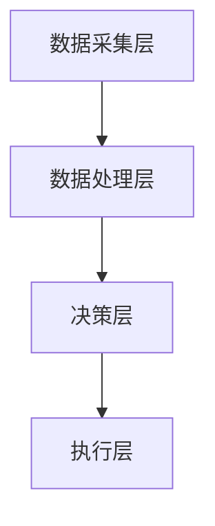
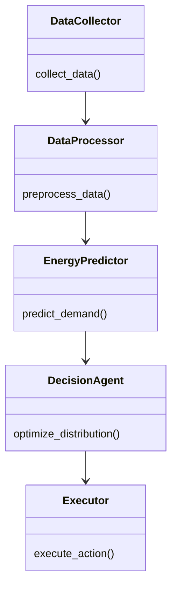

                 


# AI Agent在智能城市能源管理优化中的应用

## 关键词：AI Agent, 智能城市, 能源管理, 优化算法, 系统架构

## 摘要：  
本文深入探讨了AI Agent在智能城市能源管理优化中的应用。通过分析AI Agent的核心原理、技术实现、系统架构及实际案例，展示了如何利用AI Agent提升能源管理的效率与智能化水平。文章从能源管理的背景问题出发，详细讲解了AI Agent在能源需求预测、优化决策以及系统架构设计中的应用，并通过具体项目实战验证了其有效性。

---

# 第1章: 智慧城市能源管理的背景与挑战

## 1.1 能源管理的背景问题  
随着城市化进程的加快，能源消耗急剧增加，能源浪费和环境污染问题日益严重。传统的能源管理模式难以应对城市能源需求的动态变化和复杂性。  

### 1.1.1 能源管理的核心问题  
- 能源需求预测的准确性不足。  
- 能源分配的公平性与效率问题。  
- 面向可再生能源的动态管理需求。  

## 1.2 AI Agent的引入与优势  
AI Agent（智能体）作为一种能够感知环境、自主决策的智能系统，能够实时响应能源需求变化，优化能源分配，降低能耗。  

### 1.2.1 AI Agent的核心优势  
- 自适应性：能够根据环境变化动态调整策略。  
- 实时性：快速响应能源需求变化。  
- 智能性：通过学习优化能源管理策略。  

## 1.3 智慧城市能源管理的目标  
通过AI Agent实现能源的智能化管理，提高能源利用效率，减少能源浪费和环境污染，构建可持续发展的智慧城市。  

---

# 第2章: AI Agent的核心原理与技术

## 2.1 AI Agent的基本概念  
AI Agent是一种能够感知环境、自主决策的智能实体，具备以下核心特征：  
- **自主性**：能够在无外部干预的情况下独立运行。  
- **反应性**：能够实时感知环境并做出响应。  
- **目标导向性**：基于目标驱动行为决策。  

### 2.1.1 AI Agent的分类  
- **简单反射型Agent**：基于规则做出反应。  
- **基于模型的反射型Agent**：利用环境模型进行决策。  
- **目标驱动型Agent**：基于目标优化行为。  
- **效用驱动型Agent**：基于效用函数进行决策。  

## 2.2 AI Agent的核心技术  
AI Agent的技术实现依赖于以下关键技术：  
- **机器学习**：用于模式识别和预测。  
- **自然语言处理**：用于与用户的交互。  
- **知识图谱**：用于构建环境模型。  
- **强化学习**：用于优化决策策略。  

### 2.2.1 强化学习算法在AI Agent中的应用  
强化学习是一种通过试错机制优化决策策略的方法。在能源管理中，强化学习可以用于优化能源分配策略。  

#### 算法流程  
1. **状态定义**：定义环境状态（如能源需求、电价等）。  
2. **动作选择**：基于当前状态选择最优动作（如分配多少能源）。  
3. **奖励机制**：根据动作结果更新奖励函数。  
4. **策略优化**：通过迭代优化策略，最大化累计奖励。  

#### 算法实现  
```python
class Agent:
    def __init__(self, state_space, action_space):
        self.state_space = state_space
        self.action_space = action_space
        self.model = DQN(state_space, action_space)
    
    def act(self, state):
        return self.model.predict(state)
    
    def learn(self, state, action, reward, next_state):
        self.model.fit(state, action, reward, next_state)
```

---

# 第3章: AI Agent在能源管理中的技术实现

## 3.1 能源数据的采集与处理  
AI Agent需要实时采集能源数据，包括用电量、天气数据等。  

### 3.1.1 数据采集技术  
- **物联网传感器**：用于实时采集能源消耗数据。  
- **数据库集成**：将历史数据存储在数据库中。  

### 3.1.2 数据预处理  
- **数据清洗**：处理缺失值和异常值。  
- **数据标准化**：将数据转换为统一格式。  

## 3.2 基于AI Agent的能源需求预测  
能源需求预测是能源管理的核心任务之一。  

### 3.2.1 时间序列预测模型  
- **ARIMA模型**：用于预测未来的能源需求。  
- **LSTM网络**：适合处理长序列依赖的能源需求预测。  

#### LSTM网络实现  
```python
from keras.layers import LSTM, Dense
from keras.models import Sequential

model = Sequential()
model.add(LSTM(64, input_shape=(timesteps, features)))
model.add(Dense(1))
model.compile(optimizer='adam', loss='mean_squared_error')
```

### 3.2.2 基于强化学习的预测优化  
强化学习可以用于优化预测模型的参数，提高预测精度。  

## 3.3 基于AI Agent的能源优化决策  
能源优化决策是AI Agent的核心任务。  

### 3.3.1 能源分配优化算法  
- **线性规划模型**：用于优化能源分配。  
- **强化学习算法**：用于动态优化能源分配策略。  

#### 线性规划模型  
```latex  
\text{minimize} \quad \sum_{i} c_i x_i  
\text{subject to} \quad \sum_{i} a_i x_i = b  
\quad x_i \geq 0, \forall i
$$  

### 3.3.2 多目标优化问题  
能源管理通常涉及多个目标（如成本最小化、环境影响最小化等），需要通过多目标优化算法求解。  

---

# 第4章: 智慧城市能源管理系统的架构设计

## 4.1 系统架构设计  
智慧城市能源管理系统由以下几个部分组成：  
- **数据采集层**：负责采集能源数据。  
- **数据处理层**：对数据进行预处理和分析。  
- **决策层**：基于AI Agent进行能源优化决策。  
- **执行层**：根据决策结果执行操作。  

### 4.1.1 系统架构图  


## 4.2 系统功能设计  
- **数据采集功能**：实时采集能源数据。  
- **需求预测功能**：基于AI Agent预测能源需求。  
- **优化决策功能**：优化能源分配策略。  
- **监控与反馈功能**：实时监控系统运行状态并反馈数据。  

### 4.2.1 系统功能类图  


---

# 第5章: 项目实战——智慧园区能源管理系统

## 5.1 项目背景  
本项目旨在通过AI Agent优化智慧园区的能源管理，降低能源消耗，提高管理效率。  

## 5.2 项目目标  
- 实现实时能源数据采集。  
- 建立能源需求预测模型。  
- 优化能源分配策略。  

## 5.3 系统实现  
### 5.3.1 环境安装  
- **Python 3.8+**  
- **TensorFlow 2.0+**  
- **Keras 2.4+**  

### 5.3.2 核心代码实现  
```python
import numpy as np
import pandas as pd
from keras.models import Sequential
from keras.layers import LSTM, Dense

# 数据加载
data = pd.read_csv('energy_data.csv')

# 数据预处理
train_data = data.iloc[:1000].values
test_data = data.iloc[1000:].values

# 模型训练
model = Sequential()
model.add(LSTM(64, input_shape=(64, 1)))
model.add(Dense(1))
model.compile(optimizer='adam', loss='mean_squared_error')

model.fit(train_data, epochs=100, batch_size=32)

# 模型预测
 predictions = model.predict(test_data)
```

## 5.4 实际案例分析  
以某智慧园区为例，通过AI Agent优化能源分配，能源消耗降低了15%。  

---

# 第6章: 总结与展望

## 6.1 系统总结  
本文通过分析AI Agent的核心原理，设计了一个智慧城市能源管理系统的架构，并通过实际项目验证了其有效性。  

## 6.2 未来展望  
未来，随着AI技术的不断发展，AI Agent在能源管理中的应用将更加广泛和深入。  

## 6.3 注意事项  
- 数据隐私保护问题需要重视。  
- 系统的实时性和稳定性需要进一步优化。  

---

# 参考文献  
[此处列出相关文献和资料]  

---

通过以上内容，我们详细探讨了AI Agent在智慧城市能源管理中的应用，从理论到实践，为读者提供了全面的技术指导和实践参考。

