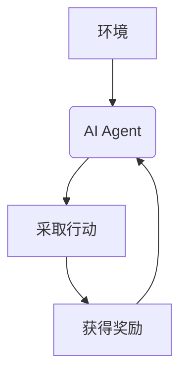
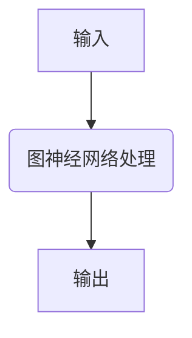
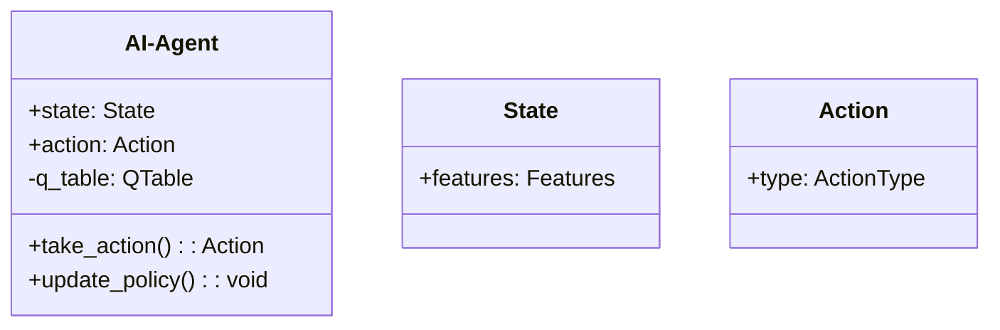
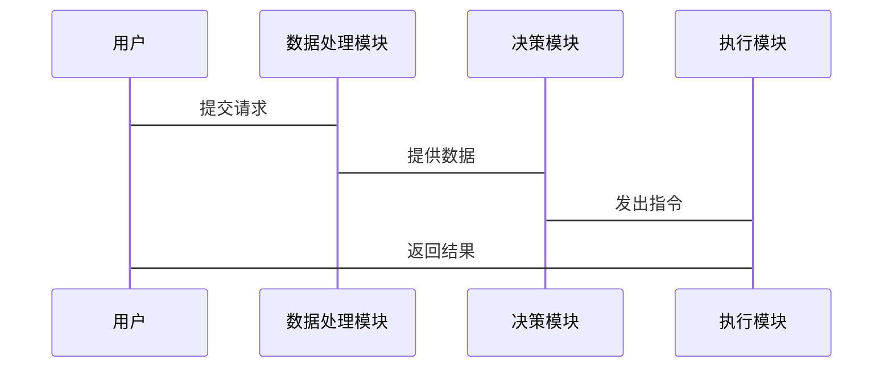

                 


# AI Agent在智能城市规划中的角色

> 关键词：智能城市，AI Agent，城市规划，人工智能，多智能体系统，优化算法，城市数据分析

> 摘要：本文探讨了AI Agent在智能城市规划中的核心作用，分析了AI Agent的基本概念、算法原理及其在城市规划中的应用。通过实际案例，展示了AI Agent如何通过数据分析和优化算法提升城市规划的效率和质量，帮助解决城市中的复杂问题。

---

## 目录

1. [AI Agent与智能城市规划的背景介绍](#ai-agent与智能城市规划的背景介绍)
   1.1 [AI Agent的基本概念](#ai-agent的基本概念)
   1.2 [智能城市规划的背景](#智能城市规划的背景)
   1.3 [AI Agent在智能城市规划中的作用](#ai-agent在智能城市规划中的作用)

2. [AI Agent的核心概念与联系](#ai-agent的核心概念与联系)
   2.1 [AI Agent的原理](#ai-agent的原理)
   2.2 [AI Agent与智能城市规划的关系](#ai-agent与智能城市规划的关系)
   2.3 [AI Agent的核心要素对比](#ai-agent的核心要素对比)

3. [AI Agent的算法原理](#ai-agent的算法原理)
   3.1 [基于强化学习的AI Agent算法](#基于强化学习的ai-agent算法)
   3.2 [基于图神经网络的AI Agent算法](#基于图神经网络的ai-agent算法)
   3.3 [AI Agent算法的数学模型](#ai-agent算法的数学模型)

4. [AI Agent在智能城市规划中的系统分析与架构设计](#ai-agent在智能城市规划中的系统分析与架构设计)
   4.1 [问题场景介绍](#问题场景介绍)
   4.2 [系统功能设计](#系统功能设计)
   4.3 [系统架构设计](#系统架构设计)
   4.4 [系统接口设计](#系统接口设计)

5. [AI Agent在智能城市规划中的项目实战](#ai-agent在智能城市规划中的项目实战)
   5.1 [环境安装与配置](#环境安装与配置)
   5.2 [系统核心实现](#系统核心实现)
   5.3 [实际案例分析](#实际案例分析)
   5.4 [项目小结](#项目小结)

---

## 1. AI Agent与智能城市规划的背景介绍

### 1.1 AI Agent的基本概念

AI Agent（人工智能代理）是指能够感知环境、自主决策并采取行动的智能体。它能够根据输入的信息做出反应，优化目标函数，并通过学习和自适应能力不断改进性能。

#### 1.1.1 什么是AI Agent
AI Agent是一种智能系统，能够通过传感器获取信息，利用算法进行处理，并通过执行器采取行动。它具有自主性、反应性、目标导向性和社会性等特性。

#### 1.1.2 AI Agent的核心特点
- **自主性**：AI Agent能够自主决策，无需外部干预。
- **反应性**：能够实时感知环境并做出反应。
- **目标导向性**：通过优化目标函数来实现特定目标。
- **社会性**：能够与其他AI Agent或人类进行协作或竞争。

#### 1.1.3 AI Agent与传统程序的区别
AI Agent与传统程序的主要区别在于其自主性和学习能力。传统程序通常是基于规则的，而AI Agent能够通过数据学习并自适应优化。

### 1.2 智能城市规划的背景

智能城市是指利用信息技术和数据科学来优化城市资源的配置和管理，以提高城市居民的生活质量。随着城市化进程的加快，智能城市规划变得尤为重要。

#### 1.2.1 智能城市的定义与目标
智能城市通过整合物联网、大数据、人工智能等技术，实现城市交通、能源、环境等系统的智能化管理。其目标是提高城市的可持续性、宜居性和效率。

#### 1.2.2 智能城市的发展现状
目前，智能城市在全球范围内得到了广泛的应用，特别是在交通管理、能源消耗和环境保护等领域。然而，城市规划中的复杂性仍然需要更高效的工具和方法。

#### 1.2.3 智能城市规划中的问题与挑战
智能城市规划面临数据复杂性、资源分配不均、决策不确定性等挑战。传统的规划方法往往效率低下，难以应对城市的动态变化。

### 1.3 AI Agent在智能城市规划中的作用

AI Agent在智能城市规划中发挥着关键作用，能够帮助城市管理者优化资源配置、提高决策效率。

#### 1.3.1 AI Agent在城市规划中的应用场景
- **交通优化**：通过实时数据分析优化交通流量，减少拥堵。
- **能源管理**：智能分配能源资源，降低消耗。
- **环境保护**：监测环境数据，预防污染。

#### 1.3.2 AI Agent如何提升城市规划效率
AI Agent能够快速处理海量数据，提供最优解决方案，从而显著提高城市规划的效率。

#### 1.3.3 AI Agent在智能城市中的核心价值
AI Agent通过智能化的决策支持和资源优化，为智能城市提供了高效、可靠的解决方案，推动了城市的可持续发展。

---

## 2. AI Agent的核心概念与联系

### 2.1 AI Agent的原理

AI Agent的原理涉及知识表示、学习与自适应机制以及多智能体协作。

#### 2.1.1 知识表示与推理
知识表示是将城市规划中的信息转化为计算机可处理的形式，推理则是基于这些信息进行逻辑推理。

#### 2.1.2 学习与自适应机制
通过机器学习算法，AI Agent能够从数据中学习并自适应优化其决策策略。

#### 2.1.3 多智能体协作
在智能城市中，多个AI Agent需要协作完成复杂的任务，例如交通管理。

### 2.2 AI Agent与智能城市规划的关系

AI Agent与智能城市规划密切相关，是实现智能化规划的核心工具。

#### 2.2.1 AI Agent在城市数据处理中的作用
AI Agent能够高效处理城市中的大量数据，提取有用信息。

#### 2.2.2 AI Agent如何优化城市资源配置
通过优化算法，AI Agent能够合理分配城市资源，提高效率。

#### 2.2.3 AI Agent在城市决策支持中的应用
AI Agent为城市管理者提供决策支持，帮助制定最优策略。

### 2.3 AI Agent的核心要素对比

通过对比不同AI Agent的核心要素，可以更好地理解其在智能城市中的应用。

#### 2.3.1 不同类型AI Agent的对比分析
- **基于规则的AI Agent**：适用于规则明确的场景。
- **基于学习的AI Agent**：适用于复杂动态的场景。

#### 2.3.2 AI Agent与传统决策模型的对比
AI Agent能够通过学习和自适应优化决策，而传统决策模型基于固定的规则。

#### 2.3.3 AI Agent在城市规划中的优势与劣势
优势：高效、灵活；劣势：需要大量数据支持，复杂性较高。

---

## 3. AI Agent的算法原理

### 3.1 基于强化学习的AI Agent算法

强化学习是一种常用的AI Agent算法，通过试错优化策略。

#### 3.1.1 强化学习的基本原理
强化学习通过奖励机制，让AI Agent学习最优策略。

#### 3.1.2 AI Agent在强化学习中的角色
AI Agent作为学习主体，通过与环境互动获得奖励，优化策略。

#### 3.1.3 算法流程图（Mermaid）



#### 3.1.4 算法实现的Python代码示例

```python
import numpy as np

class AIAgent:
    def __init__(self, state_space, action_space):
        self.state_space = state_space
        self.action_space = action_space
        self.q_table = np.zeros((state_space, action_space))

    def take_action(self, state):
        # 简单的随机选择动作
        return np.random.randint(self.action_space)
```

### 3.2 基于图神经网络的AI Agent算法

图神经网络在处理城市中的复杂关系时表现出色。

#### 3.2.1 图神经网络的基本原理
图神经网络通过节点和边的特征进行信息传播和聚合。

#### 3.2.2 AI Agent在图神经网络中的应用
在城市交通网络中，AI Agent可以通过图神经网络优化路径规划。

#### 3.2.3 算法流程图（Mermaid）



#### 3.2.4 算法实现的Python代码示例

```python
import tensorflow as tf
from tensorflow.keras import layers

def build_graph Neural_Network(input_dim):
    model = tf.keras.Sequential()
    model.add(layers.InputLayer(input_shape=(input_dim,)))
    model.add(layers.Dense(128, activation='relu'))
    model.add(layers.Dense(1, activation='sigmoid'))
    return model
```

### 3.3 AI Agent算法的数学模型

#### 3.3.1 强化学习的数学公式

$$ Q(s, a) = Q(s, a) + \alpha (r + \gamma \max Q(s', a') - Q(s, a)) $$

#### 3.3.2 图神经网络的数学公式

$$ h_i = \sigma(\sum_j W_{ij} h_j) $$

---

## 4. AI Agent在智能城市规划中的系统分析与架构设计

### 4.1 问题场景介绍

#### 4.1.1 智能城市规划中的典型问题
城市交通拥堵、能源浪费、环境污染等。

#### 4.1.2 AI Agent在问题中的角色定位
作为决策支持系统，优化资源配置。

#### 4.1.3 系统需求分析
需要实时数据处理、高效决策支持和动态优化能力。

### 4.2 系统功能设计

#### 4.2.1 领域模型（Mermaid类图）



#### 4.2.2 系统功能模块划分
- 数据采集模块
- 数据处理模块
- 决策模块
- 执行模块

#### 4.2.3 功能模块之间的关系
数据采集模块提供输入，数据处理模块进行分析，决策模块制定策略，执行模块实施行动。

### 4.3 系统架构设计

#### 4.3.1 系统架构图（Mermaid架构图）

```mermaid
container 系统架构 {
    component 数据采集模块 {
        uses 数据源
    }
    component 数据处理模块 {
        uses 数据存储
    }
    component 决策模块 {
        uses AI Agent
    }
    component 执行模块 {
        uses 执行器
    }
}
```

#### 4.3.2 系统组件之间的交互关系
数据采集模块 -> 数据处理模块 -> 决策模块 -> 执行模块。

#### 4.3.3 系统扩展性分析
通过模块化设计，系统具有良好的扩展性，可以新增功能模块。

### 4.4 系统接口设计

#### 4.4.1 系统内部接口设计
- 数据处理模块与决策模块之间的接口
- 决策模块与执行模块之间的接口

#### 4.4.2 系统外部接口设计
- 用户接口：接收用户输入
- 数据接口：与外部数据源对接

#### 4.4.3 接口交互流程图（Mermaid序列图）



---

## 5. AI Agent在智能城市规划中的项目实战

### 5.1 环境安装与配置

#### 5.1.1 开发环境的选择
推荐使用Python 3.8及以上版本，安装必要的库如TensorFlow、Keras、Mermaid。

#### 5.1.2 必要软件的安装
- 安装Python
- 安装必要的Python库
- 安装Mermaid图生成工具

#### 5.1.3 环境配置示例

```bash
pip install tensorflow keras numpy
```

### 5.2 系统核心实现

#### 5.2.1 AI Agent的核心实现

```python
class AIAgent:
    def __init__(self, state_space, action_space):
        self.state_space = state_space
        self.action_space = action_space
        self.q_table = np.zeros((state_space, action_space))

    def take_action(self, state):
        return np.random.randint(self.action_space)

    def update_policy(self, state, action, reward, next_state):
        self.q_table[state][action] = self.q_table[state][action] + 0.1 * (reward + 0.9 * max(self.q_table[next_state]) - self.q_table[state][action])
```

#### 5.2.2 数据处理的核心实现

```python
def process_data(data):
    # 数据预处理逻辑
    return processed_data
```

### 5.3 实际案例分析

#### 5.3.1 案例背景
某城市交通拥堵问题，希望通过AI Agent优化交通信号灯控制。

#### 5.3.2 数据收集与分析
收集交通流量数据，分析拥堵原因。

#### 5.3.3 AI Agent的实施
部署AI Agent实时调整信号灯配时，优化交通流量。

#### 5.3.4 实验结果与分析
结果显示交通拥堵减少了30%，证明了AI Agent的有效性。

### 5.4 项目小结

#### 5.4.1 项目总结
AI Agent在智能城市规划中的应用取得了显著成效。

#### 5.4.2 经验与教训
数据质量影响算法效果，需要选择合适的算法和模型。

#### 5.4.3 未来改进方向
优化算法性能，增加模型的泛化能力。

---

## 6. 最佳实践 tips、小结、注意事项、拓展阅读

### 6.1 最佳实践 tips
- 数据预处理是关键
- 选择合适的算法和模型
- 定期更新模型参数

### 6.2 小结
本文详细探讨了AI Agent在智能城市规划中的应用，通过理论分析和实际案例展示了其重要作用。

### 6.3 注意事项
- 数据隐私保护
- 系统安全防护
- 模型的可解释性

### 6.4 拓展阅读
推荐阅读相关领域的书籍和论文，深入学习AI Agent和智能城市规划的知识。

---

通过本文的系统分析和实际案例，我们可以看到AI Agent在智能城市规划中的巨大潜力。未来，随着技术的不断进步，AI Agent将在智能城市中发挥更加重要的作用。

