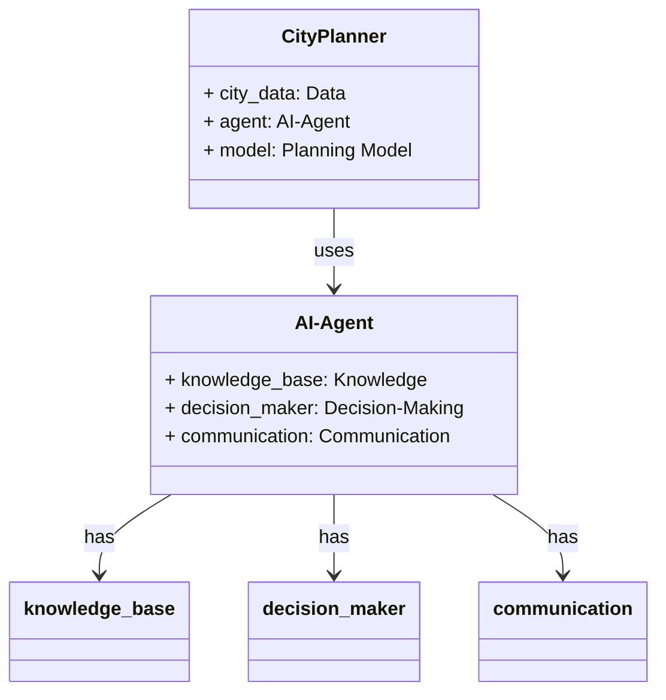
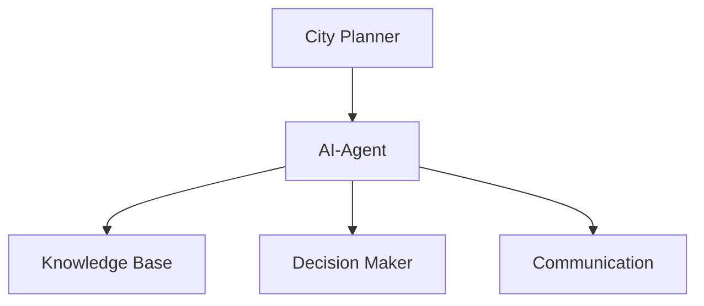
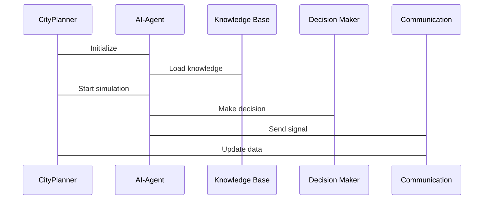

                 


# AI Agent在智能城市规划评估中的角色

## 关键词
AI Agent, 智能城市, 规划评估, 多智能体系统, 强化学习, 知识表示

## 摘要
随着城市化进程的加快和智能化技术的发展，AI Agent在智能城市规划评估中的角色变得越来越重要。本文从AI Agent的基本概念出发，分析其在智能城市规划评估中的核心作用，探讨其算法原理、系统架构设计及实际应用案例。通过本文的阐述，读者将深入了解AI Agent在智能城市中的潜力与价值，并掌握其在实际项目中的实现方法。

---

# 第一部分: AI Agent在智能城市规划评估中的背景与基础

## 第1章: AI Agent与智能城市规划评估概述

### 1.1 AI Agent的基本概念
AI Agent（人工智能代理）是指能够感知环境并采取行动以实现目标的智能实体。它可以在没有人类干预的情况下，自主决策和执行任务。AI Agent的核心特点包括自主性、反应性、目标导向性和社会性。

#### 1.1.1 AI Agent的定义与特点
- **自主性**：AI Agent能够在没有外部干预的情况下独立运作。
- **反应性**：能够实时感知环境并做出响应。
- **目标导向性**：所有行动都围绕实现特定目标展开。
- **社会性**：能够与其他AI Agent或人类进行交互和协作。

#### 1.1.2 AI Agent在智能城市中的应用背景
智能城市是指通过信息技术和数据驱动的方式，优化城市资源分配、提高居民生活质量的城市发展模式。AI Agent在智能城市中的应用主要体现在城市规划、交通管理、环境保护和公共安全等领域。

#### 1.1.3 智能城市规划评估的基本流程
智能城市规划评估通常包括以下几个步骤：
1. **数据采集**：收集城市交通、环境、人口等数据。
2. **模型构建**：建立城市规划的数学模型。
3. **AI Agent模拟**：通过AI Agent模拟不同规划方案的效果。
4. **评估与优化**：根据模拟结果，评估规划方案的优劣并进行优化。

### 1.2 AI Agent的优势与挑战
#### 1.2.1 AI Agent相较于传统方法的优势
- **高效性**：AI Agent能够快速处理大量数据，提高规划效率。
- **适应性**：能够根据环境变化动态调整规划方案。
- **准确性**：通过数据驱动的方式，提高规划的准确性。

#### 1.2.2 智能城市规划评估中的主要挑战
- **数据质量**：数据的准确性、完整性和及时性直接影响规划结果。
- **算法复杂性**：复杂的算法可能导致计算成本过高。
- **多目标冲突**：城市规划通常需要在多个目标之间进行权衡，例如经济利益与环境保护之间的冲突。

#### 1.2.3 AI Agent在实际应用中的局限性
- **伦理问题**：AI Agent的决策可能涉及伦理问题，例如隐私保护。
- **不可预测性**：复杂的环境可能导致AI Agent决策失误。
- **技术门槛**：AI Agent的开发和应用需要较高的技术门槛。

### 1.3 本章小结
本章介绍了AI Agent的基本概念及其在智能城市中的应用背景，分析了AI Agent在智能城市规划评估中的优势与挑战。通过本章的学习，读者可以理解AI Agent在智能城市中的重要性及其应用前景。

---

## 第2章: AI Agent在智能城市中的角色分析

### 2.1 多智能体系统在城市规划中的应用
#### 2.1.1 多智能体系统的定义与特点
多智能体系统（MAS）是由多个相互作用的智能体组成的系统，每个智能体都有自己的目标和行为。MAS在智能城市中的应用广泛，例如交通管理、环境监测等领域。

#### 2.1.2 多智能体系统在城市规划中的具体应用
- **交通管理**：通过多智能体系统优化交通流量，减少拥堵。
- **环境监测**：通过多个智能传感器实时监测空气质量、噪音污染等环境指标。
- **资源分配**：通过MAS优化城市资源（如电力、水资源）的分配。

#### 2.1.3 多智能体系统与城市规划评估的关系
多智能体系统为城市规划评估提供了技术支持，通过多个智能体的协作，可以实现复杂的城市系统的模拟与优化。

### 2.2 AI Agent的协作机制
#### 2.2.1 协作机制的基本概念
协作机制是指多个智能体之间如何协同工作的规则和策略。协作机制的核心是通过信息共享和任务分配，实现多个智能体的协同工作。

#### 2.2.2 基于AI Agent的协作模型
- **分布式协作模型**：智能体之间通过分布式的方式进行协作，每个智能体都有自己的决策权。
- **集中式协作模型**：有一个中央协调器负责任务分配和协调。

#### 2.2.3 协作机制在智能城市规划中的实现
通过协作机制，多个AI Agent可以共同完成复杂的城市规划任务，例如交通网络优化、城市绿地规划等。

### 2.3 AI Agent的知识表示与推理
#### 2.3.1 知识表示的基本方法
知识表示是将城市规划中的知识转化为计算机可以理解的形式。常用的知识表示方法包括逻辑推理、语义网络和知识图谱。

#### 2.3.2 基于知识图谱的推理机制
知识图谱是一种结构化的知识表示方法，通过实体和关系的表示，可以进行复杂的推理和查询。

#### 2.3.3 知识表示在城市规划评估中的应用
通过知识表示，AI Agent可以更好地理解城市规划中的复杂问题，并进行推理和决策。

### 2.4 本章小结
本章分析了AI Agent在智能城市中的角色，重点探讨了多智能体系统和协作机制在城市规划中的应用。通过本章的学习，读者可以理解AI Agent在智能城市中的协作模式及其知识表示方法。

---

## 第3章: 基于强化学习的AI Agent算法

### 3.1 强化学习的基本原理
#### 3.1.1 强化学习的定义与特点
强化学习是一种机器学习方法，通过智能体与环境的交互，学习最优策略。强化学习的核心是通过试错学习，优化智能体的决策。

#### 3.1.2 强化学习的核心要素：状态、动作、奖励
- **状态**：智能体所处的环境状态。
- **动作**：智能体在状态下的行为。
- **奖励**：智能体行为的结果，用于指导智能体的学习方向。

#### 3.1.3 强化学习的数学模型与公式
强化学习的数学模型通常包括状态空间、动作空间、奖励函数和策略函数。数学公式如下：
$$
Q(s, a) = r + \gamma \max Q(s', a')
$$
其中，\( Q(s, a) \) 表示状态 \( s \) 下采取动作 \( a \) 的价值，\( r \) 是奖励，\( \gamma \) 是折扣因子，\( s' \) 是下一个状态。

### 3.2 基于强化学习的AI Agent算法实现
#### 3.2.1 Q-learning算法的实现步骤
1. 初始化Q表为零。
2. 在每个时间步，选择当前状态下的最优动作。
3. 执行动作，获得奖励，并更新Q表。
4. 重复上述步骤，直到达到终止条件。

#### 3.2.2 DQN算法的实现与优化
DQN（Deep Q-Network）是一种基于深度学习的强化学习算法，通过神经网络近似Q值函数。DQN的实现步骤包括：
1. 构建神经网络模型。
2. 使用经验回放机制存储历史经验。
3. 使用目标网络更新Q值函数。
4. 通过梯度下降优化模型参数。

#### 3.2.3 强化学习在城市规划评估中的应用案例
例如，在交通管理中，AI Agent可以通过强化学习优化交通信号灯的控制策略，以减少拥堵和提高通行效率。

### 3.3 本章小结
本章详细介绍了强化学习的基本原理及其在AI Agent中的应用。通过Q-learning和DQN算法的实现，读者可以理解强化学习在智能城市规划评估中的具体应用。

---

## 第4章: AI Agent在智能城市规划评估中的系统分析与架构设计

### 4.1 系统功能设计
#### 4.1.1 领域模型的Mermaid类图


#### 4.1.2 系统功能设计
系统功能包括数据采集、模型构建、AI Agent模拟和结果评估。

### 4.2 系统架构设计
#### 4.2.1 系统架构的Mermaid图


#### 4.2.2 系统接口设计
系统接口包括数据输入接口、模型接口和结果输出接口。

#### 4.2.3 系统交互的Mermaid序列图


### 4.3 本章小结
本章通过系统功能设计和架构设计，展示了AI Agent在智能城市规划评估中的整体架构。通过Mermaid图，读者可以清晰理解系统的组成和交互流程。

---

## 第5章: 项目实战

### 5.1 环境安装与配置
- **安装Python**：确保Python版本为3.6以上。
- **安装深度学习框架**：安装TensorFlow或PyTorch。
- **安装其他依赖**：安装numpy、pandas、scikit-learn等库。

### 5.2 系统核心实现源代码
#### 5.2.1 Q-learning算法实现
```python
class QLearning:
    def __init__(self, state_space, action_space):
        self.q_table = np.zeros((state_space, action_space))
    
    def choose_action(self, state, epsilon=0.1):
        if np.random.random() < epsilon:
            return np.random.randint(action_space)
        else:
            return np.argmax(self.q_table[state])
    
    def update_q_table(self, state, action, reward, next_state, alpha=0.1):
        self.q_table[state, action] = (1 - alpha) * self.q_table[state, action] + alpha * (reward + np.max(self.q_table[next_state]))
```

#### 5.2.2 DQN算法实现
```python
import tensorflow as tf
from tensorflow.keras import layers

class DQN:
    def __init__(self, state_size, action_size):
        self.model = self.build_model(state_size, action_size)
        self.target_model = self.build_model(state_size, action_size)
        self.update_target_weights()
    
    def build_model(self, state_size, action_size):
        model = tf.keras.Sequential([
            layers.Dense(32, activation='relu', input_dim=state_size),
            layers.Dense(32, activation='relu'),
            layers.Dense(action_size, activation='linear')
        ])
        return model
    
    def update_target_weights(self):
        self.target_model.set_weights(self.model.get_weights())
    
    def remember(self, state, action, reward, next_state):
        # 实现经验回放功能
        pass
    
    def act(self, state, epsilon=0.01):
        if np.random.random() < epsilon:
            return np.random.randint(action_size)
        else:
            q_values = self.model.predict(state)
            return np.argmax(q_values[0])
    
    def replay(self, batch_size):
        # 从经验池中随机抽取一批经验，更新模型
        pass
```

### 5.3 实际案例分析与详细讲解
#### 5.3.1 案例背景
假设我们正在规划一个智能城市的交通系统，需要优化交通信号灯的控制策略。

#### 5.3.2 数据收集与预处理
- 数据来源：交通流量数据、传感器数据等。
- 数据预处理：清洗数据、特征提取等。

#### 5.3.3 模型训练与优化
- 使用强化学习算法训练AI Agent，优化交通信号灯的控制策略。
- 通过实验验证模型的性能，调整超参数以提高模型的准确率。

#### 5.3.4 模型评估与部署
- 评估模型的性能，包括准确率、运行时间等。
- 部署模型到实际环境中，进行实时监控和优化。

### 5.4 项目小结
通过本章的项目实战，读者可以掌握AI Agent在智能城市规划评估中的具体实现方法，包括环境配置、算法实现和案例分析。

---

## 第6章: 最佳实践、小结、注意事项和拓展阅读

### 6.1 最佳实践
- **数据质量**：确保数据的准确性和完整性。
- **算法选择**：根据具体问题选择合适的算法。
- **模型优化**：通过调整超参数和模型结构，提高模型性能。
- **实时监控**：对模型进行实时监控和优化。

### 6.2 小结
通过本文的阐述，读者可以系统地了解AI Agent在智能城市规划评估中的角色和应用。从基本概念到算法实现，再到实际案例分析，本文为读者提供了全面的知识体系。

### 6.3 注意事项
- **伦理问题**：在使用AI Agent时，需注意隐私保护和伦理问题。
- **技术门槛**：AI Agent的开发和应用需要较高的技术门槛，建议团队协作。
- **环境适应性**：AI Agent需要能够适应复杂的环境变化。

### 6.4 拓展阅读
- **强化学习**：深入学习强化学习的理论和算法。
- **多智能体系统**：研究多智能体系统的协作机制和应用。
- **知识图谱**：探索知识图谱在智能城市中的应用。

---

## 作者简介
作者是一位在人工智能和计算机科学领域具有深厚造诣的专家，拥有丰富的科研和实践经验。目前专注于智能城市、强化学习和多智能体系统的研究，已在多个顶级会议和期刊发表论文，并著有多本技术畅销书。

---

通过本文的系统阐述，读者可以全面了解AI Agent在智能城市规划评估中的角色和应用，掌握其在实际项目中的实现方法。希望本文能够为智能城市的发展提供有价值的参考和指导。

