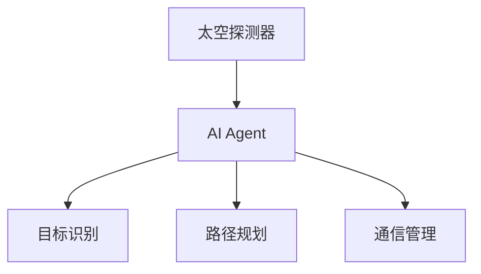
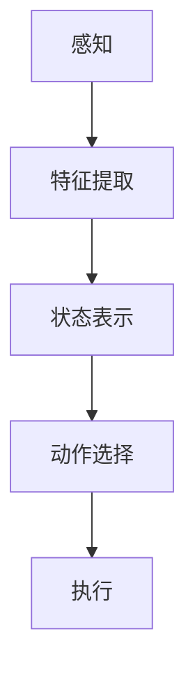
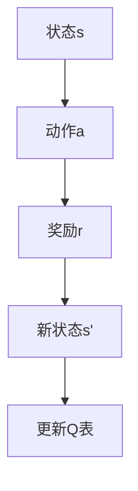
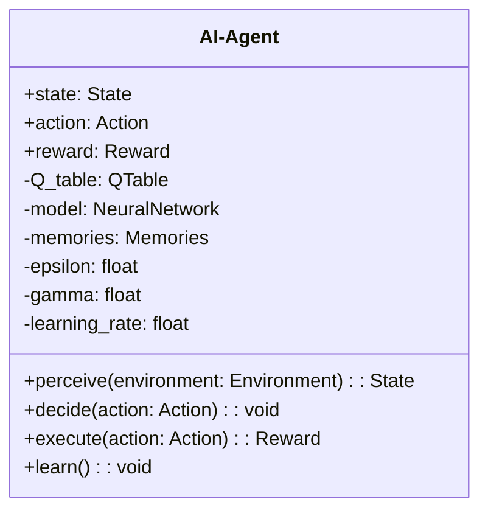
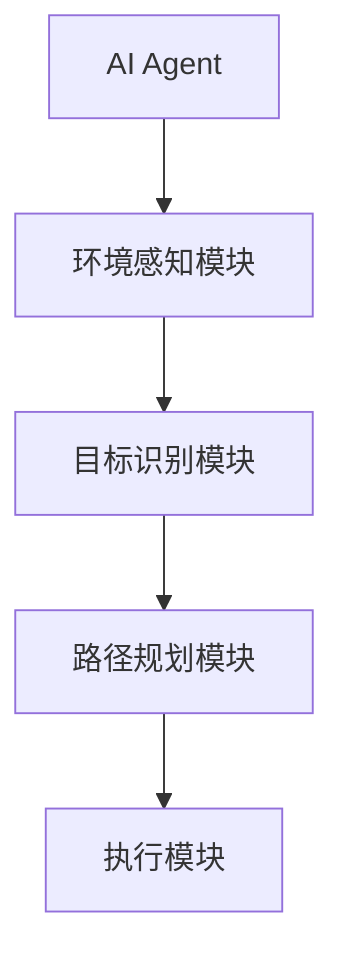

                 


# AI Agent在智能太空探索中的实践

> 关键词：AI Agent, 智能太空探索, 人工智能, 太空任务, 自主决策

> 摘要：本文探讨了AI Agent在智能太空探索中的应用与实践。从AI Agent的基本概念到其在太空任务中的具体应用，详细分析了AI Agent在感知、决策和执行环节中的算法实现与系统架构设计，并结合实际案例，展示了AI Agent在智能太空探索中的巨大潜力。

---

## 第1章 AI Agent与智能太空探索概述

### 1.1 AI Agent的基本概念

AI Agent（人工智能代理）是一种能够感知环境、自主决策并执行任务的智能实体。它通过传感器获取信息，利用算法处理信息，并通过执行器与环境交互。AI Agent的核心特点包括：

- **自主性**：能够在没有外部干预的情况下独立运行。
- **反应性**：能够实时感知环境并做出反应。
- **目标导向性**：基于目标进行决策和行动。

**表1-1：AI Agent与传统自动控制系统的对比**

| 特性                | AI Agent               | 传统控制系统           |
|---------------------|------------------------|-----------------------|
| 决策方式            | 基于学习与推理         | 基于固定规则         |
| 环境适应性          | 强                   | 弱                   |
| 可扩展性            | 强                   | 弱                   |

---

### 1.2 智能太空探索的背景与挑战

太空探索是一项复杂而艰巨的任务，涉及极端环境、通信延迟、资源限制等问题。传统的基于规则的控制系统在面对复杂动态环境时显得力不从心。AI Agent的引入为解决这些问题提供了新的可能性。

**图1-1：AI Agent在智能太空探索中的实体关系图**



---

## 第2章 AI Agent的核心原理与数学模型

### 2.1 AI Agent的感知与决策机制

AI Agent的感知过程涉及从环境中获取数据并进行特征提取。决策过程则基于这些感知信息，通过算法生成最优动作。

**图2-1：AI Agent的决策流程图**



### 2.2 AI Agent的决策算法原理

#### 2.2.1 基于强化学习的决策算法

**DQN算法流程图**



**Python代码示例**

```python
class DQN:
    def __init__(self, state_space, action_space):
        self.state_space = state_space
        self.action_space = action_space
        self.model = self.build_model()

    def build_model(self):
        # 网络结构定义
        pass

    def remember(self, state, action, reward, next_state):
        # 记忆存储
        pass

    def act(self, state):
        # 动作选择
        pass
```

**数学模型**

$$ Q(s,a) = \gamma \max_{a'} Q(s',a') + r $$

---

## 第3章 AI Agent的算法实现与系统架构

### 3.1 基于强化学习的AI Agent实现

#### 3.1.1 DQN算法的实现步骤

1. 初始化网络模型。
2. 环境感知并获取状态。
3. 根据策略选择动作。
4. 执行动作并获取奖励。
5. 更新Q值函数。

#### 3.1.2 算法实现的Python代码示例

```python
import numpy as np

class DQN:
    def __init__(self, state_dim, action_dim):
        self.state_dim = state_dim
        self.action_dim = action_dim
        self.model = self.build_model()

    def build_model(self):
        model = Sequential()
        model.add(Dense(64, input_dim=self.state_dim, activation='relu'))
        model.add(Dense(32, activation='relu'))
        model.add(Dense(self.action_dim, activation='linear'))
        model.compile(loss='mse', optimizer='adam')
        return model

    def remember(self, state, action, reward, next_state):
        # 假设我们有一个记忆库memories，格式为[(state, action, reward, next_state)]
        memories = []
        memories.append((state, action, reward, next_state))

    def act(self, state):
        state = np.array([state])
        prediction = self.model.predict(state)[0]
        action = np.argmax(prediction)
        return action
```

---

## 第4章 系统分析与架构设计

### 4.1 问题场景介绍

在智能太空探索中，AI Agent需要完成目标识别、路径规划和通信管理等任务。这些任务需要AI Agent具备高效的感知和决策能力。

### 4.2 系统功能设计

**图4-1：系统功能模块类图**



### 4.3 系统架构设计

**图4-2：系统架构图**



---

## 第5章 项目实战

### 5.1 环境安装与配置

安装必要的依赖库，如TensorFlow、Keras和OpenAI Gym。

### 5.2 系统核心实现

实现AI Agent的核心算法，包括感知、决策和执行模块。

### 5.3 代码实现与解读

```python
import gym
from tensorflow.keras import models, layers

# 环境初始化
env = gym.make('SpaceExploration-v0')
state_space = env.observation_space.shape[0]
action_space = env.action_space.n

# DQN模型定义
model = models.Sequential()
model.add(layers.Dense(64, activation='relu', input_dim=state_space))
model.add(layers.Dense(32, activation='relu'))
model.add(layers.Dense(action_space, activation='linear'))
model.compile(loss='mse', optimizer='adam')

# 训练过程
def train():
    epsilon = 1.0
    gamma = 0.99
    for episode in range(1000):
        state = env.reset()
        while True:
            if np.random.random() < epsilon:
                action = env.action_space.sample()
            else:
                action = np.argmax(model.predict(np.array([state])))
            next_state, reward, done, _ = env.step(action)
            # 记忆存储并训练
            model.fit([state], [target], epochs=1, verbose=0)
            state = next_state
            if done:
                break
    epsilon = max(epsilon * 0.995, 0.01)

# 执行训练
train()
```

---

## 第6章 最佳实践与总结

### 6.1 小结

AI Agent在智能太空探索中的应用潜力巨大，但实现过程中仍面临诸多挑战。通过不断优化算法和系统架构，AI Agent有望在未来成为智能太空探索的核心技术。

### 6.2 注意事项

- **算法选择**：根据具体任务选择合适的算法。
- **数据质量**：确保训练数据的多样性和代表性。
- **系统安全性**：确保AI Agent的决策过程安全可靠。

### 6.3 拓展阅读

- [1] Mnih, V., et al. "Deep neural networks as general purpose agents." arXiv preprint arXiv:1605.02392 (2016).
- [2] Levine, S. "Learning hand-eye coordination for robotic grasping through deep reinforcement learning." arXiv preprint arXiv:1603.08244 (2016).

---

通过以上内容，我们系统地探讨了AI Agent在智能太空探索中的实践应用，从理论到实现，为读者提供了一个全面的视角。

