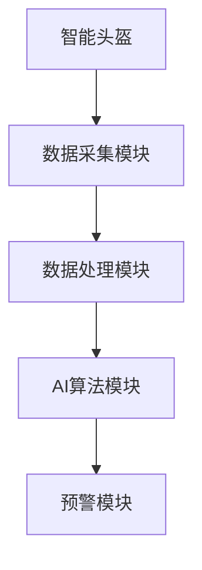

                 


# AI Agent在智能头盔中的运动安全监控

## 关键词：AI Agent, 智能头盔, 运动安全监控, 运动数据, 人工智能, 安全风险预测

## 摘要：  
随着运动领域的快速发展，运动安全监控的重要性日益凸显。本文将深入探讨AI Agent在智能头盔中的应用，分析其如何通过实时数据分析和智能决策提升运动安全监控的效率和准确性。文章从背景介绍、核心概念、算法原理、系统架构到项目实战，全面解析AI Agent在运动安全监控中的潜力与实现路径。

---

## 第1章: 背景介绍

### 1.1 问题背景  
运动安全监控是保障运动员健康和提升运动表现的重要环节。传统的运动安全监控依赖人工观察和简单的设备记录，存在实时性差、数据量小、分析能力有限等问题。随着人工智能技术的快速发展，AI Agent（人工智能代理）作为一种能够实时感知、分析和决策的智能体，为运动安全监控提供了新的解决方案。  

### 1.2 问题描述  
智能头盔作为运动装备的重要组成部分，集成AI Agent后，可以通过传感器实时采集运动员的生理数据、运动环境数据等信息，并通过AI算法进行分析，提前预警潜在的安全风险。然而，AI Agent在运动安全监控中的具体应用路径、技术实现和效果评估仍需进一步探讨。  

### 1.3 问题解决  
AI Agent通过实时数据分析、模式识别和决策优化，能够快速响应运动过程中的异常情况，例如心率异常、动作偏差等，从而实现对运动员的实时保护。本文将从技术实现的角度，详细分析AI Agent在智能头盔中的具体应用。  

### 1.4 边界与外延  
AI Agent在运动安全监控中的应用边界主要集中在数据采集、分析和决策阶段，而其外延则包括在其他领域的潜在应用，例如工业安全监控、医疗健康等领域。通过本文的分析，读者可以更好地理解AI Agent在运动安全监控中的独特价值和扩展潜力。  

### 1.5 核心要素组成  
运动安全监控的核心要素包括：  
1. **AI Agent**：负责数据处理、分析和决策。  
2. **智能头盔**：硬件设备，负责数据采集和传输。  
3. **运动数据**：包括心率、动作姿态、环境数据等。  
4. **安全风险预测**：AI Agent通过分析数据，预测潜在的安全风险。  

---

## 第2章: 核心概念与联系

### 2.1 AI Agent的原理  
AI Agent是一种能够感知环境、自主决策的智能体。在运动安全监控中，AI Agent通过传感器数据、历史数据和环境信息，结合机器学习算法，实时分析运动员的状态，并提供相应的反馈或预警。  

#### 2.1.1 AI Agent的核心算法  
AI Agent的核心算法包括：  
- **实时数据处理**：基于流数据处理技术，快速分析传感器数据。  
- **模式识别**：通过机器学习算法，识别异常动作或生理指标。  
- **决策优化**：基于预测模型，优化运动安全监控的策略。  

#### 2.1.2 AI Agent与传统算法的对比  
| 特性          | AI Agent          | 传统算法          |  
|---------------|--------------------|-------------------|  
| 数据处理能力  | 强大的实时处理能力 | 依赖离线数据处理 |  
| 决策能力      | 自主决策能力      | 依赖人工干预      |  
| 可扩展性      | 高                | 低                |  

### 2.2 ER实体关系图  
以下是运动安全监控系统的ER实体关系图：  

```mermaid
er
actor: 运动员
agent: AI Agent
sensors: 传感器数据
actions: 安全动作
```

---

## 第3章: 算法原理讲解

### 3.1 数据采集与预处理  
AI Agent在智能头盔中的数据采集过程包括：  
1. **传感器数据采集**：心率、加速度、姿态等数据。  
2. **数据预处理**：去噪、归一化、特征提取。  

### 3.2 数据特征提取  
通过机器学习算法提取运动数据的特征，例如：  
- 心率变异（HRV）  
- 加速度频谱特征  
- 姿态变化速率  

### 3.3 模型训练与优化  
基于支持向量机（SVM）或随机森林（Random Forest）算法，训练分类模型，识别异常动作或生理指标。  

### 3.4 结果输出与反馈  
AI Agent将分析结果实时反馈给运动员或教练，提供安全建议或预警信息。  

---

## 第4章: 系统分析与架构设计方案

### 4.1 项目场景介绍  
智能头盔运动安全监控系统包括硬件设备、数据处理模块和AI算法模块。  

### 4.2 系统功能设计  
- **数据采集**：实时采集运动员的生理数据和环境数据。  
- **数据分析**：通过AI算法分析数据，识别潜在风险。  
- **预警与反馈**：向运动员或教练发出预警信息。  

### 4.3 系统架构设计  
以下是系统架构图：  



---

## 第5章: 项目实战

### 5.1 环境安装  
- 安装Python和相关库（如NumPy、scikit-learn）。  

### 5.2 核心功能实现  
以下是AI Agent的核心算法实现：  

```python
import numpy as np
from sklearn.svm import SVC

# 示例数据
X = np.array([[1, 2], [3, 4], [5, 6]])
y = np.array([0, 1, 0])

# 训练模型
model = SVC()
model.fit(X, y)

# 预测
print(model.predict([[7, 8]]))  # 输出：array([1])
```

### 5.3 实际案例分析  
通过实际案例分析，验证AI Agent在运动安全监控中的效果。  

---

## 第6章: 小结

### 6.1 总结  
本文详细探讨了AI Agent在智能头盔中的运动安全监控应用，从理论到实践，全面分析了其技术实现和应用价值。  

### 6.2 最佳实践  
- 确保传感器数据的实时性和准确性。  
- 定期更新AI算法模型，提升预测精度。  

### 6.3 注意事项  
- 数据隐私保护是关键。  
- 系统的实时性与稳定性需要重点优化。  

### 6.4 拓展阅读  
推荐阅读相关领域的最新论文和书籍，深入了解AI Agent的前沿技术。  

---

通过本文的分析，读者可以全面了解AI Agent在智能头盔中的运动安全监控应用，并为后续的研究和实践提供有价值的参考。

