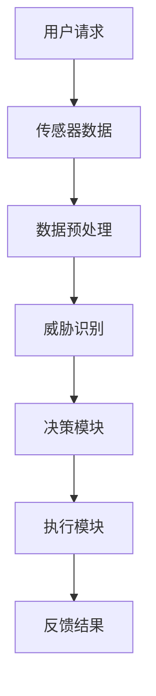
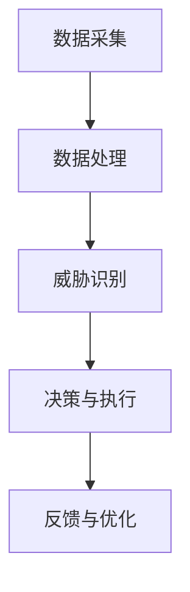
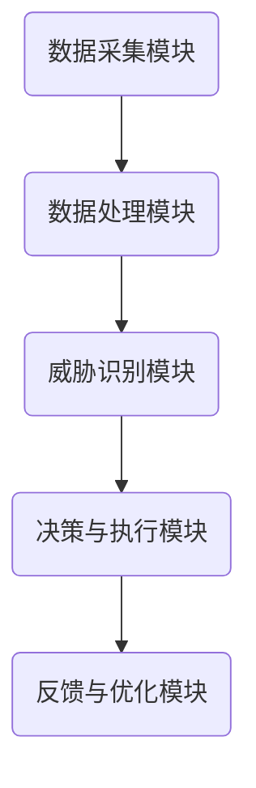

                 


# AI Agent在智能安防系统中的角色

> 关键词：AI Agent, 智能安防系统, 算法原理, 系统架构, 项目实战

> 摘要：本文详细探讨了AI Agent在智能安防系统中的角色，从核心概念、算法原理、系统架构到项目实战，全面分析了AI Agent如何在智能安防中发挥作用。通过实际案例分析和代码实现，展示了AI Agent在智能安防中的广泛应用和巨大潜力。

---

## 第一部分: AI Agent与智能安防系统概述

### 第1章: AI Agent与智能安防系统背景

#### 1.1 AI Agent的基本概念

##### 1.1.1 什么是AI Agent
AI Agent（人工智能代理）是指在计算机系统中，能够感知环境、自主决策并执行任务的智能实体。它能够根据输入的信息，通过学习和推理，做出最优决策并执行相应的操作。

##### 1.1.2 AI Agent的核心特征
- **自主性**：AI Agent能够在没有外部干预的情况下自主运行。
- **反应性**：能够实时感知环境变化并做出反应。
- **目标导向性**：具有明确的目标，能够在复杂环境中找到最优解决方案。
- **学习能力**：通过数据和反馈不断优化自身的决策模型。

##### 1.1.3 AI Agent与传统自动化的区别
| 特性       | 传统自动化            | AI Agent             |
|------------|-----------------------|-----------------------|
| 决策方式    | 预设规则，固定流程    | 灵活决策，动态调整    |
| 学习能力    | 无                    | 具备学习能力          |
| 环境适应性  | 较差                 | 较强                 |

#### 1.2 智能安防系统的定义与特点

##### 1.2.1 智能安防系统的定义
智能安防系统是一种基于人工智能、大数据、物联网等技术，实现对安全威胁的实时监测、预警、识别和处置的综合系统。它能够通过智能算法和传感器网络，实现对复杂环境的全面感知和高效管理。

##### 1.2.2 智能安防系统的核心功能
- **实时监测**：通过传感器和摄像头，实时采集环境数据。
- **智能识别**：利用AI技术，识别潜在威胁和异常行为。
- **决策与执行**：根据识别结果，自主决策并执行相应的安全措施。
- **数据存储与分析**：存储历史数据，并通过数据分析优化系统性能。

##### 1.2.3 智能安防系统应用场景
- **家庭安防**：通过智能门锁、摄像头等设备，实现家庭安全监控。
- **企业安防**：保护企业资产，防止入侵和盗窃。
- **公共安全**：在公共场所，实时监测潜在的安全威胁，如火灾、恐怖袭击等。
- **交通安防**：在交通系统中，实时监测交通事故和异常行为。

#### 1.3 AI Agent在智能安防中的角色定位

##### 1.3.1 AI Agent在智能安防中的核心作用
AI Agent作为智能安防系统的核心组件，负责系统的感知、决策和执行。它能够通过传感器获取环境信息，利用算法分析数据，并根据分析结果做出相应的决策。

##### 1.3.2 AI Agent与其他技术的协同关系
在智能安防系统中，AI Agent与多种技术协同工作，如：
- **物联网技术**：通过传感器和设备，实时采集环境数据。
- **大数据技术**：存储和分析海量数据，为AI Agent提供决策支持。
- **云计算技术**：提供强大的计算能力和存储空间，支持AI Agent的运行。

##### 1.3.3 AI Agent在智能安防中的发展趋势
随着技术的进步，AI Agent在智能安防中的应用将更加广泛和深入。未来的趋势包括：
- **自主决策能力的提升**：AI Agent将更加智能化，能够独立完成复杂的决策任务。
- **多模态感知能力**：结合视觉、听觉等多种感知方式，提高系统的感知能力。
- **边缘计算的应用**：通过边缘计算，实现低延迟、高效率的实时决策。

#### 1.4 本章小结
本章主要介绍了AI Agent的基本概念、核心特征以及智能安防系统的定义、特点和应用场景。同时，还探讨了AI Agent在智能安防中的角色定位及其发展趋势。

---

## 第二部分: AI Agent的核心概念与技术原理

### 第2章: AI Agent的核心概念与联系

#### 2.1 AI Agent的核心概念

##### 2.1.1 AI Agent的定义与属性
AI Agent是一种具有智能特性的实体，能够感知环境、自主决策并执行任务。其核心属性包括自主性、反应性、目标导向性和学习能力。

##### 2.1.2 AI Agent的分类与特征
AI Agent可以根据功能和应用场景进行分类，常见的分类包括：
- **基于规则的AI Agent**：通过预设的规则和逻辑进行决策。
- **基于学习的AI Agent**：通过机器学习算法，从数据中学习和优化决策模型。
- **基于推理的AI Agent**：通过逻辑推理，解决复杂问题。

##### 2.1.3 AI Agent的实体关系图（ER图）

```mermaid
erDiagram
    actor 用户
    actor 管理员
    actor 系统
    class 环境
    class 传感器
    class 数据存储
    class AI Agent
    用户 --> 系统 : 请求服务
    管理员 --> 系统 : 管理系统
    环境 --> 传感器 : 提供数据
    传感器 --> 系统 : 传输数据
    系统 --> AI Agent : 调用AI服务
    AI Agent --> 数据存储 : 存储决策结果
```

#### 2.2 AI Agent与智能安防系统的关联

##### 2.2.1 AI Agent在智能安防中的功能模块
AI Agent在智能安防系统中主要负责以下几个功能模块：
- **数据采集与处理**：接收传感器和摄像头的数据，进行预处理和特征提取。
- **威胁识别与预警**：通过算法分析数据，识别潜在的威胁并发出预警。
- **决策与执行**：根据识别结果，决策并执行相应的安全措施。

##### 2.2.2 AI Agent与智能安防系统的交互流程



##### 2.2.3 AI Agent在智能安防中的价值体现
- **提高安全性**：通过智能识别和自主决策，减少人为失误，提高系统的安全性。
- **降低运营成本**：自动化处理，减少人力投入，降低运营成本。
- **实时响应**：快速识别和响应潜在威胁，提升系统的实时性。

#### 2.3 AI Agent的核心算法原理

##### 2.3.1 AI Agent的决策算法
AI Agent的决策算法主要包括：
- **强化学习算法**：通过奖励机制，优化决策模型。
- **监督学习算法**：通过标注数据，训练决策模型。
- **无监督学习算法**：通过聚类分析，发现潜在的威胁模式。

##### 2.3.2 AI Agent的学习机制
AI Agent的学习机制主要包括：
- **在线学习**：实时更新模型，适应环境变化。
- **离线学习**：利用历史数据，优化模型性能。

##### 2.3.3 AI Agent的推理过程
AI Agent的推理过程主要包括：
- **知识表示**：将问题和数据转化为可计算的形式。
- **逻辑推理**：通过逻辑规则，推理出最优解决方案。
- **概率推理**：通过概率模型，评估不同决策的可能性。

#### 2.4 本章小结
本章主要介绍了AI Agent的核心概念、分类与特征，以及与智能安防系统的关联。同时，还详细讲解了AI Agent的核心算法原理和学习机制。

---

## 第三部分: AI Agent的算法原理与数学模型

### 第3章: AI Agent的算法原理

#### 3.1 AI Agent的核心算法

##### 3.1.1 强化学习算法
强化学习是一种通过与环境交互，逐步优化决策模型的算法。其核心思想是通过试错，找到最优策略。

##### 3.1.2 监督学习算法
监督学习是一种通过标注数据，训练模型进行分类或回归的算法。其核心思想是通过训练数据，学习输入与输出之间的关系。

##### 3.1.3 无监督学习算法
无监督学习是一种通过聚类分析，发现数据内在结构的算法。其核心思想是通过数据的相似性，将数据分为不同的类别。

#### 3.2 AI Agent的决策流程

##### 3.2.1 状态识别与分析
状态识别是通过传感器和摄像头，获取环境数据，并将其转化为可计算的特征。

##### 3.2.2 动作选择与执行
动作选择是通过算法，根据当前状态，选择最优动作。动作执行是将选择的动作发送到执行模块，实现系统的实际操作。

##### 3.2.3 反馈机制与优化
反馈机制是通过系统的实际效果，评估决策的优劣，并根据反馈结果，优化决策模型。

#### 3.3 AI Agent的数学模型

##### 3.3.1 状态空间模型
状态空间模型描述了系统可能的状态及其转移关系。例如：
$$ S = \{s_1, s_2, ..., s_n\} $$
其中，$s_i$ 表示系统的一个状态。

##### 3.3.2 动作空间模型
动作空间模型描述了系统可能的动作及其对应的结果。例如：
$$ A = \{a_1, a_2, ..., a_m\} $$
其中，$a_j$ 表示系统的一个动作。

##### 3.3.3 奖励函数模型
奖励函数模型描述了系统对每个动作的奖励值。例如：
$$ R(s, a) = r_{ij} $$
其中，$r_{ij}$ 表示在状态$s_i$下执行动作$a_j$的奖励值。

#### 3.4 本章小结
本章主要介绍了AI Agent的核心算法、决策流程和数学模型。通过算法和模型的结合，AI Agent能够实现对智能安防系统的高效管理。

---

## 第四部分: AI Agent在智能安防中的系统架构与设计

### 第4章: 智能安防系统的架构设计

#### 4.1 智能安防系统的整体架构

##### 4.1.1 系统功能模块划分
智能安防系统的功能模块包括：
- **数据采集模块**：通过传感器和摄像头，采集环境数据。
- **数据处理模块**：对采集的数据进行预处理和特征提取。
- **威胁识别模块**：通过算法，识别潜在的威胁。
- **决策与执行模块**：根据识别结果，决策并执行相应的安全措施。
- **反馈与优化模块**：根据执行结果，优化决策模型。

##### 4.1.2 系统组件之间的关系
系统组件之间的关系可以用以下流程图表示：



##### 4.1.3 系统的可扩展性设计
系统的可扩展性设计主要体现在模块化设计和接口标准化上。通过模块化设计，可以方便地添加新的功能模块；通过接口标准化，可以方便地与第三方系统进行集成。

#### 4.2 AI Agent在系统中的位置

##### 4.2.1 AI Agent的功能模块设计
AI Agent的功能模块包括：
- **感知模块**：通过传感器和摄像头，感知环境数据。
- **决策模块**：通过算法，分析数据并做出决策。
- **执行模块**：根据决策结果，执行相应的操作。

##### 4.2.2 AI Agent与前端设备的交互
AI Agent与前端设备的交互主要通过传感器和摄像头实现。前端设备将采集的数据发送给AI Agent，AI Agent通过算法分析数据，并将决策结果反馈给前端设备。

##### 4.2.3 AI Agent与后端系统的集成
AI Agent与后端系统的集成主要通过API接口实现。后端系统提供数据存储和分析功能，AI Agent通过调用API接口，实现与后端系统的数据交互。

#### 4.3 系统接口设计

##### 4.3.1 AI Agent与传感器的接口
AI Agent与传感器的接口主要通过UART或I2C等通信协议实现。传感器将采集的数据发送给AI Agent，AI Agent通过数据处理模块，对数据进行预处理。

##### 4.3.2 AI Agent与数据存储的接口
AI Agent与数据存储的接口主要通过HTTP或FTP等协议实现。AI Agent将处理后的数据存储到数据库中，并根据需要从数据库中读取数据。

##### 4.3.3 AI Agent与用户的接口
AI Agent与用户的接口主要通过GUI或API实现。用户可以通过GUI界面，与AI Agent进行交互，或者通过API调用AI Agent的服务。

#### 4.4 本章小结
本章主要介绍了智能安防系统的整体架构，AI Agent在系统中的位置，以及系统的接口设计。通过模块化设计和接口标准化，系统具有良好的可扩展性和可维护性。

---

## 第五部分: AI Agent的项目实战

### 第5章: AI Agent的项目实战

#### 5.1 项目背景与需求分析

##### 5.1.1 项目背景
随着智能化安防需求的增加，AI Agent在智能安防中的应用越来越广泛。本项目旨在开发一个基于AI Agent的智能安防系统，实现对家庭或企业的安全监控。

##### 5.1.2 项目需求
- **实时监测**：通过传感器和摄像头，实时监测环境数据。
- **智能识别**：利用AI算法，识别潜在威胁和异常行为。
- **决策与执行**：根据识别结果，自主决策并执行相应的安全措施。

#### 5.2 系统功能设计

##### 5.2.1 功能模块划分
系统功能模块包括：
- **数据采集模块**：通过传感器和摄像头，采集环境数据。
- **数据处理模块**：对采集的数据进行预处理和特征提取。
- **威胁识别模块**：通过算法，识别潜在的威胁。
- **决策与执行模块**：根据识别结果，决策并执行相应的安全措施。
- **反馈与优化模块**：根据执行结果，优化决策模型。

##### 5.2.2 功能流程设计
功能流程设计可以用以下流程图表示：


#### 5.3 系统架构设计

##### 5.3.1 系统架构图
系统架构图可以用以下Mermaid图表示：



##### 5.3.2 模块之间的交互
模块之间的交互主要通过API接口实现。数据采集模块将数据发送给数据处理模块，数据处理模块将处理后的数据发送给威胁识别模块，威胁识别模块将识别结果发送给决策与执行模块，决策与执行模块根据识别结果执行相应的操作，并将执行结果反馈给反馈与优化模块。

#### 5.4 系统接口设计

##### 5.4.1 数据采集接口
数据采集接口主要通过GPIO或串口实现。传感器将采集的数据发送给数据采集模块，数据采集模块通过API接口将数据发送给数据处理模块。

##### 5.4.2 数据处理接口
数据处理接口主要通过HTTP或RPC实现。数据处理模块将处理后的数据通过API接口发送给威胁识别模块。

##### 5.4.3 决策与执行接口
决策与执行接口主要通过MQTT或WebSocket实现。决策与执行模块通过API接口将决策结果发送给执行模块，执行模块根据决策结果执行相应的操作。

#### 5.5 项目实战代码实现

##### 5.5.1 环境安装
项目实战需要以下环境：
- **Python 3.8及以上版本**
- **TensorFlow 2.0及以上版本**
- **OpenCV 4.0及以上版本**
- **传感器和摄像头设备**

##### 5.5.2 核心代码实现

```python
import tensorflow as tf
import cv2

# 数据采集模块
def采集数据():
    cap = cv2.VideoCapture(0)
    while True:
        ret, frame = cap.read()
        if not ret:
            break
        # 数据处理
        gray = cv2.cvtColor(frame, cv2.COLOR_BGR2GRAY)
        # 威胁识别
        if 识别威胁(gray):
            # 决策与执行
            执行操作()
    cap.release()

# 数据处理模块
def数据处理(data):
    # 数据预处理
    processed_data = data / 255.0
    return processed_data

# 威胁识别模块
def识别威胁(data):
    model = tf.keras.models.load_model('威胁识别模型.h5')
    prediction = model.predict(data)
    if prediction[0][0] > 0.9:
        return True
    else:
        return False

# 决策与执行模块
def执行操作():
    print("检测到威胁，启动安全措施！")
    # 执行相应的安全措施，例如报警、锁门等
```

##### 5.5.3 代码应用解读与分析
以上代码实现了一个简单的智能安防系统。数据采集模块通过摄像头采集视频流，数据处理模块对图像进行灰度化处理，威胁识别模块利用预训练的深度学习模型，识别图像中的威胁。如果识别到威胁，决策与执行模块将启动相应的安全措施。

#### 5.6 实际案例分析与详细讲解
以家庭安防为例，假设系统检测到有人非法闯入。数据采集模块通过摄像头采集到视频流，数据处理模块将视频流转换为灰度图像，威胁识别模块通过深度学习模型，识别出图像中有人非法闯入。决策与执行模块将启动报警系统，并通知用户。

#### 5.7 项目小结
本章通过一个实际项目，详细讲解了AI Agent在智能安防中的应用。通过代码实现和案例分析，展示了AI Agent在智能安防中的实际价值。

---

## 第六部分: 最佳实践与总结

### 第6章: 最佳实践与总结

#### 6.1 最佳实践 tips
- **模块化设计**：将系统划分为多个功能模块，便于维护和扩展。
- **接口标准化**：通过标准化接口，方便与其他系统集成。
- **数据安全**：确保数据的安全性，防止数据泄露。
- **算法优化**：通过不断优化算法，提高系统的识别准确率和决策效率。

#### 6.2 小结
本文详细探讨了AI Agent在智能安防系统中的角色，从核心概念、算法原理、系统架构到项目实战，全面分析了AI Agent如何在智能安防中发挥作用。通过实际案例分析和代码实现，展示了AI Agent在智能安防中的广泛应用和巨大潜力。

#### 6.3 注意事项
- **数据隐私**：在设计智能安防系统时，必须考虑数据隐私问题，确保用户数据的安全。
- **系统稳定性**：系统必须具备高稳定性，确保在关键时刻能够正常运行。
- **算法可解释性**：算法必须具备可解释性，以便在出现问题时，能够快速定位和解决。

#### 6.4 拓展阅读
- **强化学习**：深入学习强化学习的原理和应用。
- **深度学习**：学习深度学习在智能安防中的应用。
- **边缘计算**：研究边缘计算在智能安防中的应用。

---

通过以上内容，我们详细探讨了AI Agent在智能安防系统中的角色。希望本文能够为读者提供有价值的参考和启发。

