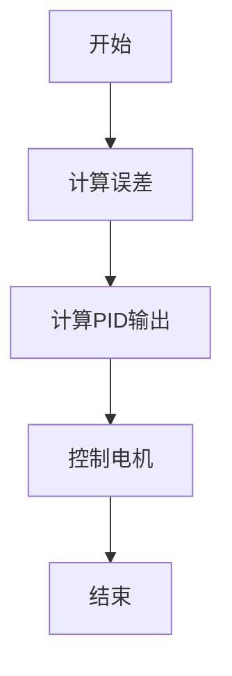
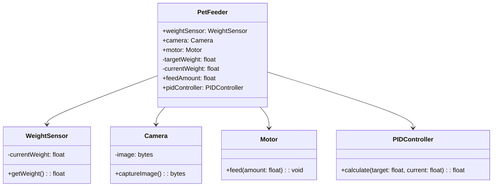
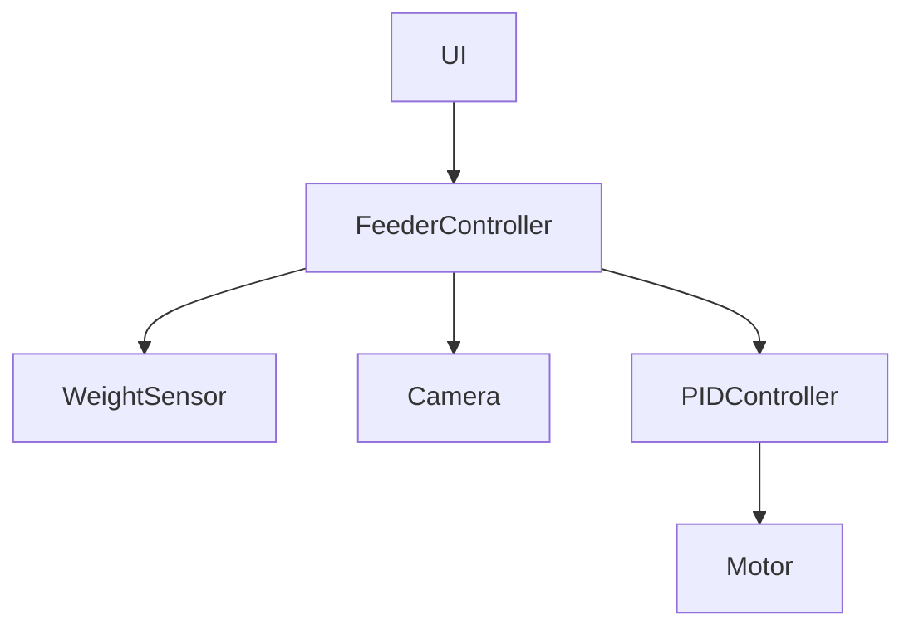
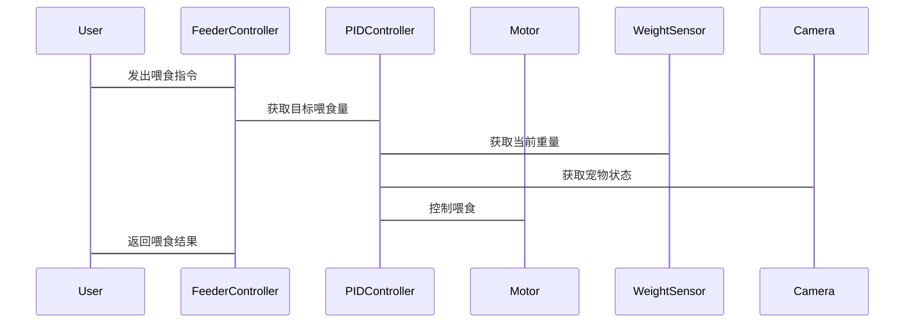

                 


# AI Agent在智能宠物喂食器中的定量控制

## 关键词：AI Agent，智能宠物喂食器，定量控制，PID算法，系统架构设计

## 摘要：  
本文详细探讨了AI Agent在智能宠物喂食器中的定量控制应用。通过分析AI Agent的核心概念、算法原理和系统架构，结合实际项目案例，展示了如何利用AI技术实现精准喂食控制。文章从背景介绍、核心概念、算法实现、系统设计到项目实战，层层深入，为读者提供全面的技术指导。

---

# 第1章: AI Agent与智能宠物喂食器的背景介绍

## 1.1 问题背景  
传统宠物喂食器主要依赖手动操作，存在喂食不规律、定量不准等问题，容易导致宠物肥胖或营养不足。AI Agent通过智能感知、决策和执行，能够实现精准的喂食控制，满足宠物健康需求。

## 1.2 问题描述  
智能宠物喂食器需要实现以下功能：  
- **定时喂食**：根据宠物的作息规律自动启动喂食。  
- **定量控制**：根据宠物体重、活动量等因素调整每次喂食的量。  
- **远程监控**：通过手机APP实时查看喂食记录和宠物状态。  

## 1.3 问题解决  
AI Agent通过传感器数据采集、算法处理和执行机构控制，实现精准喂食。其核心优势在于能够动态调整喂食量，适应宠物的实际需求。

## 1.4 边界与外延  
- 系统边界：仅关注喂食过程，不涉及宠物健康监测的其他功能。  
- 外延：未来可扩展至宠物健康管理、主人远程互动等功能。

---

# 第2章: AI Agent与智能宠物喂食器的核心概念与联系

## 2.1 核心概念原理  
- **AI Agent**：具有感知、决策和执行能力的智能体。  
- **定量控制**：根据传感器数据调整喂食量。  

## 2.2 概念属性对比  

| 比较维度 | AI Agent | 定量控制 |
|----------|----------|----------|
| 核心功能 | 感知、决策、执行 | 调整喂食量 |
| 输入 | 传感器数据、用户指令 | 猫狗体重、活动量 |
| 输出 | 喂食指令 | 定量数据 |

## 2.3 ER实体关系图  
```mermaid
erd
  title 实体关系图
  宠物喂食器 --|{has}|> 喂食记录
  AI Agent --|{controls}|> 定量控制模块
  用户 --|{configures}|> 系统设置
```

---

# 第3章: AI Agent定量控制算法原理

## 3.1 算法原理  

### 3.1.1 数据采集  
通过重量传感器获取当前饲料量，并通过摄像头识别宠物进食情况。  

### 3.1.2 数据处理  
将采集的数据传输到AI Agent，通过算法计算出需要调整的喂食量。  

### 3.1.3 决策算法  
采用PID控制算法，公式为：  
$$ PID = K_p \cdot e + K_i \cdot \int e \, dt + K_d \cdot \frac{de}{dt} $$  
其中，$e$ 是误差，$K_p$、$K_i$、$K_d$ 是比例、积分、微分系数。  

### 3.1.4 执行机构控制  
根据计算结果，控制电机转动，实现精准喂食。  

## 3.2 PID控制流程图  


## 3.3 Python实现  
```python
class PIDController:
    def __init__(self, Kp, Ki, Kd):
        self.Kp = Kp
        self.Ki = Ki
        self.Kd = Kd
        self.error = 0
        self.integral = 0
        self.derivative = 0

    def calculate(self, target, current):
        self.error = target - current
        self.integral += self.error * dt
        self.derivative = (self.error - self.previous_error) / dt
        output = self.Kp * self.error + self.Ki * self.integral + self.Kd * self.derivative
        return output
```

---

# 第4章: 系统分析与架构设计

## 4.1 项目背景  
本项目旨在设计一个基于AI Agent的智能宠物喂食器，实现精准喂食控制。  

## 4.2 系统功能设计  

### 4.2.1 领域模型类图  


## 4.3 系统架构设计  

### 4.3.1 系统架构图  


## 4.4 接口设计  
- **输入接口**：通过UI或API接收用户指令。  
- **输出接口**：驱动电机和传感器。  

## 4.5 交互流程图  


---

# 第5章: 项目实战

## 5.1 环境搭建  
- **硬件**：Raspberry Pi、电机、重量传感器、摄像头。  
- **软件**：Python、Raspbian系统。  

## 5.2 核心代码实现  

### 5.2.1 数据采集代码  
```python
class WeightSensor:
    def __init__(self):
        self.weight = 0.0

    def get_weight(self):
        return self.weight
```

### 5.2.2 PID控制代码  
```python
class PIDController:
    def __init__(self, Kp, Ki, Kd):
        self.Kp = Kp
        self.Ki = Ki
        self.Kd = Kd
        self.error = 0
        self.integral = 0
        self.derivative = 0

    def calculate(self, target, current):
        self.error = target - current
        self.integral += self.error * dt
        self.derivative = (self.error - previous_error) / dt
        output = self.Kp * self.error + self.Ki * self.integral + self.Kd * self.derivative
        return output
```

### 5.2.3 系统实现代码  
```python
class PetFeeder:
    def __init__(self):
        self.weight_sensor = WeightSensor()
        self.pid_controller = PIDController(0.5, 0.1, 0.1)
        self.motor = Motor()

    def feed_pet(self, target_weight):
        current_weight = self.weight_sensor.get_weight()
        feed_amount = self.pid_controller.calculate(target_weight, current_weight)
        self.motor.feed(feed_amount)
```

## 5.3 代码解读  
- **WeightSensor**：负责采集当前重量。  
- **PIDController**：计算需要调整的喂食量。  
- **PetFeeder**：协调各模块完成喂食任务。  

## 5.4 实际案例分析  
假设一只宠物目标体重为10kg，当前体重为9.5kg，PID算法计算出需要增加0.5kg的饲料。系统驱动电机，将饲料投放到宠物面前。

---

# 第6章: 最佳实践与总结

## 6.1 小结  
本文详细介绍了AI Agent在智能宠物喂食器中的应用，从背景、算法到系统设计，全面解析了实现精准喂食控制的过程。

## 6.2 注意事项  
- 确保传感器的精度和稳定性。  
- 定期校准系统，防止误差积累。  
- 注意数据隐私，避免用户信息泄露。  

## 6.3 拓展阅读  
- **书籍**：《AI in Smart Devices》  
- **技术博客**：https://ai4pets.com  

---

# 结语  
通过本文的学习，读者可以深入了解AI Agent在智能宠物喂食器中的应用，掌握定量控制的核心算法和系统设计方法，为后续的项目开发提供参考。

