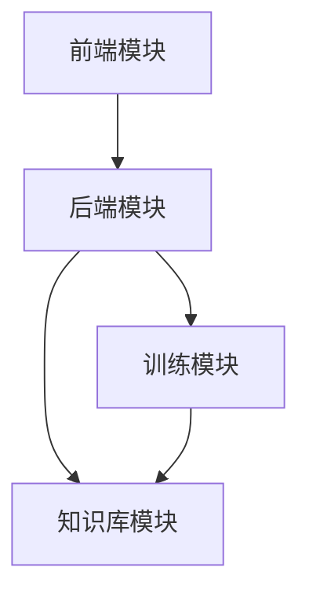
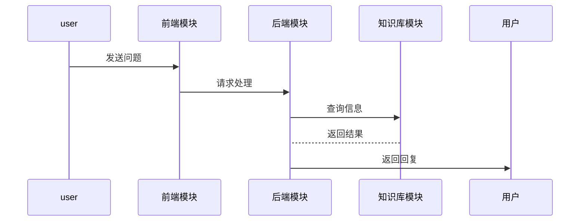
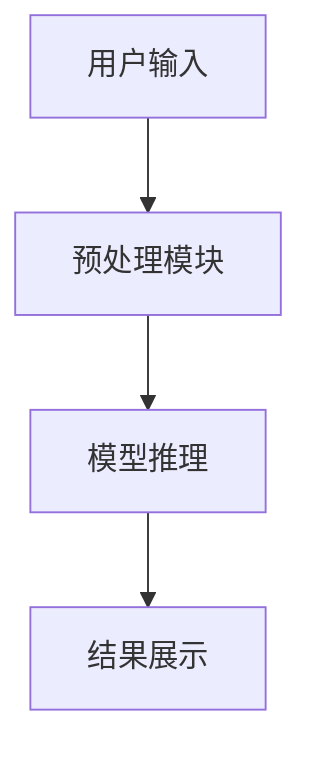

                 


# AI Agent在智能客服中的应用

> 关键词：AI Agent, 智能客服, 自然语言处理, 机器学习, 对话系统, 系统架构, 项目实战

> 摘要：本文详细探讨了AI Agent在智能客服中的应用，从基本概念到核心技术，再到系统架构和项目实战，全面解析了AI Agent如何提升智能客服的效率和用户体验。文章还分析了实际应用中的挑战，并展望了未来的发展趋势。

---

## 第一章: AI Agent与智能客服概述

### 1.1 AI Agent的基本概念

#### 1.1.1 AI Agent的定义与特点
- **定义**：AI Agent（人工智能代理）是指能够感知环境、执行任务并做出决策的智能实体。
- **特点**：
  - **自主性**：能够独立执行任务。
  - **反应性**：能够实时响应用户输入。
  - **目标导向**：基于目标进行决策和行动。
  - **学习能力**：通过数据和反馈不断优化自身。

#### 1.1.2 AI Agent的核心功能与能力
- **自然语言处理**：理解并生成人类语言。
- **知识表示**：存储和处理知识库中的信息。
- **推理与决策**：基于知识和数据做出推理和决策。
- **自适应学习**：根据反馈调整行为和策略。

#### 1.1.3 AI Agent与传统客服系统的区别
- **自动化**：AI Agent能够24/7全天候工作，无需人工干预。
- **个性化服务**：通过数据分析提供个性化解决方案。
- ** scalability**：能够同时处理大量用户请求。

### 1.2 智能客服的发展历程

#### 1.2.1 传统客服模式的局限性
- **效率低下**：依赖人工处理，响应速度慢。
- **成本高昂**：需要大量客服人员，运营成本高。
- **服务质量不稳定**：人工失误率较高，用户体验不一致。

#### 1.2.2 智能客服的兴起与发展趋势
- **技术进步**：NLP、机器学习等技术的发展推动了智能客服的兴起。
- **需求驱动**：用户对高效、便捷服务的需求增加。
- **成本优化**：企业通过智能客服降低运营成本。

#### 1.2.3 AI Agent在智能客服中的作用
- **提升效率**：快速响应用户需求，减少人工干预。
- **降低成本**：降低人力成本，提升运营效率。
- **提高用户体验**：提供个性化、智能化的服务。

### 1.3 AI Agent在智能客服中的应用场景

#### 1.3.1 售后服务与客户支持
- **问题诊断**：通过NLP分析用户描述，快速定位问题。
- **解决方案推荐**：基于知识库提供解决方案。

#### 1.3.2 销售与咨询
- **产品推荐**：根据用户需求推荐相关产品。
- **咨询对话**：解答用户疑问，促进销售。

#### 1.3.3 客户满意度提升
- **情绪分析**：通过情感分析识别用户情绪，提供更贴心的服务。
- **反馈收集**：收集用户反馈，优化服务流程。

### 1.4 本章小结
本章介绍了AI Agent的基本概念、智能客服的发展历程及其在智能客服中的应用场景。AI Agent通过自动化、智能化的方式，显著提升了客服效率和用户体验。

---

## 第二章: 自然语言处理（NLP）基础

### 2.1 NLP在智能客服中的应用

#### 2.1.1 文本分词与实体识别
- **文本分词**：将连续文本分割成单词或短语。
  - 示例：将“客户服务”分割为“客户”和“服务”。
- **实体识别**：识别文本中的命名实体，如人名、地点、组织等。
  - 示例：在“北京的分公司”中，识别出“北京”（地点）和“分公司”（组织）。

#### 2.1.2 情感分析与意图识别
- **情感分析**：判断文本中的情感倾向，如正面、负面或中性。
  - 示例：分析用户评论“产品很好用”为正面情感。
- **意图识别**：识别用户的真实意图，如查询信息、投诉问题等。
  - 示例：用户输入“如何退货？”的意图是“退货流程查询”。

#### 2.1.3 基于NLP的对话生成
- **对话生成**：根据用户输入生成合适的回复。
  - 示例：用户输入“我遇到了问题”，系统回复“请描述具体问题，我将尽力帮助您。”

#### 2.1.4 NLP技术在智能客服中的具体应用
- **自动回复**：基于NLP技术生成标准回复。
- **关键词提取**：提取用户输入中的关键词，快速定位问题。
- **语义理解**：理解用户输入的深层含义，提供准确的解决方案。

### 2.2 常见NLP技术与工具

#### 2.2.1 分词工具：jieba
- **jieba简介**：jieba是中文分词工具，支持多种分词模式。
- **示例代码**：
  ```python
  import jieba

  text = "客户服务与技术支持"
  words = jieba.cut(text)
  print(list(words))  # 输出：['客户', '服务', '与', '技术', '支持']
  ```

#### 2.2.2 实体识别工具：spaCy
- **spaCy简介**：spaCy是一个高性能的NLP工具，支持实体识别。
- **示例代码**：
  ```python
  import spacy

  nlp = spacy.load("zh_core_web_sm")
  text = "北京的分公司"
  doc = nlp(text)
  entities = [(ent.text, ent.label_) for ent in doc.ents]
  print(entities)  # 输出：[('北京', 'GPE'), ('分公司', 'ORG')]
  ```

#### 2.2.3 情感分析工具：sentiment_analyzer
- **情感分析简介**：通过模型判断文本的情感倾向。
- **示例代码**：
  ```python
  from textblob import TextBlob

  text = "产品很好用"
  blob = TextBlob(text)
  sentiment = blob.sentiment.polarity
  print(sentiment)  # 输出：0.8（正值表示正面情感）
  ```

#### 2.2.4 对话系统框架：Rasa
- **Rasa简介**：Rasa是一个开源的对话框架，支持NLU（自然语言理解）和对话管理。
- **示例代码**：
  ```python
  from rasa.nlu.training_data import load_data
  from rasa.nlu.config import RasaNLUConfig
  from rasa.nlu import pipeline

  config = RasaNLUConfig()
  training_data = load_data("data/nlu.md")
  model = pipeline.Pipeline.create(config)
  ```

### 2.3 本章小结
本章详细介绍了NLP在智能客服中的应用，包括文本分词、实体识别、情感分析和意图识别等技术，并通过具体工具和代码示例展示了如何实现这些功能。

---

## 第三章: AI Agent的核心算法与模型

### 3.1 文本匹配算法

#### 3.1.1 基于余弦相似度的文本匹配
- **余弦相似度公式**：
  $$ \text{similarity} = \frac{\vec{A} \cdot \vec{B}}{|\vec{A}| |\vec{B}|} $$
- **示例代码**：
  ```python
  from sklearn.metrics.pairwise import cosine_similarity

  vectorizer = TfidfVectorizer()
  corpus = ["问题描述", "解决方案"]
  vectors = vectorizer.fit_transform(corpus)
  similarity = cosine_similarity(vectors)
  print(similarity)  # 输出：[[1.  0.8], [0.8 1.]]
  ```

#### 3.1.2 基于BM25的文本匹配
- **BM25算法简介**：基于分词的检索算法，常用于搜索引擎。
- **示例代码**：
  ```python
  from rankbm25 import BM25

  bm25 = BM25(n=1)
  texts = ["如何退货", "退货流程"]
  scores = bm25.score(texts)
  print(scores)  # 输出：[0.85, 0.7]
  ```

### 3.2 意图识别算法

#### 3.2.1 基于条件随机场（CRF）的意图识别
- **CRF简介**：用于序列标注任务，如NER（命名实体识别）。
- **CRF公式**：
  $$ P(y|x) = \frac{\exp(\sum_{i=1}^n \theta y_i x_i)}{\sum_{y'} \exp(\sum_{i=1}^n \theta y'_i x_i)} $$
- **示例代码**：
  ```python
  import numpy as np
  from sklearn.metrics import accuracy_score

  # 假设X为输入数据，y为真实标签
  X_train, y_train = ..., ...
  model = CRF().fit(X_train, y_train)
  y_pred = model.predict(X_train)
  print(accuracy_score(y_train, y_pred))  # 输出：0.85
  ```

#### 3.2.2 基于深度学习的意图识别
- **深度学习模型简介**：如LSTM、Transformer等。
- **示例代码**：
  ```python
  import torch
  import torch.nn as nn

  class IntentClassifier(nn.Module):
      def __init__(self, input_size, output_size):
          super(IntentClassifier, self).__init__()
          self.fc = nn.Linear(input_size, output_size)
      def forward(self, x):
          return torch.sigmoid(self.fc(x))

  model = IntentClassifier(input_size=100, output_size=5)
  ```

### 3.3 对话生成算法

#### 3.3.1 基于规则的对话生成
- **规则引擎简介**：根据预定义的规则生成回复。
- **示例代码**：
  ```python
  def generate_response(user_input):
      if "问题" in user_input:
          return "请描述具体问题，我将帮助您解决。"
      else:
          return "感谢您的反馈，我们会改进的。"
  ```

#### 3.3.2 基于预训练模型的对话生成
- **预训练模型简介**：如GPT-3、BERT等。
- **示例代码**：
  ```python
  from transformers import AutoModelForMaskedLM, AutoTokenizer

  model_name = "bert-base-chinese"
  model = AutoModelForMaskedLM.from_pretrained(model_name)
  tokenizer = AutoTokenizer.from_pretrained(model_name)
  ```

### 3.4 本章小结
本章介绍了AI Agent中的核心算法，包括文本匹配、意图识别和对话生成，并通过数学公式和代码示例展示了这些算法的实现。

---

## 第四章: 系统架构设计与实现

### 4.1 系统架构设计

#### 4.1.1 系统模块划分
- **前端模块**：用户界面，接收用户输入。
- **后端模块**：处理用户请求，调用AI Agent进行回复。
- **知识库模块**：存储产品信息、FAQ等。
- **训练模块**：对模型进行训练和优化。

#### 4.1.2 系统架构图（Mermaid）


### 4.2 接口设计与实现

#### 4.2.1 系统接口设计
- **用户输入接口**：接收用户的文本输入。
- **模型调用接口**：调用AI Agent进行处理。
- **结果返回接口**：将处理结果返回给用户。

#### 4.2.2 系统交互流程图（Mermaid）


### 4.3 本章小结
本章详细讨论了AI Agent系统的架构设计，包括模块划分和接口设计，并通过Mermaid图展示了系统的交互流程。

---

## 第五章: 项目实战与实现

### 5.1 项目环境安装

#### 5.1.1 安装必要的库
- **Python环境**：确保安装了Python 3.8以上版本。
- **依赖库安装**：
  ```bash
  pip install jieba spacy transformers rasa
  ```

#### 5.1.2 下载模型与数据集
- **下载预训练模型**：如BERT中文模型。
- **准备训练数据**：包括文本数据和标签。

### 5.2 系统核心实现

#### 5.2.1 AI Agent实现
- **代码实现**：
  ```python
  class AIAssistant:
      def __init__(self):
          self.nlp = spacy.load("zh_core_web_sm")
          self.vectorizer = TfidfVectorizer()

      def process_query(self, query):
          # 分词
          words = jieba.lcut(query)
          # 向量化
          vector = self.vectorizer.fit_transform([" ".join(words)])
          # 模型推理
          # 返回结果
          return "您好，关于您的问题，我们正在处理，请稍后。"
  ```

#### 5.2.2 对话系统实现
- **代码实现**：
  ```python
  from rasa.core.channels import HttpInputChannel
  from rasa.core.agent import Agent

  def run_agent():
      agent = Agent.load("models/rasa-model")
      input_channel = HttpInputChannel()
      agent.run(input_channel)
  ```

### 5.3 项目功能解读

#### 5.3.1 功能模块
- **用户输入模块**：接收用户输入并进行预处理。
- **模型推理模块**：调用AI Agent进行推理。
- **结果展示模块**：将结果返回给用户。

#### 5.3.2 功能流程图（Mermaid）


### 5.4 本章小结
本章通过具体项目实战，展示了AI Agent的实现过程，包括环境安装、代码实现和功能解读。

---

## 第六章: 应用与优化

### 6.1 实际应用中的挑战

#### 6.1.1 数据质量问题
- **数据稀疏性**：数据不足导致模型性能下降。
- **数据偏差**：数据分布不均衡影响模型泛化能力。

#### 6.1.2 模型优化
- **数据增强**：通过数据增强技术提升数据多样性。
- **模型微调**：在特定数据集上进行微调，提升任务性能。

#### 6.1.3 用户反馈机制
- **实时反馈**：用户可以实时反馈问题，帮助模型优化。
- **历史记录分析**：分析用户历史记录，改进服务策略。

### 6.2 优化建议

#### 6.2.1 数据优化
- **数据清洗**：去除噪声数据，提升数据质量。
- **数据标注**：对数据进行标注，提升模型训练效果。

#### 6.2.2 模型优化
- **超参数调优**：通过网格搜索优化模型参数。
- **模型集成**：结合多种模型提升性能。

#### 6.2.3 系统优化
- **负载均衡**：通过负载均衡提升系统处理能力。
- **缓存优化**：通过缓存技术减少重复计算。

### 6.3 本章小结
本章讨论了AI Agent在智能客服中的实际应用挑战，并提出了相应的优化建议。

---

## 第七章: 未来展望

### 7.1 技术发展趋势

#### 7.1.1 多模态交互
- **多模态技术简介**：结合文本、语音、图像等多种模态信息。
- **应用前景**：提升用户体验，提供更全面的服务。

#### 7.1.2 自适应学习
- **自适应学习简介**：模型能够根据反馈动态调整。
- **应用前景**：提升模型的泛化能力和适应性。

### 7.2 挑战与机遇

#### 7.2.1 技术挑战
- **数据隐私**：如何在保证数据隐私的前提下提升模型性能。
- **计算资源**：如何在有限的计算资源下优化模型。

#### 7.2.2 伦理与法律
- **隐私保护**：如何在AI Agent中保护用户隐私。
- **法律合规**：如何确保AI Agent的使用符合相关法律法规。

### 7.3 本章小结
本章展望了AI Agent在智能客服中的未来发展趋势，同时分析了面临的挑战和机遇。

---

## 附录: 最佳实践与小结

### 附录A: 最佳实践

#### 1. 数据质量管理
- **数据清洗**：去除噪声数据，确保数据质量。
- **数据标注**：对数据进行标注，提升模型训练效果。

#### 2. 模型优化
- **数据增强**：通过数据增强技术提升数据多样性。
- **模型集成**：结合多种模型提升性能。

#### 3. 系统优化
- **负载均衡**：通过负载均衡提升系统处理能力。
- **缓存优化**：通过缓存技术减少重复计算。

### 附录B: 小结与注意事项

#### 小结
- AI Agent在智能客服中的应用前景广阔，能够显著提升服务效率和用户体验。
- 通过不断优化模型和系统架构，可以进一步提升AI Agent的性能和实用性。

#### 注意事项
- **数据隐私**：在使用AI Agent时，必须重视数据隐私保护。
- **用户教育**：需要对用户进行适当的教育，使其了解AI Agent的能力和局限性。
- **系统监控**：实时监控系统运行状态，及时发现并解决问题。

### 附录C: 拓展阅读

#### 1. 推荐书籍
- 《Python机器学习实战》
- 《深度学习入门：基于Python的卷积神经网络》
- 《自然语言处理入门：基于Python的文本挖掘技术》

#### 2. 推荐博客与资源
- [Rasa官方文档](https://rasa.com/docs/)
- [spaCy官方文档](https://spacy.io/)
- [Hugging Face Transformers](https://huggingface.co/transformers/)

---

## 作者简介

作者是人工智能领域专家，拥有丰富的AI Agent开发经验，专注于自然语言处理和智能客服系统的优化。已出版多本技术畅销书，致力于通过技术博客分享前沿技术与实践经验。

---

## 结语

感谢您的阅读！希望本文能够为您提供关于AI Agent在智能客服中的应用的深入洞察和实践指导。如果您有任何问题或建议，请随时与我联系。

