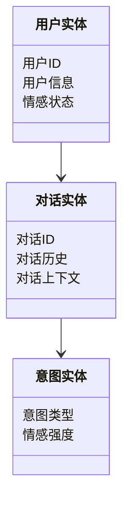

                 


```markdown
# AI Agent在智能客服中的应用：多轮对话与情感理解

## 关键词
AI Agent, 智能客服, 多轮对话, 情感理解, 自然语言处理, 深度学习, 对话系统

## 摘要
本文详细探讨了AI Agent在智能客服中的应用，重点分析了多轮对话和情感理解的核心原理和实现方法。通过理论与实践相结合的方式，深入讲解了对话管理、自然语言处理、情感分析等关键技术，并结合实际案例，展示了如何设计和优化智能客服系统。文章还提供了系统架构设计、项目实战和最佳实践，帮助读者全面理解和掌握AI Agent在智能客服中的应用。

---

## 第1章: AI Agent与智能客服的背景介绍

### 1.1 AI Agent的基本概念

#### 1.1.1 AI Agent的定义与核心要素
AI Agent（人工智能代理）是一种能够感知环境并采取行动以实现目标的智能实体。其核心要素包括：
1. **感知能力**：通过传感器或数据输入获取环境信息。
2. **决策能力**：基于感知信息进行推理和决策。
3. **行动能力**：通过执行器对外界产生影响。
4. **学习能力**：通过机器学习不断优化自身性能。

#### 1.1.2 智能客服的定义与特点
智能客服是一种利用人工智能技术提供自动化服务的系统，其特点是：
1. **自动化处理**：能够自动响应用户请求。
2. **7×24小时可用**：无需人工值守，全天候提供服务。
3. **个性化服务**：根据用户需求提供定制化解决方案。

#### 1.1.3 AI Agent在智能客服中的应用价值
AI Agent能够显著提升智能客服的效率和用户体验，具体体现在：
1. **提高响应速度**：通过自动化处理减少用户等待时间。
2. **降低运营成本**：减少人工客服的需求，降低运营成本。
3. **增强用户体验**：通过情感理解和多轮对话提供更贴心的服务。

### 1.2 多轮对话与情感理解的背景

#### 1.2.1 多轮对话的定义与特点
多轮对话是指用户与系统之间进行的连续、交互式的对话，其特点包括：
1. **连续性**：对话过程需要保持上下文的一致性。
2. **交互性**：用户和系统之间需要交替发送信息。
3. **复杂性**：对话内容可能涉及多个主题和意图。

#### 1.2.2 情感理解的定义与特点
情感理解是指系统能够识别和分析用户在对话中表达的情感状态，其特点包括：
1. **实时性**：情感理解需要在对话过程中实时进行。
2. **准确性**：能够准确识别用户的情感状态。
3. **适应性**：根据情感反馈调整对话策略。

#### 1.2.3 AI Agent在智能客服中的问题背景
在智能客服中，多轮对话和情感理解面临以下问题：
1. **上下文丢失**：对话过程中容易出现上下文不一致的问题。
2. **情感误判**：由于语言的复杂性，情感识别可能出现误差。
3. **对话中断**：用户可能在对话过程中中途退出或改变意图。

### 1.3 问题描述与解决

#### 1.3.1 智能客服中的常见问题
1. 用户提问复杂，需要多轮对话才能解决。
2. 用户情绪激动，需要情感支持。
3. 系统无法准确理解用户意图，导致对话中断。

#### 1.3.2 AI Agent如何解决这些问题
1. **对话管理技术**：通过维护对话上下文，确保多轮对话的连贯性。
2. **情感分析技术**：通过识别用户情感状态，提供个性化服务。
3. **自适应对话策略**：根据用户反馈动态调整对话流程。

#### 1.3.3 AI Agent的应用边界与外延
AI Agent的应用边界主要集中在对话理解和情感分析领域，而其外延则涉及多模态数据处理、个性化推荐等更广泛的应用场景。

---

## 第2章: 多轮对话的核心原理

### 2.1 对话管理的原理

#### 2.1.1 对话状态表示
对话状态表示是对话管理的基础，通常包括：
1. **用户状态**：用户的当前意图和情感状态。
2. **系统状态**：系统的当前状态和可用操作。

#### 2.1.2 对话上下文的维护
对话上下文的维护需要考虑以下方面：
1. **上下文存储**：将对话历史记录存储为结构化数据。
2. **上下文更新**：根据用户输入实时更新对话上下文。
3. **上下文恢复**：在对话中断后恢复之前的上下文。

#### 2.1.3 对话策略的制定
对话策略的制定需要考虑以下因素：
1. **用户意图**：根据用户的历史行为推断其意图。
2. **系统目标**：根据系统的目标制定对话策略。
3. **反馈机制**：根据用户反馈调整对话策略。

### 2.2 自然语言处理在多轮对话中的应用

#### 2.2.1 分词与句法分析
分词和句法分析是自然语言处理的基础，通常使用以下工具：
1. **分词工具**：如jieba、 SpaCy等。
2. **句法分析工具**：如NLTK、Stanford Parser等。

#### 2.2.2 语义理解与意图识别
语义理解是多轮对话的核心，通常采用以下方法：
1. **基于规则的方法**：通过预定义规则匹配用户意图。
2. **基于统计的方法**：通过机器学习模型训练意图识别器。
3. **基于深度学习的方法**：使用LSTM或Transformer模型进行语义理解。

#### 2.2.3 对话生成的算法原理
对话生成的算法通常包括以下步骤：
1. **输入处理**：将用户输入转换为模型可处理的格式。
2. **对话状态更新**：根据用户输入更新对话状态。
3. **生成响应**：通过模型生成回复文本。
4. **输出处理**：将生成的回复返回给用户。

### 2.3 情感理解的核心机制

#### 2.3.1 情感分析的定义与方法
情感分析是通过分析文本内容判断用户的情感倾向，通常采用以下方法：
1. **基于词袋模型的方法**：通过统计情感词的出现频率进行情感判断。
2. **基于机器学习的方法**：使用SVM、随机森林等模型进行情感分类。
3. **基于深度学习的方法**：使用CNN、RNN等模型进行情感分析。

#### 2.3.2 情感记忆的实现方法
情感记忆的实现方法包括：
1. **情感状态记录**：将用户的情感状态记录在对话上下文中。
2. **情感记忆更新**：根据用户的最新情感状态更新记忆。
3. **情感记忆恢复**：在对话恢复时重新加载之前的情感记忆。

#### 2.3.3 情感反馈的处理流程
情感反馈的处理流程包括：
1. **情感识别**：识别用户的当前情感状态。
2. **情感评估**：评估情感状态对对话的影响。
3. **情感反馈生成**：根据情感状态生成适当的反馈响应。

---

## 第3章: 情感理解的实现与优化

### 3.1 情感理解的理论基础

#### 3.1.1 情感计算的定义
情感计算是通过分析用户的情感状态来改进人机交互体验的过程。

#### 3.1.2 情感三元组的提取方法
情感三元组的提取方法包括：
1. **基于规则的方法**：通过预定义规则提取情感三元组。
2. **基于统计的方法**：通过统计模型提取情感三元组。
3. **基于深度学习的方法**：使用神经网络模型提取情感三元组。

#### 3.1.3 情感强度的计算公式
情感强度的计算公式如下：
$$
情感强度 = \sum_{i=1}^{n} w_i \cdot s_i
$$
其中，$w_i$是第$i$个情感词的权重，$s_i$是第$i$个情感词的情感值。

### 3.2 基于深度学习的情感理解模型

#### 3.2.1 LSTM网络的结构与原理
LSTM网络的结构包括：
1. **输入门**：控制输入信息的流动。
2. **遗忘门**：控制记忆的遗忘。
3. **输出门**：控制输出信息的流动。

#### 3.2.2 Transformer模型在情感分析中的应用
Transformer模型在情感分析中的应用包括：
1. **文本编码**：将输入文本编码为向量表示。
2. **注意力机制**：通过注意力机制捕获文本中的关键信息。
3. **情感分类**：基于编码后的向量进行情感分类。

#### 3.2.3 情感分类的数学模型
情感分类的数学模型可以表示为：
$$
p(y|x) = \arg\max_{y} \text{softmax}(W_{y}x + b_{y})
$$
其中，$x$是输入文本的向量表示，$W_{y}$是情感类别$y$的权重矩阵，$b_{y}$是情感类别$y$的偏置向量。

### 3.3 情感理解的优化策略

#### 3.3.1 数据增强的方法
数据增强的方法包括：
1. **同义词替换**：将部分词语替换为同义词。
2. **数据扰动**：对数据进行小幅度的扰动以增加数据多样性。
3. **数据扩展**：通过生成新数据来扩展数据集。

#### 3.3.2 模型调优的技巧
模型调优的技巧包括：
1. **超参数优化**：通过网格搜索或随机搜索优化模型超参数。
2. **正则化方法**：使用L1/L2正则化防止过拟合。
3. **集成学习**：通过集成多个模型的结果提高性能。

#### 3.3.3 情感反馈的闭环优化
情感反馈的闭环优化流程包括：
1. **情感识别**：识别用户的当前情感状态。
2. **情感评估**：评估情感状态对对话的影响。
3. **情感反馈生成**：根据情感状态生成适当的反馈响应。
4. **反馈闭环**：将情感反馈纳入对话上下文，指导后续对话。

---

## 第4章: AI Agent在智能客服中的系统架构

### 4.1 系统功能设计

#### 4.1.1 用户输入处理模块
用户输入处理模块的功能包括：
1. **输入解析**：将用户的输入解析为结构化的数据。
2. **意图识别**：识别用户的意图。
3. **情感分析**：分析用户的当前情感状态。

#### 4.1.2 对话管理模块
对话管理模块的功能包括：
1. **对话上下文维护**：维护对话的上下文信息。
2. **对话策略制定**：根据对话上下文制定对话策略。
3. **对话生成**：生成回复文本并返回给用户。

#### 4.1.3 情感理解模块
情感理解模块的功能包括：
1. **情感识别**：识别用户的当前情感状态。
2. **情感记忆**：记录和更新用户的情感状态。
3. **情感反馈**：根据情感状态生成适当的反馈响应。

### 4.2 系统架构设计

#### 4.2.1 领域模型设计
领域模型设计包括：
1. **用户实体**：表示用户的基本信息和情感状态。
2. **对话实体**：表示对话的上下文信息和对话历史。
3. **意图实体**：表示用户的意图和情感状态。



#### 4.2.2 系统架构设计
系统架构设计包括：
1. **前端模块**：负责用户输入和输出的处理。
2. **后端模块**：负责对话管理和情感理解。
3. **数据库模块**：负责存储对话历史和用户信息。


#### 4.2.3 系统接口设计
系统接口设计包括：
1. **用户输入接口**：接收用户的输入文本。
2. **对话管理接口**：管理对话的上下文和历史记录。
3. **情感理解接口**：提供情感分析和情感反馈的功能。

#### 4.2.4 系统交互流程

```mermaid
sequenceDiagram
    用户 -->+> 系统: 发送查询请求
    系统 -->+> 对话管理模块: 获取对话上下文
    对话管理模块 -->+> 情感理解模块: 分析用户情感
    情感理解模块 -->+> 系统: 返回情感分析结果
    系统 -->+> 对话管理模块: 更新对话上下文
    对话管理模块 -->+> 用户: 返回回复
```

### 4.3 系统实现与优化

#### 4.3.1 环境安装
需要安装以下工具和库：
1. Python 3.8+
2. TensorFlow 2.5+
3. NLTK 3.6+
4. Jieba 0.43+

#### 4.3.2 核心代码实现

```python
import tensorflow as tf
from tensorflow.keras import layers
import numpy as np
import nltk
from nltk import word_tokenize
from jieba import tokenize

# 情感分析模型
class SentimentAnalyzer:
    def __init__(self):
        self.model = self.build_model()
    
    def build_model(self):
        model = tf.keras.Sequential()
        model.add(layers.Embedding(input_dim=10000, output_dim=64))
        model.add(layers.LSTM(64, return_sequences=True))
        model.add(layers.Dropout(0.5))
        model.add(layers.Dense(2, activation='softmax'))
        model.compile(loss='sparse_categorical_crossentropy', optimizer='adam', metrics=['accuracy'])
        return model
    
    def predict(self, text):
        # 文本预处理
        text = text.lower()
        tokens = word_tokenize(text)
        # 转换为向量
        vector = self.text_to_vector(tokens)
        # 预测
        prediction = self.model.predict(vector)
        return np.argmax(prediction, axis=1)
    
    def text_to_vector(self, tokens):
        # 简单的词袋模型
        vocab_size = 10000
        vector = np.zeros(vocab_size, dtype=np.int32)
        for token in tokens:
            if token < vocab_size:
                vector[token] += 1
        return vector.reshape(1, -1)

# 对话管理模块
class DialogueManager:
    def __init__(self):
        self.dialogue_context = {}
    
    def process_input(self, user_id, input_text):
        # 获取上下文
        context = self.dialogue_context.get(user_id, {})
        # 更新上下文
        context['history'].append(input_text)
        context['emotion'] = SentimentAnalyzer().predict(input_text)[0]
        self.dialogue_context[user_id] = context
    
    def generate_response(self, user_id):
        context = self.dialogue_context[user_id]
        response = self.respond(context['history'], context['emotion'])
        return response
    
    def respond(self, history, emotion):
        # 简单的响应生成逻辑
        if emotion == 1:
            return "您看起来有些不开心，有什么我可以帮助您的吗？"
        else:
            return "感谢您的耐心，有什么我可以帮助您的吗？"

# 系统主程序
def main():
    analyzer = SentimentAnalyzer()
    manager = DialogueManager()
    while True:
        user_input = input("请输入您的问题：")
        manager.process_input(1, user_input)
        response = manager.generate_response(1)
        print(response)

if __name__ == "__main__":
    main()
```

#### 4.3.3 系统优化策略
系统优化策略包括：
1. **模型优化**：通过数据增强和超参数调优提高模型性能。
2. **性能优化**：通过并行计算和缓存优化提高系统响应速度。
3. **可扩展性优化**：通过模块化设计提高系统的可扩展性。

---

## 第5章: 项目实战

### 5.1 项目背景与需求分析

#### 5.1.1 项目背景
本项目旨在开发一个基于AI Agent的智能客服系统，实现多轮对话和情感理解功能。

#### 5.1.2 项目需求
1. 实现用户与系统的多轮对话功能。
2. 实现情感分析和情感反馈功能。
3. 提供友好的用户界面和交互体验。

### 5.2 项目实施步骤

#### 5.2.1 环境搭建
1. 安装所需的Python库和工具。
2. 配置开发环境，如PyCharm或Jupyter Notebook。

#### 5.2.2 系统设计
1. 设计系统的功能模块和系统架构。
2. 确定数据结构和接口设计。

#### 5.2.3 代码实现
1. 实现情感分析模块。
2. 实现对话管理模块。
3. 实现用户界面模块。

#### 5.2.4 系统测试
1. 进行功能测试，确保系统功能正常。
2. 进行性能测试，优化系统响应速度。
3. 进行用户测试，收集用户反馈。

### 5.3 项目代码实现

#### 5.3.1 情感分析模块实现
```python
class SentimentAnalyzer:
    def __init__(self):
        self.model = self.build_model()
    
    def build_model(self):
        model = tf.keras.Sequential()
        model.add(layers.Embedding(input_dim=10000, output_dim=64))
        model.add(layers.LSTM(64, return_sequences=True))
        model.add(layers.Dropout(0.5))
        model.add(layers.Dense(2, activation='softmax'))
        model.compile(loss='sparse_categorical_crossentropy', optimizer='adam', metrics=['accuracy'])
        return model
    
    def predict(self, text):
        text = text.lower()
        tokens = word_tokenize(text)
        vector = self.text_to_vector(tokens)
        prediction = self.model.predict(vector)
        return np.argmax(prediction, axis=1)
    
    def text_to_vector(self, tokens):
        vocab_size = 10000
        vector = np.zeros(vocab_size, dtype=np.int32)
        for token in tokens:
            if token < vocab_size:
                vector[token] += 1
        return vector.reshape(1, -1)
```

#### 5.3.2 对话管理模块实现
```python
class DialogueManager:
    def __init__(self):
        self.dialogue_context = {}
    
    def process_input(self, user_id, input_text):
        context = self.dialogue_context.get(user_id, {})
        context['history'].append(input_text)
        context['emotion'] = SentimentAnalyzer().predict(input_text)[0]
        self.dialogue_context[user_id] = context
    
    def generate_response(self, user_id):
        context = self.dialogue_context[user_id]
        response = self.respond(context['history'], context['emotion'])
        return response
    
    def respond(self, history, emotion):
        if emotion == 1:
            return "您看起来有些不开心，有什么我可以帮助您的吗？"
        else:
            return "感谢您的耐心，有什么我可以帮助您的吗？"
```

#### 5.3.3 系统主程序实现
```python
def main():
    analyzer = SentimentAnalyzer()
    manager = DialogueManager()
    while True:
        user_input = input("请输入您的问题：")
        manager.process_input(1, user_input)
        response = manager.generate_response(1)
        print(response)

if __name__ == "__main__":
    main()
```

### 5.4 项目测试与优化

#### 5.4.1 功能测试
1. 测试多轮对话功能，确保对话连贯性。
2. 测试情感分析功能，确保情感识别准确率。

#### 5.4.2 性能优化
1. 优化模型训练速度，减少训练时间。
2. 优化系统响应速度，提高用户体验。

#### 5.4.3 用户测试
1. 收集用户反馈，改进系统功能。
2. 根据用户反馈进行系统优化。

---

## 第6章: 高级话题与未来展望

### 6.1 多模态对话

#### 6.1.1 多模态对话的定义
多模态对话是指同时利用文本、语音、图像等多种模态信息进行对话的过程。

#### 6.1.2 多模态对话的优势
1. 提供更丰富的交互方式。
2. 提高对话的准确性和流畅性。
3. 增强用户体验的沉浸感。

#### 6.1.3 多模态对话的实现
1. 多模态数据融合：将多种模态数据进行融合处理。
2. 多模态模型设计：设计能够处理多种模态数据的模型。
3. 多模态对话管理：实现多模态数据的协同处理。

### 6.2 个性化服务

#### 6.2.1 个性化服务的定义
个性化服务是指根据用户的需求和偏好提供定制化服务的过程。

#### 6.2.2 个性化服务的实现
1. 用户画像构建：通过收集用户数据构建用户画像。
2. 个性化推荐：基于用户画像进行个性化推荐。
3. 个性化对话：根据用户画像调整对话策略。

### 6.3 可解释性与安全性

#### 6.3.1 对话系统的可解释性
1. 可解释性的重要性：确保系统的决策过程透明可解释。
2. 可解释性的实现：通过可视化和日志记录提高系统的可解释性。

#### 6.3.2 对话系统的安全性
1. 安全性的重要性：确保系统的安全性，防止恶意攻击。
2. 安全性的实现：通过加密和访问控制提高系统的安全性。

---

## 第7章: 总结与展望

### 7.1 总结

#### 7.1.1 核心内容回顾
本文详细探讨了AI Agent在智能客服中的应用，重点分析了多轮对话和情感理解的核心原理和实现方法。

#### 7.1.2 关键技术总结
1. 对话管理技术：通过维护对话上下文实现多轮对话。
2. 情感理解技术：通过深度学习模型实现情感分析和情感反馈。

### 7.2 未来展望

#### 7.2.1 技术发展趋势
1. 多模态对话技术：将逐渐成为主流，提供更丰富的交互方式。
2. 个性化服务技术：将更加智能化，提供更精准的个性化推荐。
3. 可解释性与安全性：将成为系统设计的重要考虑因素。

#### 7.2.2 应用场景扩展
1. 智能客服：将更加智能化和个性化。
2. 智能助手：将更加普及，成为人们生活的重要工具。
3. 智能教育：将更加个性化，提供更优质的教育资源。

### 7.3 学习与实践建议

#### 7.3.1 学习建议
1. 学习自然语言处理技术，如分词、句法分析、语义理解。
2. 学习深度学习技术，如LSTM、Transformer等模型。
3. 学习对话系统设计，如对话管理、情感理解等。

#### 7.3.2 实践建议
1. 从简单的对话系统开始，逐步实现多轮对话功能。
2. 结合情感分析技术，实现情感反馈功能。
3. 不断优化系统性能，提高用户体验。

---

## 参考文献
1. TensorFlow官方文档
2. NLTK官方文档
3. Jieba官方文档
4. 参考书籍：《Deep Learning》
5. 参考书籍：《自然语言处理入门》
6. 参考书籍：《对话系统实战》

---

通过本文的详细讲解，读者可以全面了解AI Agent在智能客服中的应用，掌握多轮对话和情感理解的核心技术，并能够在实际项目中进行应用和优化。未来，随着人工智能技术的不断发展，AI Agent在智能客服中的应用将更加广泛和深入。
```

