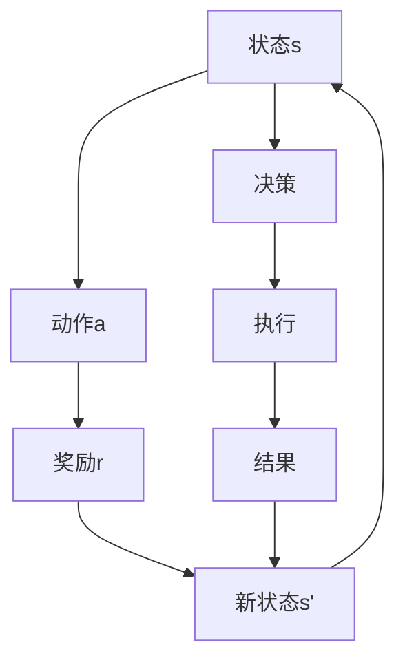
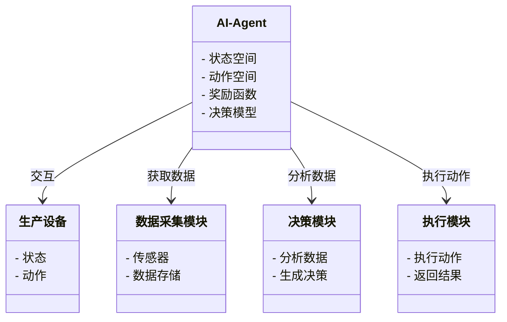
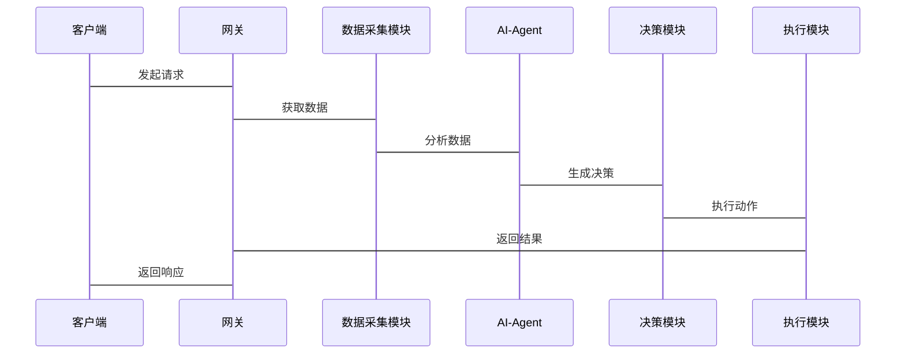

                 


# AI Agent在智能工厂管理中的全面应用策略

## 关键词：
AI Agent, 智能工厂, 工业4.0, 人工智能, 强化学习, 工业物联网

## 摘要：
本文系统地探讨了AI Agent在智能工厂管理中的应用策略，从基本概念到算法原理，再到系统架构和实际案例，全面分析了AI Agent在智能工厂管理中的关键作用。通过强化学习算法和工业物联网的结合，AI Agent能够实现生产优化、设备维护和供应链管理等重要功能，为企业创造更高的效率和竞争力。

---

# 第一部分: AI Agent在智能工厂管理中的背景与概述

## 第1章: AI Agent与智能工厂管理概述

### 1.1 AI Agent的定义与核心概念
#### 1.1.1 AI Agent的基本定义
AI Agent（人工智能代理）是指能够感知环境、自主决策并采取行动的智能实体。它可以是一个软件系统、机器人或其他智能设备，具备以下核心特征：
- **自主性**：能够在没有外部干预的情况下独立运行。
- **反应性**：能够实时感知环境并做出响应。
- **目标导向**：通过目标驱动来优化决策和行动。

#### 1.1.2 AI Agent的核心属性与特征
| 属性 | 描述 |
|------|------|
| 感知能力 | 能够通过传感器或数据源获取环境信息。 |
| 决策能力 | 基于感知信息，通过算法做出决策。 |
| 学习能力 | 能够通过经验或数据优化自身行为。 |
| 执行能力 | 能够通过执行机构或API实现行动。 |

#### 1.1.3 AI Agent与传统自动化系统的区别
AI Agent的核心区别在于其自主性和学习能力。传统自动化系统依赖预定义的规则，而AI Agent能够根据环境动态调整行为，并通过学习优化决策过程。

### 1.2 智能工厂管理的背景与挑战
#### 1.2.1 智能工厂的概念与发展现状
智能工厂是工业4.0的核心组成部分，通过物联网、大数据和人工智能技术，实现生产过程的智能化和高效化。当前，智能工厂已经在汽车制造、电子制造等领域得到广泛应用。

#### 1.2.2 智能工厂管理中的主要挑战
- **数据复杂性**：智能工厂涉及大量异构数据，如何有效整合和分析是一个难题。
- **实时性要求**：生产过程需要实时决策，对系统响应速度提出高要求。
- **系统安全性**：智能工厂的网络攻击风险较高，需要确保系统的安全性。

#### 1.2.3 AI Agent在智能工厂管理中的角色与价值
AI Agent能够通过实时数据分析和自主决策，帮助智能工厂实现生产优化、设备维护和供应链管理，从而提高效率、降低成本。

### 1.3 AI Agent在智能工厂中的应用前景
#### 1.3.1 AI Agent在智能工厂中的潜在应用场景
- **预测性维护**：通过分析设备数据，预测设备故障并进行维护。
- **生产优化**：优化生产流程，减少资源浪费。
- **供应链管理**：实时监控供应链状态，优化库存管理。

#### 1.3.2 企业采用AI Agent的优势与挑战
优势：
- 提高生产效率。
- 降低成本。
- 提高决策的准确性。

挑战：
- 数据隐私和安全问题。
- 系统集成的复杂性。
- 技术人才的短缺。

#### 1.3.3 未来发展趋势与研究方向
未来，AI Agent在智能工厂中的应用将更加广泛，研究方向包括：
- 更高效的强化学习算法。
- 更智能的多智能体协作。
- 更安全的系统架构设计。

---

## 第2章: AI Agent的核心概念与理论基础

### 2.1 AI Agent的基本原理
#### 2.1.1 AI Agent的感知与决策机制
AI Agent的感知机制通过传感器或数据源获取环境信息，决策机制基于这些信息进行分析并做出决策。

#### 2.1.2 基于强化学习的AI Agent行为模型
强化学习是一种通过试错机制优化决策的算法。AI Agent通过与环境的交互，不断优化自身的行为策略。

#### 2.1.3 AI Agent的自主学习与进化能力
AI Agent可以通过监督学习、无监督学习和强化学习等多种方式不断优化自身的决策能力。

### 2.2 AI Agent与智能工厂管理的关联
#### 2.2.1 AI Agent在智能工厂管理中的功能模块划分
- **数据采集模块**：负责采集生产过程中的各种数据。
- **决策模块**：基于数据进行分析并做出决策。
- **执行模块**：根据决策结果执行相应的操作。

#### 2.2.2 AI Agent与工业物联网（IIoT）的协同关系
AI Agent与IIoT协同工作，可以通过实时数据采集和分析，实现对生产过程的智能化管理。

#### 2.2.3 AI Agent在生产优化中的应用逻辑
AI Agent通过分析生产数据，优化生产流程，减少资源浪费，提高生产效率。

### 2.3 AI Agent的核心概念与理论基础
#### 2.3.1 AI Agent的核心概念
- **状态空间**：AI Agent所处的环境状态集合。
- **动作空间**：AI Agent可以执行的动作集合。
- **奖励函数**：衡量AI Agent行为好坏的标准。

#### 2.3.2 AI Agent的决策模型
AI Agent的决策模型可以通过强化学习算法进行训练，优化自身的决策能力。

---

## 第3章: AI Agent的算法原理与数学模型

### 3.1 强化学习算法在AI Agent中的应用
#### 3.1.1 Q-learning算法的数学模型
Q-learning算法的更新公式为：
$$ Q(s, a) = r + \gamma \max Q(s', a') $$

其中：
- $s$ 表示当前状态。
- $a$ 表示当前动作。
- $r$ 表示奖励。
- $\gamma$ 表示折扣因子。
- $s'$ 表示新状态。
- $a'$ 表示新动作。

#### 3.1.2 算法流程图（Mermaid）


### 3.2 AI Agent的数学模型与公式
#### 3.2.1 状态转移模型
状态转移概率可以用马尔可夫链模型表示：
$$ P(s' | s, a) $$

其中：
- $s$ 表示当前状态。
- $a$ 表示当前动作。
- $s'$ 表示新状态。

#### 3.2.2 奖励函数模型
奖励函数可以表示为：
$$ r(s, a, s') $$

其中：
- $s$ 表示当前状态。
- $a$ 表示当前动作。
- $s'$ 表示新状态。

---

## 第4章: AI Agent在智能工厂管理中的系统架构与设计

### 4.1 系统功能设计
#### 4.1.1 领域模型（Mermaid类图）


#### 4.1.2 系统架构设计（Mermaid架构图）


### 4.2 系统接口设计
#### 4.2.1 系统接口描述
- **数据采集接口**：用于采集生产设备的状态数据。
- **决策接口**：用于生成优化决策。
- **执行接口**：用于执行优化后的动作。

#### 4.2.2 系统交互设计（Mermaid序列图）


---

## 第5章: AI Agent在智能工厂管理中的项目实战

### 5.1 环境安装与配置
#### 5.1.1 系统环境
- 操作系统：Linux/Windows/MacOS
- 开发工具：Python、PyTorch、TensorFlow
- 数据库：MySQL/PostgreSQL
- 云平台：AWS/Azure/阿里云

#### 5.1.2 安装依赖
```bash
pip install numpy
pip install pandas
pip install matplotlib
pip install torch
```

### 5.2 系统核心实现
#### 5.2.1 AI Agent的核心代码实现
```python
import numpy as np
import torch
import torch.nn as nn
import torch.optim as optim

class AIAgent:
    def __init__(self, state_space, action_space):
        self.state_space = state_space
        self.action_space = action_space
        self.model = nn.Sequential(
            nn.Linear(state_space, 64),
            nn.ReLU(),
            nn.Linear(64, 64),
            nn.ReLU(),
            nn.Linear(64, action_space)
        )
        self.optimizer = optim.Adam(self.model.parameters(), lr=0.001)

    def act(self, state):
        with torch.no_grad():
            return self.model(torch.FloatTensor(state)).argmax().item()

    def learn(self, state, action, reward, next_state):
        self.optimizer.zero_grad()
        current_q = self.model(torch.FloatTensor(state))
        next_q = self.model(torch.FloatTensor(next_state))
        loss = (current_q[action] - (reward + gamma * next_q.max().item())) ** 2
        loss.backward()
        self.optimizer.step()
```

#### 5.2.2 数据采集与处理
```python
import pandas as pd

# 采集数据
data = pd.read_csv('production_data.csv')
# 数据预处理
data = data.dropna()
data = (data - data.mean()) / data.std()
```

#### 5.2.3 系统功能实现
```python
# 预测性维护
def predict_failure(data):
    model = nn.Sequential(
        nn.Linear(10, 64),
        nn.ReLU(),
        nn.Linear(64, 1)
    )
    # 训练模型
    criterion = nn.MSELoss()
    optimizer = optim.Adam(model.parameters(), lr=0.01)
    for epoch in range(100):
        outputs = model(data)
        loss = criterion(outputs, labels)
        loss.backward()
        optimizer.step()
    return model

# 优化生产流程
def optimize_production(data):
    # 使用强化学习优化生产流程
    pass
```

### 5.3 实际案例分析
#### 5.3.1 预测性维护案例
- **数据来源**：生产设备的传感器数据。
- **算法选择**：使用基于强化学习的预测性维护模型。
- **结果分析**：准确预测设备故障，减少停机时间。

#### 5.3.2 生产优化案例
- **数据来源**：生产过程中的各项指标。
- **算法选择**：使用强化学习优化生产流程。
- **结果分析**：提高生产效率，降低资源浪费。

### 5.4 项目小结
- **实现目标**：成功实现了AI Agent在智能工厂管理中的应用。
- **关键点**：强化学习算法的应用、数据采集与处理、系统架构设计。
- **经验总结**：系统集成的复杂性需要充分考虑，同时需要实时监控系统的运行状态。

---

## 第6章: 总结与展望

### 6.1 总结
本文详细探讨了AI Agent在智能工厂管理中的应用策略，从基本概念到算法原理，再到系统架构和实际案例，全面分析了AI Agent在智能工厂管理中的关键作用。

### 6.2 展望
未来，AI Agent在智能工厂中的应用将更加广泛，研究方向包括更高效的强化学习算法、更智能的多智能体协作、更安全的系统架构设计。

---

### 最佳实践 Tips
- 在实际应用中，建议先从小规模项目开始，逐步优化AI Agent的行为策略。
- 确保系统的安全性和稳定性，避免因系统故障导致生产中断。
- 定期更新AI Agent的决策模型，以适应生产环境的变化。

---

### 参考文献
1. Russell, S. & Norvig, P. (2010). *Artificial Intelligence: A Modern Approach*.
2. Mnih, V. et al. (2016). *Human-level control through deep reinforcement learning*.
3. Li, Y. et al. (2020). *Deep reinforcement learning for intelligent manufacturing*.

