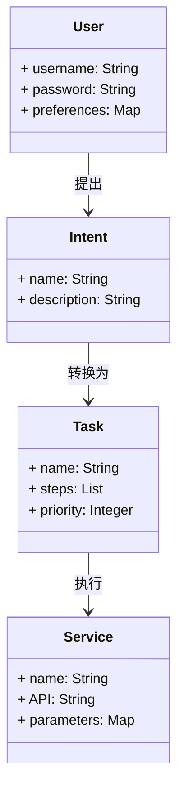
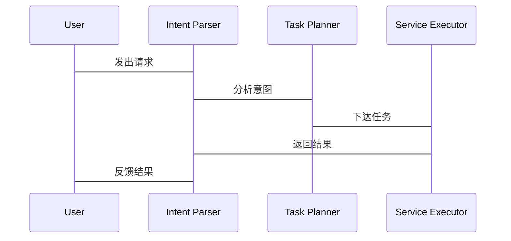

                 


# AI Agent在智能工程设计中的应用

> 关键词：AI Agent, 智能工程, 强化学习, 多智能体系统, 系统架构设计

> 摘要：本文详细探讨了AI Agent在智能工程设计中的应用，从核心概念、算法原理到系统架构设计，再到项目实战，系统地分析了AI Agent在智能工程中的重要作用和实现方法。通过具体案例分析和数学模型的推导，深入剖析了AI Agent在智能工程中的应用价值和未来发展。

---

# 第一部分: AI Agent 的背景与概念

## 第1章: AI Agent 的基本概念与应用背景

### 1.1 AI Agent 的定义与核心概念

#### 1.1.1 AI Agent 的基本定义

AI Agent（人工智能代理）是指能够感知环境、自主决策并执行任务的智能实体。它具备以下核心特征：

- **自主性**：能够在没有外部干预的情况下自主执行任务。
- **反应性**：能够感知环境并实时响应。
- **目标导向性**：具有明确的目标，决策基于目标的优化。
- **学习能力**：能够通过经验改进自身性能。

#### 1.1.2 AI Agent 的核心属性与特征

| 属性 | 描述 |
|------|------|
| 自主性 | 能够独立执行任务，无需外部干预 |
| 反应性 | 能够感知环境并实时响应 |
| 目标导向性 | 决策基于明确的目标 |
| 学习能力 | 通过经验优化自身性能 |

#### 1.1.3 AI Agent 的应用场景与边界

AI Agent 在智能工程中的应用场景包括：

- **智能助手**：如 Siri、Alexa 等，帮助用户完成日常任务。
- **自动驾驶**：如特斯拉、Waymo 的自动驾驶系统。
- **智能推荐系统**：如 Netflix 的电影推荐、亚马逊的商品推荐。
- **机器人协作**：如工业机器人在生产线上的协作。

**边界**：AI Agent 的能力受限于其感知能力和决策算法，需要明确的环境定义和任务目标。

### 1.2 AI Agent 的技术背景

#### 1.2.1 人工智能技术的发展历程

人工智能技术从 1950 年代的专家系统到现在的深度学习，经历了多个发展阶段。当前，强化学习和多智能体系统是 AI Agent 的主要技术支撑。

#### 1.2.2 多智能体系统与分布式计算

多智能体系统（Multi-Agent System, MAS）是由多个智能体组成的系统，智能体之间通过通信和协作完成复杂的任务。分布式计算为多智能体系统的实现提供了技术基础。

#### 1.2.3 当前 AI Agent 的技术趋势

当前，AI Agent 的技术趋势包括：

- **强化学习**：通过试错和奖励机制优化决策。
- **深度学习**：通过神经网络实现复杂任务。
- **人机协作**：AI Agent 与人类协同完成任务。

### 1.3 AI Agent 在智能工程设计中的应用现状

#### 1.3.1 智能工程设计的定义与特点

智能工程设计是指利用人工智能技术优化工程设计过程。其特点包括：

- **智能化**：利用 AI 技术辅助设计。
- **自动化**：部分设计过程自动化完成。
- **优化性**：通过 AI 技术优化设计结果。

#### 1.3.2 AI Agent 在智能工程中的典型应用

AI Agent 在智能工程中的典型应用包括：

- **工业设计优化**：通过 AI Agent 优化产品设计。
- **建筑智能设计**：利用 AI Agent 进行建筑设计优化。
- **智能制造**：AI Agent 在生产线上的应用。

#### 1.3.3 当前应用中的主要挑战

当前 AI Agent 在智能工程中的应用面临以下挑战：

- **复杂环境的适应性**：复杂环境下的决策能力不足。
- **多智能体协作**：多智能体协作中的通信和协调问题。
- **实时性要求**：高实时性要求下的计算效率问题。

### 1.4 本章小结

本章介绍了 AI Agent 的基本概念、技术背景及其在智能工程中的应用现状。通过分析 AI Agent 的核心特征和应用场景，明确了其在智能工程中的重要作用。

---

# 第二部分: AI Agent 的核心概念与原理

## 第2章: AI Agent 的核心原理与数学模型

### 2.1 AI Agent 的决策模型

#### 2.1.1 强化学习的基本原理

强化学习是一种通过试错和奖励机制优化决策的算法。其基本原理如下：

1. 智能体通过感知环境获取状态信息。
2. 根据当前状态选择一个动作。
3. 执行动作后，获得环境的奖励。
4. 根据奖励调整策略，优化决策过程。

#### 2.1.2 状态、动作、奖励的定义与关系

- **状态（State）**：智能体所处的环境信息。
- **动作（Action）**：智能体选择的行为。
- **奖励（Reward）**：智能体执行动作后获得的反馈。

#### 2.1.3 Q-learning 算法的数学模型

Q-learning 算法的目标是找到最优的 Q 值函数，表示状态-动作对的最优价值。数学模型如下：

$$ Q(s, a) = \max_{a'} Q(s', a') $$

其中，\( s \) 是当前状态，\( a \) 是当前动作，\( s' \) 是下一个状态。

### 2.2 AI Agent 的行为规划模型

#### 2.2.1 无模型强化学习与有模型强化学习

- **无模型强化学习**：基于经验直接优化策略，不依赖于环境模型。
- **有模型强化学习**：基于环境模型优化策略。

#### 2.2.2 搜索算法在行为规划中的应用

搜索算法在 AI Agent 的行为规划中起到关键作用。常用算法包括：

- **广度优先搜索（BFS）**：适用于找到最短路径。
- **深度优先搜索（DFS）**：适用于探索未知领域。
- **A* 算法**：结合了启发式搜索，效率更高。

#### 2.2.3 A* 算法的数学模型与实现

A* 算法的启发函数 \( h(n) \) 用于评估节点 \( n \) 到目标节点的剩余成本。算法步骤如下：

1. 初始化优先队列，将起始节点加入队列。
2. 取出队列中成本最低的节点，展开其子节点。
3. 计算每个子节点的总成本 \( g(n) + h(n) \)。
4. 将总成本最低的子节点加入队列。
5. 重复直到目标节点被找到。

### 2.3 AI Agent 的通信与协作机制

#### 2.3.1 多智能体系统中的通信协议

多智能体系统中的通信协议包括：

- **简单通信协议**：如交换状态信息。
- **复杂通信协议**：如协商和协作。

#### 2.3.2 协作式强化学习的基本原理

协作式强化学习通过多智能体之间的协作优化整体奖励。其基本原理是：

1. 多智能体通过通信共享信息。
2. 每个智能体根据共享信息优化自身策略。
3. 整体奖励分配到各个智能体的奖励中。

#### 2.3.3 跨智能体通信的数学模型

协作式强化学习的数学模型可以通过以下公式表示：

$$ R = \sum_{i=1}^{n} r_i $$

其中，\( R \) 是整体奖励，\( r_i \) 是智能体 \( i \) 的奖励。

---

## 第3章: AI Agent 的算法原理与实现

### 3.1 强化学习算法的实现

#### 3.1.1 Q-learning 算法的实现步骤

Q-learning 算法的实现步骤如下：

1. 初始化 Q 表 \( Q(s, a) = 0 \)。
2. 重复以下步骤直到终止条件满足：
   - 选择当前状态下的动作 \( a \)。
   - 执行动作 \( a \)，获得奖励 \( r \) 和下一个状态 \( s' \)。
   - 更新 Q 表：\( Q(s, a) = Q(s, a) + \alpha (r + \gamma \max Q(s', a')) \)。

#### 3.1.2 策略梯度方法的实现原理

策略梯度方法通过优化策略的参数来最大化期望奖励。其数学模型如下：

$$ \nabla \theta J(\theta) = \mathbb{E}[ \nabla \log \pi(a|s) Q(s, a) ] $$

其中，\( \theta \) 是策略参数，\( J(\theta) \) 是目标函数。

#### 3.1.3 算法的收敛性分析

Q-learning 和策略梯度方法在收敛性上均具有理论保证。Q-learning 在离散状态下收敛到最优 Q 值，策略梯度方法在连续状态下收敛到局部最优。

---

## 第4章: AI Agent 的系统架构设计

### 4.1 问题场景介绍

本章通过一个智能助手设计的案例，介绍 AI Agent 的系统架构设计。智能助手需要实现以下功能：

1. **用户意图识别**：识别用户的输入意图。
2. **任务规划**：根据意图规划任务。
3. **执行任务**：调用外部服务完成任务。

### 4.2 系统功能设计

智能助手的领域模型如下：



### 4.3 系统架构设计

智能助手的系统架构设计如下：


### 4.4 系统接口设计

智能助手的系统接口设计如下：



---

## 第5章: AI Agent 的项目实战

### 5.1 智能助手设计与实现

#### 5.1.1 环境安装与配置

安装 Python 和相关库：

```bash
pip install python-dotenv gym numpy
```

#### 5.1.2 系统核心实现源代码

以下是智能助手的核心代码实现：

```python
import gym
import numpy as np

class AI-Agent:
    def __init__(self, env):
        self.env = env
        self.Q = np.zeros(env.observation_space.shape)
    
    def choose_action(self, state):
        if np.random.random() < 0.1:
            return self.env.action_space.sample()
        else:
            return np.argmax(self.Q[state])
    
    def learn(self, state, action, reward, next_state):
        self.Q[state][action] += 0.1 * (reward + 0.9 * np.max(self.Q[next_state]) - self.Q[state][action])
```

#### 5.1.3 代码应用解读与分析

该代码实现了一个简单的 Q-learning 算法，用于智能体在环境中的学习。通过不断选择动作和更新 Q 值，智能体逐步优化其决策策略。

#### 5.1.4 案例分析与详细讲解

通过训练智能体在迷宫环境中的导航任务，验证算法的有效性。训练过程中，智能体逐步学会最优路径。

---

## 第6章: 最佳实践与总结

### 6.1 小结

本章详细探讨了 AI Agent 在智能工程设计中的应用，从核心概念到算法实现，再到系统架构设计，系统地介绍了 AI Agent 的实现过程。

### 6.2 注意事项

- **环境定义**：明确智能体的环境定义。
- **任务目标**：明确智能体的任务目标。
- **算法选择**：根据场景选择合适的算法。

### 6.3 拓展阅读

- 建议阅读强化学习的经典论文和相关书籍，深入理解 AI Agent 的实现原理。

---

# 结语

通过本文的详细讲解，读者可以全面理解 AI Agent 在智能工程设计中的应用。从基本概念到算法实现，再到系统架构设计，本文为读者提供了全面的知识体系。希望本文能为从事智能工程设计的读者提供有益的参考和指导。

