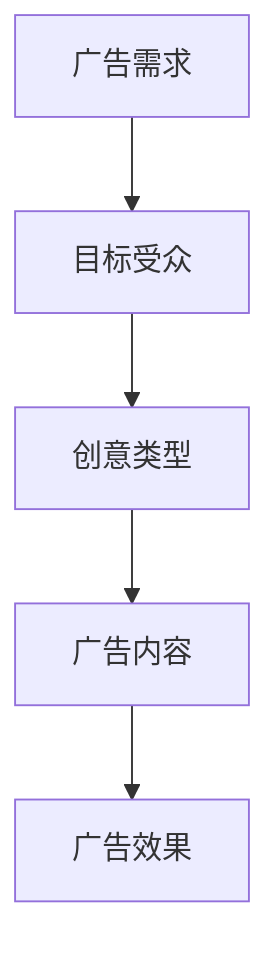
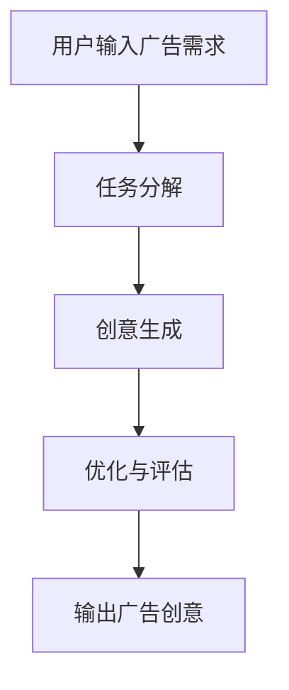
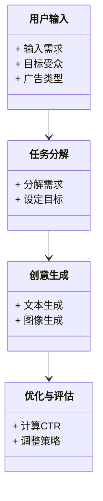
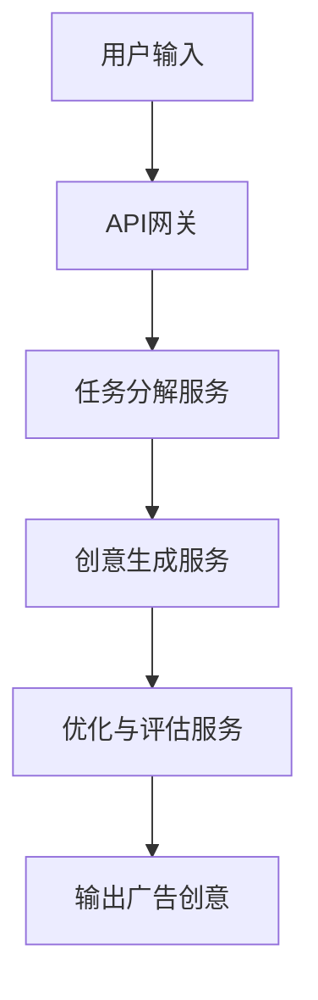

                 


# AI Agent在智能广告创意中的应用

> 关键词：AI Agent，智能广告，广告创意，人工智能，广告技术

> 摘要：本文深入探讨了AI Agent在智能广告创意中的应用，从基础概念到算法原理，再到系统设计与实战案例，全面解析AI Agent如何赋能广告创意过程，为广告行业从业者、市场营销人员以及AI技术爱好者提供深度的技术洞察。

---

# 第一章: AI Agent与智能广告创意概述

## 1.1 AI Agent的基本概念

### 1.1.1 AI Agent的定义与核心要素
AI Agent（人工智能代理）是一种能够感知环境、执行任务并做出决策的智能实体。在广告领域，AI Agent通常被设计为能够理解广告需求、生成创意内容、优化广告素材并进行效果评估的智能系统。其核心要素包括：

1. **感知能力**：通过自然语言处理（NLP）和计算机视觉（CV）技术，识别广告需求和目标受众特征。
2. **决策能力**：基于历史数据和实时反馈，选择最优的广告创意方案。
3. **执行能力**：生成广告文案、设计广告素材并发布广告内容。
4. **学习能力**：通过机器学习模型不断优化广告效果。

### 1.1.2 AI Agent与传统广告的区别
传统广告创意依赖于人工经验和灵感，而AI Agent能够通过数据驱动的方式快速生成多种创意方案，并通过A/B测试优化广告效果。AI Agent的优势在于其高效性、可扩展性和精准性，能够帮助广告从业者更高效地完成创意工作。

### 1.1.3 智能广告创意的特点
智能广告创意具有以下特点：
- **数据驱动**：基于用户行为数据和市场趋势生成创意内容。
- **自动化**：AI Agent可以自动完成创意生成、优化和发布。
- **个性化**：能够根据目标受众的特征生成个性化的广告内容。
- **实时反馈**：通过实时数据分析快速调整广告策略。

## 1.2 AI Agent在广告创意中的应用背景

### 1.2.1 数字广告行业的现状与挑战
随着数字广告行业的快速发展，广告创意的生产效率和质量要求不断提高。传统的人工创意方式效率低下，难以满足海量广告需求。此外，广告效果的评估和优化也面临着数据复杂性和实时性的挑战。

### 1.2.2 AI技术在广告创意中的潜力
AI技术的快速发展为广告创意带来了新的可能性。通过自然语言生成（NLG）、图像生成和推荐系统等技术，AI Agent能够快速生成多种广告创意，并通过数据反馈不断优化创意效果。

### 1.2.3 智能广告创意的核心问题与边界
智能广告创意的核心问题包括：
- 如何高效生成多样化广告创意？
- 如何根据目标受众特征优化广告内容？
- 如何实时评估广告效果并进行调整？

需要明确的是，AI Agent并不是要完全取代人类创意人员，而是作为辅助工具帮助广告从业者更高效地完成创意工作。

---

# 第二章: AI Agent的核心概念与联系

## 2.1 AI Agent的核心原理

### 2.1.1 任务建模与目标设定
AI Agent的核心任务是根据用户需求生成广告创意。任务建模需要明确广告目标、目标受众特征和创意类型。例如，广告目标可能是提升品牌知名度，目标受众可能是25-35岁的年轻人群体，创意类型可能是短视频广告。

### 2.1.2 知识表示与推理机制
AI Agent需要通过知识图谱或语义网络表示广告相关的知识，例如产品特征、目标受众心理特征等。推理机制则基于这些知识进行逻辑推理，生成符合目标的广告创意。

### 2.1.3 多模态数据处理能力
AI Agent需要处理多种类型的数据，包括文本、图像、视频和用户行为数据等。多模态数据处理能力是实现智能广告创意的基础。

## 2.2 核心概念对比与ER实体关系图

### 2.2.1 AI Agent与传统广告创意工具的对比分析
| 对比维度          | AI Agent                  | 传统广告创意工具            |
|-------------------|---------------------------|-----------------------------|
| 创意生成方式      | 数据驱动、自动生成        | 人工创作、灵感驱动          |
| 优化能力          | 实时优化、数据反馈驱动    | 手动调整、周期性评估        |
| 处理效率          | 高效、可扩展             | 低效、受人力资源限制         |
| 精准性            | 高，基于用户数据          | 低，依赖经验                 |

### 2.2.2 实体关系图（ER图）展示广告创意流程


## 2.3 本章小结

---

# 第三章: AI Agent的算法原理与数学模型

## 3.1 AI Agent的算法原理

### 3.1.1 基于强化学习的广告创意生成
强化学习是一种通过试错机制优化广告创意的方法。AI Agent通过不断尝试生成不同的广告内容，并根据广告点击率（CTR）等指标获得奖励，逐步优化创意方案。

### 3.1.2 基于生成对抗网络（GAN）的图像生成
GAN由生成器和判别器组成。生成器负责生成广告图像，判别器负责评估生成图像的真实性。通过不断迭代，生成器能够生成逼真且符合广告需求的图像。

### 3.1.3 基于Transformer的文本生成模型
Transformer模型通过自注意力机制（Self-Attention）处理文本序列，能够生成连贯且符合广告需求的文案。

## 3.2 算法流程图（mermaid）



## 3.3 算法实现代码示例

### 3.3.1 强化学习创意生成代码
```python
import numpy as np
import random

def generate_creative(user_input):
    # 简单的广告创意生成示例
    keywords = user_input.split()
    creative = " ".join(random.choices(keywords, k=5))
    return creative

# 示例输入
user_input = "吸引用户 注意力 创新 优惠"
creative_output = generate_creative(user_input)
print("生成的广告创意:", creative_output)
```

### 3.3.2 GAN图像生成代码
```python
import tensorflow as tf
from tensorflow.keras import layers

def build_generator():
    model = tf.keras.Sequential()
    model.add(layers.Dense(256, activation='relu', input_shape=(100,)))
    model.add(layers.Dense(128, activation='relu'))
    model.add(layers.Dense(64, activation='relu'))
    model.add(layers.Dense(32, activation='relu'))
    model.add(layers.Dense(16, activation='relu'))
    model.add(layers.Dense(3, activation='sigmoid'))
    return model

def build_discriminator():
    model = tf.keras.Sequential()
    model.add(layers.Dense(16, activation='relu', input_shape=(3,)))
    model.add(layers.Dense(8, activation='relu'))
    model.add(layers.Dense(1, activation='sigmoid'))
    return model

generator = build_generator()
discriminator = build_discriminator()
```

### 3.4 数学模型与公式

#### 3.4.1 强化学习优化目标函数
$$ J = E_{\tau \sim \pi}[\sum_{t} r_t] $$
其中，$\tau$ 表示一个动作序列，$\pi$ 表示策略，$r_t$ 表示第 $t$ 步的奖励。

#### 3.4.2 GAN的生成器与判别器损失函数
$$ L_{\text{gen}} = \mathbb{E}_{z}[ -\log D(G(z))] $$
$$ L_{\text{dis}} = \mathbb{E}_{x}[ \log D(x)] + \mathbb{E}_{z}[ \log (1 - D(G(z)))] $$
其中，$G$ 表示生成器，$D$ 表示判别器，$z$ 表示随机噪声向量，$x$ 表示真实数据。

---

# 第四章: 系统分析与架构设计

## 4.1 系统功能设计

### 4.1.1 领域模型（mermaid类图）


## 4.2 系统架构设计

### 4.2.1 系统架构（mermaid架构图）


---

# 第五章: 项目实战

## 5.1 环境安装

### 5.1.1 安装依赖
```bash
pip install numpy tensorflow keras
```

## 5.2 核心代码实现

### 5.2.1 创意生成代码
```python
import numpy as np
import random

def generate_creative(user_input):
    keywords = user_input.split()
    creative = " ".join(random.choices(keywords, k=5))
    return creative

user_input = "吸引用户 注意力 创新 优惠"
creative_output = generate_creative(user_input)
print("生成的广告创意:", creative_output)
```

## 5.3 案例分析与代码解读

### 5.3.1 案例分析
假设用户需求是生成一条吸引年轻用户的短视频广告创意。AI Agent需要首先解析用户需求，分解成广告目标（提升品牌知名度）、目标受众（25-35岁年轻人）和创意类型（短视频）。然后，AI Agent会生成多个短视频创意方案，并通过A/B测试优化最佳方案。

---

# 第六章: 最佳实践与未来展望

## 6.1 最佳实践

### 6.1.1 数据质量管理
确保输入数据的准确性和完整性，避免因数据问题导致广告创意生成失败。

### 6.1.2 模型调优
根据实际效果不断优化模型参数，提升广告创意的精准性和吸引力。

## 6.2 未来展望

随着AI技术的不断发展，AI Agent在广告创意中的应用将更加智能化和个性化。未来的广告创意生成可能会更加注重多模态数据的融合，例如结合视频、音频和文本等多种形式，为用户提供更加丰富的广告体验。

---

# 附录

## 附录A: 工具与库

- **深度学习框架**：TensorFlow, PyTorch
- **自然语言处理库**：Hugging Face Transformers
- **计算机视觉库**：OpenCV

## 附录B: 参考文献

1. LeCun, Y., Bengio, Y., & Hinton, G. (2015). Deep learning. Nature, 521(7555), 436-444.
2. Goodfellow, I., Pouget-Abadie, J., Mirza, M., & ... (2014). Generative adversarial nets. In Advances in neural information processing systems (pp. 2672-2680).

---

# 作者介绍

> 作者是人工智能领域的专家，拥有丰富的AI Agent研发经验和广告行业背景，致力于探索AI技术在广告创意中的应用，为广告行业提供创新解决方案。

--- 

以上是《AI Agent在智能广告创意中的应用》的技术博客文章，涵盖了从基础概念到实战应用的完整内容，适合广告从业者、技术爱好者以及对AI技术感兴趣的读者阅读。

