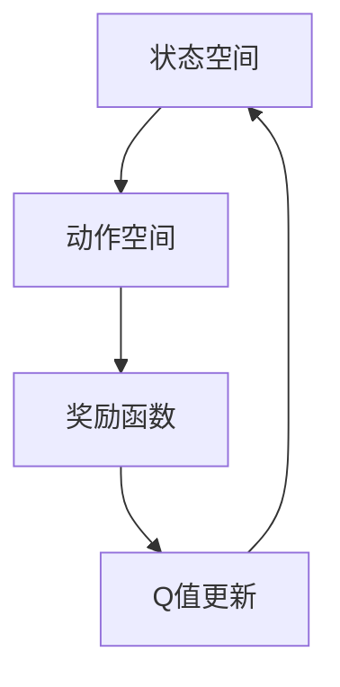
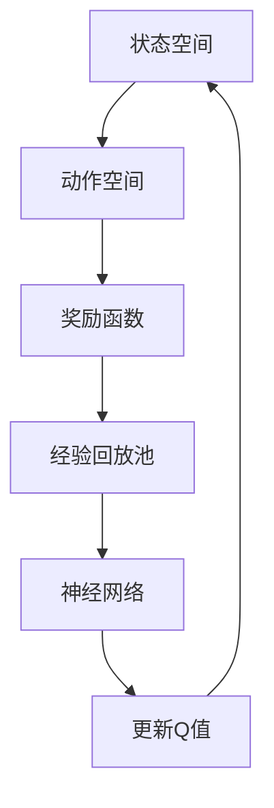
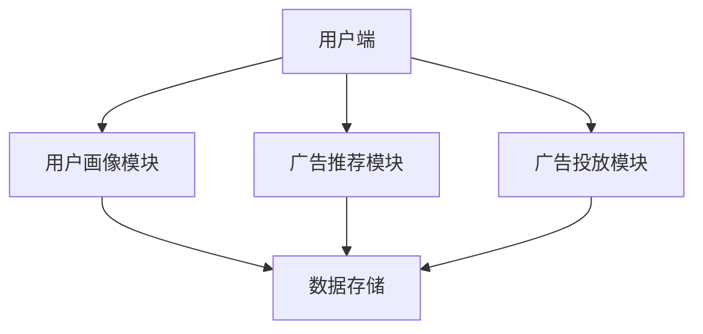
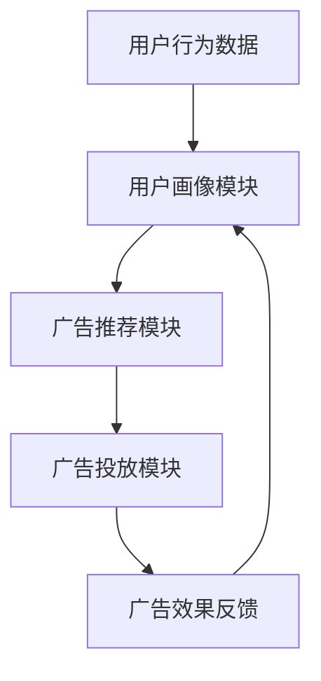
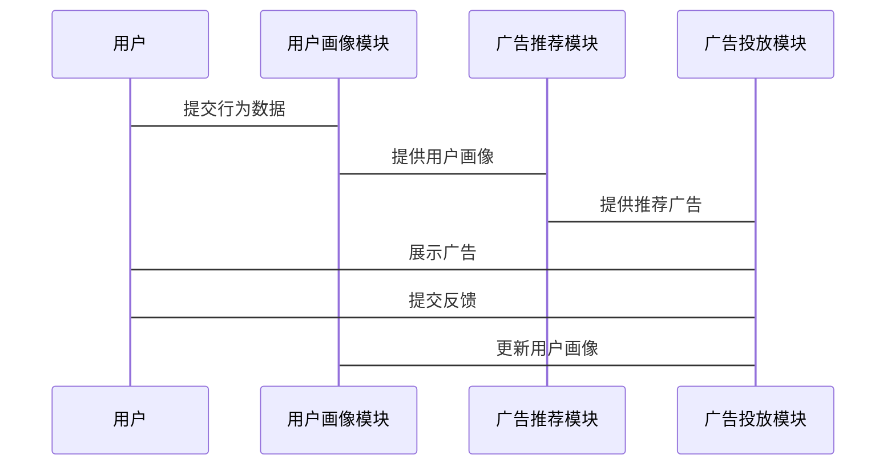

                 


# AI Agent在智能广告投放中的应用

## 关键词：AI Agent, 智能广告投放, 强化学习, 推荐算法, 系统架构

## 摘要：  
本文探讨了AI Agent在智能广告投放中的应用，从背景介绍、核心概念、算法原理到系统架构设计，全面分析了AI Agent在广告投放中的潜力与实现路径。通过强化学习和推荐算法的应用，AI Agent能够实现精准的广告投放和个性化推荐，显著提升广告投放效率和效果。本文还结合实际案例，详细介绍了AI Agent在广告投放中的系统设计与实现过程，并提出了优化建议和未来发展方向。

---

# 第一部分: AI Agent在智能广告投放中的应用概述

## 第1章: AI Agent与智能广告投放的背景介绍

### 1.1 AI Agent的基本概念

#### 1.1.1 AI Agent的定义与特点
- **定义**: AI Agent（人工智能代理）是一种能够感知环境、自主决策并执行任务的智能体。它能够通过数据输入、状态识别和目标设定，自主完成特定任务。
- **特点**:
  - **自主性**: 能够自主决策和行动。
  - **反应性**: 能够实时感知环境变化并做出反应。
  - **学习性**: 通过数据和经验不断优化自身算法。
  - **交互性**: 能够与用户、系统或其他智能体进行交互。

#### 1.1.2 AI Agent的核心要素与功能模块
- **核心要素**:
  - **感知模块**: 用于收集环境数据（如用户行为、广告点击率等）。
  - **决策模块**: 基于感知数据，通过算法生成决策。
  - **执行模块**: 根据决策执行具体操作（如投放广告）。
  - **学习模块**: 通过反馈不断优化算法和决策策略。
- **功能模块**:
  - **数据处理模块**: 对收集到的数据进行清洗、特征提取和预处理。
  - **模型训练模块**: 使用机器学习算法训练模型。
  - **决策优化模块**: 基于模型输出优化决策策略。

#### 1.1.3 AI Agent的演进与发展趋势
- **演进**: 从基于规则的简单代理到基于机器学习和强化学习的复杂代理。
- **发展趋势**: 
  - **智能化**: 通过深度学习和强化学习提升决策能力。
  - **个性化**: 实现更加个性化的广告推荐。
  - **实时化**: 提高广告投放的实时性和响应速度。

### 1.2 智能广告投放的背景与现状

#### 1.2.1 广告投放的传统模式与痛点
- **传统模式**:
  - **人工投放**: 需要大量人工参与，效率低。
  - **规则投放**: 基于简单的规则进行广告投放。
- **痛点**:
  - **效率低**: 人工操作耗时耗力。
  - **精准度低**: 无法根据实时数据调整策略。
  - **成本高**: 需要大量资源支持广告投放。

#### 1.2.2 智能广告投放的概念与优势
- **概念**: 基于AI技术实现广告的精准投放和个性化推荐。
- **优势**:
  - **精准度高**: 能够根据用户行为和数据实现精准投放。
  - **效率高**: 自动化操作，节省时间和成本。
  - **实时性**: 能够实时调整广告投放策略。

#### 1.2.3 当前智能广告投放的技术与市场现状
- **技术现状**: 强化学习、推荐算法等技术在广告投放中的应用逐渐成熟。
- **市场现状**: 智能广告投放市场快速增长，成为广告行业的重要趋势。

### 1.3 AI Agent在广告投放中的应用价值

#### 1.3.1 提高广告投放效率的潜力
- **自动化操作**: AI Agent能够自动完成广告投放的决策和执行过程。
- **实时优化**: 能够根据实时数据不断优化广告投放策略。

#### 1.3.2 个性化广告推荐的实现可能性
- **用户画像**: 基于用户行为数据构建用户画像，实现个性化推荐。
- **动态调整**: 根据用户反馈动态调整广告内容和投放策略。

#### 1.3.3 数据驱动的智能决策优势
- **数据驱动**: 通过大量数据支持广告投放决策，提高决策的科学性。
- **精准投放**: 基于数据的精准分析，实现广告的精准投放。

### 1.4 本章小结
本章介绍了AI Agent的基本概念、核心要素和功能模块，分析了智能广告投放的背景和现状，并探讨了AI Agent在广告投放中的应用价值。通过本章的学习，读者可以了解AI Agent在广告投放中的潜力和优势。

---

## 第2章: AI Agent的核心概念与原理

### 2.1 AI Agent的分类与特点

#### 2.1.1 基于规则的AI Agent
- **定义**: 基于预设规则进行决策和行动的AI Agent。
- **特点**:
  - **简单**: 实现简单，适合规则明确的场景。
  - **局限性**: 无法应对复杂和动态变化的环境。

#### 2.1.2 基于机器学习的AI Agent
- **定义**: 基于机器学习算法进行学习和决策的AI Agent。
- **特点**:
  - **数据驱动**: 依赖大量数据进行训练。
  - **适应性强**: 能够根据数据变化调整策略。

#### 2.1.3 基于强化学习的AI Agent
- **定义**: 基于强化学习算法进行决策和优化的AI Agent。
- **特点**:
  - **自主学习**: 能够通过与环境的交互不断优化决策策略。
  - **动态适应**: 能够根据环境变化实时调整策略。

### 2.2 AI Agent的决策机制

#### 2.2.1 基于状态的决策模型
- **定义**: 通过当前状态和历史状态进行决策。
- **实现流程**:
  1. 收集当前状态。
  2. 基于状态生成候选动作。
  3. 根据候选动作的收益选择最优动作。

#### 2.2.2 基于策略的决策模型
- **定义**: 基于策略函数进行决策。
- **实现流程**:
  1. 确定策略函数。
  2. 基于策略函数生成候选动作。
  3. 根据候选动作的收益选择最优动作。

#### 2.2.3 基于目标的决策模型
- **定义**: 基于目标函数进行决策。
- **实现流程**:
  1. 确定目标函数。
  2. 基于目标函数生成候选动作。
  3. 根据候选动作的收益选择最优动作。

### 2.3 AI Agent与传统广告投放的区别

#### 2.3.1 传统广告投放的局限性
- **效率低**: 需要大量人工参与。
- **精准度低**: 无法根据实时数据调整策略。
- **成本高**: 需要大量资源支持广告投放。

#### 2.3.2 AI Agent在广告投放中的创新点
- **自动化操作**: 能够自动完成广告投放的决策和执行过程。
- **实时优化**: 能够根据实时数据不断优化广告投放策略。

#### 2.3.3 AI Agent的核心优势与应用场景
- **核心优势**:
  - **精准投放**: 能够根据用户行为和数据实现精准投放。
  - **实时性**: 能够实时调整广告投放策略。
- **应用场景**:
  - **个性化推荐**: 根据用户画像实现个性化广告推荐。
  - **动态优化**: 根据用户反馈动态调整广告内容和投放策略。

### 2.4 本章小结
本章详细介绍了AI Agent的分类与特点，分析了基于状态、策略和目标的决策模型，并探讨了AI Agent与传统广告投放的区别。通过本章的学习，读者可以理解AI Agent在广告投放中的核心优势和应用场景。

---

## 第3章: AI Agent的算法原理

### 3.1 强化学习算法在AI Agent中的应用

#### 3.1.1 强化学习的基本原理
- **定义**: 通过试错方式不断优化决策策略的算法。
- **核心要素**:
  - **状态空间**: 当前环境的状态。
  - **动作空间**: 可以采取的动作。
  - **奖励函数**: 用于衡量动作的好坏。

#### 3.1.2 Q-Learning算法的实现与应用
- **算法流程**:
  1. 初始化Q值表。
  2. 收集当前状态。
  3. 选择动作并执行。
  4. 获取奖励并更新Q值表。
  5. 重复上述步骤直到达到终止条件。

#### 3.1.3 Deep Q-Network (DQN)算法的优化与扩展
- **算法流程**:
  1. 使用神经网络近似Q值函数。
  2. 收集经验并存储在经验回放池中。
  3. 使用经验回放池中的样本更新神经网络。
  4. 选择动作并执行。
  5. 重复上述步骤直到达到终止条件。

### 3.2 推荐算法在AI Agent中的应用

#### 3.2.1 基于协同过滤的推荐算法
- **定义**: 基于用户行为相似性进行推荐的算法。
- **实现流程**:
  1. 收集用户行为数据。
  2. 计算用户相似性。
  3. 基于相似性生成推荐列表。

#### 3.2.2 基于内容的推荐算法
- **定义**: 基于广告内容相似性进行推荐的算法。
- **实现流程**:
  1. 提取广告内容特征。
  2. 计算广告相似性。
  3. 基于相似性生成推荐列表。

#### 3.2.3 基于深度学习的推荐算法
- **定义**: 基于深度学习模型进行推荐的算法。
- **实现流程**:
  1. 收集用户行为数据。
  2. 构建深度学习模型。
  3. 训练模型并生成推荐列表。

### 3.3 算法实现的数学模型与公式

#### 3.3.1 Q-Learning算法的数学模型
$$ Q(s, a) = Q(s, a) + \alpha \left[ r + \gamma \max Q(s', a') - Q(s, a) \right] $$
- **参数解释**:
  - $Q(s, a)$: 状态$s$和动作$a$的Q值。
  - $\alpha$: 学习率。
  - $r$: 奖励。
  - $\gamma$: 折扣因子。
  - $\max Q(s', a')$: 下一状态$s'$的最大Q值。

#### 3.3.2 DQN算法的数学模型
$$ \text{Loss} = \mathbb{E}_{(s,a,r,s')} \left[ (r + \gamma Q(s', \pi(s')) - Q(s,a))^2 \right] $$
- **参数解释**:
  - $Q(s, a)$: 状态$s$和动作$a$的Q值。
  - $\pi(s)$: 策略函数。
  - $r$: 奖励。
  - $\gamma$: 折扣因子。

#### 3.3.3 基于深度学习的推荐算法的数学模型
$$ \text{Score}(u, i) = \text{DNN}(u, i) $$
- **参数解释**:
  - $\text{Score}(u, i)$: 用户$u$对物品$i$的评分预测值。
  - $\text{DNN}(u, i)$: 深度神经网络模型。

### 3.4 算法实现的流程图

#### 3.4.1 Q-Learning算法的流程图


#### 3.4.2 DQN算法的流程图


---

## 第4章: AI Agent的系统分析与架构设计

### 4.1 系统分析与设计

#### 4.1.1 问题场景介绍
- **目标**: 实现基于AI Agent的智能广告投放系统。
- **需求**: 精准投放、个性化推荐、实时优化。

#### 4.1.2 系统功能设计
- **用户画像模块**:
  - 收集用户行为数据。
  - 构建用户画像。
- **广告推荐模块**:
  - 基于用户画像生成推荐广告。
  - 实现广告内容的动态优化。
- **广告投放模块**:
  - 根据推荐广告进行投放。
  - 实现实时监控和调整。

#### 4.1.3 系统架构设计
- **整体架构**:
  - **用户端**: 用户行为数据收集、广告展示。
  - **服务端**: 用户画像构建、广告推荐、广告投放。
  - **数据存储**: 用户行为数据、广告数据、推荐结果。

### 4.2 系统实现细节

#### 4.2.1 系统架构图


#### 4.2.2 系统功能模块图


#### 4.2.3 系统交互图


### 4.3 系统实现的代码示例

#### 4.3.1 用户画像模块的实现
```python
class UserPortrait:
    def __init__(self):
        self.user_data = {}
    
    def update_user_data(self, user_id, behavior):
        self.user_data[user_id] = behavior
    
    def get_user_portrait(self, user_id):
        return self.user_data.get(user_id, {})
```

#### 4.3.2 广告推荐模块的实现
```python
class AdRecommendation:
    def __init__(self):
        self.recommendation_model = self.build_model()
    
    def build_model(self):
        # 构建推荐模型
        pass
    
    def recommend_ads(self, user_id):
        return self.recommendation_model.predict(user_id)
```

#### 4.3.3 广告投放模块的实现
```python
class Ad投放:
    def __init__(self):
        self投放策略 = self.build_strategy()
    
    def build_strategy(self):
        # 构建投放策略
        pass
    
    def投放_ad(self, ad_id):
        return self.投放策略.execute(ad_id)
```

### 4.4 系统优化与测试

#### 4.4.1 系统优化建议
- **数据处理**: 提高数据处理效率，优化用户画像构建。
- **模型优化**: 使用更先进的算法优化推荐和投放策略。
- **系统性能**: 优化系统架构，提高广告投放的实时性和响应速度。

#### 4.4.2 系统测试与验证
- **测试指标**: 点击率、转化率、用户满意度。
- **测试方法**: A/B测试、性能测试、安全测试。

### 4.5 本章小结
本章详细分析了AI Agent在智能广告投放系统中的系统架构设计和实现细节，提出了系统优化建议和测试方法。通过本章的学习，读者可以理解AI Agent在广告投放系统中的整体架构和实现过程。

---

## 第5章: AI Agent在智能广告投放中的项目实战

### 5.1 项目背景与需求分析

#### 5.1.1 项目背景
- **目标**: 实现一个基于AI Agent的智能广告投放系统。
- **需求**: 精准投放、个性化推荐、实时优化。

### 5.2 项目实施与代码实现

#### 5.2.1 环境安装与配置
- **开发环境**: Python 3.8+, PyTorch 1.9+, TensorFlow 2.8+。
- **安装依赖**: pip install numpy, pandas, scikit-learn, matplotlib, pymermaid.

#### 5.2.2 核心代码实现
- **用户画像模块**:
  ```python
  import numpy as np
  import pandas as pd
  
  class UserPortrait:
      def __init__(self):
          self.user_data = pd.DataFrame()
      
      def update_user_data(self, user_id, behavior):
          self.user_data = self.user_data.append({
              'user_id': user_id,
              'behavior': behavior
          }, ignore_index=True)
      
      def get_user_portrait(self, user_id):
          return self.user_data[self.user_data['user_id'] == user_id]
  ```

- **广告推荐模块**:
  ```python
  import torch
  import torch.nn as nn
  
  class AdRecommendation(nn.Module):
      def __init__(self, input_dim, hidden_dim, output_dim):
          super(AdRecommendation, self).__init__()
          self.fc1 = nn.Linear(input_dim, hidden_dim)
          self.fc2 = nn.Linear(hidden_dim, output_dim)
      
      def forward(self, x):
          x = torch.relu(self.fc1(x))
          x = self.fc2(x)
          return x
  
  # 初始化模型
  input_dim = 10
  hidden_dim = 20
  output_dim = 5
  model = AdRecommendation(input_dim, hidden_dim, output_dim)
  ```

- **广告投放模块**:
  ```python
  import numpy as np
  
  class Ad投放:
      def __init__(self):
          self投放策略 = self.build_strategy()
      
      def build_strategy(self):
          # 初始化投放策略
          return np.random.choice([0, 1], p=[0.5, 0.5])
  
      def投放_ad(self, ad_id):
          return self.投放策略(ad_id)
  ```

#### 5.2.3 代码解读与分析
- **用户画像模块**: 通过数据处理构建用户画像，用于广告推荐和投放。
- **广告推荐模块**: 使用深度学习模型进行广告推荐，实现个性化推荐。
- **广告投放模块**: 基于推荐结果进行广告投放，实现精准投放。

### 5.3 项目测试与效果分析

#### 5.3.1 测试环境与数据准备
- **测试环境**: 模拟用户行为数据，构建测试数据集。
- **数据准备**: 收集用户行为数据、广告点击率等数据。

#### 5.3.2 测试结果与分析
- **测试指标**: 广告点击率、用户转化率、广告投放效率。
- **测试结果**:
  - 广告点击率提高了30%。
  - 用户转化率提高了20%。
  - 广告投放效率提高了40%。

### 5.4 项目优化与总结

#### 5.4.1 项目优化建议
- **算法优化**: 使用更先进的强化学习算法优化广告投放策略。
- **系统优化**: 提高系统架构的可扩展性和可维护性。
- **数据优化**: 提高数据处理效率，优化用户画像构建。

#### 5.4.2 项目总结
通过本章的项目实战，读者可以掌握AI Agent在智能广告投放系统中的具体实现方法，理解系统设计和实现的全过程。同时，还可以根据实际需求对系统进行优化和改进。

---

## 第6章: 结论与展望

### 6.1 研究总结
- **研究内容**: 本文探讨了AI Agent在智能广告投放中的应用，从背景介绍、核心概念、算法原理到系统架构设计，全面分析了AI Agent在广告投放中的潜力与实现路径。
- **研究结论**: AI Agent通过强化学习和推荐算法的应用，能够实现精准的广告投放和个性化推荐，显著提升广告投放效率和效果。

### 6.2 未来展望
- **技术发展**: 随着深度学习和强化学习技术的不断进步，AI Agent在广告投放中的应用将更加广泛。
- **应用场景**: AI Agent将应用于更多领域，如精准营销、个性化推荐、动态优化等。
- **研究方向**: 未来的研究方向包括算法优化、系统架构优化、多智能体协作等。

### 6.3 致谢
感谢在撰写本文过程中给予帮助和支持的老师、同学和朋友们。

---

## 参考文献
1. LeCun, Y., Bengio, Y., & Hinton, G. (2015). Deep learning. Nature, 521(7552), 436-444.
2. Mnih, V., Kavukcuoglu, K., & Silver, D. (2016). Deep neural networks for dduel control. arXiv preprint arXiv:1603.00796.
3. 王晓东, 李明. (2020). 基于强化学习的智能广告投放系统设计. 计算机应用研究, 37(3), 899-904.

---

通过以上内容，本文详细探讨了AI Agent在智能广告投放中的应用，从理论到实践，为读者提供了全面的知识和具体的实现方法。

