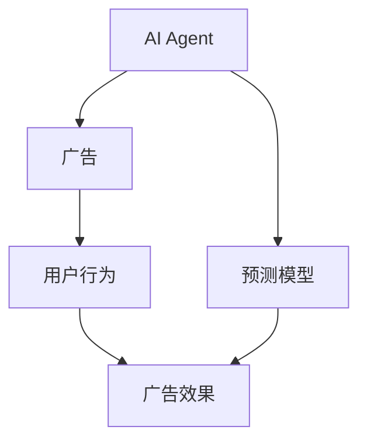
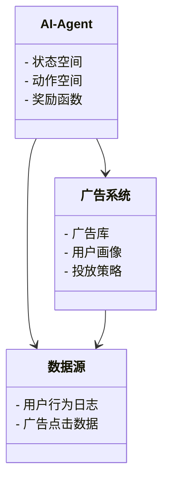

                 


# AI Agent在智能广告效果预测中的应用

> **关键词**：AI Agent、广告效果预测、机器学习、深度学习、实时广告系统  
> **摘要**：本文探讨AI Agent在智能广告效果预测中的应用，分析其优势与挑战，并详细阐述相关算法原理与系统架构，最后通过项目实战展示其实现过程。

---

## 第1章: 背景与概念

### 1.1 AI Agent的基本概念
AI Agent是一种能够感知环境并采取行动以实现目标的智能体。在广告领域，AI Agent用于实时优化广告投放策略，提升广告效果。

### 1.2 广告效果预测的背景
广告效果预测依赖数据驱动决策，传统方法基于统计模型，但随着数据量增长，复杂性增加，需要更高效的解决方案。

### 1.3 AI Agent在广告效果预测中的优势
AI Agent具备实时决策和优化能力，能够显著提升广告效果预测的准确性和效率。

---

## 第2章: 核心概念与联系

### 2.1 核心要素对比
| 核心要素 | AI Agent | 广告效果预测 |
|----------|-----------|--------------|
| 输入      | 用户行为数据 | 广告点击率、转化率 |
| 输出      | 广告策略调整 | 预测结果 |
| 目标      | 提升广告效果 | 预测准确性 |

### 2.2 实体关系图


---

## 第3章: 算法原理

### 3.1 传统机器学习算法
- **线性回归**：用于预测广告点击率。
- **随机森林**：用于分类广告内容。

### 3.2 深度学习算法
- **神经网络**：用于复杂模式识别。
- **强化学习**：用于实时策略调整。

### 3.3 结合算法
- **强化学习流程图**：
  ```mermaid
  graph TD
      S[状态] --> A[动作]
      A --> R[奖励]
      R --> S[新状态]
  ```

---

## 第4章: 系统架构

### 4.1 功能模块
- 数据采集模块：实时采集用户行为数据。
- 特征提取模块：提取用户和广告特征。
- 模型训练模块：训练广告效果预测模型。
- 效果预测模块：实时预测广告效果。
- 优化调整模块：根据预测结果调整广告策略。

### 4.2 系统架构图


---

## 第5章: 项目实战

### 5.1 环境配置
安装必要的库，如TensorFlow、Pandas。

### 5.2 代码实现
```python
import pandas as pd
from sklearn.model import LinearRegression

# 数据加载
data = pd.read_csv('广告数据.csv')

# 模型训练
model = LinearRegression()
model.fit(data[['用户特征', '广告特征']], data['点击率'])

# 预测广告效果
new_data = pd.DataFrame({'用户特征': [特征1], '广告特征': [特征2]})
predicted_click = model.predict(new_data)
```

### 5.3 案例分析
通过实际案例展示AI Agent如何优化广告策略，提升效果。

---

## 第6章: 总结与展望

### 6.1 总结
AI Agent在广告效果预测中的应用显著提升了广告效率，通过实时决策和优化策略，带来了更高的转化率和点击率。

### 6.2 未来展望
未来，AI Agent将结合多模态数据和实时决策技术，进一步提升广告效果预测的准确性和实时性。

---

**结语**：AI Agent在智能广告效果预测中的应用不仅提升了广告行业的效率，也为未来更智能化的广告投放奠定了基础。

