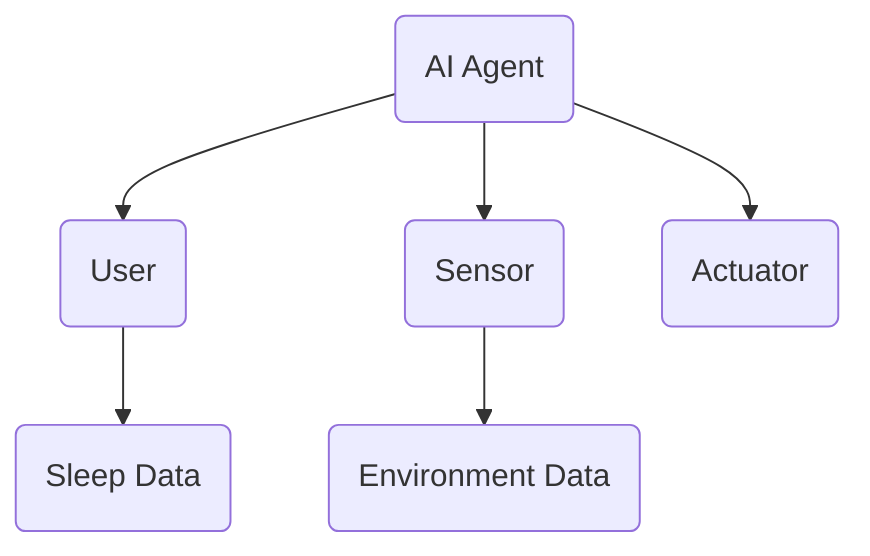
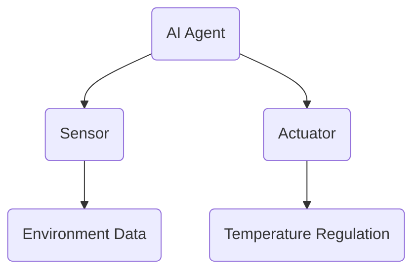

                 


# AI Agent在智能床垫中的体温调节系统

> 关键词：AI Agent，智能床垫，体温调节，传感器，机器学习

> 摘要：本文详细探讨了AI Agent在智能床垫中的体温调节系统，分析了其核心原理、系统架构、算法实现以及实际应用场景。通过理论与实践相结合的方式，展示了AI技术在智能家居领域的创新应用。

---

## 第一部分: AI Agent在智能床垫中的体温调节系统概述

### 第1章: 问题背景与需求分析

#### 1.1 问题背景
- **传统床垫的局限性**：传统床垫无法根据用户的体温变化进行调节，导致舒适度不足。
- **用户需求**：用户希望床垫能够智能调节温度，提供个性化的睡眠体验。
- **AI Agent的优势**：AI Agent能够实时感知环境和用户需求，实现智能化的温度调节。

#### 1.2 问题描述
- **体温调节的重要性**：体温直接影响睡眠质量，需要实时监测和调节。
- **AI Agent的功能**：通过传感器采集数据，利用算法进行分析和决策，驱动执行器调节温度。

#### 1.3 问题解决
- **AI Agent的核心作用**：通过实时数据分析和智能决策，实现精准的体温调节。
- **用户体验的提升**：为用户提供舒适、个性化的睡眠体验。

#### 1.4 边界与外延
- **功能边界**：AI Agent仅负责温度调节，不涉及床垫的其他功能。
- **适用场景**：适用于卧室环境，针对单个用户或多个用户的睡眠场景。
- **系统扩展性**：未来可以扩展到更多智能设备的联动。

---

## 第二部分: AI Agent与智能床垫的核心概念与联系

### 第2章: AI Agent的原理与特性

#### 2.1 AI Agent的基本原理
- **智能性**：AI Agent通过传感器获取数据，利用算法进行分析和决策。
- **自适应性**：能够根据环境变化和用户反馈，动态调整调节策略。
- **学习能力**：通过机器学习算法，不断优化体温调节的准确性。

#### 2.2 AI Agent的特性对比
| 特性         | AI Agent的特性       | 智能床垫的特性       |
|--------------|----------------------|----------------------|
| 智能性       | 高度智能，能够自主决策 | 基于传感器和执行器实现智能调节 |
| 响应速度     | 快速响应用户需求     | 快速响应传感器信号   |
| 自适应能力   | 能够适应不同用户需求 | 能够适应不同环境变化 |

#### 2.3 ER实体关系图


---

## 第三部分: 体温调节系统的算法原理

### 第3章: 算法原理与实现

#### 3.1 算法概述
- **PID控制算法**：用于实时调节温度，保持在目标范围内。
- **机器学习模型**：利用历史数据训练模型，预测用户需求。

#### 3.2 PID控制算法
- **公式**：$$ PID = K_p \cdot e + K_i \cdot \int e \, dt + K_d \cdot \frac{de}{dt} $$
- **步骤**：
  1. 采集当前温度值。
  2. 计算偏差值（目标温度 - 当前温度）。
  3. 根据PID公式计算调节量。
  4. 输出调节量到执行器。

#### 3.3 机器学习模型
- **数据输入**：用户体温、环境温度、床垫温度。
- **模型训练**：使用历史数据训练回归模型。
- **预测输出**：预测用户在不同时间点的舒适温度。

#### 3.4 算法实现代码
```python
def pid_control(target, current, Kp, Ki, Kd, integral, derivative, dt):
    error = target - current
    integral += error * dt
    derivative = (error - previous_error) / dt
    output = Kp * error + Ki * integral + Kd * derivative
    return output

# 示例参数
Kp = 1
Ki = 0.1
Kd = 0.5
dt = 1  # 时间间隔
integral = 0
derivative = 0
previous_error = 0

target_temp = 25  # 目标温度
current_temp = 20  # 当前温度

output = pid_control(target_temp, current_temp, Kp, Ki, Kd, integral, derivative, dt)
print(f"PID输出: {output}")
```

---

## 第四部分: 系统分析与架构设计

### 第4章: 系统架构设计

#### 4.1 系统功能设计
- **传感器数据采集**：采集用户体温、环境温度和床垫温度。
- **AI Agent决策**：根据数据计算调节量，输出控制信号。
- **执行器调节**：根据调节信号，驱动床垫调整温度。

#### 4.2 系统架构图


---

## 第五部分: 项目实战

### 第5章: 项目实现与分析

#### 5.1 环境安装
- **传感器**：温度传感器（如DS18B20）。
- **控制器**：微控制器（如Arduino或Raspberry Pi）。
- **执行器**：电热器或制冷器模块。

#### 5.2 核心代码实现
```python
import time

# 初始化传感器和执行器
sensor = Sensor()
actuator = Actuator()

target_temp = 25
current_temp = sensor.read_temp()

while True:
    current_temp = sensor.read_temp()
    error = target_temp - current_temp
    # PID计算
    output = pid_control(error)
    actuator.set_temp(output)
    time.sleep(1)
```

#### 5.3 代码解读与分析
- **传感器数据读取**：从传感器获取当前温度。
- **PID计算**：根据当前温度和目标温度，计算调节量。
- **执行器调节**：根据调节量，控制床垫的温度。

#### 5.4 实际案例分析
- **案例1**：用户设定目标温度25℃，系统根据环境温度自动调节。
- **案例2**：用户在睡眠过程中体温变化，系统实时调整床垫温度。

---

## 第六部分: 总结与展望

### 第6章: 总结与展望

#### 6.1 最佳实践
- **传感器校准**：定期校准传感器，确保数据准确性。
- **算法优化**：根据用户反馈优化PID参数或机器学习模型。

#### 6.2 小结
- 本文详细介绍了AI Agent在智能床垫中的体温调节系统，从原理到实现，展示了其在智能家居中的应用潜力。

#### 6.3 注意事项
- **数据隐私**：确保用户的睡眠数据不被滥用。
- **系统稳定性**：确保系统在极端环境下的稳定性。

#### 6.4 拓展阅读
- 《基于机器学习的智能控制系统设计》
- 《智能家居中的多设备协同控制》

---

通过以上分析和实现，我们可以看到AI Agent在智能床垫中的体温调节系统具有广阔的应用前景。未来，随着AI技术的不断发展，智能床垫将更加智能化，为用户带来更好的睡眠体验。

