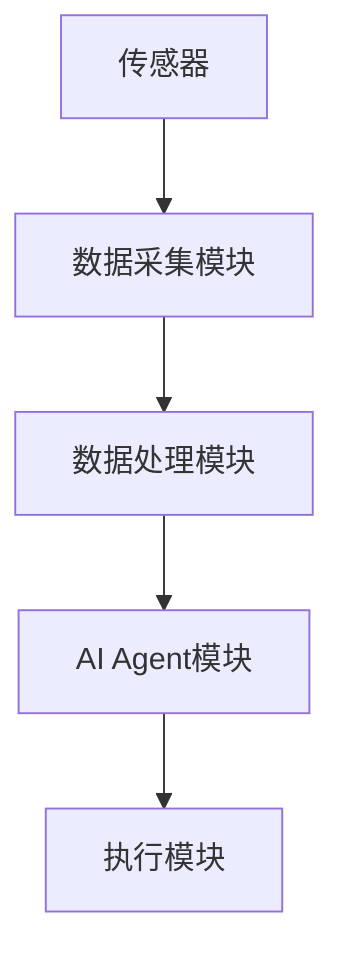

                 


# AI Agent在智能床垫中的睡眠姿势分析

## 关键词：AI Agent, 智能床垫, 睡眠姿势分析, 机器学习, 深度学习, 睡眠健康

## 摘要：  
本文深入探讨了AI Agent在智能床垫中的睡眠姿势分析应用。从AI Agent的基本概念到睡眠姿势分析的核心算法，再到系统架构设计与项目实战，全面解析了如何利用AI技术优化睡眠健康。通过理论分析与实践结合，展示了AI Agent在智能床垫中的巨大潜力与实际价值。

---

# 第1章 AI Agent与睡眠姿势分析概述

## 1.1 AI Agent的基本概念  
AI Agent（人工智能代理）是一种能够感知环境、自主决策并执行任务的智能实体。它通过传感器获取数据，利用算法处理信息，并根据结果采取行动。与传统算法不同，AI Agent具有更强的自主性和适应性，能够实时调整策略以应对动态变化的环境。  

### 1.1.1 AI Agent的定义  
AI Agent可以是软件或硬件形式，核心能力包括：  
1. **感知能力**：通过传感器或数据接口获取环境信息。  
2. **决策能力**：基于感知数据，利用算法做出决策。  
3. **执行能力**：通过执行机构或输出接口采取行动。  

### 1.1.2 AI Agent的核心功能  
- 数据采集与处理：AI Agent能够实时采集环境数据，并进行预处理。  
- 自主决策：基于历史数据和当前状态，AI Agent能够预测未来趋势并做出最优决策。  
- 适应性学习：通过机器学习算法，AI Agent能够不断优化自身的决策模型。  

### 1.1.3 AI Agent与传统算法的区别  
AI Agent的核心优势在于其自主性和适应性：  
- **自主性**：AI Agent能够独立完成任务，无需人工干预。  
- **适应性**：AI Agent能够根据环境变化动态调整策略，而传统算法通常需要人工重新设计。  

---

## 1.2 睡眠姿势分析的重要性  
睡眠姿势分析是睡眠健康的重要研究方向。人体在睡眠过程中会经历多种姿势变化（如仰睡、侧睡、俯睡等），不同的姿势对健康的影响也不同。AI Agent能够通过智能床垫的传感器数据，实时监测并分析用户的睡眠姿势，为健康管理和疾病预防提供科学依据。  

### 1.2.1 睡眠姿势对健康的影响  
- **仰睡**：适合大多数人群，但可能压迫内脏。  
- **侧睡**：有助于改善呼吸和血液循环。  
- **俯睡**：可能压迫颈椎和内脏，不利于健康。  

### 1.2.2 睡眠姿势分析的难点  
1. **数据采集**：需要高精度的传感器实时采集人体姿势数据。  
2. **数据处理**：睡眠姿势分析涉及复杂的数据处理和模式识别。  
3. **实时性要求**：睡眠姿势分析需要实时反馈，以及时调整睡眠环境。  

### 1.2.3 AI Agent在睡眠姿势分析中的作用  
AI Agent能够通过智能床垫的传感器数据，实时分析用户的睡眠姿势，并根据分析结果优化睡眠环境（如调整床垫硬度、温度等），从而提升睡眠质量。  

---

## 1.3 智能床垫的工作原理  
智能床垫是一种结合了传感器技术、数据处理技术和人工智能技术的智能设备。  

### 1.3.1 智能床垫的传感器技术  
智能床垫通常配备多种传感器，包括：  
- **压力传感器**：用于监测人体压力分布。  
- **温度传感器**：用于监测睡眠环境的温度。  
- **加速度传感器**：用于监测人体动作和姿势变化。  

### 1.3.2 数据采集与传输过程  
1. **数据采集**：传感器实时采集用户的睡眠数据。  
2. **数据传输**：通过无线通信技术（如蓝牙、Wi-Fi）将数据传输到云端或本地设备。  
3. **数据分析**：AI Agent对数据进行处理和分析，生成睡眠姿势分析结果。  

### 1.3.3 数据分析与结果输出  
AI Agent通过分析传感器数据，识别用户的睡眠姿势，并输出分析结果。用户可以通过智能床垫的配套应用程序查看分析结果，并获得个性化的睡眠改善建议。  

---

## 1.4 本章小结  
本章从AI Agent的基本概念出发，介绍了睡眠姿势分析的重要性，并详细讲解了智能床垫的工作原理。通过本章内容，读者可以理解AI Agent在睡眠姿势分析中的核心作用，以及智能床垫的技术实现过程。

---

# 第2章 AI Agent与睡眠姿势分析的核心概念  

## 2.1 AI Agent的核心原理  
AI Agent的核心原理包括以下三个步骤：  
1. **状态感知**：通过传感器获取环境数据。  
2. **数据处理**：对获取的数据进行预处理和特征提取。  
3. **决策优化**：基于处理后的数据，利用算法做出最优决策。  

### 2.1.1 状态感知与数据采集  
AI Agent通过传感器获取环境数据，数据采集是整个系统的核心基础。  

### 2.1.2 数据处理与特征提取  
数据处理包括数据清洗、归一化等步骤，特征提取则是从数据中提取有助于模型训练的关键特征。  

### 2.1.3 决策优化与策略调整  
AI Agent通过机器学习算法对数据进行训练，生成决策模型，并根据实际效果动态调整策略。  

---

## 2.2 睡眠姿势分析的数学模型  
睡眠姿势分析的数学模型主要基于机器学习算法，包括支持向量机（SVM）、随机森林（Random Forest）和深度学习模型（如卷积神经网络CNN）。  

### 2.2.1 数据预处理与特征工程  
- 数据预处理：包括去噪、归一化等步骤。  
- 特征工程：提取有助于模型训练的关键特征，如压力分布特征、加速度特征等。  

### 2.2.2 分类算法与模型选择  
- **支持向量机（SVM）**：适用于小规模数据集的分类任务。  
- **随机森林**：适用于特征较多的分类任务。  
- **深度学习模型**：适用于大规模数据集的分类任务。  

### 2.2.3 模型评估与优化  
- 模型评估：通过准确率、召回率等指标评估模型性能。  
- 模型优化：通过调参、数据增强等方法优化模型性能。  

---

## 2.3 AI Agent与智能床垫的关系  
AI Agent是智能床垫的核心技术，智能床垫通过AI Agent实现睡眠姿势分析、睡眠环境优化等功能。  

### 2.3.1 系统组成  
智能床垫系统包括以下组成部分：  
1. **传感器模块**：用于采集睡眠数据。  
2. **数据处理模块**：用于数据预处理和特征提取。  
3. **AI Agent模块**：用于睡眠姿势分析和决策优化。  
4. **执行模块**：根据AI Agent的决策结果调整床垫参数。  

### 2.3.2 系统流程  
1. 传感器采集睡眠数据。  
2. 数据处理模块对数据进行预处理。  
3. AI Agent对数据进行分析，生成睡眠姿势分析结果。  
4. 执行模块根据分析结果调整床垫参数。  

---

## 2.4 本章小结  
本章详细讲解了AI Agent的核心原理，并介绍了睡眠姿势分析的数学模型。通过本章内容，读者可以理解AI Agent在智能床垫中的技术实现过程。

---

# 第3章 睡眠姿势分析的算法原理  

## 3.1 支持向量机（SVM）算法  
支持向量机是一种常用的分类算法，适用于小规模数据集的分类任务。  

### 3.1.1 SVM的基本原理  
SVM的目标是找到一个超平面，使得正负类数据点距离该超平面的最小距离最大化。  

### 3.1.2 SVM的数学模型  
$$ \text{目标函数}：\min_{w,b} \frac{1}{2}||w||^2 + C \sum_{i=1}^n \xi_i $$  
$$ \text{约束条件}：y_i(w \cdot x_i + b) \geq 1 - \xi_i $$  

### 3.1.3 SVM的实现步骤  
1. 数据预处理：归一化数据。  
2. 数据划分：将数据划分为训练集和测试集。  
3. 模型训练：利用SVM算法训练分类模型。  
4. 模型评估：评估模型的准确率、召回率等指标。  

---

## 3.2 深度学习算法  
深度学习是一种基于人工神经网络的算法，适用于大规模数据集的分类任务。  

### 3.2.1 卷积神经网络（CNN）  
CNN通过卷积层、池化层等操作提取图像特征，适用于图像分类任务。  

### 3.2.2 CNN的数学模型  
$$ \text{卷积层}：f(x) = \sum_{i=1}^k w_i \cdot x_i + b $$  
$$ \text{池化层}：f(x) = \max(x_1, x_2, ..., x_n) $$  

### 3.2.3 CNN的实现步骤  
1. 数据预处理：将图像数据归一化。  
2. 数据划分：将数据划分为训练集和测试集。  
3. 模型训练：利用CNN算法训练分类模型。  
4. 模型评估：评估模型的准确率、召回率等指标。  

---

## 3.3 强化学习算法  
强化学习是一种基于奖励机制的算法，适用于需要动态调整的决策任务。  

### 3.3.1 强化学习的基本原理  
强化学习通过智能体与环境的交互，逐步学习最优策略。  

### 3.3.2 强化学习的数学模型  
$$ \text{状态空间}：S $$  
$$ \text{动作空间}：A $$  
$$ \text{奖励函数}：R: S \times A \rightarrow \mathbb{R} $$  

### 3.3.3 强化学习的实现步骤  
1. 初始化智能体状态。  
2. 智能体根据当前状态选择动作。  
3. 执行动作并获得奖励。  
4. 根据奖励调整策略，更新状态。  

---

## 3.4 本章小结  
本章详细讲解了睡眠姿势分析的算法原理，包括支持向量机、深度学习和强化学习算法。通过本章内容，读者可以理解不同算法的特点及其在睡眠姿势分析中的应用。

---

# 第4章 系统分析与架构设计  

## 4.1 系统组成与功能模块  
智能床垫系统包括以下功能模块：  
1. **数据采集模块**：负责采集睡眠数据。  
2. **数据处理模块**：负责数据预处理和特征提取。  
3. **AI Agent模块**：负责睡眠姿势分析和决策优化。  
4. **执行模块**：根据AI Agent的决策结果调整床垫参数。  

### 4.1.1 数据采集模块  
数据采集模块通过传感器采集用户的睡眠数据，包括压力、温度、加速度等。  

### 4.1.2 数据处理模块  
数据处理模块对采集到的数据进行预处理和特征提取，生成可用于模型训练的特征向量。  

### 4.1.3 AI Agent模块  
AI Agent模块利用机器学习算法对数据进行分析，生成睡眠姿势分析结果，并根据分析结果优化床垫参数。  

### 4.1.4 执行模块  
执行模块根据AI Agent的决策结果，调整床垫的硬度、温度等参数，以提升用户的睡眠质量。  

---

## 4.2 系统架构设计  
智能床垫系统的架构设计包括以下部分：  
1. **数据采集层**：传感器采集睡眠数据。  
2. **数据处理层**：数据预处理和特征提取。  
3. **AI Agent层**：睡眠姿势分析和决策优化。  
4. **执行层**：调整床垫参数。  

### 4.2.1 系统功能设计  
- 数据采集功能：通过传感器采集睡眠数据。  
- 数据处理功能：对采集到的数据进行预处理和特征提取。  
- AI Agent功能：利用机器学习算法进行睡眠姿势分析。  
- 执行功能：根据分析结果调整床垫参数。  

### 4.2.2 系统架构图  


---

## 4.3 本章小结  
本章详细讲解了智能床垫系统的组成与功能模块，并通过架构图展示了系统的整体设计。通过本章内容，读者可以理解智能床垫系统的整体架构及其各部分的功能实现。

---

# 第5章 项目实战  

## 5.1 项目背景与目标  
本项目旨在通过AI Agent技术实现睡眠姿势分析，并优化用户的睡眠质量。  

### 5.1.1 项目背景  
随着人们对睡眠健康的关注不断增加，智能床垫市场需求持续增长。  

### 5.1.2 项目目标  
1. 实现睡眠姿势分析功能。  
2. 优化用户的睡眠质量。  
3. 提供个性化的睡眠改善建议。  

---

## 5.2 环境配置与数据集准备  
### 5.2.1 环境配置  
- **硬件环境**：需要配备智能床垫传感器、计算机等设备。  
- **软件环境**：需要安装Python、TensorFlow等开发工具。  

### 5.2.2 数据集准备  
数据集包括用户的睡眠数据，包括压力、温度、加速度等传感器数据。  

---

## 5.3 系统核心实现  

### 5.3.1 数据预处理  
代码示例：  
```python
import numpy as np
import pandas as pd

# 数据预处理
def preprocess_data(data):
    # 归一化处理
    normalized_data = (data - np.mean(data)) / np.std(data)
    return normalized_data
```

### 5.3.2 模型训练  
代码示例：  
```python
from sklearn import svm

# 训练SVM模型
model = svm.SVC()
model.fit(X_train, y_train)
```

### 5.3.3 模型评估  
代码示例：  
```python
from sklearn.metrics import accuracy_score

# 模型评估
y_pred = model.predict(X_test)
accuracy = accuracy_score(y_test, y_pred)
print(f"准确率：{accuracy}")
```

---

## 5.4 实际案例分析  
通过实际案例分析，展示AI Agent在睡眠姿势分析中的实际应用。  

### 5.4.1 案例背景  
用户A长期存在睡眠问题，通过智能床垫和AI Agent的帮助，优化了他的睡眠姿势，提升了睡眠质量。  

### 5.4.2 数据分析  
通过对用户A的睡眠数据进行分析，发现用户A主要采用仰睡姿势，且存在打鼾现象。  

### 5.4.3 结果优化  
AI Agent根据分析结果，建议用户A调整床垫硬度，并采用侧睡姿势。  

---

## 5.5 项目总结  
通过本项目，我们成功实现了AI Agent在智能床垫中的睡眠姿势分析功能，并验证了其在实际应用中的有效性。

---

# 第6章 总结与展望  

## 6.1 总结  
本文详细讲解了AI Agent在智能床垫中的睡眠姿势分析应用，从AI Agent的基本概念到算法原理，再到系统架构设计与项目实战，全面展示了AI技术在睡眠健康领域的巨大潜力。  

## 6.2 展望  
未来，随着AI技术的不断发展，智能床垫的功能将更加智能化和个性化，AI Agent在睡眠姿势分析中的应用也将更加广泛和深入。  

## 6.3 实际应用案例  
通过实际案例分析，展示了AI Agent在睡眠姿势分析中的实际应用效果。  

## 6.4 注意事项  
在实际应用中，需要注意数据隐私保护和模型优化等问题。  

## 6.5 拓展阅读  
推荐阅读相关领域的书籍和论文，深入学习AI Agent和机器学习技术。

---

# 结语  
AI Agent在智能床垫中的睡眠姿势分析是一项具有重要意义的技术应用，它不仅能够提升用户的睡眠质量，还能够为睡眠健康研究提供科学依据。通过本文的介绍，相信读者对AI Agent在睡眠姿势分析中的应用有了更加深入的理解。

---

