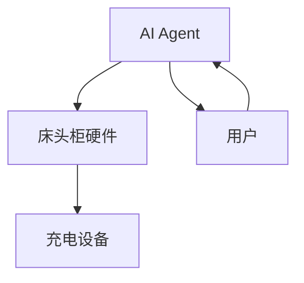
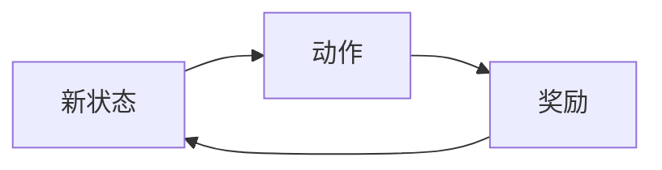
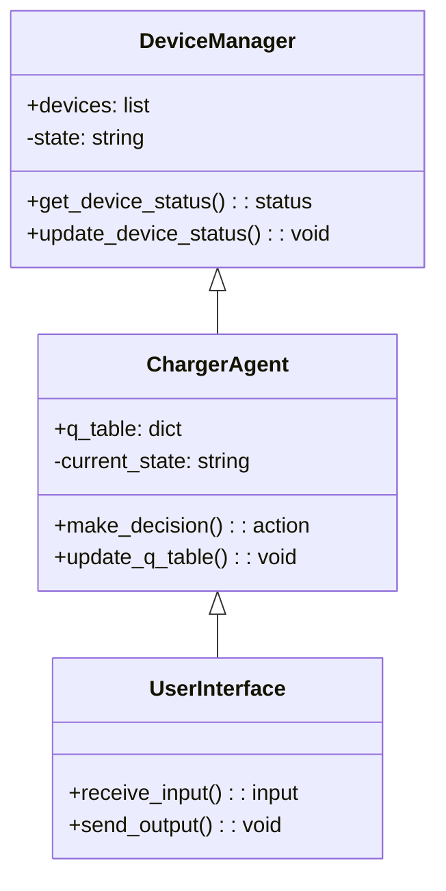
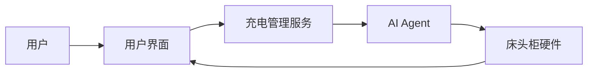
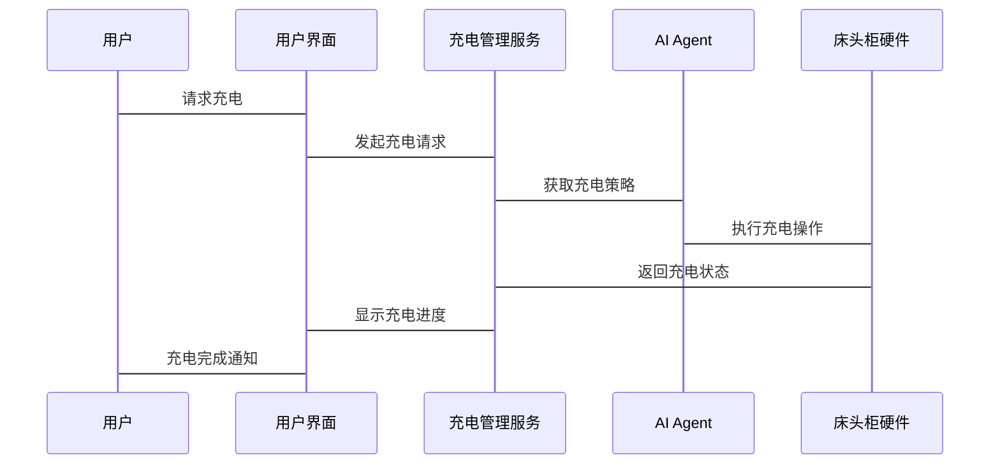

                 


# AI Agent在智能床头柜中的充电管理

## 关键词：
- AI Agent，人工智能代理
- 智能床头柜，充电管理
- 强化学习，充电优化
- 物联网，智能硬件
- 设备管理，充电策略

## 摘要：
随着智能家居的普及，智能床头柜作为家庭中的重要设备，其充电管理功能也变得越来越重要。传统的充电管理方式存在效率低下、资源浪费和用户体验差的问题。本文将探讨如何通过AI Agent技术，实现智能床头柜中的充电管理优化。文章从AI Agent的基本概念出发，详细分析其在充电管理中的应用，包括算法原理、系统架构设计、项目实战和最佳实践等方面，为读者提供全面的技术指导。

---

# 第1章 AI Agent与智能床头柜概述

## 1.1 AI Agent的基本概念

### 1.1.1 人工智能代理的定义
人工智能代理（AI Agent）是一种能够感知环境并采取行动以实现目标的智能实体。它可以是一个软件程序或一个物理设备，通过传感器和执行器与环境交互。

### 1.1.2 AI Agent的核心特征
- **自主性**：能够在没有外部干预的情况下自主运行。
- **反应性**：能够实时感知环境变化并做出反应。
- **学习能力**：通过数据和经验不断优化自身行为。
- **社交能力**：能够与其他AI Agent或人类进行交互和协作。

### 1.1.3 AI Agent与传统自动化的区别
| 特性 | 传统自动化 | AI Agent |
|------|------------|----------|
| 智能性 | 无学习能力 | 具备学习能力 |
| 灵活性 | 固定规则 | 可动态调整策略 |
| 适应性 | 适应性差 | 具备高适应性 |

## 1.2 智能床头柜的背景与应用

### 1.2.1 智能床头柜的功能概述
智能床头柜是一种结合了物联网技术的智能家居设备，具备以下功能：
- **设备充电**：支持多种设备的无线或有线充电。
- **智能控制**：通过AI Agent实现设备的智能调度和管理。
- **用户交互**：通过触摸屏或语音助手与用户进行交互。

### 1.2.2 智能床头柜的市场现状
随着智能家居市场的快速发展，智能床头柜逐渐成为家庭必备设备。其市场需求主要集中在以下几点：
- 用户对设备充电的便捷性要求越来越高。
- 智能设备的普及推动了对智能床头柜的需求。
- 物联网技术的成熟为智能床头柜的实现提供了技术支持。

### 1.2.3 智能床头柜的未来发展
未来的智能床头柜将更加智能化和人性化，具备以下发展趋势：
- **多功能集成**：整合更多智能家居设备的控制功能。
- **AI Agent优化**：通过AI技术实现更高效的充电管理和设备调度。
- **用户个性化服务**：根据用户的使用习惯提供定制化服务。

## 1.3 充电管理的现状与挑战

### 1.3.1 传统充电管理的痛点
- **资源浪费**：设备充电时间长，能源利用效率低。
- **用户体验差**：用户需要手动插拔设备，使用不便。
- **安全性问题**：传统充电设备可能存在安全隐患。

### 1.3.2 智能充电管理的优势
- **高效管理**：通过AI Agent实现设备的智能调度，优化充电时间。
- **用户体验提升**：用户可以通过手机APP或语音助手远程控制充电过程。
- **安全性增强**：智能充电设备能够实时监测设备状态，预防安全隐患。

### 1.3.3 充电管理中的技术挑战
- **设备兼容性问题**：不同设备的充电需求不同，需要支持多种接口和协议。
- **算法优化**：需要设计高效的充电调度算法，确保资源合理分配。
- **安全性保障**：需要确保系统的安全性，防止黑客攻击和数据泄露。

---

# 第2章 AI Agent在充电管理中的核心概念与联系

## 2.1 AI Agent的核心原理

### 2.1.1 AI Agent的感知机制
AI Agent通过传感器和数据接口获取环境信息，例如设备的电量、充电状态、用户需求等。

### 2.1.2 AI Agent的决策模型
AI Agent根据感知到的信息，结合预设的规则和学习到的策略，制定最优的充电计划。

### 2.1.3 AI Agent的执行方式
AI Agent通过控制充电设备的开关、调整充电功率等方式，实现对充电过程的管理。

## 2.2 充电管理的核心要素

### 2.2.1 设备识别与状态监测
AI Agent需要能够识别连接到床头柜的设备，并实时监测设备的电量、充电状态等信息。

### 2.2.2 充电策略与优先级
根据设备的重要性、用户的使用习惯和电力资源的可用性，制定充电策略并确定设备的充电优先级。

### 2.2.3 用户需求与反馈机制
AI Agent需要能够理解用户的充电需求，并根据用户的反馈不断优化充电管理策略。

## 2.3 AI Agent与充电管理的联系

### 2.3.1 AI Agent在充电管理中的角色
AI Agent作为智能床头柜的核心大脑，负责协调和管理充电过程。

### 2.3.2 AI Agent如何优化充电流程
通过实时感知设备状态和用户需求，AI Agent能够动态调整充电策略，确保充电效率最大化。

### 2.3.3 AI Agent与床头柜硬件的协同
AI Agent需要与床头柜的硬件设备协同工作，例如通过MQTT协议进行数据通信，实现设备的智能控制。

## 2.4 核心概念对比表

| 比较维度 | 传统充电管理 | AI Agent充电管理 |
|----------|--------------|------------------|
| 管理方式 | 手动或固定策略 | 智能动态调整 |
| 资源利用率 | 低效 | 高效 |
| 用户体验 | 差 | 优 |
| 安全性 | 低 | 高 |

## 2.5 实体关系图



---

# 第3章 AI Agent充电管理算法原理

## 3.1 强化学习算法

### 3.1.1 强化学习的基本原理
强化学习是一种机器学习方法，通过智能体与环境的交互，学习最优策略以最大化累积奖励。

### 3.1.2 充电管理中的强化学习模型


### 3.1.3 算法实现
```python
class ChargerAgent:
    def __init__(self, actions):
        self.actions = actions
        self.q_table = {}
    
    def get_action(self, state):
        if state not in self.q_table:
            self.q_table[state] = [0.0] * len(self.actions)
        max_val = max(self.q_table[state])
        return self.actions[state.index(max_val)]
    
    def update_q_table(self, state, action, reward, next_state):
        current_q = self.q_table[state][action]
        next_max_q = max(self.q_table.get(next_state, [0.0]))
        new_q = current_q + 0.1 * (reward + 0.9 * next_max_q)
        self.q_table[state][action] = new_q
```

### 3.1.4 数学公式
$$ Q(s, a) = Q(s, a) + \alpha (r + \gamma \max Q(s', a')) $$

---

# 第4章 系统分析与架构设计

## 4.1 系统功能设计

### 4.1.1 领域模型类图


### 4.1.2 系统架构设计


### 4.1.3 接口设计
- **设备连接接口**：通过USB或无线通信连接设备。
- **用户授权接口**：用户授权AI Agent控制充电过程。
- **充电状态查询接口**：用户可以通过手机APP查询设备充电状态。
- **异常处理接口**：当检测到异常情况（如过热、短路）时，AI Agent会触发报警并停止充电。

### 4.1.4 交互流程


---

# 第5章 项目实战

## 5.1 环境搭建

### 5.1.1 安装Python
```bash
python --version
pip install --upgrade pip
```

### 5.1.2 安装依赖库
```bash
pip install numpy
pip install tensorflow
pip install mqtt
```

## 5.2 核心代码实现

### 5.2.1 设备管理模块
```python
import mqtt

def device_connection():
    client = mqtt.Client()
    client.connect("localhost", 1883)
    client.on_message = on_message
    client.loop_start()
    return client
```

### 5.2.2 充电调度模块
```python
class ChargerManager:
    def __init__(self):
        self.devices = []
        self.charging_status = {}

    def add_device(self, device):
        self.devices.append(device)
        self.charging_status[device] = False

    def start_charging(self, device):
        if device not in self.charging_status:
            return False
        self.charging_status[device] = True
        return True
```

### 5.2.3 用户交互模块
```python
def user_interaction():
    while True:
        user_input = input("请输入命令：")
        if user_input == "停止":
            break
        elif user_input == "开始":
            start_charging()
        else:
            print("无效命令")
```

### 5.2.4 数据记录模块
```python
import json

def save_charging_data(data):
    with open("charging_log.json", "a") as f:
        json.dump(data, f)
```

## 5.3 实际案例分析

### 5.3.1 案例背景
假设用户有两个设备：手机和笔记本电脑，需要同时充电。

### 5.3.2 充电策略
AI Agent会根据设备的电量和用户需求，优先为手机充电，然后是笔记本电脑。

### 5.3.3 实施过程
1. 用户通过手机APP发送充电请求。
2. AI Agent通过mqtt协议接收请求。
3. 根据设备电量和充电策略，AI Agent决定先给手机充电。
4. 充电完成后，AI Agent开始给笔记本电脑充电。
5. 充电过程中，AI Agent实时监测设备状态，确保充电安全。
6. 充电完成后，AI Agent通过mqtt协议通知用户。

### 5.3.4 分析与优化
通过分析充电数据，AI Agent可以不断优化充电策略，例如优先为重要设备充电，或者在电力高峰期调整充电时间。

## 5.4 项目小结

---

# 第6章 最佳实践

## 6.1 小结
通过AI Agent技术，智能床头柜的充电管理变得更加高效和智能化。本文详细介绍了AI Agent的基本概念、算法原理、系统架构设计和项目实战，为读者提供了全面的技术指导。

## 6.2 注意事项
- **安全性**：在实现AI Agent时，必须确保系统的安全性，防止数据泄露和黑客攻击。
- **兼容性**：需要确保AI Agent能够兼容各种设备和接口。
- **维护性**：定期更新AI Agent的算法和模型，以适应新的设备和用户需求。

## 6.3 拓展阅读
- 《强化学习：理论与应用》
- 《物联网技术入门与实战》
- 《Python机器学习实战》

---

# 结语
AI Agent在智能床头柜中的充电管理是一个充满潜力的领域。随着技术的不断发展，未来的充电管理将更加智能化和个性化。通过本文的介绍，希望能够为读者提供一些启发和指导，推动这一领域的进一步发展。

