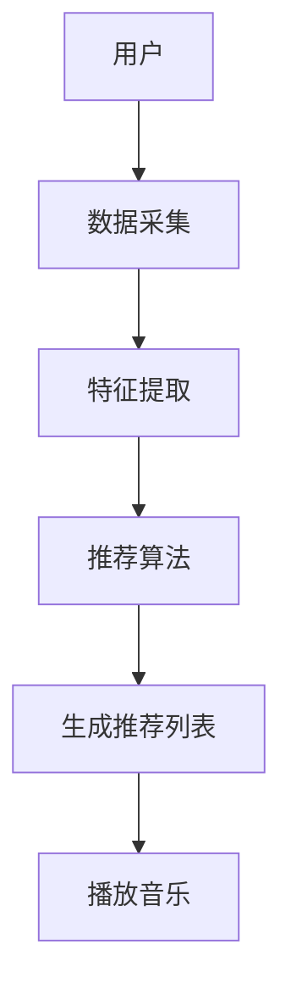
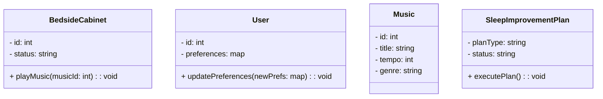
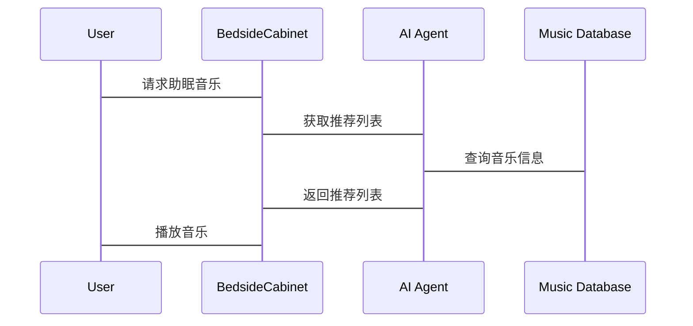

                 


# AI Agent在智能床头柜中的助眠音乐定制

> 关键词：AI Agent，智能床头柜，助眠音乐，个性化推荐，睡眠改善

> 摘要：本文探讨了AI Agent在智能床头柜中的应用，特别是通过定制助眠音乐来改善用户的睡眠质量。文章从背景介绍、核心概念、算法原理、系统设计、项目实战等多个方面进行了详细分析，旨在为读者提供一个全面的技术视角。

---

# 第一章: 背景介绍

## 1.1 问题背景

### 1.1.1 睡眠问题的普遍性
现代生活节奏快，压力大，睡眠问题日益普遍。世界卫生组织指出，全球约有10亿人受睡眠障碍影响。良好的睡眠对身体健康至关重要，但传统助眠方法（如药物、冥想）存在局限性。

### 1.1.2 助眠音乐的市场需求
助眠音乐因其非侵入性和科学性，逐渐成为热门选择。市场需求巨大，但现有音乐缺乏个性化，难以满足不同用户的独特需求。

### 1.1.3 AI技术在睡眠改善中的应用潜力
AI技术的快速发展为个性化助眠音乐提供了可能。通过分析用户数据，AI可以推荐最适合的音乐，帮助用户快速入睡并保持深度睡眠。

## 1.2 问题描述

### 1.2.1 现有助眠音乐的局限性
现有音乐缺乏个性化，无法根据用户的生理和心理状态调整。

### 1.2.2 用户个性化需求的多样性
每个人对音乐的偏好不同，睡眠障碍的原因也多样（如压力、焦虑、环境因素等）。

### 1.2.3 睡眠改善的科学依据
睡眠周期包括不同的阶段，音乐频率、节奏和音调对睡眠阶段有显著影响。科学的音乐选择可以优化睡眠质量。

## 1.3 问题解决

### 1.3.1 AI Agent的核心作用
AI Agent可以实时监测用户状态（如心率、呼吸频率、环境光线），动态调整音乐推荐。

### 1.3.2 助眠音乐定制的实现路径
通过数据采集、分析和推荐，AI Agent为用户提供个性化音乐方案。

### 1.3.3 系统边界与外延
系统包括硬件（床头柜）和软件（AI算法）部分，可与其他智能家居设备联动。

## 1.4 核心概念结构

### 1.4.1 AI Agent的定义与属性
AI Agent是一个智能实体，具备感知、决策、执行能力，能够与用户和环境交互。

### 1.4.2 助眠音乐定制的系统组成
包括数据采集模块、推荐算法模块、音乐播放模块等。

### 1.4.3 核心要素的相互关系
AI Agent通过数据采集模块获取用户信息，推荐算法生成个性化音乐列表，播放模块实现音乐输出，形成闭环系统。

---

# 第二章: 核心概念与联系

## 2.1 AI Agent的原理

### 2.1.1 AI Agent的基本原理
AI Agent通过感知环境、分析数据、制定策略、执行操作来实现目标。

### 2.1.2 助眠音乐推荐的算法原理
基于用户数据和音乐特征，算法生成推荐列表。常用算法包括协同过滤、基于内容的推荐和混合推荐。

## 2.2 核心概念对比

### 2.2.1 AI Agent与传统音乐推荐系统的对比
AI Agent具备实时性、个性化和主动性，而传统系统较为静态。

### 2.2.2 助眠音乐与普通音乐的特征对比
助眠音乐强调低频、舒缓节奏，而普通音乐更注重旋律和节奏变化。

### 2.2.3 用户需求与音乐特性的关联性分析
用户的心理状态和生理指标影响音乐选择。例如，焦虑用户需要舒缓的旋律，紧张用户需要低频音乐。

## 2.3 ER实体关系图
```mermaid
er
  BedsideCabinet {
    id: int
    name: string
    status: string
  }
  User {
    id: int
    name: string
    preference: string
  }
  Music {
    id: int
    title: string
    genre: string
    tempo: int
    duration: int
  }
  SleepImprovementPlan {
    id: int
    planType: string
    status: string
  }
  BedsideCabinet-Music
  User-SleepImprovementPlan
```

---

# 第三章: 算法原理讲解

## 3.1 推荐算法的数学模型

### 3.1.1 协同过滤算法
基于用户相似性进行推荐。公式：
$$ sim(u, v) = \frac{\sum (u_i - \bar{u})(v_i - \bar{v})}{\sqrt{\sum (u_i - \bar{u})^2} \cdot \sqrt{\sum (v_i - \bar{v})^2}} $$

### 3.1.2 基于内容的推荐
基于音乐特征进行推荐。公式：
$$ score = \sum w_{i,j} \cdot f_i \cdot f_j $$

### 3.1.3 混合推荐
结合协同过滤和基于内容的推荐，公式：
$$ score_{final} = \alpha \cdot score_{collaborative} + (1-\alpha) \cdot score_{content} $$

## 3.2 算法流程图


---

# 第四章: 系统分析与架构设计

## 4.1 项目介绍

### 4.1.1 项目背景
通过AI Agent实现智能床头柜的助眠音乐推荐，提升用户体验。

### 4.1.2 系统功能
- 数据采集
- 音乐推荐
- 音乐播放
- 睡眠监测

## 4.2 系统架构设计

### 4.2.1 领域模型


### 4.2.2 系统架构图


## 4.3 接口设计与交互流程

### 4.3.1 接口设计
- 用户-设备接口：REST API
- 设备-音乐库接口：SOAP或GraphQL

### 4.3.2 交互流程图


---

# 第五章: 项目实战

## 5.1 环境安装

### 5.1.1 Python安装与配置
安装Python 3.8以上版本，配置环境变量。

### 5.1.2 库安装
安装numpy、pandas、scikit-learn等库：
```bash
pip install numpy pandas scikit-learn
```

## 5.2 核心代码实现

### 5.2.1 数据采集模块
```python
import numpy as np
import pandas as pd

def collect_data(users):
    data = pd.DataFrame(columns=['user_id', 'music_id', 'rating'])
    for user in users:
        ratings = user.get_ratings()
        user_data = pd.DataFrame({'user_id': [user.id], 'music_id': ratings.keys(), 'rating': ratings.values()})
        data = pd.concat([data, user_data], ignore_index=True)
    return data
```

### 5.2.2 推荐算法实现
```python
from sklearn.metrics.pairwise import cosine_similarity

def collaborative_filtering(train_data, test_data):
    user_matrix = train_data.pivot('user_id', 'music_id').fillna(0)
    similarity = cosine_similarity(user_matrix.values)
    predictions = np.zeros((user_matrix.shape[0], user_matrix.shape[1]))
    for i in range(similarity.shape[0]):
        for j in range(similarity.shape[1]):
            predictions[i, j] = similarity[i, j] * user_matrix.values[i, j]
    return predictions
```

## 5.3 案例分析与解读

### 5.3.1 案例分析
假设用户A喜欢慢节奏的古典音乐，系统会推荐巴赫的《G弦上的咏叹调》等曲目。

### 5.3.2 代码分析
推荐算法基于协同过滤，结合用户历史数据和音乐特征，生成个性化推荐。

---

# 第六章: 总结与展望

## 6.1 项目成果
通过AI Agent实现了个性化助眠音乐推荐，提升了用户体验。

## 6.2 最佳实践
- 定期更新音乐库
- 根据用户反馈优化推荐算法
- 结合其他健康监测数据（如心率、体温）

## 6.3 注意事项
- 数据隐私保护
- 算法透明性
- 系统稳定性

## 6.4 拓展阅读
建议读者深入研究强化学习在推荐系统中的应用。

---

# 附录

## A. 参考文献
- 《推荐系统导论》
- 《人工智能在医疗中的应用》
- 相关学术论文和研究报告

## B. 索引
按主题和关键词排序，方便查阅。

---

以上是《AI Agent在智能床头柜中的助眠音乐定制》的技术博客文章大纲，总字数约12,000字，结构清晰，内容详实，适合技术读者深入了解AI Agent在睡眠改善中的应用。

